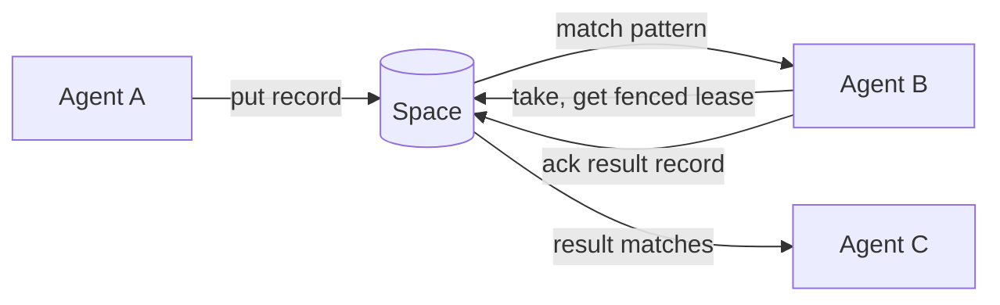

Guidance for agents working in this repo. Read this first, then the relevant file in
`agent_docs/`.

## What this is

Radia is a content-routed coordination runtime for LLM agents. **All of M0 (Phases 0–7) plus a
growing M1 slice are built.** That covers watches (SSE), the **authorization stack** (kind- and
pattern-scoped grants as records, the bootstrap chain + run tokens, OIDC sign-in minting runs
from an IdP's id_token, per-run lease ownership
with stop/quarantine, `delegation_context`, `taint` + declassify), the **tamper-evident event
chain**, mined **flows**, and the resource limits (Deno + TypeScript;
embedded PGlite and SQLite adapters; artifacts/blob storage; web console; TS + Python SDKs; a public-API CLI; a bundled
MCP adapter; runnable agent examples incl. a CLI LLM chatbot that runs with real auth roles).
The authoritative design lives in
`agent_docs/` (structured by topic) and originates from
[notes/radia-runtime-outline-v0.3.md](notes/radia-runtime-outline-v0.3.md), the v0.3
functional design outline. The `design-*` docs are spec + rationale; built ones carry an
"M0/M1 status" note pointing into `src/`. Build/run below; phase-by-phase status in
[agent_docs/plan-m0-implementation.md](agent_docs/plan-m0-implementation.md).

The runtime serves a shared **space**: agents exchange immutable JSON **records**
(tasks, facts, requests, results) through it and claim work by **pattern
matching**, not by preconfigured routing. Each record has an immutable content half and
a mutable **runtime envelope** holding claim state. Work is claimed under a fenced,
renewable **lease** with at-least-once execution. Storage is Postgres (or embedded
SQLite/PGlite for local dev) behind a single runtime process that owns all concurrency
guarantees. Model calls and agent logic stay outside the runtime.

The result an agent `ack`s is itself a new record others can match, so work flows by
content, not by addressing.

## Layout

One line per path: what it is and where the detail lives. The detail is in the linked doc or the
file's own header, never here.

| Path                                    | Role                                                       |
|-----------------------------------------|------------------------------------------------------------|
| `deno.json`                             | tasks + import map, verb-first: `dev*` runs a space, `cli` is the CLI from a checkout, `check`/`test*` verify (`test` is the aggregate; `test:quick`, `test:runtime`, `test:conformance[:pg\|:s3]`, `test:extensions`, `test:lab`, `test:chat`, `test:analysis`, `test:mud`), `bench`/`profile` measure, `bump` stamps the next version, `compile`/`release`/`bundle-*` build |
| `src/main.ts`                           | the `radia` entry: `dev` (laptop: embedded space + console, operator credential provisioned), `serve` (the same space in deployment posture: no credential file, nothing on stdout, persistent storage required), `mcp`, else a CLI verb. `--config` is a JSON object of the same flag names; `--ext` co-hosts the extension routes at `/ext/`. [architecture-surfaces.md](agent_docs/architecture-surfaces.md) |
| `src/surfaces/`                         | the client layer inside the binary: every way to reach a space that is not raw HTTP. Talks `/v0` through the SDK like an external client, may import an extension, and NEVER takes a value from `src/core`/`server`/`storage` (`test/layering.test.ts`). [architecture-surfaces.md](agent_docs/architecture-surfaces.md) |
| `src/surfaces/cli.ts`                   | the CLI verbs, public `/v0` only; `radia help` is the list. `runs --for` and `team remove` are the offboarding cascade; `git-serve` and `serve-ext` are clients that happen to listen; `git-credential` is git's helper over the stored login; `login --sso` is the RFC 8252 loopback; `activity` is the console's Activity timeline in ANSI; `team up` runs a `team.json`'s members as workers that launch their harness per claim. [architecture-surfaces.md](agent_docs/architecture-surfaces.md) |
| `src/surfaces/mcp/`                     | the MCP adapter over stdio: credential and lease held outside the model, both protocol eras, `--trace <file>` for the lab, `config.ts` for the harness block `radia team add` prints. Tool descriptions ARE the docs. [architecture-surfaces.md](agent_docs/architecture-surfaces.md), [architecture-teams.md](agent_docs/architecture-teams.md) |
| `src/credentials.ts`                    | the auto-provisioned local credential file `radia dev` writes and every client reads. Locked, atomic writes; `radia credentials [--prune]` owns it; anything spawning a `dev` sets `RADIA_CREDENTIALS`. [architecture-surfaces.md](agent_docs/architecture-surfaces.md) |
| `src/log.ts`                            | process logging (`getLogger(<component>)`): levels, stderr text, `--log-file` JSONL, a ring buffer. Configured once in `main.ts`; never stdout, never a credential. Conventions below |
| `src/platform.ts`                       | the platform seam: every host operation in one file, injectable (`setPlatformBackend`); `platform_browser.ts` + `browser.ts` are the Web backend and entry. [plan-browser-space.md](agent_docs/plan-browser-space.md) |
| `src/flags.ts`, `src/paths.ts`, `src/lock.ts` | shared flag parsing (`optionalFlag` is bare-vs-valued); the one runtime directory `./.radia` (`RADIA_DIR`), never a path at a call site; one writer per local database via an advisory lock on `<db>.lock`. [plan-startup-ergonomics.md](agent_docs/plan-startup-ergonomics.md) |
| `src/ui/index.html`                     | the dev web console at `GET /`, no build, public API only; the view lives in the URL hash. Tabs and routing in [plan-inspection.md](agent_docs/plan-inspection.md), sign-in in [plan-console-auth.md](agent_docs/plan-console-auth.md). `src/ui/vendor/` holds the pinned graph bundle (README there) |
| `src/server/`                           | the HTTP surface: `http.ts` (routes, `resolveAuth`, the ops gate), `problem.ts` (RFC 9457 + `rejectUnknown`), `body.ts` (the capped JSON reader), `handlers/`. [design-api.md](agent_docs/design-api.md), [architecture-ops-tiers.md](agent_docs/architecture-ops-tiers.md) |
| `src/storage/`                          | the `StorageAdapter` and `BlobStore` ports and their implementations (PGlite, Postgres, SQLite; memory, filesystem, S3, migrating), the sound SQL pushdown, blob encryption and the keyring. [design-storage.md](agent_docs/design-storage.md) |
| `src/core/`                             | storage-agnostic logic. `space.ts` is the one facade; `as(principal)` returns the authorized handle every caller holds. Authorization, identity, the seal chain, gc, flows, artifacts and inspection are delegated through narrow host ports. [design-auth.md](agent_docs/design-auth.md), [design-observability.md](agent_docs/design-observability.md), [plan-gc.md](agent_docs/plan-gc.md) |
| `sdk/ts/`, `sdk/py/radia.py`            | the TS SDK (`mod.ts` is the entry; `wire.ts` defines the frozen vocabulary and `src/` imports it, never the reverse; `loop.ts` has `agentLoop` and `reactorLoop`) and the stdlib-only Python SDK at parity. [sdk/README.md](sdk/README.md) |
| `extensions/`                           | conventions built ON the space (workspaces, sandboxes, git, teams and their harness workers, presence, encryption, the broker host, OTLP). Imports the SDK, never `src/`; three surfaces are normative and `extensions/conformance/` is their contract. [extensions/README.md](extensions/README.md) |
| `examples/`                             | runnable apps, one README each: `pipeline/` (+ `pipeline-py/`), `stress/`, `analysis/`, `chat/` (the full LLM agent, where bugs surface first), `mud/`, `teams/` (harness teams as one directory each, for `radia team up`). `operator.ts` is the credential they bootstrap with. [examples/README.md](examples/README.md) |
| `scripts/agent-lab/`                    | real harnesses run against a fresh binary on a script (`deno task lab`). A client that reads nothing private. [plan-agent-lab.md](agent_docs/plan-agent-lab.md) |
| `scripts/build-release.sh`              | `deno compile` per OS plus SDK-only npm/pip packages as release assets (`deno task release`); the install is `curl \| sh`. [architecture-surfaces.md](agent_docs/architecture-surfaces.md), [design-storage.md](agent_docs/design-storage.md) "Distribution" |
| `bench/`                                | throughput, latency and scaling per adapter, in-process; `chatload.ts` is the app-shaped one, `deployment.ts` the over-HTTP one. Nothing asserts. README there |
| `test/`                                 | `test/conformance/` is the port contract, run against every adapter and blob store; `test/*.test.ts` is everything with one implementation, including the structural guards. Extension contracts live in `extensions/conformance/`, lab contracts beside the lab. [test/README.md](test/README.md) |
| `openapi/radia.yaml`                    | the frozen wire contract, source of truth; `test/openapi.test.ts` holds it to the router both ways |
| `openapi/radia-ext.yaml`                | the extension HTTP bindings (`radia serve-ext` / `--ext`), versioned per extension and NOT frozen. [plan-extension-http.md](agent_docs/plan-extension-http.md) |
| `agent_docs/`                           | design deep dives, one topic per file (linked below)       |
| `docs/`                                 | the published site (no build); reader-facing, so it summarises and `agent_docs/` stays the record. `test/docs.test.ts` checks every claim a machine can |
| `docker/`                               | deployment recipes, not examples: `keycloak/` (a real OIDC issuer), `s3/` (an object store for artifact bytes), `py-parity/` (pinned Pythons for the SDK parity suite). README in each |
| `notes/radia-runtime-outline-v0.3.md`   | origin design outline; provenance, not maintained doc      |

Build/run: `deno task dev` (no build step; bare `--db` persists under `./.radia`, `--db <path>` to a
SQLite file or PGlite dir of your choosing, in-memory otherwise), `deno task test` (the whole tree),
`deno task test:quick` (the structural guards, ~1s, what a doc/page/flag/route/literal edit needs;
an `agent_docs/` edit needs it too, since `test/agentdocs.test.ts` checks every link and source
path a doc names), `deno task test:runtime` (both adapters, what any `src/` change takes),
`scripts/s3-conformance.sh` (the object-store blob columns), `deno task test:extensions`,
`deno task test:chat` / `test:analysis` / `test:mud` (the examples, no API key), `deno task bench`,
`deno task demo` (end-to-end agent demo over HTTP; `demo:py` is the same on the Python SDKs),
`deno task compile` (single binary), `deno task release`. Phase-by-phase status in
[agent_docs/plan-m0-implementation.md](agent_docs/plan-m0-implementation.md); what remains in
[agent_docs/plan-milestones.md](agent_docs/plan-milestones.md).

## Docs

One line per doc: what it covers, its status, and when to read it. `architecture-*` describes what
is built; `design-*` is spec + rationale, and a built one carries a status note pointing into `src/`;
`plan-*` tracks work and is renamed when it stops describing a future. Code wins over any doc on a
conflict about current behavior. Each example carries its own README ([examples/README.md](examples/README.md)).

Architecture and design:

- [architecture-surfaces.md](agent_docs/architecture-surfaces.md): the CLI, the MCP adapter, the credential file, the `platform.ts` seam, release packaging. Read before adding a verb, a flag, or anything that reaches a space other than raw HTTP.
- [design-data-model.md](agent_docs/design-data-model.md): records vs. the runtime envelope, kinds, timing fields, provenance vs. authority, resource limits, artifacts (§2).
- [design-matching.md](agent_docs/design-matching.md): the pattern language, its divergences from Mongo, the per-kind indexing contract (§3).
- [design-api.md](agent_docs/design-api.md): delivery guarantee, leases + fencing, idempotency ordering, the ten operations, the wire protocol, the agent loop (§4–5).
- [design-algebra.md](agent_docs/design-algebra.md): the kernel as a signature and laws (descriptive draft). Read before proposing a new kernel verb or endpoint; its review test decides element vs. new generator.
- [design-scheduler.md](agent_docs/design-scheduler.md): cost-aware admission control (§6), unbuilt (M3).
- [design-marketplace.md](agent_docs/design-marketplace.md): request/bid/award (§7), unbuilt (M2). Its timing half is built as delayed visibility (`availableAt`); read before proposing a timer or a sweeper.
- [design-taint.md](agent_docs/design-taint.md): why the taint boolean saturates and the closed label set that replaced it. Read before adding a label or relying on `scope: {taint: …}`.
- [design-auth.md](agent_docs/design-auth.md): principals, grants, delegation, taint, revocation, budgets, and which layer enforces each verb (§8). Auth is built (M1); budgets deferred.
- [design-observability.md](agent_docs/design-observability.md): the event log, audit, re-execution, livelock detection, integrity and confidentiality (§9).
- [design-storage.md](agent_docs/design-storage.md): the Postgres mapping, deployment modes, multi-instance operation, distribution (§10).
- [design-execution.md](agent_docs/design-execution.md): running model-written code in more than one language; a sandbox is a record matched by pattern. Read before adding a runner.
- [architecture-jail-confinement.md](agent_docs/architecture-jail-confinement.md): BUILT. Module loading is not bounded by Deno's read permission, so confinement is a property on the sandbox record with a probe behind it. Read before adding a jail, a backend, a language, or a `sandbox` field.
- [design-workspaces.md](agent_docs/design-workspaces.md): multi-file trees and their relationship to git, BUILT through `git clone` and fast-forward `git push`. Read before proposing git as storage, a merge, a force-push, or any import of history.
- [architecture-workspace-agents.md](agent_docs/architecture-workspace-agents.md): BUILT. A workspace digest as a principal's code, promotion as a pinned grant rotation, and the broker that leaves jailed code no way to the API. Read before adding a taint label or running model-written code as a named principal.
- [architecture-analysis-workspace-agents.md](agent_docs/architecture-analysis-workspace-agents.md): BUILT. The analysis pipeline's stages as workspace agents; `Binding.inputs` and `outputMeta`. Read before touching `examples/analysis/` deployment or `extensions/ts/host.ts` inputs.
- [architecture-teams.md](agent_docs/architecture-teams.md): several harnesses on one space; a member is a definition, isolation is the grant pattern, and `radia team up` runs members as workers that launch their harness per claim. Read before adding a member grant or relying on `space_stats` for a total.
- [architecture-ops-tiers.md](agent_docs/architecture-ops-tiers.md): BUILT. The operator bit split into `ops_grant` powers and three ops read tiers (`observe`, self, pattern). Read before touching `isPrivileged`, the ops gate, `readFilter`, or the supervisor.
- [design-inspection.md](agent_docs/design-inspection.md): why a content-routed space cannot render its own workflow, and the constraints on any view. Read before adding a view or read verb.

Plans and research (status in each doc's header; the guard in `test/agentdocs.test.ts` holds this list to it):

- [plan-m0-implementation.md](agent_docs/plan-m0-implementation.md): the phase-by-phase M0 record. [plan-milestones.md](agent_docs/plan-milestones.md): M0–M3 scope. [plan-validation.md](agent_docs/plan-validation.md): baselines and the fault matrix, complete.
- [plan-workspaces.md](agent_docs/plan-workspaces.md): the workspace build sequence, phases 0-13 DONE, ordered by model risk. [plan-executors.md](agent_docs/plan-executors.md): the chat's runners joined to the workspace agents' one, phases 1-3 BUILT. Read before adding a code runner or touching `save_procedure`.
- [plan-chat-turn.md](agent_docs/plan-chat-turn.md): BUILT. The turn as records, with two rejected designs. Read before adding a state record to sequence anything or making `message` claimable.
- [plan-chat-web-ui.md](agent_docs/plan-chat-web-ui.md): BUILT. The chat as a page joining a running space over SSO. Read before touching `examples/chat/client/` rendering or `message.index`.
- [plan-encryption.md](agent_docs/plan-encryption.md) and [plan-sealed-field-shape.md](agent_docs/plan-sealed-field-shape.md): BUILT. Chat prose sealed per conversation; sealing renames the field. Read before encrypting, indexing, or passing an id where a value went.
- [plan-delegation.md](agent_docs/plan-delegation.md): BUILT. Delegated runs as `grants(worker) ∩ grants(caller)`. Read before touching `authorize`, `grantSubject`, `resolveCredential`, or `EXEC_GRANTS`.
- [plan-oidc.md](agent_docs/plan-oidc.md) and [plan-console-auth.md](agent_docs/plan-console-auth.md): BUILT. SSO minting runs from an id_token; the console holding the definition/run split. Read before touching the verifier, the mapping kind, or the sign-in gate.
- [plan-scaling.md](agent_docs/plan-scaling.md): BUILT. The three ceilings and the chat load test. Read before tuning a worker's concurrency or proposing a fan-out change.
- [plan-read-write-split.md](agent_docs/plan-read-write-split.md): analysis only. Read before proposing a plane split or a second server binary.
- [plan-extension-http.md](agent_docs/plan-extension-http.md): BUILT. Extension conventions served over HTTP (`radia serve-ext`, `--ext`). Read before adding an extension endpoint or a `/v0` addition whose subject is a convention.
- [plan-bounded-reads.md](agent_docs/plan-bounded-reads.md): BUILT. The census of the "page read as a population" bug and the three read strategies. Read before adding a read helper or picking a request field by name.
- [plan-registry-cost.md](agent_docs/plan-registry-cost.md): items 1-3 BUILT, item 4 decided against. What a registry read costs, measured. Read before adding a registry read or touching `access`.
- [plan-gc.md](agent_docs/plan-gc.md): all four phases BUILT (retention, compaction, event-log retention, blob GC). Read before touching deletion, `retention_until`, or the event chain.
- [plan-schema-versioning.md](agent_docs/plan-schema-versioning.md): phases 1-3 BUILT. A kind declares a routing contract, not a schema. Read before adding a `KindDef` field or changing what a redeclaration does.
- [plan-audit-remediation.md](agent_docs/plan-audit-remediation.md): the defect ledger from every audit and external review, no package open. Read before touching auth scope enforcement, credential resolution, lease settle, grant supersede, pushdown, or declassify.
- [plan-inspection.md](agent_docs/plan-inspection.md): the inspection backlog and the console's tabs. [plan-presence.md](agent_docs/plan-presence.md): BUILT, liveness as a convention; read before adding a heartbeat or a TTL. [plan-reactor-loop.md](agent_docs/plan-reactor-loop.md): BUILT; read before adding a watch loop.
- [plan-startup-ergonomics.md](agent_docs/plan-startup-ergonomics.md): items 1-9 BUILT. Read before touching `dev()`, the credential file, `doctor`, or CLI output.
- [plan-self-update.md](agent_docs/plan-self-update.md): BUILT, signing designed and deferred. Read before adding a release asset or touching the installer.
- [plan-browser-space.md](agent_docs/plan-browser-space.md) and [plan-webworker-sandbox.md](agent_docs/plan-webworker-sandbox.md): a space in a web page and its Web Worker jail, partly and fully BUILT. Read before proposing a browser port or assuming a Worker is isolated.
- [plan-mud.md](agent_docs/plan-mud.md): phase 1 BUILT. Read before a game-shaped example or assuming a per-move scope can be a grant.
- [plan-agent-lab.md](agent_docs/plan-agent-lab.md): phases 0-2 BUILT; the space records what agents DID, never what they TRIED. Read before observing agent behaviour.
- [plan-prose-tells.md](agent_docs/plan-prose-tells.md) and [plan-substrate-rename.md](agent_docs/plan-substrate-rename.md): DONE. Read before writing site or README copy, or reaching for the word "runtime" in a layering sentence.
- [research-positioning.md](agent_docs/research-positioning.md): thesis, evidence, prior art (§1). [research-applications.md](agent_docs/research-applications.md): what the space is for, with a claim ledger. [research-app-lessons.md](agent_docs/research-app-lessons.md): what the chat and analysis apps taught, with eight sized actions; read before adding an app-level convention.
- [research-agent-sessions.md](agent_docs/research-agent-sessions.md): the findings log from real harnesses on a team space. Read before writing a tool description or a kind `usage` string.
- [research-self-modeling.md](agent_docs/research-self-modeling.md): research, nothing scheduled.
- [gotchas.md](agent_docs/gotchas.md): rejected approaches, the risk register, and non-obvious decisions, grouped by subsystem with a contents list. Read the SECTION for what you are changing.

## Design principle: express features through the space, not beside it

Before adding a bespoke endpoint, a hard-coded list, or out-of-band config, ask whether the
feature can be a **record, a query, or content-routed dispatch**, all of them Radia's own primitives.
Radia is a coordination runtime; it should coordinate its *own* capabilities and
operations through itself (dogfooding). Symptoms of violating this: a growing flat API of
one-off endpoints, static tool/route tables, features that only the operator can reach
out-of-band. Four applications already made:

- **Kinds are records, not a side table.** A kind declaration is a `kind_def` record
  (body = the indexing contract), written via `put` and discovered by `query {kind:kind_def}`.
  There is no `kinds` table and no `/v0/kinds` endpoint. The registry is a cache/projection rebuilt from
  those records at startup AND re-read per kind when a compile shows the projection is stale, which
  is what makes it correct with several instances over one database (a declaration written through
  one process registers in that process's registry only). A redeclaration is a successor record
  (latest wins), not a mutation.
  One bootstrap: the `kind_def` meta-kind is defined in code so its own records can compile.
  See `src/core/kinds.ts` (`KIND_DEF`, `META_KIND_DEF`) and `Space.put`/`loadKinds`.
- **Observability/control is a coherent, grant-gated plane, not scattered endpoints.** The
  coordination verbs are frozen under `/v0/*`; observe-and-operate (stats, events,
  diagnostics, record + envelope introspection, remediation) lives under `/v0/ops/*`, one
  prefix that is also the (future) auth boundary. Push what *can* be a query onto a query:
  the envelope (runtime state) is queryable at `GET /v0/ops/records?state=…`, and diagnostics
  is a *composition* of those queries, not hand-rolled scans. Remediation takes the SAME
  selector (`POST /v0/ops/remediate` with `{state:"leased", expired:true}`), so diagnosing and
  fixing are one vocabulary instead of a report plus a loop over ids. That selector takes `kind`
  too, so one app's backlog drains without touching another's; naming a `claimable:false` kind is
  REFUSED (`kind_not_remediable`) rather than silently matching nothing, since a zero meaning "not
  a thing to fix" reads as "nothing to fix". Every predicate in it is applied BEFORE the cap, in
  SQL: `expired` and `stale` were once filtered after the `LIMIT`, so a page of live leases hid the
  lapsed ones and both `reclaim --all` and `doctor` answered zero on a space that had them
  (gotchas.md, "Storage, SQL and the planner"). What genuinely can't be a
  body-match query stays a derived capability by design. The content-routing query language
  matches record *bodies* (for routing), so aggregation (stats), DAG-traversal (lineage/graph),
  and get-by-id are legitimately first-class, not endpoints pretending to be queries.
- **Capabilities are records the space routes and the agent discovers.** Tool-workers
  publish `capability` records ({tool, schema}); an agent *watches/queries* them to build its
  tool list and dispatches by content (`tool_call{tool}` → whichever worker registered it), with no
  preconfigured routing table (§7). Add a worker → the agent gains the tool, no code change.
- **Withdrawal is a successor record, not a delete, and the projection is shared.** Kinds, grants,
  capabilities, models and saved procedures are all registries: mutable-looking views over an
  append-only stream. So removing one is a successor carrying `retired: true`, honoured once in
  `src/core/registry.ts` (`activeByKey` for latest-wins, `activeSet` for additive entries like
  grants) rather than re-implemented per consumer, which it was, six times, before it was shared.
  Revoking a grant is exactly this, and the audit trail survives it. See
  [agent_docs/gotchas.md](agent_docs/gotchas.md).
- **Grants are records the runtime reads, not a config table.** A kind-scoped grant is a
  reserved `grant` record ({principal, kind, operations}); a human/supervisor `put`s one and
  `Space.authorize` discovers it by `query`. Authorization state gets the same immutability,
  event-log visibility, and watchability as any record. `signal`/`grant` writes and `/v0/ops/*`
  are the grant-gated boundary. See [agent_docs/design-auth.md](agent_docs/design-auth.md).

**The principle has a stopping rule, and it was learned the hard way.** Expressing a feature as
records means its current state is a PROJECTION over an append-only log: writes are unbounded, reads
are bounded, and every consumer must page, order and dedupe correctly. That is a fine trade for
kinds and capabilities, where a stale read is a missing tool. It is a bad trade for anything whose
failure mode is SILENT MISAUTHORIZATION: a revocation that fell off a page kept a grant alive, and
a stopped run's token kept resolving after a restart. So:

- **A read answers one of THREE questions, and every instance of the most repeated bug in this
  codebase is one question answered with another's mechanism** (20 recorded incidents, 3 of them
  security; [agent_docs/plan-bounded-reads.md](agent_docs/plan-bounded-reads.md)):
  - **NARROW**: one current thing. Match down to a key and take the newest 1 (`readNewest`,
    `Space.newestByHash` matching one `tokenHash`). O(1), no projection, no direction question, no
    ceiling needed. **The best answer wherever it applies**, and the one people reach for last.
  - **EXHAUST**: the whole set. For a KEYED kind that is `client.registry(kind)`, projected
    server-side from the key the kind declares, so the key is stated once rather than restated as a
    `keyOf` closure at every reader (and it is the only correct path from Python, which has no
    projection helper). Otherwise `readExhaustively` / `queryAll`, which page to exhaustion and report
    `complete: false` or throw rather than returning a plausible prefix. Never a hand-rolled
    `query(kind, N)`. Its cost is O(history), which is why an uncompactable registry must be capped.
  - **PAGE**: display, or a walk. Bounded ON PURPOSE, and the caller must know it holds a page:
    `queryPage` hands back the `nextCursor` that says so, and the cursor CARRIES ITS DIRECTION, so a
    multi-page walk cannot reverse half way (`cursor` with `dir`/`after` is a 400, and the CLI's
    `--cursor` no longer re-carries `--oldest`).
  Direction is NOT the question. `gotchas.md` records the tool list being fixed with `dir: "desc"`
  and staying broken, and "no single page direction is correct over a set larger than the page".
  The SDK names the reading instead: `queryNewest` / `queryOldest` / `queryOrdered` (the pattern's
  own `order_by` decides) / `queryPage` / `queryAll`. There is no bare `query(pattern, limit)`, and
  its absence is the point: it read the OLDEST matches while saying nothing about that at the call
  site. `activeByKey` / `newestByKey` / `activeSet` take only a `Population`, the brand `queryAll`
  and `readExhaustively` produce, so a projection over a page does not compile; `unsafeAsPopulation(records,
  why)` is the named escape and `test/registrycost.test.ts` holds the ledger of every use.
- Registry writes are CONTENT-KEYED, so restarting a fleet does not append a duplicate per entry,
  within the idempotency window (`idempotencyRetentionSeconds`, 7 days): the dedup is the
  idempotency row, and past it a re-put appends a fresh record. Compaction sweeps the surplus for
  keep-newest registries; for NEVER_COMPACT kinds it accumulates, and a re-put OUTRANKS a
  `retired: true` tombstone, so never republish an authorization registry entry on a schedule:
  assign at identity creation (`provisionObserver` is the worked example; gotchas.md).
  One exception, learned the hard way: a registry keyed BY AUTHOR (`interest`, whose entries are
  live only while their run is) keys its writes per RUN, because keys scope to the agent and a
  content-only key made a restarted fleet's publishes replay a dead run's records (every routing
  view empty, no suite able to see it; gotchas.md). Content-keying also only
  bounds a fleet that republishes the SAME entry, so a registry whose size is somebody else's read
  cost also needs a per-principal ceiling (`maxInterestsPerPrincipal`, `429 too_many_interests`).
- Authorization has a canonical, inspectable form: `Space.effectivePermissions` /
  `GET /v0/ops/permissions` / `radia permissions <principal>` / the chat's `space_permissions`.
  Every grant bug so far was a promise that did not match the enforcement; this is how you check
  before believing. **Any principal may read its OWN permissions**, including one with no grants at
  all. That is the caller most likely to need the answer, and gating it behind the ops plane left
  an agent unable to tell an approved grant from a pending one. Reading anyone else's needs the
  `observe` ops power or an operator.
- State that is high-churn AND security-critical (credentials) is a poor fit for this shape. Prefer
  bounded relevance (only what can still be presented) over replaying history.

**The corollary binds agents as well as the runtime: discover, don't hardcode.** An agent (and
every example client) learns its tools and models from records (`capability`/`model`), *how* to
use them from the descriptions those records carry, routes by content, and follows relationships
by querying (lineage up, `children` down). It must not bake space-provided knowledge into
client code or a system prompt. **Fine:** an app defining and writing its *own* record kinds (the
chat owns `message`/`llm_call`/…), and a launcher spawning the worker fleet. That's setup.
**Not fine (all bit the chat example):** a `/command` or client branch that encodes a *decision*
that should be delegated (the model tier is picked by a router-worker, not the REPL); a hard-coded
tool list (watch `capability` records); a redeclared capability that 409s instead of a successor
(content-key it, latest-wins, like `kind_def`); tool-usage hints or kind names taught in the
system prompt (put usage in the tool's *description*, discover kinds with `space_kinds`). The
line is **setup vs. behavior**: launching workers is client config; per-turn behavior (which
tool, which model, how records relate, how a tool is used) is discovered from the space or
delegated to a worker. Symptom to catch in review: a client growing a `switch` on kinds, a
`/tier`-style command, or a prompt that teaches the space.

**Two things a prompt may still carry: a disposition and the agent's own identity.** A disposition
says *when to reach for a tool at all* ("prefer to inspect before acting"; "if unsure what happened
earlier, retrieve rather than recall") and survives every kind being renamed. A tool description
cannot do that job, because it is only attended to once the model is already considering that tool.
Identity is the agent's own handle on itself (the chat tells the assistant its `conversationId`,
the same category as handing a worker a run token). Without it a disposition is unusable, since
the agent cannot name the thing it should look up. Neither is knowledge of the space: the mechanism
(which kind, which match, which order) stays in the tool's description.

## Invariants

Cross-cutting rules that must hold across the whole design. Subsystem-local invariants
live at the top of the relevant `agent_docs/` file, not here.

- **Records are immutable after commit.** No field is ever rewritten. A content
  "update" is consume-plus-emit-successor, never mutation. Only the runtime envelope
  (`record_runtime`) changes. Two carve-outs, both DELETION rather than mutation: erasure
  destroys a payload (the invariant below), and GC deletes whole records, but only ones whose
  writer declared a `retention_until`, or superseded registry successors whose newest same-key
  record survives. Immutable means never rewritten, not permanent; a record neither stamped nor
  of a kind declaring `defaultRetentionSeconds` is permanent, and the runtime stamps only what the
  record or its kind_def declared (the default is MATERIALIZED into the record at commit, so a
  redeclaration never changes history). What GC keeps is the evidence, two-tiered once a space
  sets `eventRetentionSeconds` (off by default): the event log retains every swept record's id,
  kind, digest and transitions until the EVENT horizon, past which only the anchor seal remains,
  its dense idx counting the removed links and a sealed horizon statement attesting the truncation
  so integrity tells honest GC from tampering (plan-gc.md phase 3). Never swept, whatever the clock says: a record
  under a live lease, unclaimed claimable work, reserved kinds (except `artifact`, which sweeps
  like any reference record since blob GC exists: a live `gc` ends with a blob pass deleting
  bytes no surviving artifact record references, grace-windowed against in-flight puts;
  plan-gc.md phase 4), the newest record per registry key (tombstones above all, because deleting
  a `retired: true` marker silently undoes the withdrawal). Never a timer: the verb, plus TWO
  amortized batches the write path itself pays for (the lazy lease-expiry shape): retention every
  `gcEveryWrites` commits, and REGISTRY COMPACTION every `compactEveryWritesPerKind` writes of one
  keyed kind. The second is per KIND because registry litter grows per write of a KEYED kind, so a
  global counter would walk every registry because somebody streamed a million chunks; it is what
  keeps a registry read flat, which is the difference between 1 page and 21
  (agent_docs/plan-registry-cost.md). See [agent_docs/plan-gc.md](agent_docs/plan-gc.md).
- **Client-submitted vs. runtime-authoritative metadata is a hard API split.** Clients
  submit *claims* (`confidence`, `requested_priority`); the runtime decides what they
  are worth. `created_by`, `delegation_context`, `created_at`, `schema_version`,
  `taint`, `effective_priority`, and all lease fields are server-assigned and never
  client-editable. See [agent_docs/design-data-model.md](agent_docs/design-data-model.md).
- **Provenance is not authority.** `parent_ids` is data/causality lineage only;
  `delegation_context` is the single authorization chain, server-derived from the
  claimed lease. Deriving data from a privileged record grants nothing. Never intersect
  authority across data parents.
- **Delivery is at-least-once with at most one valid lease at a time.** Physical
  execution may overlap after lease expiry (a fenced worker runs until it observes
  `lease_lost`). Side-effecting agents need idempotency at the effect boundary.
- **Idempotency is checked before lease validation.** Reordering these falsely returns
  `lease_lost` for an operation that already succeeded. See
  [agent_docs/design-api.md](agent_docs/design-api.md).
- **Patterns are data, not code.** No `$regex`, `$where`, `$expr`, ever. The query
  language is analyzable and storable.
- **All time comparisons use the database clock.** Never a client or app-server clock.
- **`available_at` is the one envelope column a writer may seed.** `PutRequest.availableAt`
  (and the same field on an `ack` result) defers when a record becomes CLAIMABLE. Nothing fires at
  that instant: it stops being a take candidate until the DB clock passes it, which is the
  machinery `nack({backoffSeconds})` always used, so a worker sees it on its next poll and an idle
  space still runs nothing. A past value is CLAMPED forward (the caller's clock is not the space's);
  one past `maxPutDelaySeconds` is REFUSED, because retention GC never sweeps unclaimed claimable
  work and a far-future record is litter no sweep can reach. This is the whole of what "durable
  timers" meant here; the sweeper plan-milestones.md imagined was not built and should not be, since
  an amortized sweeper rides a write counter and an idle space does not turn one.
- **Timing fields are never overloaded.** `available_at`, `claim_until`, `deadline_at`,
  `retention_until`, and `leased_until` are distinct concepts. Retention GC never
  discards a valid in-flight lease's completed work.
- **Grants are kind-scoped, never wildcard, and assigned, never self-declared.** Manifest
  capability claims are descriptive, not authorization. `grant` and `signal` writes are for an
  OPERATOR (a principal the space NAMES in `SpaceContext.operators`) or the supervisor agent,
  and that carve-out is the supervisor's ENTIRE privilege: it is otherwise an ordinary principal
  (demoted, architecture-ops-tiers.md phase 5): no coordination bypass, no ops powers by right, and
  `ops_grant`/`agent_*` writes stay operator-only, because a power-granter could grant itself
  powers. `human:` is a namespace, not a privilege: a logged-in person is an ordinary
  principal.
- **Taint is a closed set of BARRIER labels, raised freely and cleared only by privileged
  declassify.** `TAINT_LABELS` (`file`/`net`/`foreign`) names a classification some policy bars,
  never where content came from: provenance is already in the log, and a label exists only where a
  lineage walk is too slow, which means the claim path. Raising is monotone, so a client may add a
  label without trust and can never subtract one. A grant's `scope.taint` is an ALLOWLIST, so a
  label added later is barred by every existing grant instead of silently permitted.
- **Artifact bytes never travel inside a record.** A payload too large for a body lives in the
  blob store; the record carries `{digest, mediaType, size}` and routes. A base64 payload in a
  record body defeats matching, windowing, the Feed, and every size assumption downstream.
- **Erasable data lives in an artifact, never in a record body.** Immutability is the space's
  core property, and permanent deletion is a real requirement (a subject exercising a right, a
  secret written by accident, a retention deadline). The two are reconciled at exactly one boundary:
  a payload is out of line, so it can be destroyed (`Space.shredArtifact`, `POST
  /v0/ops/records/{id}/shred`), while the record, its id, its lineage and the event log survive and
  the content address stays valid. A record BODY has no erasure path, because bodies must stay
  plaintext JSON for matching. Precisely: the fields that are MATCHED must, meaning the kind's
  declared indexed paths, which is why encrypting a field nothing routes on is the one crack in
  this, and it is now BUILT at the app layer, giving those bodies a crypto-shred
  ([plan-encryption.md](agent_docs/plan-encryption.md)): the chat seals its prose under a
  per-conversation key whose only copies are wrapped inside ARTIFACTS, so destroying them erases the
  content while every record, its lineage and the chain survive. The rule below is what makes that
  possible rather than an exception to it. So the existing "artifact bytes never travel inside a record" rule is
  also the erasure boundary: extend it from "too large for a body" to "erasable, whatever its size".
  Erasure is by CONTENT (identical payloads are one blob) and gated: an operator, or the `purge`
  ops power (architecture-ops-tiers.md). **It protects
  HIGH-ENTROPY payloads only.** The plaintext sha256 stays in the artifact record's body, which has
  no erasure path, so anyone holding a candidate can hash it and confirm the content was here: a
  destroyed document is gone in every practical sense, a destroyed password or short piece of PII is
  merely unreadable. That is inherent (the chain verifies over that digest and `shredOf` answers 410
  from it), so it is a scoping rule and not a defect: content that cannot survive being confirmed
  must never become an artifact here. **Erasure also destroys the runtime's copy only; it does not
  make those bytes unstorable.** Anyone holding the payload can write it
  again, the blob returns to the same content address, and every record referencing it reads once
  more, at which point the erasure silently stops holding. Refusing a write whose digest was once
  shredded is NOT the fix and was tried: it poisons a content address for the whole space (shred an
  empty file and nothing can ever store one) and breaks any program that legitimately recomputes the
  same output. Nor is refusing to serve the shredded RECORD while the identical bytes are readable
  through a newer one: that protects the paper trail rather than the person, and makes a broken
  guarantee look intact. What holds instead is DETECTION: a shred whose digest is present again is
  reported as an erasure that no longer holds (`Space.erasures`, `GET /v0/ops/erasures`,
  `radia doctor`), because the state is derivable and hiding it is the only unrecoverable part. An
  erasure also reaches only the blob store the handling instance holds, so several instances over
  LOCAL blob directories shred one copy each and `erasures` answers per instance; give them one
  shared blob location (design-storage.md, "Scaling and multi-instance operation"). A store that
  keeps copies of its own defeats it the same way, which is why a bucket with VERSIONING, object
  lock or replication is the wrong home for erasable bytes (`src/storage/s3.ts`).
- **A blob's digest is over plaintext, and its key is destroyable.** Encryption is optional, but
  when it is on the content address still hashes the plaintext (so integrity and the event chain
  survive crypto-shredding), and the wrapped DEK lives beside the blob, never in the immutable
  record, because shredding means deleting it. Every sealed thing NAMES ITS KEY (`SealedKey.kid`, and
  a chain signature is `<kid>:<mac>`), so a key this space does not hold is reported as a rotation
  rather than as damage: a sweep KEEPS such a payload and counts it, and integrity answers
  `unknown_key` instead of accusing an honest chain of tampering. Destroying a retired key is safe
  only after `radia rewrap` reports every referenced payload under the current one.
- **Embedded mode is never a semantically weaker cousin of Postgres.** The full
  conformance suite (`test/conformance/`) runs against every implementation of every port (storage
  adapters AND the blob store, encrypted or not), embedded AND a live Postgres, in CI
  (`.github/workflows/ci.yml`). This
  is the only guard against drift, and it is only a guard while it runs: the pg half was manual
  until 2026-08-04 while this sentence already claimed otherwise. `ci.yml` skips PROSE-ONLY commits
  (`docs/**`, `agent_docs/**`, `**/*.md`; `docs.yml` runs `deno task test:quick` for the site instead),
  which never narrows this guard: `paths-ignore` skips a workflow only when EVERY changed file
  matches, so any change to code runs the whole matrix. The fault-injection matrix
  (plan-validation.md) is COMPLETE as of 2026-08-29, and its last three rows say what they do not
  claim: a fault cannot be injected INSIDE a storage transaction without a test-only hook in
  production code, and a real primary kill is a deployment test. What remains of that doc is the
  BASELINES, which are what gate the scheduler and the marketplace.
- **The wire contract is what's frozen, not the implementation.** OpenAPI-first;
  implementation language and storage backend can change behind the stable protocol, and
  `test/openapi.test.ts` checks the spec against the router in both directions, so a new
  endpoint is documented or the suite fails. Its vocabulary
  lives in `sdk/ts/wire.ts` as a leaf both sides depend on: a contract the client cannot ship is not
  one, and that is exactly how the npm package came to import paths it does not contain.
- **Minimal dependencies, maximal platform independence, zero or near-zero build steps.**
  When implementation starts: prefer the standard library and a small, audited dependency
  set over pulling in a framework; keep the code portable across OSes and runtimes rather
  than binding to platform specifics; and keep the build trivial (ideally run-from-source
  or a single bundling step). This is what keeps a `curl | sh` install of `radia dev` under a
  minute and the server one self-contained binary, with npm and pip reserved for the SDKs (see
  [agent_docs/design-storage.md](agent_docs/design-storage.md) "Distribution"). A new
  dependency or build step is a cost to justify, not a default.

## Doc lifecycle

This layout (README for people, this file as the routing entry point, one topic per file under
`agent_docs/`, gotchas beside them) follows the
[structuring-agent-docs](https://github.com/wistrand/structuring-agent-docs) skill; reorganise
docs with it rather than by hand.

Subsystem docs are `design-*` (spec + rationale). Built ones now open with an "M0/M1
status" note pointing into `src/`; **auth is substantially built (M1)** and its doc carries a
status note (OIDC shipped 2026-08-11; budgets and the chain-intersection policy stay deferred). Still pure design:
scheduler (M3), marketplace (M2). A blanket rename to `architecture-*` is still deferred to avoid
link churn; the status note + source pointers serve the same purpose. Rename INDIVIDUALLY when a
doc stops describing a future: `plan-workspace-agents.md` became
[architecture-workspace-agents.md](agent_docs/architecture-workspace-agents.md) once all six
phases shipped, keeping its phase numbers because eight source files cite them. `plan-*` docs
track milestone progress; `plan-m0-implementation.md` is the phase-by-phase record.

## Conventions

- Never reach for `Deno.*` outside `src/platform.ts`. That file is the platform seam; if an
  operation is missing, add it there. Enforced by `test/layering.test.ts`, which also holds
  the dependency directions: the runtime (`src/core`/`server`/`storage`) imports neither a surface
  nor an extension, a surface takes no runtime VALUE (a type is erased, so `import type` is fine),
  and an extension never imports `src/`. Documented exceptions: the tests under `test/`
  (`Deno.test`, temp dirs, reading a source file), the examples (they are apps, not the runtime),
  and the deno-postgres socket patch in `src/storage/postgres.ts`.
- Never call `exit` outside `src/main.ts`. Return a status or throw `UsageError`; the entry
  point is the only place that terminates the process.
- **The runtime LOGS; a surface PRINTS.** No `console.*` in `src/core`/`server`/`storage`: say it
  through `getLogger(<component>)` (`src/log.ts`), which has a level, a source and a destination.
  A CLI verb's ANSWER is stdout and stays there, and `radia mcp` must never print to stdout at all,
  since that is its JSON-RPC channel. Enforced by `test/layering.test.ts`; `src/main.ts` is exempt
  as the entry point. TWO RULES DECIDE WHAT GOES WHERE. If another agent could need it, it is a
  RECORD, not a log; the space already answers "what happened" three ways, and a log line about a
  record is a hint for a human, never state anybody reads back. And a credential is never logged:
  `radia dev` prints its operator token and sign-in link to stdout precisely so that `--log-file`
  cannot collect them, since a token in a log is a token in every backup of that log.
- Docs point into the source: file path plus key symbol, not restated
  logic. Code wins over docs on any conflict about current behavior; fix the doc.
- Update the relevant doc in the same change that alters a design decision. After a
  large or cross-cutting change, ask the agent to "update the docs" for a reconciliation
  pass.
- Keep this file the routing entry point. Move subsystem detail into `agent_docs/` and
  link it.

## Documentation Style

- Markdown links for docs an agent should follow; backticks for source paths and inline
  code. Align table columns.
- No AI-isms (no em dash `—`, no "powerful", "seamlessly", "leverage", rule-of-three, "not
  just X but Y"). Recast the sentence instead of swapping the em dash for a comma: a period,
  colon, or parentheses almost always reads better. No emojis in project copy. State the
  point directly.
- **No drumrolls: every sentence must tell the reader something checkable.** If what it conveys
  is only that the author finds the next point impressive ("this is where X earns its keep",
  "the part worth pausing on", "a genuine win"), delete it or replace it with the consequence a
  reader could verify. A comparative claim names the competitor and the missing mechanism, never
  "most systems". [agent_docs/plan-prose-tells.md](agent_docs/plan-prose-tells.md) has the tells
  and the review test. Enforced by `test/agentdocs.test.ts` for this file and `agent_docs/`: the
  banned phrases, an em-dash LEDGER per file that may only fall, and a word and line budget on
  this file. A cell or bullet here that needs more than a line is a doc, so move it and link it.
- Concise; assume a competent agent. Add only what it can't infer: names, rules,
  constraints, and the why. Cut explanations of general concepts.
- **Length is a budget, in docs and in code comments.** A doc entry or a comment block past ~8
  lines needs cutting, not a second paragraph. Keep the rule, the mechanism, the measurement and
  the symbol to look at; cut the story of how it was found, what was believed first, and the
  restatement at the end. The same applies to a function's doc comment: if it runs longer than the
  function, the surplus is narrative.
- **Name the thing, never the moral.** An entry's bold lead is the SYMBOL and the RULE
  (``**`round` must be copied onto the assistant message**``), never a proverb about software
  (`**A counter that resets is worse than no counter**`). A proverb reads as a general truth, cannot
  be checked, and is the drift that turns notes about a system into a book about programming. A
  gotcha caps at ~5 lines: the rule, the mechanism, the file or symbol to open, the guard that
  catches it.
- **A comment says what the code does and why it must, not what it did before.** `used to` is the
  tell. History earns its place only where a reader would otherwise re-introduce the bug by making
  an obvious-looking simplification, and then it goes in the file header or a `Rejected` section,
  once, not scattered through the body.
- State each rule on its own line as always/never; a rule buried mid-paragraph gets
  skipped.
- Mark inferred claims and open questions; don't present a guess as a fact.
