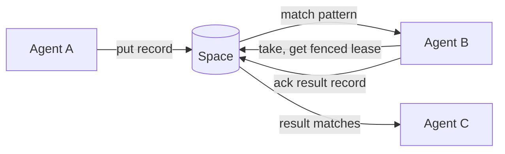

Guidance for agents working in this repo. Read this first, then the relevant file in
`agent_docs/`.

## What this is

Radia is a content-routed coordination runtime for LLM agents. **All of M0 (Phases 0–7) plus a
growing M1 slice are built.** That covers watches (SSE) and the **authorization stack**: kind- and
pattern-scoped grants (as records), the bootstrap chain + run tokens, per-run lease ownership
with stop/quarantine, `delegation_context`, and `taint` + declassify (Deno + TypeScript;
embedded PGlite and SQLite adapters; artifacts/blob storage; web console; TS + Python SDKs; a public-API CLI; a bundled
MCP adapter; runnable agent examples incl. a CLI LLM chatbot that runs with real auth roles).
The authoritative design lives in
`agent_docs/` (structured by topic) and originates from
[notes/radia-runtime-outline-v0.3.md](notes/radia-runtime-outline-v0.3.md), the v0.3
functional design outline. The `design-*` docs are spec + rationale; built ones carry an
"M0/M1 status" note pointing into `src/`. Build/run below; phase-by-phase status in
[agent_docs/plan-m0-implementation.md](agent_docs/plan-m0-implementation.md).

The runtime is a coordination substrate: agents exchange immutable JSON **records**
(tasks, facts, requests, results) through a shared space and claim work by **pattern
matching**, not by preconfigured routing. Each record has an immutable content half and
a mutable **runtime envelope** holding claim state. Work is claimed under a fenced,
renewable **lease** with at-least-once execution. Storage is Postgres (or embedded
SQLite/PGlite for local dev) behind a single runtime process that owns all concurrency
guarantees. Model calls and agent logic stay outside the runtime.

The result an agent `ack`s is itself a new record others can match, so work flows by
content, not by addressing.

## Layout

| Path                                    | Role                                                       |
|-----------------------------------------|------------------------------------------------------------|
| `deno.json`                             | tasks (`dev`/`check`/`conformance`/`chat-test`/`bench`/`compile`) + import map |
| `src/main.ts`                           | `radia` entry: `dev` (embedded space + console), `mcp`, else a CLI verb |
| `src/cli.ts`                            | the CLI verbs (health/stats/doctor/kinds/put/query/take/ack/watch/…), public `/v0` only |
| `src/mcp/`                              | MCP adapter over stdio: `server.ts` (JSON-RPC, credential + lease held outside the model, internal heartbeat), `tools.ts` (tool defs; descriptions ARE the docs) |
| `src/credentials.ts`                    | auto-provisioned local credential; `radia dev` writes it, CLI/MCP/Python SDK read it |
| `src/platform.ts`                       | **the platform seam**: every host operation (process/files/streams/signals/serve) in one file; nothing else in `src/` touches `Deno.*` |
| `src/flags.ts`                          | shared CLI flag parsing (`flag`/`optionalFlag`/`flags`/`has`/`positional`); `optionalFlag` is the bare-vs-valued distinction (`--db` = "persist, you pick where") |
| `src/paths.ts`                          | the one runtime directory: everything a space writes (db, blobs, KEK) lands under `./.radia` (`RADIA_DIR` moves it). Never name a runtime path at a call site; that is how the project root grew four `.radia-*` siblings |
| `src/ui/index.html`                     | dev web console served at `GET /` (no build, public API only); the **Space** tab streams the ops event log into a property-similarity map (bounded, evicting finished records before live ones); the **Auth** tab mints a person's session (operator only, the console's `radia login`) and the pasted token in `sessionStorage` decides the identity, read back from `ops/permissions` rather than assumed to be the operator |
| `src/ui/vendor/`                        | prebuilt browser assets served under `/ui/`: `blitzoom.bundle.js` (`<bz-graph>`, layout for the Space tab), pinned to an upstream commit; see the README there |
| `src/server/`                           | HTTP surface: `http.ts` (`startServer`, routes, `resolveAuth` Bearer, ops-plane gate, operator-token injection), `problem.ts` (RFC 9457), `handlers/` (`records.ts` + authorize, `leases.ts`, `agents.ts` = bootstrap chain, `artifacts.ts` = bytes in/out + download capabilities, `ops.ts` = ops plane: stats/events/lineage/children/graph/envelope-query/diagnostics/admin/remediate/declassify, `watches.ts` SSE = grant-gated `authorizeWatch`) |
| `src/storage/`                          | `adapter.ts` (the `StorageAdapter` port: records/leases/idempotency/events/graph + compiled-match AST, plus the optional `prepareKind` physical hint; kinds are records, not a port concern), `blobs.ts` (the `BlobStore` port: artifact bytes, content-addressed; memory + filesystem impls), `crypto.ts` (optional blob encryption: per-blob AES-GCM DEK wrapped under a space KEK), `row.ts` (shared row/value mapping), `pushdown.ts` (compiled pattern → a **sound** SQL pre-filter; the oracle still decides, see the soundness contract at the top of the file), `pgbase.ts` (shared Postgres-dialect body over a minimal SQL port) + `pglite.ts`, `postgres.ts` (both bind their driver to `pgbase`), `sqlite.ts` (own dialect) |
| `src/core/`                             | storage-agnostic logic: `space.ts` (service: put/take/settle, watches, lineage + graph, kinds-as-records, envelope query, `authorize`/grants, delegation, taint, bootstrap chain), `record.ts` (`buildRecord`, metadata split), `matching.ts` (compile + oracle + order + `combineMatch`), `kinds.ts` (indexing contract + `kind_def`/`grant`/`signal`/`agent_*`/`artifact` reserved kinds), `auth.ts` (token mint/hash; `CredentialStore` holds only what cannot be revoked, so credentials resolve from records per request), `take.ts` (claim ranking), `registry.ts` (the latest-wins / additive projections every registry is built from, and `retired: true`), `notifier.ts` (watch wakeup), `time.ts`, `ids.ts` (**monotonic** ULIDs; latest-wins depends on it), `errors.ts` |
| `sdk/README.md`                         | SDK overview + parity table (TS and Python); start here for client work |
| `sdk/ts/`                               | TS SDK: `client.ts` (`RadiaClient` over `/v0`, incl. `watch()` SSE), `loop.ts` (`agentLoop`, event-driven, design §5) |
| `sdk/py/radia.py`                       | Python SDK at parity (stdlib only): `RadiaClient`, `watch()`, `agent_loop` with heartbeat |
| `scripts/build-release.sh`              | `deno compile` per OS + staged npm/pip launcher packages (`deno task release`) |
| `examples/operator.ts`                  | the operator credential an example bootstraps with (`RADIA_TOKEN`, else the file `radia dev` writes). Examples authenticate like any client; none relies on the no-header shortcut |
| `examples/`                             | one directory per example, each with its own README: `pipeline/` (planner + workers + aggregator, `deno task demo`), `stress/` (wave load generator for the Space tab), `chat/` (the full LLM agent: llm + tool calls, images, artifacts and sandboxed code execution, all as records; `deno task chat-test` runs its eleven suites with NO API key, and this app is where bugs surface first, so it has its own harness). See [examples/README.md](examples/README.md) |
| `bench/`                                | benchmark suite (`deno task bench`): throughput, latency percentiles, scaling curves per adapter. Nothing asserts; see the README there for what the numbers mean and what the first run found |
| `conformance/`                          | port contract suites for storage adapters and the blob store (`run.test.ts`, `harness.ts`, `suites/`), plus standalone `*.test.ts` for what is not adapter-parameterized: `http.test.ts` (the HTTP boundary, via `makeHandler`), `backfill.test.ts` (the schema's one migration), `planner.test.ts` (Postgres statistics), `registry.test.ts`, `console.test.ts` (the console page, incl. its sign-in gate), `defaults.test.ts` (the posture an unconfigured space lands in); see the README there |
| `openapi/radia.yaml`                    | the frozen wire contract (source of truth)                 |
| `agent_docs/`                           | design deep dives, one topic per file (linked below)       |
| `notes/radia-runtime-outline-v0.3.md`   | origin design outline; provenance, not maintained doc      |

Build/run: `deno task dev` (no build step; bare `--db` persists under `./.radia`, `--db <path>` to a
SQLite file or PGlite dir of your choosing, in-memory otherwise), `deno task conformance` (both adapters), `deno task chat-test` (the chat example, no API key), `deno task bench` (hotspots + scaling), `deno task demo`
(end-to-end agent demo over HTTP), `deno task compile` (single binary), `deno task release`
(per-OS binaries + npm/pip launcher packages). All of M0 is built;
[agent_docs/plan-m0-implementation.md](agent_docs/plan-m0-implementation.md) holds the
per-phase record, and [agent_docs/plan-milestones.md](agent_docs/plan-milestones.md) tracks
what remains in M1–M3.

## Docs

Subsystem docs. `architecture-*` describes what is built; `design-*` is spec + rationale, and a
built one carries an "M0/M1 status" note pointing into `src/`. Code wins over any doc on a
conflict about current behavior:

Each example carries its own README: [examples/pipeline/](examples/pipeline/) (coordination, no
key), [examples/stress/](examples/stress/) (load, for the Space tab), [examples/chat/](examples/chat/)
(the full LLM agent: `client/`, `workers/`, `tools/`, `space/`, `provider/`).

- [agent_docs/architecture-surfaces.md](agent_docs/architecture-surfaces.md): the CLI, the MCP adapter, auto-provisioned credentials, the `platform.ts` host seam, and release packaging; how anything reaches a space other than raw HTTP.

- [agent_docs/design-data-model.md](agent_docs/design-data-model.md): records vs. runtime envelope, kinds, timing fields, provenance vs. authority, resource limits, artifacts (§2).
- [agent_docs/design-matching.md](agent_docs/design-matching.md): the pattern query language, its divergences from Mongo, per-kind indexing contract, semantic matching (§3).
- [agent_docs/design-api.md](agent_docs/design-api.md): delivery guarantee, leases + fencing, idempotency ordering, the ten operations, wire protocol, agent loop (§4–5).
- [agent_docs/design-scheduler.md](agent_docs/design-scheduler.md): optional cost-aware admission control, atomic admission-to-claim, server-computed priority (§6).
- [agent_docs/design-marketplace.md](agent_docs/design-marketplace.md): request/bid/award capability marketplace and durable timers (§7).
- [agent_docs/design-auth.md](agent_docs/design-auth.md): principals, grants, delegation, taint, revocation, budgets (§8).
- [agent_docs/design-observability.md](agent_docs/design-observability.md): event log, audit, re-execution, livelock detection, integrity and confidentiality architecture (§9).
- [agent_docs/design-storage.md](agent_docs/design-storage.md): Postgres mapping, deployment modes, distribution strategy (§10).
- [agent_docs/design-execution.md](agent_docs/design-execution.md): running model-written code in more than one language. The language question is an isolation question: Deno's permission flags ARE the sandbox today, and nothing about that generalises. Dispatch is free (a runner is a worker, a tool is a capability record); the isolation choice and what stops being uniform are the design.
- [agent_docs/design-workspaces.md](agent_docs/design-workspaces.md): multi-file working trees for code generation, and the relationship to git. Decided (store Radia-native, shape git-compatible, export git-real, sha256 authoritative, export only); unbuilt. Read before proposing git as a storage format.

Research and planning:

- [agent_docs/research-positioning.md](agent_docs/research-positioning.md): thesis, evidence, prior art, the defensible gap (§1).
- [agent_docs/research-applications.md](agent_docs/research-applications.md): what the substrate is for, verified against `src/`: the `template` → `pattern` naming decision (§1, applied), the pattern layer as the authorization primitive and its limits, ranked applications, gated execution of LLM-generated code, and the Bank Python precedent. Carries a claim ledger of what was checked, including doc claims that turned out false.
- [agent_docs/plan-milestones.md](agent_docs/plan-milestones.md): M0–M3 delivery plan, milestone scope (§11).
- [agent_docs/plan-m0-implementation.md](agent_docs/plan-m0-implementation.md): the buildable M0 plan: Deno + TS runtime, storage decisions, phase-by-phase build with verify steps.
- [agent_docs/plan-validation.md](agent_docs/plan-validation.md): baselines, metrics, fault-injection matrix (§12).
- [agent_docs/plan-audit-remediation.md](agent_docs/plan-audit-remediation.md): confirmed defects from the 2026-07-27 full-codebase audit, grouped by root cause with the guard each one needs. Read before touching auth scope enforcement, lease settle, grant supersede, or declassify.
- [agent_docs/design-inspection.md](agent_docs/design-inspection.md): inspecting emergent flows. Why a content-routed substrate cannot render its own workflow, the three audiences that ask different questions, what shape each mechanism has to take, and the constraints that turn an inspection feature into a defect. Read before adding any view or read verb.
- [agent_docs/plan-inspection.md](agent_docs/plan-inspection.md): the inspection backlog: order, audience per item, and the one open prerequisite (watch lifecycle).
- [agent_docs/research-self-modeling.md](agent_docs/research-self-modeling.md): whether a space can hold an agent's model of its own process in the same medium as its model of the world. Covers the paired self-report/measurement claim, the verified blockers, and the calibration baseline. Research, gated like the marketplace; nothing scheduled.
- [agent_docs/gotchas.md](agent_docs/gotchas.md): rejected approaches, the risk register, and non-obvious "why is it like this" decisions. Skim before proposing a change to signing, encryption, idempotency ordering, or storage backends.

## Design principle: express features through the substrate, not beside it

Before adding a bespoke endpoint, a hard-coded list, or out-of-band config, ask whether the
feature can be a **record, a query, or content-routed dispatch**, all of them Radia's own primitives.
Radia is a coordination substrate; it should coordinate its *own* capabilities and
operations through itself (dogfooding). Symptoms of violating this: a growing flat API of
one-off endpoints, static tool/route tables, features that only the operator can reach
out-of-band. Four applications already made:

- **Kinds are records, not a side table.** A kind declaration is a `kind_def` record
  (body = the indexing contract), written via `put` and discovered by `query {kind:kind_def}`.
  There is no `kinds` table and no `/v0/kinds` endpoint. The registry is a cache/projection rebuilt from
  those records at startup; a redeclaration is a successor record (latest wins), not a mutation.
  One bootstrap: the `kind_def` meta-kind is defined in code so its own records can compile.
  See `src/core/kinds.ts` (`KIND_DEF`, `META_KIND_DEF`) and `Space.put`/`loadKinds`.
- **Observability/control is a coherent, grant-gated plane, not scattered endpoints.** The
  coordination verbs are frozen under `/v0/*`; observe-and-operate (stats, events,
  diagnostics, record + envelope introspection, remediation) lives under `/v0/ops/*`, one
  prefix that is also the (future) auth boundary. Push what *can* be a query onto a query:
  the envelope (runtime state) is queryable at `GET /v0/ops/records?state=…`, and diagnostics
  is a *composition* of those queries, not hand-rolled scans. Remediation takes the SAME
  selector (`POST /v0/ops/remediate` with `{state:"leased", expired:true}`), so diagnosing and
  fixing are one vocabulary instead of a report plus a loop over ids. What genuinely can't be a
  body-match query stays a derived capability by design. The content-routing query language
  matches record *bodies* (for routing), so aggregation (stats), DAG-traversal (lineage/graph),
  and get-by-id are legitimately first-class, not endpoints pretending to be queries.
- **Capabilities are records the substrate routes and the agent discovers.** Tool-workers
  publish `capability` records ({tool, schema}); an agent *watches/queries* them to build its
  tool list and dispatches by content (`tool_call{tool}` → whichever worker registered it), with no
  preconfigured routing table (§7). Add a worker → the agent gains the tool, no code change.
- **Withdrawal is a successor record, not a delete, and the projection is shared.** Kinds, grants,
  capabilities, models and saved procedures are all registries: mutable-looking views over an
  append-only stream. So removing one is a successor carrying `retired: true`, honoured once in
  `src/core/registry.ts` (`activeByKey` for latest-wins, `activeSet` for additive entries like
  grants) rather than re-implemented per consumer, which it was, six times, before it was shared.
  Revoking a grant is exactly this, and the audit trail survives it. See
  [agent_docs/gotchas.md](agent_docs/gotchas.md).
- **Grants are records the runtime reads, not a config table.** A kind-scoped grant is a
  reserved `grant` record ({principal, kind, operations}); a human/supervisor `put`s one and
  `Space.authorize` discovers it by `query`. Authorization state gets the same immutability,
  event-log visibility, and watchability as any record. `signal`/`grant` writes and `/v0/ops/*`
  are the grant-gated boundary. See [agent_docs/design-auth.md](agent_docs/design-auth.md).

**The principle has a stopping rule, and it was learned the hard way.** Expressing a feature as
records means its current state is a PROJECTION over an append-only log: writes are unbounded, reads
are bounded, and every consumer must page, order and dedupe correctly. That is a fine trade for
kinds and capabilities, where a stale read is a missing tool. It is a bad trade for anything whose
failure mode is SILENT MISAUTHORIZATION: a revocation that fell off a page kept a grant alive, and
a stopped run's token kept resolving after a restart. So:

- Registry state is read through `readRegistry` (`src/core/registry.ts`), never a hand-rolled
  `query(kind, N)`. It pages to exhaustion and reports `complete: false` rather than returning a
  plausible prefix. A bounded read whose result is treated as a population is the single most
  repeated bug in this codebase.
- Registry writes are CONTENT-KEYED, so restarting a fleet does not append a duplicate per entry.
  Unbounded growth is what makes bounded reads dangerous in the first place.
- Authorization has a canonical, inspectable form: `Space.effectivePermissions` /
  `GET /v0/ops/permissions` / `radia permissions <principal>` / the chat's `space_permissions`.
  Every grant bug so far was a promise that did not match the enforcement; this is how you check
  before believing. **Any principal may read its OWN permissions**, including one with no grants at
  all. That is the caller most likely to need the answer, and gating it behind the ops plane left
  an agent unable to tell an approved grant from a pending one. Reading anyone else's stays
  operator-only.
- State that is high-churn AND security-critical (credentials) is a poor fit for this shape. Prefer
  bounded relevance (only what can still be presented) over replaying history.

**The corollary binds agents as well as the runtime: discover, don't hardcode.** An agent (and
every example client) learns its tools and models from records (`capability`/`model`), *how* to
use them from the descriptions those records carry, routes by content, and follows relationships
by querying (lineage up, `children` down). It must not bake substrate-provided knowledge into
client code or a system prompt. **Fine:** an app defining and writing its *own* record kinds (the
chat owns `message`/`llm_call`/…), and a launcher spawning the worker fleet. That's setup.
**Not fine (all bit the chat example):** a `/command` or client branch that encodes a *decision*
that should be delegated (the model tier is picked by a router-worker, not the REPL); a hard-coded
tool list (watch `capability` records); a redeclared capability that 409s instead of a successor
(content-key it, latest-wins, like `kind_def`); tool-usage hints or kind names taught in the
system prompt (put usage in the tool's *description*, discover kinds with `space_kinds`). The
line is **setup vs. behavior**: launching workers is client config; per-turn behavior (which
tool, which model, how records relate, how a tool is used) is discovered from the substrate or
delegated to a worker. Symptom to catch in review: a client growing a `switch` on kinds, a
`/tier`-style command, or a prompt that teaches the substrate.

**Two things a prompt may still carry: a disposition and the agent's own identity.** A disposition
says *when to reach for a tool at all* ("prefer to inspect before acting"; "if unsure what happened
earlier, retrieve rather than recall") and survives every kind being renamed. A tool description
cannot do that job, because it is only attended to once the model is already considering that tool.
Identity is the agent's own handle on itself (the chat tells the assistant its `conversationId`,
the same category as handing a worker a run token). Without it a disposition is unusable, since
the agent cannot name the thing it should look up. Neither is substrate knowledge: the mechanism
(which kind, which match, which order) stays in the tool's description.

## Invariants

Cross-cutting rules that must hold across the whole design. Subsystem-local invariants
live at the top of the relevant `agent_docs/` file, not here.

- **Records are immutable after commit.** No field is ever rewritten. A content
  "update" is consume-plus-emit-successor, never mutation. Only the runtime envelope
  (`record_runtime`) changes.
- **Client-submitted vs. runtime-authoritative metadata is a hard API split.** Clients
  submit *claims* (`confidence`, `requested_priority`); the runtime decides what they
  are worth. `created_by`, `delegation_context`, `created_at`, `schema_version`,
  `taint`, `effective_priority`, and all lease fields are server-assigned and never
  client-editable. See [agent_docs/design-data-model.md](agent_docs/design-data-model.md).
- **Provenance is not authority.** `parent_ids` is data/causality lineage only;
  `delegation_context` is the single authorization chain, server-derived from the
  claimed lease. Deriving data from a privileged record grants nothing. Never intersect
  authority across data parents.
- **Delivery is at-least-once with at most one valid lease at a time.** Physical
  execution may overlap after lease expiry (a fenced worker runs until it observes
  `lease_lost`). Side-effecting agents need idempotency at the effect boundary.
- **Idempotency is checked before lease validation.** Reordering these falsely returns
  `lease_lost` for an operation that already succeeded. See
  [agent_docs/design-api.md](agent_docs/design-api.md).
- **Patterns are data, not code.** No `$regex`, `$where`, `$expr`, ever. The query
  language is analyzable and storable.
- **All time comparisons use the database clock.** Never a client or app-server clock.
- **Timing fields are never overloaded.** `available_at`, `claim_until`, `deadline_at`,
  `retention_until`, and `leased_until` are distinct concepts. Retention GC never
  discards a valid in-flight lease's completed work.
- **Grants are kind-scoped, never wildcard, and assigned, never self-declared.** Manifest
  capability claims are descriptive, not authorization. `signal` and grant management are
  writable only by an OPERATOR (a principal the space NAMES in `SpaceContext.operators`) or the
  supervisor agent. `human:` is a namespace, not a privilege: a logged-in person is an ordinary
  principal.
- **Taint clears only via privileged declassify.** Ordinary agents cannot write
  `taint: false`.
- **Artifact bytes never travel inside a record.** A payload too large for a body lives in the
  blob store; the record carries `{digest, mediaType, size}` and routes. A base64 payload in a
  record body defeats matching, windowing, the Feed, and every size assumption downstream.
- **Erasable data lives in an artifact, never in a record body.** Immutability is the substrate's
  core property, and permanent deletion is a real requirement (a subject exercising a right, a
  secret written by accident, a retention deadline). The two are reconciled at exactly one boundary:
  a payload is out of line, so it can be destroyed (`Space.shredArtifact`, `POST
  /v0/ops/records/{id}/shred`), while the record, its id, its lineage and the event log survive and
  the content address stays valid. A record BODY has no erasure path, because bodies must stay
  plaintext JSON for matching. So the existing "artifact bytes never travel inside a record" rule is
  also the erasure boundary: extend it from "too large for a body" to "erasable, whatever its size".
  Erasure is by CONTENT (identical payloads are one blob), irreversible, and operator-only.
- **A blob's digest is over plaintext, and its key is destroyable.** Encryption is optional, but
  when it is on the content address still hashes the plaintext (so integrity and the event chain
  survive crypto-shredding), and the wrapped DEK lives beside the blob, never in the immutable
  record, because shredding means deleting it.
- **Embedded mode is never a semantically weaker cousin of Postgres.** The full
  conformance + fault-injection suite runs against every implementation of every port
  (storage adapters AND the blob store, encrypted or not) in CI from day one. This is the only
  guard against drift.
- **The wire contract is what's frozen, not the implementation.** OpenAPI-first;
  implementation language and storage backend can change behind the stable protocol.
- **Minimal dependencies, maximal platform independence, zero or near-zero build steps.**
  When implementation starts: prefer the standard library and a small, audited dependency
  set over pulling in a framework; keep the code portable across OSes and runtimes rather
  than binding to platform specifics; and keep the build trivial (ideally run-from-source
  or a single bundling step). This is what keeps `npx radia dev` under a minute and lets
  the one server binary wrap for both npm and pip (see
  [agent_docs/design-storage.md](agent_docs/design-storage.md) "Distribution"). A new
  dependency or build step is a cost to justify, not a default.

## Doc lifecycle

Subsystem docs are `design-*` (spec + rationale). Built ones now open with an "M0/M1
status" note pointing into `src/`; **auth is substantially built (M1)** and its doc carries a
status note (OIDC, budgets, and the chain-intersection policy stay deferred). Still pure design:
scheduler (M3), marketplace (M2). Full rename to `architecture-*` is deferred to avoid link
churn; the status note + source pointers serve the same purpose for now. `plan-*` docs
track milestone progress; `plan-m0-implementation.md` is the phase-by-phase record.

## Conventions

- Never reach for `Deno.*` outside `src/platform.ts`. That file is the platform seam; if an
  operation is missing, add it there. Documented exceptions: the tests under `conformance/`
  (`Deno.test`, temp dirs, reading a source file), the examples (they are apps, not the runtime),
  and the deno-postgres socket patch in `src/storage/postgres.ts`.
- Never call `exit` outside `src/main.ts`. Return a status or throw `UsageError`; the entry
  point is the only place that terminates the process.
- Docs point into the source: file path plus key symbol, not restated
  logic. Code wins over docs on any conflict about current behavior; fix the doc.
- Update the relevant doc in the same change that alters a design decision. After a
  large or cross-cutting change, ask the agent to "update the docs" for a reconciliation
  pass.
- Keep this file the routing entry point. Move subsystem detail into `agent_docs/` and
  link it.

## Documentation Style

- Markdown links for docs an agent should follow; backticks for source paths and inline
  code. Align table columns.
- No AI-isms (no em dash `—`, no "powerful", "seamlessly", "leverage", rule-of-three, "not
  just X but Y"). Recast the sentence instead of swapping the em dash for a comma: a period,
  colon, or parentheses almost always reads better. No emojis in project copy. State the
  point directly.
- Concise; assume a competent agent. Add only what it can't infer: names, rules,
  constraints, and the why. Cut explanations of general concepts.
- State each rule on its own line as always/never; a rule buried mid-paragraph gets
  skipped.
- Mark inferred claims and open questions; don't present a guess as a fact.
