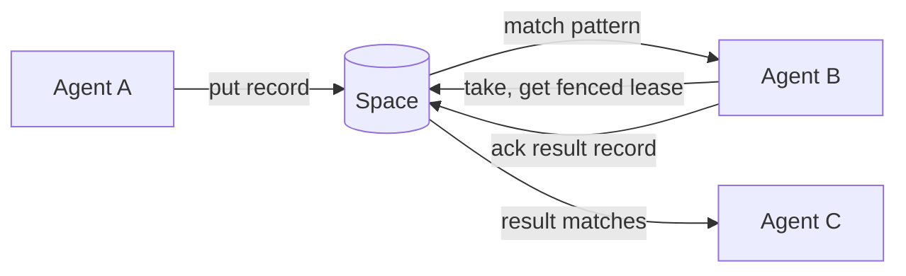

Guidance for agents working in this repo. Read this first, then the relevant file in
`agent_docs/`.

## What this is

Radia is a content-routed coordination runtime for LLM agents. **All of M0 (Phases 0–7) plus a
growing M1 slice are built.** That covers watches (SSE), the **authorization stack** (kind- and
pattern-scoped grants as records, the bootstrap chain + run tokens, OIDC sign-in minting runs
from an IdP's id_token, per-run lease ownership
with stop/quarantine, `delegation_context`, `taint` + declassify), the **tamper-evident event
chain**, mined **flows**, and the resource limits (Deno + TypeScript;
embedded PGlite and SQLite adapters; artifacts/blob storage; web console; TS + Python SDKs; a public-API CLI; a bundled
MCP adapter; runnable agent examples incl. a CLI LLM chatbot that runs with real auth roles).
The authoritative design lives in
`agent_docs/` (structured by topic) and originates from
[notes/radia-runtime-outline-v0.3.md](notes/radia-runtime-outline-v0.3.md), the v0.3
functional design outline. The `design-*` docs are spec + rationale; built ones carry an
"M0/M1 status" note pointing into `src/`. Build/run below; phase-by-phase status in
[agent_docs/plan-m0-implementation.md](agent_docs/plan-m0-implementation.md).

The runtime serves a shared **space**: agents exchange immutable JSON **records**
(tasks, facts, requests, results) through it and claim work by **pattern
matching**, not by preconfigured routing. Each record has an immutable content half and
a mutable **runtime envelope** holding claim state. Work is claimed under a fenced,
renewable **lease** with at-least-once execution. Storage is Postgres (or embedded
SQLite/PGlite for local dev) behind a single runtime process that owns all concurrency
guarantees. Model calls and agent logic stay outside the runtime.

The result an agent `ack`s is itself a new record others can match, so work flows by
content, not by addressing.

## Layout

| Path                                    | Role                                                       |
|-----------------------------------------|------------------------------------------------------------|
| `deno.json`                             | tasks + import map. Verbs are grouped and verb-first: `dev*` runs a space, `cli` is the CLI from a checkout (`deno task cli health`), `check`/`test*` verify (`test` is the aggregate; `test:quick`, `test:runtime`, `test:conformance[:pg|:s3]`, `test:extensions`, `test:chat`, `test:analysis`, `test:mud`), `bench`/`profile` measure, `compile`/`release`/`bundle-*` build |
| `src/main.ts`                           | `radia` entry: `dev` (embedded space + console), `mcp`, else a CLI verb |
| `src/surfaces/`                         | **the client layer inside the binary**: ways to reach a space that are not raw HTTP. Everything here talks `/v0` through the SDK exactly as an external client does, so it may import an `extensions/` convention and may NEVER take a value from `src/core`/`server`/`storage`. That direction is what makes `workspace-git` an ordinary client verb instead of the runtime growing an opinion about files; `test/layering.test.ts` holds both halves |
| `src/surfaces/cli.ts`                   | the CLI verbs (version/health/stats/doctor/credentials/erasures/flows/integrity/kinds/put/query/take/ack/watch/gc/rewrap/otlp/workspaces/workspace-git/git-serve/promote/rollback/pins/bind/bindings/host/compartment/runs/team/…), public `/v0` only. `query` reads NEWEST first and names the page it stopped at; `credentials` is the one verb about this MACHINE rather than a space. `runs --for <principal> [--stop]` is the offboarding cascade, and it covers BOTH classes a person acts through — `agent_run{agent: X}` (their own sessions) and `agent_run{actingFor: X}` (delegated, held by workers). It shipped covering only the second and left their own session live for up to the run ceiling. `team remove` is the same cascade for a member and shipped with the MIRROR half missing (own sessions only); it now also retires the member's grants and ops powers, because a revoked definition cannot authenticate while `mintDelegatedRun` still intersects with that principal's live grants. Both verbs read the DATABASE clock for "is this run live": `expiresAt` is stamped by the space, and a local clock running fast reads a live run as expired, skips the stop, and that run then renews itself to the 12h ceiling, since `renewRun` checks the run's own status and never the definition behind it. `revoke` is NOT a kill switch and never was: it stops a definition MINTING, deliberately leaves live runs alone (rotating a token must not take every worker down mid-call), and is a no-op for an SSO identity, which holds no definition at all. `git-serve` is a CLIENT that happens to listen: it binds its own port, so serving git needs no runtime change and no wire-contract entry. The workspace-agent verbs are the same move: `promote`/`bind` write the two locks, `pins`/`bindings` read them back from the enforcement path, and `host` is a client that happens to run other people's code, holding each agent's definition token and claiming under a run minted from it. `login --sso` is the OIDC loopback (RFC 8252): a one-shot listener on 127.0.0.1:8253 behind a random-path short link, PKCE and the nonce checked CLI-side, the run token stored where the chat and CLI already look |
| `src/surfaces/mcp/`                     | MCP adapter over stdio: `server.ts` (JSON-RPC, credential + lease held outside the model, internal heartbeat), `tools.ts` (tool defs; descriptions ARE the docs), `server.ts` speaks BOTH protocol eras: `server/discover` and per-request `_meta` for 2026-07-28 (which made MCP STATELESS, with a stdio process explicitly "not a conversation or session"), plus `initialize` for the 2025 handshake every harness actually sends, since the reference SDK's client defaults to it byte for byte and no deprecation date exists on either side. Statelessness has ONE real bite here: a claimId only its minting process could settle. `recoverClaim` rederives the lease from the envelope, gated on the RUN matching because a settle is owner-bound, which makes `--session` load-bearing for conformance and is why an anonymous session still releases its claims on exit while a named one keeps them. `trace.ts` (`--trace <file>`, one JSONL line per tool call at the single `tools/call` dispatch: what the model ASKED FOR, which the space cannot see, since a `take` appends its event only after it WINS a record and reads append none, so a claim that matched nothing is invisible to the log, to lineage and to `radia flows`. A FILE, never records in the space, which is the instrument under observation. `classify` is narrow on purpose and anything it cannot read counts as `ok`, because over-reporting `empty` puts false findings in front of a reader), `config.ts` (the harness config `radia team add` prints: it names THE BINARY THAT WROTE IT, absolute, because a block saying `"command": "radia"` works only if the harness's PATH has it, which is the one thing a generated config cannot check. A PATH SCAN was tried and rejected for the same reason in reverse: it can name a different build than the one writing the block, and a stale install speaks an older wire contract while still starting cleanly. Running from source has no binary to name, so it reports `fromSource` and the CLI sends the reader to `deno task compile` rather than handing another project a config pinned to this checkout's path. `--scope local` is spelled out in the `claude mcp add` line, since the `user` scope writes one config for every project and collapses two members into one principal) |
| `src/credentials.ts`                    | auto-provisioned local credential; `radia dev` writes it, CLI/MCP/Python SDK read it. It is the USER's file, not a space's, so `radia credentials [--prune]` owns it: it drops only what a restart can rebuild (operator, `#observer`), never a `#login` durable half or a content key, and PROBES each dormant base first, since an entry is rewritten only when a space starts and age alone cannot tell a dead space from a long-running one |
| `src/log.ts`                            | **process logging**, which is the one thing the space cannot tell you: what THIS BUILD did at 02:00 (which credential resolved, why a sweep was slow, what the config parsed to). It replaced 40 bare `console.log` calls with no level, no source and no way to turn any of them off. Four levels, `getLogger(<component>)`, text to STDERR and JSONL to `--log-file`, a bounded ring buffer for a reader with no file, synchronous with lost lines lost. It reads NO configuration: `src/main.ts` configures it once before anything can log, which is what keeps `src/core` from importing a surface's flag parsing in order to say something. Stderr is not a preference: `radia mcp` speaks JSON-RPC on stdout, and a log line there kills the session. An unwritable `--log-file` disables the file and says so ONCE, because an observation must never break the thing it observes. See the two rules in Conventions for what belongs here rather than in a record |
| `src/platform.ts`                       | **the platform seam**: every host operation (process/files/streams/signals/serve/http) in one file; nothing else in `src/` touches `Deno.*`. INJECTABLE: the exported functions delegate to a backend object (`setPlatformBackend`), Deno by default; `src/platform_browser.ts` is the Web-APIs backend and `src/browser.ts` the browser entry (`bootBrowserSpace`: PGlite + memory blobs + `makeHandler` as the whole wire, no socket). `deno task bundle-browser` builds the docs playground from it — outputs gitignored, never committed (plan-browser-space.md) |
| `src/flags.ts`                          | shared CLI flag parsing (`flag`/`optionalFlag`/`flags`/`has`/`positional`); `optionalFlag` is the bare-vs-valued distinction (`--db` = "persist, you pick where") |
| `src/paths.ts`                          | the one runtime directory: everything a space writes (db, blobs, KEK, the event-chain key) lands under `./.radia` (`RADIA_DIR` moves it). Never name a runtime path at a call site; that is how the project root grew four `.radia-*` siblings |
| `src/lock.ts`                           | ONE writer per local database: an OS advisory lock on `<db>.lock`, taken before the adapter opens the files and released after it closes them. PGlite has no locking of its own, so two `radia dev` on one directory both started and DIVERGED with nothing able to detect it afterwards. The kernel releases the lock when a holder dies, so a SIGKILL leaves nothing stale, and the loser reads the holder's pid and base URL out of the file (plan-startup-ergonomics.md item 1) |
| `src/ui/index.html`                     | dev web console served at `GET /` (no build, public API only); the view lives in the URL as `#tab/recordId?knobs`, applied from INSIDE the sign-in gate (a route applied while signed out starts the Feed/Space polls behind the overlay) and surviving re-auth for free, since sign-in reloads the same URL; the **Overview** tab renders `ops/diagnostics` as ranked findings whose samples LINK to the records they rest on (a finding nobody can open is an assertion); the **Records** browser reads NEWEST first (the oldest-50-as-"the records" trap shipped here once), columns come from the kind's own `indexedPaths`, and both it and Query render `explain` notes; the **Feed** groups events by lineage root with same-shape runs collapsed to ×N and a match filter that is a REAL bounded query (flat view one toggle away, knobs in the hash); the **Kinds** tab renders the digest (declaration + counts + live listeners per kind) and the ROUTING DIAGRAM (agents ←listen— kinds, from live interest records, never declared); the **Space** tab streams the ops event log into a property-similarity map (bounded, evicting finished records before live ones; seeds from the TAIL like the Feed, with "Replay all" as the explicit whole-log path); the **Graph** tab defaults its root picker to a kind THIS SPACE declares (it was hardcoded to `conversation`, so on any space but the chat's the tab opened with a 403 about somebody else's app) and has a WATERFALL view (time as the x-axis, bars honest about "a record has no duration": creation → last derived record) and colours taint BY LABEL — the waterfall is the drill-down target wherever a duration raises a question (flow exemplars, feed threads, doctor samples, record detail), and each mined shape offers a "timing" waterfall aggregated across its exemplars. "from here down" (`?direction=down`) is what makes ONE sub-thread readable: the walk goes both ways, so under a hub record every sibling thread is two hops away and a conversation rendered 150 of its 346 records with nothing saying so — the cap now reports `truncated`; the **Flows** tab renders shapes MINED from lineage, never declared, with the exemplar ids as the evidence behind each claim; a record's `created_by` names the AGENT beside the run (`agentOf`, a NARROW read of the newest `agent_run` for that one run, memoized and FAIL-SOFT, since an ordinary session holds no `agent_run: query` grant and a decoration must not blank the field it decorates), and the Space map clusters by that agent rather than a ULID that means nothing tomorrow; the **Auth** tab mints a person's session (operator only, the console's `radia login`); sign-in holds the credential the way every client does (plan-console-auth.md: a definition token remembered on request and exchanged/renewed silently, `radia login --console` prints a fragment sign-in link, open mode offers the operator as a LABELED button, and "Sign in with SSO" appears when health advertises an OIDC issuer — code+PKCE in the page, nonce checked page-side, the IdP display name kept client-side as pill DECORATION beside the enforced principal), and identity is read back from `ops/permissions` rather than assumed |
| `src/ui/vendor/`                        | prebuilt browser assets served under `/ui/`: `blitzoom.bundle.js` (`<bz-graph>`, layout for the Space tab), pinned to an upstream commit; see the README there |
| `src/server/`                           | HTTP surface: `http.ts` (`startServer`, routes, `resolveAuth` Bearer, ops-plane gate, operator-token injection), `problem.ts` (RFC 9457, plus `rejectUnknown`: a field the operation does not have is a 400 NAMING it, because a dropped field that narrows hands back a wider answer than was asked for), `handlers/` (`records.ts` + authorize, `leases.ts`, `agents.ts` = bootstrap chain, `artifacts.ts` = bytes in/out + download capabilities + **shred** (the erasure carve-out), `ops.ts` = ops plane: stats/events/lineage/children/graph/envelope-query/diagnostics/erasures/flows/integrity/admin/remediate/gc/rewrap/declassify/shred, `watches.ts` SSE = grant-gated `authorizeWatch`) |
| `src/storage/`                          | `adapter.ts` (the `StorageAdapter` port: records/leases/idempotency/events/graph + compiled-match AST, plus the optional `prepareKind` physical hint; kinds are records, not a port concern), `blobs.ts` (the `BlobStore` port: artifact bytes, content-addressed; memory + filesystem impls, plus `MigratingBlobStore`, which writes to ONE store and reads through the rest, since a record names bytes by content address and cannot be repointed — that is what makes changing backend possible, and `delete` plus `retainOnly` fan out to every layer because an erasure that reached one copy is not one), `s3.ts` (the S3-compatible store, which is what a horizontal deployment needs: a local blob directory is shared with nobody, so an artifact 404s on every other instance and a shred reaches one copy. SigV4 written here rather than an SDK, the wrapped DEK in OBJECT METADATA so key and payload land in one atomic PUT, a deduped put touching the object with a self-copy because `retainOnly`'s grace window reads that clock, and a stated caveat that bucket versioning keeps what a shred deletes), `blobspec.ts` (what `--blobs` accepts: a directory, `memory`, `s3://bucket/prefix`, or a comma-separated list that is a migration), `crypto.ts` (optional blob encryption: per-blob AES-GCM DEK wrapped under a space KEK, and the KEYRING that makes rotation a config change rather than a migration: a `SealedKey` names the key that wrapped it (`kid`, derived from the key so two processes agree without being told), retired keys READ but never write, and every read, delete and keep-set spans all of them, because a name is HMAC(KEK, digest) and a new key renames the estate. `rewrap` FINISHES the rotation by re-sealing referenced payloads under the current key, and is digest-driven, so what it cannot name is what the sweep keeps rather than deletes), `row.ts` (shared row/value mapping), `pushdown.ts` (compiled pattern → a **sound** SQL pre-filter; the oracle still decides, see the soundness contract at the top of the file), `pgbase.ts` (shared Postgres-dialect body over a minimal SQL port) + `pglite.ts`, `postgres.ts` (both bind their driver to `pgbase`), `sqlite.ts` (own dialect) |
| `src/core/`                             | storage-agnostic logic: `space.ts` (the service and the one facade every caller holds: put/take/settle, watches, lineage + graph, kinds-as-records, envelope query, taint), plus seven features it DELEGATES to rather than contains, each reached through a narrow `XxxHost` port so the dependency runs one way: `authorization.ts` (`authorize`/grants, and ONE seam, `access`, because five of the six entry points would otherwise read the worker's own grants and miss a delegated run's attenuation), `identity.ts` (the credential chain: definitions, runs, delegation, OIDC. The one port here that WRITES, since a credential comes into existence as a record; what it must not hold is a credential CACHE, so every read is `newestByHash`, a NARROW read of one `tokenHash`, and a stop or revocation is a successor carrying that same hash), `seal.ts` (the event chain: sealing, signing and `verifyIntegrity`. `ChainHost` is TWO members wide, `storage` and the key, because sealing is a walk over the log plus arithmetic over hashes: it reads no record, grant or kind, so nothing in it can be wrong about authorization), `gc.ts` (the sweeps: retention, registry compaction, the event horizon, and the two amortized triggers the write path pays for. The counters are INSTANCE state in a `SweepState` holder, so two instances over one database each keep their own and the housekeeping merely runs oftener; it asks the chain to ATTEST a truncation rather than reimplementing it, or a sweep is indistinguishable from tampering), `flows.ts` (shapes mined from lineage), `artifacts.ts` (bytes beside the record, and the capability store), `inspection.ts` (`digest`/`thread`/`diagnostics`/`explainQuery`, all compositions of reads and a port that holds no writer). `record.ts` (`buildRecord`, metadata split), `matching.ts` (compile + oracle + order + `combineMatch`), `kinds.ts` (indexing contract + `kind_def`/`grant`/`signal`/`agent_*`/`artifact` reserved kinds), `auth.ts` (token mint/hash; `CredentialStore` holds only what cannot be revoked, so credentials resolve from records per request; a DEFINITION token is durable and mint-only, a RUN token is short and acts, and the SDK exchanges the first for the second on expiry), `take.ts` (claim ranking), `registry.ts` (the latest-wins / additive projections every registry is built from, and `retired: true`), `notifier.ts` (watch wakeup, KIND-AWARE: a write of kind K wakes only streams watching K plus the any-set; authorization-kind writes and the cross-instance poll wake everyone), `coalesce.ts` (the other half of the same fix: one `notify` resumes every parked stream in the same tick, so their identical log reads and record fetches are single-flighted into one each — a write costs 2 queries however many streams are parked, measured in bench/suites/fanout.ts; single-flight, never a cache, and a shared record is still authorized per stream), `seal.ts` (the event chain: sealing follows the log's finality watermark, signed under a key beside the database), `time.ts`, `ids.ts` (**monotonic** ULIDs; latest-wins depends on it), `errors.ts` |
| `sdk/README.md`                         | SDK overview + parity table (TS and Python); start here for client work |
| `extensions/`                           | conventions built ON the space that more than one app wants and the runtime has no business knowing: `ts/workspace.ts` (multi-file trees, each declaring the `entrypoint` it runs as, outside the digest), `ts/sandbox.ts` + registry (jails as records: three process backends, plus a filesystem CONFINER under the Deno jail because a read permission does not bound module loading), `ts/sandbox-web.ts` (the FOURTH backend, `isolation: "web-worker"`, for a browser tab: a bare Worker leaves network and ORIGIN STORAGE open — a blob worker inherits the page origin and can open the space's own IndexedDB — so the jail is a sandboxed iframe without `allow-same-origin` (opaque origin closes storage), inherited CSP `connect-src 'none'` (closes network) and `terminate()`, with memory stated UNBOUNDED because no browser can cap it. The channel is a broker binding over `postMessage` reusing `brokerPerformer`, so the host-side rules cannot fork, and `probeWebWorker` attempts each escape at boot against a REACHABLE target: a probe that cannot run, or has nothing to dial, reports not-held rather than passing. The process host REFUSES a web spec rather than downgrading it), `ts/git.ts` (a workspace's history as a real git repository, export only, `radia workspace-git`) and `ts/git-http.ts` + `ts/git-pack.ts` (the same objects served for `git clone`, `radia git-serve`: both protocols, the smart one turning a 98-request clone into 2, read-only, and authorized as the CALLER rather than the server), `ts/otlp.ts` (threads as OTLP traces, attempts as spans; `radia otlp --to <collector>` pushes to Jaeger v2/Tempo/Alloy — a client that pushes, the way git-serve is a client that listens), `ts/promotion.ts` (which code a tier may run, as a grant rotation pinned to a workspace digest; grant-then-retire, revive-safe rollback, and `pinnedDigests` answering "what is prod running" from the enforcement path), `ts/capability.ts` (tools advertised as records, keyed by (provider, tool) so replicas of one worker are one entry and two tools wearing one name are a reported conflict; `publishCapability` reads before writing because only a read catches a CHANGED definition or a retired one needing revival, so a publisher without `capability: query` serves tools nothing can discover; every successor is ANCHORED on the record it supersedes, since a constant idempotency key replays and a registry that could be retired once could never be retired again), `ts/tool-worker.ts` (the shape every tool worker repeats: advertise, claim one pattern per tool NAME rather than the kind wholesale, run, and answer through ONE envelope; a failed call is an ANSWER, never a nack, and the envelope exists because `callId` was hand-written at sixteen sites and a reply without it leaves the caller waiting out its deadline; `ToolContext.caller()` hands any tool a client bounded by the CALLER as well as by the worker — a delegated run minted from the claimed record and cached per author-run, so one worker serves many people without holding anyone's credential), `ts/turn.ts` (an LLM turn as a chain of records: the client seeds one call and the worker performs the links, so a dead terminal does not kill a turn; every hop CARRIES what the next needs and records are addressed by IDENTITY, never a predicted index), `ts/inference.ts` (an LLM worker with the PROVIDER INJECTED: claim, context window, the chunk stream and its watermark, the escalation ladder and the two ack shapes are Radia work, and `complete` is the one function that knows an HTTP API, so the layer stays dependency-free), `ts/model.ts` (tiers as a latest-wins registry, which is what an escalation ladder and a router both read), `ts/context.ts` (transcript records to a provider's message list: one leading system message whatever the thread looks like, and orphaned tool calls trimmed, because a resumed conversation otherwise returns 400 forever), `ts/media.ts` (bytes in and out of a tool call: an artifact needs `conversationId` in its META and not only its lineage or no grant can bind it, and a read is by id with a permission failure named as one), `ts/agent-tools.ts` (the space offered to a model, split into reads any session may have and ops-plane writes it may not), `ts/progress.ts` (what a worker is doing, as records), `ts/enrolment.ts` ("everyone the IdP vouches for may use this app", parameterised by the app's own grants: an SSO identity enrols holding NOTHING, so somebody must decide, and this is saying yes once instead of per person. Shared because each part has a failure behind it — paging to exhaustion, deciding once per process, never re-assigning to someone who already holds something. That last one means a power added LATER reaches nobody already admitted, so anything meant for everyone enumerates `enrolledPrincipals` instead), `ts/encrypted.ts` (the clear `enc` marker on a body whose prose is ciphertext, the FAIL-CLOSED refusal every prose reader owes it, and the per-conversation keys: `assertReadable` names the reader and raises, the readable-marker set is EMPTY until keys land, and a tool worker's refusal is an ANSWER rather than a nack because an undecryptable body will not decrypt on redelivery. One DEK wrapped TWICE, and the fleet half is ASYMMETRIC because in join mode the SESSION creates the conversation and must wrap for a fleet whose secret it must not hold; the wraps live in a `conversation_key` record rather than on the anchor, since a session cannot fetch by id. the conversation's prose is sealed end to end (messages, chunks, tool arguments, tool output, a code runner's stdout): OPENING clears the marker rather than a whitelist, so a reader that forgot to decrypt still hits the wall, and a keyed write's nonce derives from its idempotency key so a retry replays instead of hitting `idempotency_conflict`. Tool ARGUMENTS seal one level down, inside the assistant message, so the TURN WORKER copies an opaque blob and still needs no key. The wraps live in a SHREDDABLE artifact the key record names, because a body has no erasure path: destroying it erases the conversation for its owner and the fleet alike, while records, lineage and the chain survive. A PERSON's key is a pair too, one per machine, public half published as `person_key` and bound by grant to their own principal; wraps are keyed by KEY ID, so a conversation follows someone between machines and ENROLMENT extends an older one to a machine that can already read it. Erasure then has to shred EVERY key artifact, since each successor holds the same DEK, and losing every machine needs an OPERATOR verb (`recover-keys.ts`) rather than a request, because a stolen credential yields ciphertext and the person's key is what keeps it that way), `ts/team.ts` (several agent harnesses sharing one space to pass work between them: five kinds and a grant set PATTERN-SCOPED to a `team` field, and a member that is an AGENT DEFINITION rather than a run, since a run dies at the 12h ceiling and attribution resting on one lasts a day. TEAMS ARE ISOLATED BY DEFAULT and the isolation is the grant pattern, not a convention: `bodyMatchesGrant` refuses a write carrying another team's label OR NO LABEL AT ALL, so there is no unlabelled lane, and a read is `grant ∧ request`, so an unscoped query answers scoped and says nothing about what it withheld. `artifact` is redeclared to add `team` because an unscoped artifact grant is a documented door out of a compartment, so bytes would cross while records did not. `workspace` is redeclared for the same reason and is the same door: a tree is the team's CODE plus the artifact ids to fetch the rest, and `auditCompartment` now reports an unscoped grant on either. A member can author one because the adapter offers four workspace tools over `extensions/ts/workspace.ts` (a `treeDigest` is a normative sha256 no model can hand-compute), and a tree lands in a compartment because `WriteInput.meta` stamps the label on every file's artifact and on the manifest, LEARNED from a refusal rather than pre-stamped. `capability` is redeclared for the same reason and to add `team` to its CONTENT KEY, since (provider, tool) alone makes one member's tool in two teams one entry: it is the member's own claim about ITSELF, which is what `task.tags` matches against, and without it a team has no channel for a claimant to say what it can do. A NAME belongs on a fact, never in the routing position of a claimable record: `note.to` is a mailbox and is right, `task.assignee` binds nothing (no grant reads it) and a task addressed to a member who leaves is claimable forever, since unclaimed claimable work is never swept, so `removeMember` withdraws the departing member's advertisements. `observe` is therefore OPT-IN: it is unscoped, so a member holding it reads every OTHER team off the ops plane while its own coordination query correctly answers empty (measured, `test/team.test.ts`), and there is no tier between it and `createdBy: "self"`, which a TEAMMATE's record fails. The cost of leaving it off is `space_get`/`space_lineage`/`space_children`/`space_stats`/`space_events`. `radia team` is the audit and reports both doors (crossers, observe holders); `radia compartment` is NOT, since it answers a kind-compartment question and calls every member a crosser for reading `task` and writing `artifact`. The label is not the model's to remember: `src/surfaces/mcp/scope.ts` fills it in, LEARNED FROM A REFUSAL rather than read up front, because `EffectivePermissions.kinds[].patterns` unions every grant on a kind whatever operation it permits, so pre-stamping would add a label to a record written under an UNSCOPED put grant and narrow who may read it. One refusal per kind per process teaches it; a CROSSER is asked rather than guessed, since either answer files the work in the wrong team). `radia team add claude codex` declares the kinds, mints a durable principal per name and prints the MCP block for that harness (three are known: Claude Code, Codex and agy, which takes the same `mcpServers` shape at a FIXED path with no flag to move it, so two on one machine need `HOME` moved); ONE MEMBER PER SESSION, because one credential in two windows is one principal, so nothing tells their work apart and stopping one stops both. A SECOND definition for one agent is not a rotation and looks like one, so `add` refuses it and `--rotate` revokes first: both tokens would keep minting while `radia revoke` reaches only the newest), `ts/compartment.ts` (who can get data OUT of a compartment: crossers holding both sides, unscoped `artifact` grants, and ops powers, since `observe` reads every body and is no grant), `ts/host.ts` (a generic host running a workspace's code AS the agent it belongs to: a `binding` names the digest, the host claims under that agent's own run, and a binding disagreeing with the grant's pin is refused rather than run; a run WRITES to a different tree than it runs from, since the code tree is shared between claims and pinned by promotion, so `binding.outputWorkspace` is the run's cwd and the host captures it as a version afterwards), `ts/broker.ts` (NORMATIVE IN ITS BEHAVIOUR, never its frame format: jailed code gets `(record, space)` and no credential, and ONLY when its `binding.brokered` asked for it, since the default is `(record)` and no reach at all, and `BROKER_API` states WHICH calls that `space` has, carried on the `sandbox` record and declared by `radia host`, because it was the one interface an author could not discover and a model guessed at it five ways, proposals go to the host over a private pipe pair and are performed under the agent's token, with labels, the compartment stamp and the claimed record as a parent all added HOST-side so the code cannot lie about what it touched. Frames are lines of JSON on a PRIVATE FIFO pair, not stdout, which deletes the marker and the interleaving rules rather than porting them (a socket would cost the JAIL `--allow-net`; a pipe costs the HOST `--allow-run=mkfifo`, and the untrusted side is the one to keep clean). BYTES never travel in a frame: a run saves a file instead; `dryRunEntrypoint` rehearses all of it and writes NOTHING, which is how the chat tests an agent's entrypoint). `summarizeWorkspaces` there is the latest-wins-minus-retired projection behind `radia workspaces` AND the chat's `list_workspaces`, shared so the two cannot disagree about what exists. Imports the SDK, NEVER `src/` — that rule is what keeps the tier real. Three surfaces are NORMATIVE (`treeDigestOf`, `validatePath`, the git object encoding) because each has a consumer OUTSIDE the code that produces it: a differing digest gives one tree two identities, a differing path check turns another implementation's manifest into a traversal, and real `git clone` reads the objects. So `extensions/conformance/` is a contract for any implementation, not a regression net. The BROKER's frame format was listed here for three weeks and does not qualify: the frames travel between a shim and a host that ship in one file, no record contains one, and a second implementation could use any encoding and produce identical records. What IS worth holding stable is the broker's BEHAVIOUR (performed as the agent, stamped, forced parent, refused outside the compartment), which is what its 22 conformance cases assert and what survives replacing the channel. Ships in the npm package; not covered by the frozen wire contract. See [extensions/README.md](extensions/README.md) |
| `sdk/ts/`                               | TS SDK. `mod.ts` is the ENTRY POINT the npm package's `.` resolves to and the only import an app needs: a barrel re-exporting the modules below unchanged, so a journey costs one import rather than three (the individual paths stay exported for anyone who wants one). A record body is typed where a caller names it (`RadiaRecord<T>`, threaded through `agentLoop<T>`/`registry<T>`/`readOne<T>`/`readNewest<T>`), with the single cast at the harness boundary rather than one per worker. It is also the one place the frozen contract's vocabulary is DEFINED: `wire.ts` (the shapes that cross `/v0`, plus the pure functions both sides must compute identically — `kindDefKey`, the registry projection), `registry.ts` (latest-wins-minus-retired), `client.ts` (`RadiaClient` over `/v0`, incl. `watch()` SSE), `loop.ts` (`agentLoop`, event-driven, design §5; `concurrency: K` holds K claims at once, DEFAULT 1 so no existing worker changes, and the fleet's WAITING workers opt in while exec stays at 1 — agent_docs/plan-scaling.md; and `reactorLoop`, the fact-side twin for readers that never claim: reconcile at boot/wakeup/tick, the tick as the correctness spine — agent_docs/plan-reactor-loop.md). **`src/` imports `wire.ts`, never the reverse**, and the old definition sites re-export from it; the SDK reaches into `src/` nowhere, because `scripts/build-release.sh` stages `sdk/` into the npm package and no `src/` |
| `sdk/py/radia.py`                       | Python SDK at parity (stdlib only): `RadiaClient`, `watch()`, `agent_loop` with heartbeat |
| `scripts/build-release.sh`              | `deno compile` per OS + staged npm/pip launcher packages (`deno task release`) |
| `examples/operator.ts`                  | the operator credential an example bootstraps with (`RADIA_TOKEN`, else the file `radia dev` writes). Examples authenticate like any client; none relies on the no-header shortcut |
| `examples/`                             | one directory per example, each with its own README: `pipeline/` (planner + workers + aggregator, `deno task demo`), `stress/` (wave load generator for the Space tab), `analysis/` (a staged data pipeline as a WEB APP with SSO, `deno task analysis`: work is identified by CONTENT — dataset, input digest, code digest, all indexed — so changing a stage re-runs it and everything after it while unchanged stages are found already done, and there is no replay verb or invalidation pass anywhere. Each stage's output is an artifact, so its digest is the next stage's input digest. The one thing the runtime cannot decide is which work is stale, and that is the whole of `planner.ts`; the app itself is a CLIENT THAT LISTENS, serving a page and relaying `/v0` with the browser's own token so it holds no credential. It starts its own space WITH the OIDC flags, which is what makes them stop being something to remember), `chat/` (the full LLM agent: llm + tool calls, images, artifacts and sandboxed code execution, all as records; the TURN ITSELF is records, not a loop in the REPL: the client seeds one `llm_call` and renders, while a turn worker watches `message` facts and emits each next link, so a dead terminal no longer kills a turn and `radia flows` can mine the shape (agent_docs/plan-chat-turn.md); a saved PROCEDURE is a workspace with an entrypoint rather than a lone code artifact, which is what makes it multi-file, Python-capable and bindable; Ctrl-V STAGES an attachment and Enter writes it, since the chat stamps no retention and an attachment is therefore permanent; SETUP AND SESSION ARE SEPARATE JOBS and only the first is privileged, so `deno task chat -- --serve` does the deployment half once (kinds, worker credentials, fleet) and parks, while everyone else runs `deno task chat` holding nothing but their own login — join mode is selected by the ABSENCE of an operator credential, never a flag, and a session that lacks this app's grants is told so at boot; `deno task test:chat` runs its suites with NO API key, and this app is where bugs surface first, so it has its own harness), `mud/` (a shared world, phase 1 of plan-mud.md: an NPC is a PRINCIPAL rather than a branch in a game loop, its `event: put` pinned to the room it stands in AND the actor it may speak as, so speaking elsewhere or in a player's name is refused at the write with nothing here checking for it; a feed is ordered by RECORD ID because an idempotency key is scoped to the agent, and an occupant list is a `readExhaustively` PROJECTION because `presence` is append-only and a plain query returns everyone who was ever in the room; AMBIENT NPCs are a chain of DEFERRED cues, each beat acking the next with `availableAt`, so nothing holds an interval and the same shape reaches a jailed workspace agent that exits after every claim). See [examples/README.md](examples/README.md) |
| `scripts/agent-lab/`                    | REAL harnesses (Claude Code, Codex) run against a fresh binary on a script, so a finding stops depending on a human pasting a transcript (`deno task lab`, agent_docs/plan-agent-lab.md). A CLIENT: it spawns the binary and reads nothing private. Every CLI call carries `--url`, because without it a setup verb targets `defaultBase()`, which on a developer's machine is their own `radia dev`: the first dry run sent `team add --rotate` there and was saved only by `RADIA_CREDENTIALS` already pointing into the run directory. `RADIA_TOKEN` is dropped from every child (it would override each member's own token and make every agent the operator), the space runs `--auth required` (open mode resolves every member to the operator and the scoping under observation stops existing), and `team add` always passes `--rotate`, since a second definition for one agent is not a rotation and looks exactly like one. The harnesses' own non-interactive flags live in the SCENARIO file and are UNVERIFIED by anything here, because they change on somebody else's release schedule |
| `bench/`                                | benchmark suite (`deno task bench`): throughput, latency percentiles, scaling curves per adapter, all IN-PROCESS so they are a floor for latency and a ceiling for throughput. `suites/chatload.ts` is the app-shaped one: N chat sessions on ONE space, five parked streams each, taking real turns through one shared worker, reporting QUERIES PER TURN as N grows — the column that decides whether the shape scales, and the one that caught coalescing decaying at 200 streams on a queueing store. `deployment.ts` is the other side of that: one space over HTTP against real storage, `--url` instead of an adapter, and where the non-pushable oracle path is measured (`$each`: 13.6s at 1M before the scan budget, REFUSED at a flat ~2.5s after it, measured to 5.5M; it found the same cost in `$any`, which is now pushed). It prints per checkpoint and resumes from the space's own count, so a long run can be stopped early without losing what it measured. Nothing asserts; see the README there |
| `test/`                                 | tests, split by whether they are parameterized over implementations. `test/conformance/` is the PORT CONTRACT: one suite set (`run.test.ts`, `harness.ts`, `adapters.ts`, `suites/`) run against every storage adapter and blob store, which is what keeps embedded from becoming a weaker cousin of Postgres. `test/*.test.ts` is everything with ONE implementation, or that knows a dialect: `layering.test.ts` (the dependency directions and the `platform.ts` seam, as greps rather than prose; each guard was proved to FAIL on a planted violation, because a structural test nobody has seen fail is one nobody has tested), `http.test.ts` (the HTTP boundary, via `makeHandler`), `backfill.test.ts` (the schema's one migration), `blobmigration.test.ts` (what a migration layer adds over the blob port: fall-through without copy-on-read, `delete` and `retainOnly` across every layer, `sealed` false unless all of them seal), `planner.test.ts` (Postgres statistics), `registry.test.ts`, `console.test.ts` (the console page, incl. its sign-in gate), `defaults.test.ts` (the posture an unconfigured space lands in), `concurrency.test.ts` (the fault matrix's contended half, Postgres-only), `flows.test.ts` (flow mining, incl. the acceptance test written before the feature), `docs.test.ts` (the published site, structurally: CLI verbs it shows against `cli.ts`, its `radia` imports against the npm exports map, links, external hosts), `exchange.test.ts` (a client that re-authenticates itself: the durable half of a credential exchanged for the short half, over a real socket), `oidc.test.ts` (SSO end to end against the in-repo issuer in `oidc-issuer.ts`: the verifier's forgery classes, enrollment + retire-as-ban, replay + the run ceiling, the JWKS cache under flood, and the CLI's loopback dance), `delegation.test.ts` (delegated runs: the two `authorize` shortcuts one must not reach, the intersection as a SUBSET, the caller resolved through the RUN, the cold-memo fail-open, and run REUSE instead of a permanent record per mint), `team.test.ts` (the team convention AND the MCP surface under it: attribution surviving a run, the second-definition hazard asserted rather than commented, cross-team isolation with no unlabelled lane, a teammate's record on the ops plane, the aggregates naming what they do not cover, the write fill learned from a refusal, `newOnly` on a fact kind, a `kind_def` usage line that can be re-worded, and both protocol eras); see the README there. Extension contracts do NOT live here: they are `extensions/conformance/` (`deno task test:extensions`), split on the dependency rule (everything here may import `src/`; nothing in an extension may) |
| `openapi/radia.yaml`                    | the frozen wire contract (source of truth)                 |
| `agent_docs/`                           | design deep dives, one topic per file (linked below)       |
| `docs/`                                 | the published GitHub Pages site (no build, no framework, inline SVG). Reader-facing, so it summarizes rather than specifies: `agent_docs/` stays the record. Every claim it makes that a machine can check is checked by `test/docs.test.ts`, because it sits outside the directory where "update the doc in the same change" is written down and it drifted within a week of being written. `og.png` is generated from `og.svg` (`rsvg-convert`) |
| `docker/keycloak/`                      | a real OIDC issuer for local SSO (compose + preconfigured realm: PKCE-enforced public client, console + CLI redirect URIs, one demo user). A deployment recipe, not an example; the import runs once per fresh Keycloak database |
| `docker/s3/`                            | an S3 endpoint for artifact bytes (compose + the identity file that turns SigV4 on), used by a local space, `scripts/s3-conformance.sh` and CI's `s3` job, so one recipe cannot drift into three. Named for the ROLE, not the vendor, because the vendor already changed once: MinIO stopped publishing public images (Oct 2025) and archived its community edition (Apr 2026), so this runs SeaweedFS. The README lists what was verified against it, including the SELF-COPY that refreshes a blob's clock, which is what a grace window rests on and what a metadata-only no-op would silently disable |
| `docker/py-parity/`                     | a pinned python3 beside a pinned deno for the SDK content-key parity suite (`test/py-parity.test.ts` SKIPS wherever python3 is missing, so this is the run that cannot silently skip). `deno task test:py-parity`, or `run.sh <versions>`; defaults to 3.9 (the oldest the SDK claims) and 3.13 |
| `notes/radia-runtime-outline-v0.3.md`   | origin design outline; provenance, not maintained doc      |

Build/run: `deno task dev` (no build step; bare `--db` persists under `./.radia`, `--db <path>` to a
SQLite file or PGlite dir of your choosing, in-memory otherwise), `deno task test` (the whole tree:
check + `test/` + the extension contracts), `deno task test:quick` (the
structural guards: layering, docs, openapi, console, defaults, registry, TASKS the workflows
invoke, HTTP boundary, flows, tree — ~1s, and what a doc/page/flag/route/literal edit needs; nothing under `agent_docs/` is
covered by any test), `deno task test:runtime` (both adapters, and what any `src/` change takes), `scripts/s3-conformance.sh` (the object-store blob columns, against the `docker/s3/` endpoint), `deno task test:extensions` (the extension contract), `deno task workspace-git` (a workspace as a git repo), `deno task test:chat` (the chat example, no API key), `deno task test:analysis` (the staged pipeline), `deno task test:mud` (the shared world, no API key), `deno task bench` (hotspots + scaling), `deno task demo`
(end-to-end agent demo over HTTP), `deno task compile` (single binary), `deno task release`
(per-OS binaries + npm/pip launcher packages). All of M0 is built;
[agent_docs/plan-m0-implementation.md](agent_docs/plan-m0-implementation.md) holds the
per-phase record, and [agent_docs/plan-milestones.md](agent_docs/plan-milestones.md) tracks
what remains in M1–M3.

## Docs

Subsystem docs. `architecture-*` describes what is built; `design-*` is spec + rationale, and a
built one carries an "M0/M1 status" note pointing into `src/`. Code wins over any doc on a
conflict about current behavior:

Each example carries its own README: [examples/pipeline/](examples/pipeline/) (coordination, no
key), [examples/stress/](examples/stress/) (load, for the Space tab),
[examples/analysis/](examples/analysis/) (a staged pipeline as a web app with SSO; content-keyed
staleness), [examples/chat/](examples/chat/)
(the full LLM agent: `client/`, `workers/`, `tools/`, `space/`, `provider/`).

- [agent_docs/architecture-surfaces.md](agent_docs/architecture-surfaces.md): the CLI, the MCP adapter, auto-provisioned credentials, the `platform.ts` host seam, and release packaging; how anything reaches a space other than raw HTTP.

- [agent_docs/design-data-model.md](agent_docs/design-data-model.md): records vs. runtime envelope, kinds, timing fields, provenance vs. authority, resource limits, artifacts (§2).
- [agent_docs/design-matching.md](agent_docs/design-matching.md): the pattern query language, its divergences from Mongo, per-kind indexing contract, semantic matching (§3).
- [agent_docs/design-api.md](agent_docs/design-api.md): delivery guarantee, leases + fencing, idempotency ordering, the ten operations, wire protocol, agent loop (§4–5).
- [agent_docs/design-scheduler.md](agent_docs/design-scheduler.md): optional cost-aware admission control, atomic admission-to-claim, server-computed priority (§6).
- [agent_docs/design-marketplace.md](agent_docs/design-marketplace.md): request/bid/award capability marketplace (§7), unbuilt. Its timing half IS built and under a different name: "durable timers" became DELAYED VISIBILITY (`PutRequest.availableAt`), and the sweeper that section described was deliberately not built. Read before proposing a timer, a sweeper, or anything that fires at a deadline.
- [agent_docs/design-taint.md](agent_docs/design-taint.md): why the taint BOOLEAN saturates (measured: after one tool call every record in a conversation carries it, and nothing in the chat uses the barrier), and the small closed label set that replaced it (three labels, all barriers: a label exists only where a lineage walk is too slow, since provenance is already in the log). Read before adding a label or relying on `scope: {taint: …}`.
- [agent_docs/design-auth.md](agent_docs/design-auth.md): principals, grants, delegation, taint, revocation, budgets (§8).
- [agent_docs/design-observability.md](agent_docs/design-observability.md): event log, audit, re-execution, livelock detection, integrity and confidentiality architecture (§9).
- [agent_docs/design-storage.md](agent_docs/design-storage.md): Postgres mapping, deployment modes, distribution strategy (§10).
- [agent_docs/design-execution.md](agent_docs/design-execution.md): running model-written code in more than one language. The language question is an isolation question: Deno's permission flags ARE the sandbox today, and nothing about that generalises. A sandbox is a **record**, matched by pattern, so a grant binds the property that matters rather than a language name standing in for it; selection follows the `llm_call` tier-router precedent. Carries the measured finding that bwrap-over-host-`/usr` is faster than the Deno jail and three orders of magnitude weaker on filesystem. Read before adding a runner.
- [agent_docs/plan-jail-confinement.md](agent_docs/plan-jail-confinement.md): closing the one channel the Deno jail's read permission does not cover. MODULE LOADING is not bounded by `--allow-read` or `--deny-read` (package T), so a filesystem-only confiner is the whole fix: the permission model already denies net, env, run, ffi and write. Measured: a mount-namespace-only bwrap blocks it in 34ms against the full jail's 65ms and drops the `--unshare-net` that fails on hosted CI; the vector is decided by file EXTENSION, which BOUNDS it to JSON and code rather than arbitrary bytes (renaming secrets off `.json` was proposed as a fix and REJECTED: it rests on an upstream heuristic nothing here can verify); and the jail HONOURS a `deno.json` written into the model's own tree, which `--no-config` closes. macOS is answered too, VERIFIED on a real Mac: a filesystem-only `sandbox-exec` profile closes it for ~6ms, with `(import "dyld-support.sb")` moving the version-sensitive dyld bootstrap onto Apple. Windows is answered by WSL2, which reports `linux` and takes the bubblewrap branch with no code added (UNVERIFIED); native Windows stays unconfined and says so. Python runs on BOTH: Linux via bubblewrap, macOS via a `(deny default)` Seatbelt profile (verified on a Mac). The shapes differ and must: `(allow default)` plus targeted denies is right for Deno ONLY because its flags deny every other axis, and copying that to Python would leave everything nobody named allowed. Read before adding a jail, a backend, a language, or a `sandbox` record field.
- [agent_docs/plan-executors.md](agent_docs/plan-executors.md): joining the chat's code runners to the workspace agents' one. Both always shared a jail, a sandbox registry and a taint rule; they differed only in the ENTRY CONTRACT (a script on stdin whose answer is stdout, versus a module called as `default(record, space)`), so code could not move up the ladder without a rewrite. Phases 1-2 built: a manifest declares its `entrypoint` (outside the tree digest, a default that a `binding` overrides), and a PROCEDURE is now a workspace rather than a lone code artifact, which is what makes it multi-file, Python-capable and bindable. A throwaway snippet deliberately keeps stdin, because a saved artifact without declared retention is permanent. Carries the measured finding that Deno's `--allow-read`/`--deny-read` do NOT gate module loading. Read before adding a code runner or touching `save_procedure`.
- [agent_docs/plan-workspaces.md](agent_docs/plan-workspaces.md): the build sequence for workspaces + execution, ordered by MODEL RISK rather than feature value. Phases 0-5 need no new isolation mechanism; each phase answers a question. Start here before touching either design doc.
- [agent_docs/architecture-workspace-agents.md](agent_docs/architecture-workspace-agents.md): the arc's terminal state, BUILT: a workspace digest as a principal's code (a `binding` record plus a generic host that claims under the hosted agent's OWN run token), promotion to prod as a pattern-scoped grant rotation pinned to that digest, and a BROKER that leaves jailed code no way to reach the API, so the host stamps labels, the compartment and the claimed record as a parent where the code cannot lie about them. Rollback and kill are record writes. Its founding use case is LLM-written code over protected data. Diagrams for the pipeline, the two locks, the rotation window and the broker's frames. Two rules from it are worth knowing before designing anything similar: contain a class of data with a dedicated KIND plus pattern-scoped grants (default-deny by construction, refused on every write path by `bodyMatchesGrant`), never with a taint label; and containment is a COMPARTMENT that agents join by grant, never a human-only gate, with crossing out reserved to a principal deliberately granted both sides. Read before adding a taint label, before treating `scope.taint` as a default, or before building anything that runs model-written code as a named principal.
- [agent_docs/design-workspaces.md](agent_docs/design-workspaces.md): multi-file working trees for code generation, and the relationship to git. Decided (store Radia-native, shape git-compatible, export git-real, sha256 authoritative, export only). BUILT: manifests, materialisation, write-back, fork detection, serving a tree over one path capability, git export, and `git clone` over HTTP (`radia git-serve`). Read before proposing git as a storage format, or push.

Research and planning:

- [agent_docs/research-positioning.md](agent_docs/research-positioning.md): thesis, evidence, prior art, the defensible gap (§1).
- [agent_docs/research-applications.md](agent_docs/research-applications.md): what the space is for, verified against `src/`: the `template` → `pattern` naming decision (§1, applied), the pattern layer as the authorization primitive and its limits, ranked applications, gated execution of LLM-generated code, and the Bank Python precedent. Carries a claim ledger of what was checked, including doc claims that turned out false.
- [agent_docs/research-app-lessons.md](agent_docs/research-app-lessons.md): what building the chat and the analysis pipeline taught us about the runtime, with a claim ledger and six sized proposals. The findings that generalise: `indexedPaths` is the real API surface (both apps' core decision was which fields to declare), content addressing carries three unrelated features the docs do not lead with, and EVERY non-trivial bug across both apps was one hazard — a projection over an append-only log read as state. The gaps both apps hit independently: no scoped ops READ tier (`observe` is all-or-nothing and the self-scope tier needs `createdBy: "self"` on every grant, which fails when a WORKER authors your results), and no CORS, so every browser app proxies. Read before adding an app-level convention, or before deciding a gap is one app's problem rather than the runtime's.
- [agent_docs/architecture-analysis-workspace-agents.md](agent_docs/architecture-analysis-workspace-agents.md): ALL STEPS BUILT 2026-08-17: the analysis pipeline's stages as workspace agents (research-app-lessons.md action 5, full shape). Each stage is an entrypoint tree published as a workspace, the memo's `codeDigest` became the pinned treeDigest, promotion pins BOTH sides (`take` on the request, `put` on the result, so a result cannot lie about which code produced it), `stage_code` is DELETED (the planner discovers live code from the bindings, so discovery and enforcement read one state), and one host runs all three agents brokered, with the generic half in extensions: `Binding.inputs` (the host fetches declared inputs under the AGENT's authority into `input/` in the run's cwd, since broker frames carry no bytes and the jail has no net) and `Binding.outputMeta` (output artifacts stamped with claimed-record fields, so a person's `{owner}` scope reaches bytes an agent computed for them). The pipeline SHAPE is a `stage_def` registry (the planner and UI walk it; `STAGES` survives only as "which trees this repo ships"), so a workspace authored anywhere — the chat's save_procedure yields the right shape — becomes a NEW stage by deployment alone (def + promote + bind + a host holding its token), demonstrated live in `smoke.ts`. Read before touching `examples/analysis/` deployment or `extensions/ts/host.ts` inputs.
- [agent_docs/plan-chat-web-ui.md](agent_docs/plan-chat-web-ui.md): PHASES 0-5 AND 7 BUILT (`examples/chat/web/`, `deno task chat -- --serve --web`, `deno task bundle-chat-web`, `smoke-web.ts`, and the `ChatUI` port in `examples/chat/client/ui.ts` that `turn`/`waiting`/`grants` reach their surface through, with `terminal.ts` and `web/dom-ui.ts` as its two implementations and the no-`Deno.` bundle as the guard; the DOM one converts the ANSI the SHARED markdown parser emits, so neither the parser nor the emit format forked, and the page parks NO watch streams, taking `waiting.ts`'s 250ms tick as its spine; `client/live.ts` renders what OTHER clients say to both front ends, gated on the thread's own cursor so nothing is drawn twice, and `findOpenTurn` + `runTurn(…, resumeFrom)` let any client pick up a turn already in flight; the page serves its own inspection tools too, which is what `LoopOptions.watch: false` bought: a claim loop on its tick alone, for a host whose six connections per origin are worth more than a wakeup; attachments reuse the terminal's `staging` so the placeholder in the box stays the record of intent, and the MARKER both front ends write is one function in `client/attach.ts`): a page that JOINS a running space and a conversation named in its URL, signed in over SSO, holding one run token and nothing else. The fleet in the tab is DROPPED, not deferred (Web Workers keep credentials separate and process permissions not, the provider key would live in the page, and spend is unbounded with no process to kill). Two built things make the client thin: join mode (selected by the ABSENCE of an operator credential) and the turn being records, so a closed tab no longer kills a turn. The measurement that decides the work: the chat's protocol files are Deno-free but ANSI-BOUND, `client/turn.ts` calling eleven `terminal.ts` functions at 44 sites, so the port is getting the renderer out of the protocol and nothing else. Two rules from the CLI it must keep: SSO only, because a definition token in browser storage is a durable credential; and the conversation is NAMED, never enumerated, since a session deliberately lacks `conversation: query`. Joining costs ONE URL and one click, which is a plan item rather than a hope: `--serve --web` starts the page beside the fleet and its banner prints what to send people, port 8082 ships registered in the Keycloak realm so a local demo needs no IdP edit, and a thread moves between terminal and tab both ways, with the terminal learning the page URL from a `chat_web` fact instead of config. Two clients on ONE conversation both write now (phase 7): `Thread.append` CLAIMS its slot with the key `msg:<conv>:<index>`, so the loser of a race takes the next slot. What that fixes is `turnAt`, which IS the index a turn started at, so unique slots stop two concurrent turns sharing an identity and answering with each other's records. Ordering by RECORD ID was the plan and was dropped on two findings: a record cannot be addressed BY ITS OWN ID on the coordination plane (`readOne` matches bodies), and `turnAt` is declared `integer` across four kinds. The residue is ambiguous display order between records written in one instant, never corruption. Three browser-only walls the review found, each verified: a session parks FIVE watch streams against a browser's SIX-per-origin HTTP/1.1 budget (shared across tabs, and `handleCreateWatch` refuses a kindless pattern, so the escape is the fallback tick or TLS/h2, not one stream); artifacts MUST open from the page by clicking, in three lanes that follow the runtime's own paint rule (raster/audio/video previewed in-page from a blob URL, everything else opened on the artifact origin under a capability MINTED AT CLICK TIME since it lasts 300s and dies with the space, downloads the same URL), and never by relaying bytes onto the page's origin, whose allowlist drops the `content-security-policy` and `nosniff` the space sets per origin; and Stop is the existing `cancel` RECORD (keyed `cancel:<conv>:<turnAt>`, read by the turn worker before each next link), which stops the turn in every client but never recalls the round already claimed. Read before touching `examples/chat/client/` rendering, `message.index`, or proposing a chat port.
- [agent_docs/plan-webworker-sandbox.md](agent_docs/plan-webworker-sandbox.md): BUILT 2026-08-18 (`extensions/ts/sandbox-web.ts`, the `extensions/ts/browser.ts` bundle entry, and the playground beat gated on the probe): a Web Worker code-execution backend for the browser space, so jailed code runs in a tab. It is plan-jail-confinement.md in browser clothing: a bare Worker leaves NETWORK and ORIGIN STORAGE open (a blob worker inherits the page origin and can open the space's own IndexedDB), so the fix is three layers each closing one axis — a sandboxed iframe WITHOUT `allow-same-origin` (opaque origin -> storage refused), inherited CSP `connect-src 'none'` (network blocked), `terminate()` (CPU); memory stays UNBOUNDED and is stated. The channel is a broker binding over an unforgeable `MessagePort` (stronger than the FIFO pair, no framing rules), and a BOOT PROBE attempts the escapes and advertises `run_javascript` only if all fail. Read before adding a browser jail, a `sandbox` backend, or before assuming a Worker is isolated.
- [agent_docs/plan-browser-space.md](agent_docs/plan-browser-space.md): steps 1, 2, 5, 6 BUILT 2026-08-18 (injectable platform backend, `bootBrowserSpace`, `deno task bundle-browser` with nothing committed, the playground page, the built-bundle smoke; SharedWorker and IndexedDB blobs remain): a real Radia space running in a web page (the docs-site playground), same `src/core` + `server` + PGlite adapter bundled to JS behind the same wire contract. Carries the PLAYGROUND V2 design (a five-beat guided demo whose verdict lines are links to the records that prove them; prerequisite: the toy worker must become a real principal, since today it claims as the operator and the auth stack is never consulted). Feasible because of two paid-for invariants: the `platform.ts` seam (swap ONE file at bundle time) and `makeHandler` being pure `(Request) => Response` (a Service Worker serves the unmodified SDK and console, no socket). The space lives in a SharedWorker (the "single runtime process" sentence made literal), persists via PGlite's `idb://`, and the CONSOLE is the playground UI, embedded whole in a blob-URL iframe with a fetch shim (it polls, so a shim suffices; blob:, never srcdoc, because srcdoc's opaque origin breaks the console's credential storage) and driven by its own fragment router. Limitations stated up front: no PROCESSES (JS snippets do run, in the Web Worker jail; Python, the FIFO broker and workspace trees do not), one space per profile, weaker artifact-origin isolation, single-person auth, tamper evidence against accidents only. Read before proposing a browser port or a second wire implementation.
- [agent_docs/plan-mud.md](agent_docs/plan-mud.md): PHASE 1 BUILT 2026-08-21 (`examples/mud/`, `deno task mud`, `deno task test:mud`; phases 2-6 planned): a shared MUD-like world as an example, ported from melker's `melkrox` (an LLM text adventure) onto a space, with plain DOM+JS rendering and NPCs as WORKERS holding their own principals. The reason to build it: nothing in the repo demonstrates CONTENTION between independent principals over a scarce thing, which is what leases and fencing exist for (`pipeline` is fan-out, `analysis` is content-keyed staleness, `chat` is an LLM agent). Carries the kind table with its `contentKey`s, the NPC ladder (scripted -> `llm_call` -> workspace agent under a pinned digest), and the finding that FOG OF WAR is not expressible with grants as they exist: a grant pattern is static and a player's room changes every move, so it is either a world-scoped read or per-recipient fan-out. Building phase 1 corrected three things, all marked BUILT-CORRECTION in the doc: a feed is ordered by RECORD ID with no `index` field, because an idempotency key is scoped to the AGENT and the chat's slot claim therefore does not work across principals; `event.causedBy` is what makes at-least-once survivable for a handler that reads mutable state, since the per-claim key alone collides when a redelivery walks a different branch; and an NPC's `event: put` pin names the ACTOR as well as the room. Read before adding a game-shaped example, before assuming a per-move scope can be a grant, or before copying `Thread.append`'s slot claim into anything two principals write.
- [agent_docs/plan-prose-tells.md](agent_docs/plan-prose-tells.md): DONE 2026-08-18: the STRUCTURAL classes of AI-isms in user-facing prose, invisible to word-level rules because each instance is defensible alone and the disease is frequency or staging: drumrolls (significance announcements, idiom-as-merit, unfalsifiable sweeps), antithesis as a metronome (the polished abstract inversion, one per paragraph), staged Q&A outside a FAQ, candor theatrics ("honest" x7), intensifier "exactly". Site and chat README fixed; the guard (curated always-wrong phrases + the em dash, `test/docs.test.ts`, proven red first) holds the line; judgment tells stay in review. Read before writing site or README copy.
- [agent_docs/research-agent-sessions.md](agent_docs/research-agent-sessions.md): a FINDINGS LOG of what real harnesses (Claude Code, Codex) did on a shared team space, hand-run and then through the lab (the doc carries the session count; this entry deliberately does not, because two copies of a number that grows every run drift). Read it before writing a tool description or a kind `usage` string, and before treating a surprising agent behaviour as new. The rule everything else turned out to be an instance of: **a hint fires only in the thing the model is already reading at the moment of the decision**, which is TWO variables, the artifact and the moment. The same sentence did nothing in `space_put_artifact`'s description and worked first try in the `note` kind's usage, and the claim-by-tag hint went the other way (useless in the kind's usage, effective in the always-read `MATCH` description); a kind's usage is read ONCE during orientation, so it teaches SHAPE, while a rule about which verb to reach for late in a session survives only on the verbs. Carries the measured findings: calling `space_kinds` PREDICTS whether a session goes well, and is the strongest correlation in the log; a claim that matched nothing is indistinguishable from an empty queue; settled work reported as available, twice; FOUR spellings of one identity, whose cause was that `space_health` answered with a RUN and no call answered "what is my durable name"; convention propagating by IMITATION of neighbouring records, wrong spellings included; a harness's own permission layer being part of the experiment and invisible until it refuses (85k tokens, zero calls, exit 0); and the per-run cost baselines. Rules that generalise: the space records what agents DID and never what they TRIED, findings are RATES rather than booleans, and an identity question must be answerable by the surface that is asked it.
- [agent_docs/plan-agent-lab.md](agent_docs/plan-agent-lab.md): PHASES 0 AND 1 BUILT 2026-08-28 (`scripts/agent-lab/`, `deno task lab`, and `radia mcp --trace`); phases 2 to 4 planned: running real MCP harnesses (Claude Code, Codex) against a fresh binary on a script, and mining the result, so a finding stops depending on a human pasting a transcript. Written after four hand-run sessions produced three code changes in two days. It turns on one measured fact: **the space records what an agent DID, never what it TRIED**, because a `take` appends its event only after it wins a record and reads emit none, so a claim that matched nothing is invisible to the event log, to lineage and to `radia flows`. The four sessions sort into three evidence sources by that line, and flow mining covers only the third of them that reached the records. So the plan is a runner (no repo change), then ONE code change, `radia mcp --trace`, a JSONL line per tool call, written to a FILE and never into the space under test, since the space is the instrument and trace records would land in its own flows, stats, chain and registry budgets. Carries the assertion catalogue derived from the real sessions (a take that answered empty while a record stood available; a session that wrote to a kind whose `space_kinds` it never read; an answer that did not ride the ack), the trap list from rules that already exist (a second definition is not a rotation, one member per session, one writer per database), and the rule that keeps the lab honest: **findings are rates, not booleans**, since the `$in` failure appeared in one of two sessions and the difference was whether `space_kinds` had been called. Read before building anything that observes agent behaviour, or before assuming `radia flows` can see why a claim came back empty.
- [agent_docs/plan-reactor-loop.md](agent_docs/plan-reactor-loop.md): BUILT 2026-08-18: `reactorLoop`, the fact-side twin of `agentLoop` (`sdk/ts/loop.ts`), for the watch/re-read/decide/write-keyed join shape that nine call sites hand-rolled and mostly got wrong. The failure modes it ends are INVISIBLE ones: `client.watch()` self-heals drops and server restarts internally but never tells the caller a reconnect happened (gap events silently missed), and a `credential_invalid` revocation at the run ceiling threw out of naive `for await` sites and killed the process (the analysis planner and host, both now converted, as is `enrolment.ts`). The always-on reconcile tick is the CORRECTNESS SPINE, not a fallback; patterns stay wakeup hints. Owns supervision only — the completeness test, the join key and the sweep scoping stay app policy. Contract tests plant all three failure classes (`test/loop.test.ts`). Read before adding a watch loop, or before narrowing a watch pattern.
- [agent_docs/plan-substrate-rename.md](agent_docs/plan-substrate-rename.md): DONE 2026-08-18: retired the word "substrate" for the RUNTIME/SPACE split (the runtime is the software, the space is what agents share and apps build on), per SENSE rather than per string. Four senses with different replacements (product noun -> "runtime"; the medium -> "through the space"/"as records"; the below-the-app tier incl. extensions -> explicit tier names, never "runtime"; the positioning contrast -> recast on the space framing), and one hard rule: "the runtime" in layering contexts must keep meaning only `src/`, with "built on" language attaching to the space. Read before renaming anything, or before writing new copy that reaches for any of these words.
- [agent_docs/plan-milestones.md](agent_docs/plan-milestones.md): M0–M3 delivery plan, milestone scope (§11).
- [agent_docs/plan-m0-implementation.md](agent_docs/plan-m0-implementation.md): the buildable M0 plan: Deno + TS runtime, storage decisions, phase-by-phase build with verify steps.
- [agent_docs/plan-validation.md](agent_docs/plan-validation.md): baselines, metrics, fault-injection matrix (§12).
- [agent_docs/plan-audit-remediation.md](agent_docs/plan-audit-remediation.md): confirmed defects from three full-codebase audits (2026-07-27, 2026-08-03, 2026-08-22) plus PACKAGE X (2026-08-25), which is not an audit but what reviewing ONE change set twice produced, and produced more defects than the change set fixed: two P1 (a typo committing an UNSCOPED grant, a fail-open taint barrier), five pre-existing and all one shape, and every one of the five already stated as a rule in code that did not follow it. Grouped by root cause with the guard each one needs. Items are marked VERIFIED or REPORTED; a REPORTED one has not been re-derived and should be checked before it is trusted. Read before touching auth scope enforcement, credential resolution, lease settle, grant supersede, pushdown, or declassify. ONE PACKAGE IS OPEN, T, and only on native Windows, where no confiner exists and the jail says so. No P0 is open (K closed 2026-08-03: definitions are revocable). Package W (2026-08-22) is CLOSED, and carries the rule its own review produced: **a refutation is a claim like any other and needs the same evidence as the finding.** One of its findings was closed by searching for the REPORT'S PHRASING rather than for the claim, finding no literal match, and calling it absent; the text was there, and it survived two further rounds because a checked-and-refuted entry does not get re-checked. Quote the file, never report the absence of a quote.
- [agent_docs/design-inspection.md](agent_docs/design-inspection.md): inspecting emergent flows. Why a content-routed space cannot render its own workflow, the three audiences that ask different questions, what shape each mechanism has to take, and the constraints that turn an inspection feature into a defect. Read before adding any view or read verb.
- [agent_docs/plan-chat-turn.md](agent_docs/plan-chat-turn.md): removing the tool-call loop from the chat client by letting the space route the conversation. BUILT 2026-08-09, with its prerequisite (audit Package U, agent-scoped idempotency keys). A conversation is already a chain of records with two link shapes, both with shipped precedent: FENCED links (workers ack the next record as their result, the router's own move, so the assistant message IS the inference worker's ack) and KEYED links (a turn worker watches message facts and emits the next work under a content-derived key, the aggregator's move). Carries two rejected designs with the reasons they look correct and are not: a `turn{phase}` state token (a program counter in a record; `phase` cached a derivable predicate), and claimable messages (starvation noise, uncovered roles, and flipping a kind claimable REPLAYS HISTORY). Read before adding a state record to sequence anything, or before making `message` claimable.
- [agent_docs/plan-inspection.md](agent_docs/plan-inspection.md): the inspection backlog: order and audience per item. NOTHING GATES IT: its last prerequisite, watch lifecycle, closed 2026-08-04 (`Notifier` waiters remove themselves on timeout, and the watches map is swept of anything idle past `watchIdleSeconds`, with `maxWatchesPerPrincipal` as the ceiling).
- [agent_docs/plan-console-auth.md](agent_docs/plan-console-auth.md): BUILT (all four phases, 2026-08-11): the console holds the definition/run split like every other client (paste once, remembered on request, exchanged and renewed silently), `radia login --console` prints a fragment sign-in link, and open mode offers the operator as a LABELED button instead of a silent default. Carries the security accounting and the rejected alternatives (cookies, OIDC-now; OIDC has since shipped, plan-oidc.md).
- [agent_docs/plan-oidc.md](agent_docs/plan-oidc.md): BUILT (2026-08-11): `POST /v0/sessions/oidc` mints an ordinary run from a verified id_token (RS256/ES256 via the issuer's JWKS, `--oidc-issuer`/`--oidc-audience`); the principal comes from the reserved `oidc_identity` registry, a first login ENROLLS itself (writes the mapping record, `auto: true`, only on true absence) with the IdP's display claims in a SHREDDABLE profile artifact the body references (never inline: bodies have no erasure path — the claims JSON carries a nonce so a shredded digest is unconfirmable), unmapped identities hold ZERO grants, a retired mapping is a BAN, and no durable half exists, so IdP deprovisioning bites within one 12h ceiling. The console's "Sign in with SSO" button does code+PKCE with the nonce checked page-side, and `radia login --sso` is the same dance as an RFC 8252 loopback (one-shot listener on 127.0.0.1:8253), landing the run token where the chat and CLI already look. Read before touching the verifier, the mapping kind, or anything that mints runs without a definition.
- [agent_docs/plan-scaling.md](agent_docs/plan-scaling.md): how many users a space serves, and what raises the number. Three ceilings that bind in order (the per-user 9-process fleet, worker concurrency, watch fan-out), each with the measurement behind it. The RUNTIME half is BUILT (kind-aware wakeup, `idx_events_xid_seq`, the shared log read: a write costs 2 queries however many streams are parked, though the load test below shows that decaying once wakeups stop overlapping). So is the APP half now: DELEGATED RUNS (item 3a, [plan-delegation.md](agent_docs/plan-delegation.md)) and the deployment split (item 3 — setup is `--serve`, a session joins with only its own login), so one fleet serves many people and nothing holds anyone's credential. The CHAT LOAD TEST is taken (`bench/suites/chatload.ts`): ~122 queries per turn, flat to 100 streams; throughput flat and latency pure queueing, so only horizontal scaling changes the shape. It also killed the obvious micro-optimisation — the DB clock looked like 19% of a turn and measures ~2%. Carries the concurrency rule (bound at whatever outside thing judges the work: a vendor's rate limit, a wall-clock deadline; be generous where only we pay) and the within-kind routing verdict (measured at ~9µs/stream, deferred). Read before tuning a worker's concurrency or proposing a fan-out change.
- [agent_docs/plan-delegation.md](agent_docs/plan-delegation.md): BUILT, delegated runs (plan-scaling.md item 3a). `POST /v0/agent-runs/delegated` mints a run whose authority is `grants(worker) INTERSECT grants(caller)`, materialized on its own `agent_run` body, and the worker then holds two credentials and picks per operation. Four things decide whether it is a guarantee or decoration. The caller is resolved through the RUN behind `created_by` (`actingFor` on its `agent_run`), never a body field and never the leased record's author, since in the chat that names another worker. Every authorization read goes through ONE seam (`Space.access`), because there are six entry points and five of them would otherwise keep reading the worker's grants. An intersection cannot narrow the worker (it is a SUBSET of what it holds), so authority a worker may use only for callers lives under `delegable:<agent>`, a principal no credential can resolve to; the same subset property means a capability the caller lacks can NEVER be delegated, which is why `check: put` and workspace authoring stay on the worker's own token. And `authorize`'s two early returns (privileged, the supervisor carve-out) skip attenuation entirely, so the MINT refuses those agents rather than trusting the check. Read before touching `authorize`, `grantSubject`, `resolveCredential`, or `EXEC_GRANTS`.
- [agent_docs/plan-encryption.md](agent_docs/plan-encryption.md): ALL PHASES BUILT (2026-08-16), opt-in encryption of chat content. Possible because NOTHING routes on prose and cannot: no chat kind indexes `content`/`args`/`output`, an undeclared path is refused at compile, and patterns are data so there is no `$regex` to search with. The turn worker needs no plaintext at all (`TurnMessage` has no `content`), which is what leaves the conversation's control flow outside the key. Four things the design turns on: the flag is per SESSION but the unit is the CONVERSATION (a resumed thread must be readable whole); the DEK is wrapped TWICE, under the fleet KEK and under a per-person key, or every joining session holds the key to every conversation; the nonce is `HKDF(DEK, idempotency key)`, because a random one makes a keyed re-put fail `idempotency_conflict` and a deterministic one leaks equality; and a reader that cannot decrypt must RAISE, never pass ciphertext to a model. Phase 0 (the router classifying BY REFERENCE) carries the rule that generalises furthest and has a P1 defect behind it: a worker must never read a record named by a BODY FIELD using its own authority, because a body is a claim and `bodyMatchesGrant` bounds only what a caller may WRITE (package V, plan-audit-remediation.md). Read before encrypting any body field, before indexing one, or before passing an id where a value used to go.
- [agent_docs/plan-bounded-reads.md](agent_docs/plan-bounded-reads.md): ALL EIGHT STEPS BUILT 2026-08-25, ending the "bounded read treated as a population" class. Opens with the CENSUS: 20 distinct incidents, 3 security-relevant (a revoked grant that kept working, a stopped run's token that still resolved, an offboarding verb that stops nothing), found by audits 6 / symptoms 3 / review 7 / guards 2. Three findings reorder it. DIRECTION IS NOT THE DISEASE: gotchas.md records the tool list being fixed with `dir: "desc"` and staying broken, and "no single page direction is correct over a set larger than the page", so naming the direction at every call site is that same partial fix at API scale. THERE ARE THREE STRATEGIES, not two: exhaust, page, and NARROW (`newestByHash` matches one tokenHash and takes the newest 1, which is flat and needs no projection); every incident is a narrow-or-exhaust question answered with a page. And a REGISTRY IS EITHER COMPACTABLE OR CAPPED, never neither: `ops_grant` violated it on the ops-plane hot path (read per principal on every `/v0/ops/` request, the exact shape that measured 93ms at 5,000 grant records) and was CAPPED at 64 on 2026-08-25. The invariant now HOLDS: one `Space.checkRegistryBudget` over `grant`, `ops_grant` and `kind_def`, whose primary mechanism is ABSORBING an identical live re-put (answering with the record that already carries it) so history grows only on a real change, with the ceilings as backstops against distinct identities in a loop; `kind_def` gets the absorb and no ceiling, since a per-name cap would not bound `loadKinds` and a total cap would refuse declaring a new kind. Compared by BODY, never identity: `grantKey` excludes `scope`, so absorbing on identity DROPPED a narrowing and left the wider grant standing. AUDITING THE WORK FOUND MORE DEFECTS THAN THE WORK FIXED, and the important ones were a SIBLING disease the plan had not named: a field the code picks BY NAME is silently dropped when misspelled, and wherever that field NARROWS, dropping it WIDENS. `patern` on a grant body committed an UNSCOPED grant; `allow_taint` on a take removed the caller's barrier entirely (an absent one means "send me anything"); `Kind` on `remediate` swept every app; `order_by` on a read answered 200 unsorted, which is how a model told to "order_by the numeric path descending" reported the OLDEST row as the maximum. `rejectUnknown` (`src/server/problem.ts`) refuses them by name; `grant` and `kind_def` are checked in CORE because they arrive by more than one route, and a TOOL boundary accepts both spellings because the key is a model's and the wire never sees it. Read before adding a read helper, before hand-rolling a latest-wins, before assuming direction is the fix, or before picking a request field by name.
- [agent_docs/plan-registry-cost.md](agent_docs/plan-registry-cost.md): ITEMS 1-3 BUILT (2026-08-22/23), item 4 open, what a registry read COSTS, measured. A registry read is linear in HISTORY, not in entries (10k successors behind 20 capabilities: 21 pages, 4.9 MiB, to learn 20 entries), and COMPACTION MAKES IT EXACTLY FLAT (1 page, 10 KiB). The exception is the hot path: `Space.access` reads grants per authorized request, unmemoized, and `GRANT` is in NEVER_COMPACT so its history never sweeps. Measured `authorize()` against one (principal, kind): 1.72ms at 1 record, 16.18ms at 1,000, 93.57ms at 5,000 on Postgres, which is 5.5x worse than SQLite at the tail and therefore invisible to a mostly-embedded conformance suite. Carries the REJECTION of a server-side registry read (it hides an O(history) walk where the caller cannot see it, and removes the pressure to sweep) and the rule behind it: a read whose cost the caller cannot see is acceptable only when that cost is FLAT. Those three items are: a per-(principal, kind) ceiling on grant HISTORY (`too_many_grants`, because that read can never be swept), a structural guard against a latest-wins projection over a bounded read (`test/registrycost.test.ts`, which found two live defects), and AMORTIZED PER-KIND COMPACTION (`compactEveryWritesPerKind`, so the flat case is the default rather than a property of well-tended spaces; measured FASTER than not compacting, since a small table is cheaper to insert into). Read before adding a registry read, before touching `access`, or before assuming compaction is optional.
- [agent_docs/plan-gc.md](agent_docs/plan-gc.md): garbage collection. Retention sweep (`retention_until`, finally consulted), registry compaction (keep-newest per content key, tombstones kept) and opt-in event-log retention (anchored + attested truncation, `eventRetentionSeconds`) are BUILT; blob GC is designed, not scheduled. Its "ledger" section states what each sweep buys and loses. Read before touching deletion, `retention_until`, the event chain, or any latest-wins registry's growth.
- [agent_docs/plan-startup-ergonomics.md](agent_docs/plan-startup-ergonomics.md): what a person meets when they start, restart or inspect a space, measured 2026-08-20 against real spaces rather than read off the code. Opens with what must not regress (the one-directory footprint, the startup line that names which side of every either/or you got, the unreachable-space message). Then the surprises, worst first: two `radia dev` on one PGlite directory both start and DIVERGE with no lock and no way for integrity to see it (SQLite is clean, so the default backend is the unsafe one); a port conflict prints a raw Deno stack trace; `radia query` reads OLDEST first and truncates at 500 in silence, which is the console's own fixed trap still live in the CLI; and inspection GROWS the space, since every observer verb exchanges a definition token and appends an `agent_run` (measured 765 → 766 across three operator `query` calls). Items 1-7 and 9 are BUILT (the database lock; the port-conflict message; `query` reading newest-first with the page it truncated at named and followable; `{reuse: true}` on the run mint, so a CLI verb stops appending an `agent_run` per command; `radia credentials [--prune]`, which deletes only what a restart can rebuild and only after probing that the space is gone; `health` reporting `instance`/`startedAt`/`persistent`; `doctor` reporting the COMPACTION backlog it used to omit, so it agrees with `gc`; and the CLI papercuts, including whole record ids in tables and a DECLARED-vs-PRESENT note on `kinds`/`stats`). Item 8 (six permanent definitions per fleet restart) is open. Read before touching `dev()`, the credential file, `doctor`'s report, or any CLI output format.
- [agent_docs/architecture-teams.md](agent_docs/architecture-teams.md): several agent harnesses (Claude Code, Codex, anything
  speaking MCP) on one space, passing work between them. A member is an AGENT DEFINITION rather than a run, since a run dies
  at the 12h ceiling and attribution resting on one lasts a day. Teams are ISOLATED BY DEFAULT and the isolation is the
  grant PATTERN, not a convention: a write carrying another team's label OR NO LABEL is refused, so there is no unlabelled
  lane. Two grant sets, and mixing them is a trap: the team pattern belongs on kinds that carry DATA, never on the ones that
  DESCRIBE them (`kind_def: query` scoped to a team refuses every declaration, exactly as omitting it did). The MCP adapter
  fills the label in, LEARNED FROM A REFUSAL rather than stamped up front. Read before adding a member grant, before
  assuming `radia compartment` audits a team, before relying on `space_stats` for a total, or before building RESOURCES to
  get push: the subscription half of that mechanism is unsupported by most clients (Claude Code and Desktop included) and
  MCP APPS, the most adopted extension and the one whose case is a live dashboard, routes its updates around it over
  postMessage. A standard nobody implements is a weaker reason to build than an untested one. Carries the tier split as a
  worked example (the runtime gained ONE thing, the ops PATTERN tier, because a read tier is enforcement; everything else is
  extension or surface) and a WHAT IT IS NOT FOR section. Two entries there are corrections of things that read as facts and
  are not: "MCP cannot push" is FALSE (the protocol is bidirectional; this ADAPTER emits no frames, which is a choice), and
  an agent is not limited to acting when poked (a harness that spawns subagents can hand one a `space_watch {newOnly}` loop,
  bounded by the session rather than the space). What is true is narrower: nothing external wakes a harness that is not
  running. Also records that `foreign` taint SATURATES within a few exchanges, which is why the taint barrier is the wrong
  mechanism for separating agents.
- [agent_docs/architecture-ops-tiers.md](agent_docs/architecture-ops-tiers.md): splitting the one operator bit. The seven bundled powers are named in design-auth.md ("The operator bit"); powers 1–5 are BUILT as reserved `ops_grant` records (`observe`/`remediate`/`sweep`/`declassify`/`purge`, assigned by config operators, fail-closed, enforced in `http.ts` and reported by `effectivePermissions.opsPowers`), with the escalation root (grant/identity writes) and the coordination bypass never below the full tier. ALL PHASES BUILT: the supervisor is demoted to a `grant`/`signal` carve-out (and thereby mintable for the first time), and `radia mcp` defaults to the revocable OBSERVER credential (`agent:local-observer`, `observe` only), as do the CLI's read-only verbs. The ops-plane READ tiers are now THREE, not two: `observe` (unscoped, every body), the SELF tier (`scope: {createdBy: "self"}`), and the PATTERN tier, which applies the grant pattern that already bounds coordination reads to per-record ops reads. The third exists because the first two cannot express a TEAM: a colleague's record fails `createdBy: "self"` for no reason but its author, so three apps in turn had to hand out `observe` to make `space_get`/`space_lineage`/`space_children`/`space_graph`/`space_thread` work at all. ONE seam: `Space.readFilter(principal)` asks `readAccess` the same question a `query` asks, resolved once PER KIND per request (the grant registry is never memoized across decisions, and that read is the one measured at 93ms against 5,000 grants), and the walks take it as a WALL rather than a post-filter, or an edge dangles at a node the answer omits. The AGGREGATES (`stats`, `ops/records`, `events`) deliberately do NOT cover pattern-scoped kinds: an exact count needs the ORACLE rather than the pushdown pre-filter, which is a sound over-approximation by contract, so counting there would over-report. They NAME what they left out (`OpsScope.patternScoped`) instead of answering zero. Read before touching `isPrivileged`, the ops gate, `readFilter`, or the supervisor's authority.
- [agent_docs/research-self-modeling.md](agent_docs/research-self-modeling.md): whether a space can hold an agent's model of its own process in the same medium as its model of the world. Covers the paired self-report/measurement claim, the verified blockers, and the calibration baseline. Research, gated like the marketplace; nothing scheduled.
- [agent_docs/gotchas.md](agent_docs/gotchas.md): rejected approaches, the risk register, and non-obvious "why is it like this" decisions. **Read the SECTION for what you are changing, not the file**: the traps are grouped by subsystem, with a linked contents list at the top. The ones most often needed are [credentials](agent_docs/gotchas.md#credentials-tokens-and-sessions), [grants and scopes](agent_docs/gotchas.md#grants-scopes-and-narrowed-answers), [registries and bounded reads](agent_docs/gotchas.md#registries-and-reads-that-must-not-truncate), [leases and watches](agent_docs/gotchas.md#leases-claims-events-and-watches), and [storage and the planner](agent_docs/gotchas.md#storage-sql-and-the-planner).

## Design principle: express features through the space, not beside it

Before adding a bespoke endpoint, a hard-coded list, or out-of-band config, ask whether the
feature can be a **record, a query, or content-routed dispatch**, all of them Radia's own primitives.
Radia is a coordination runtime; it should coordinate its *own* capabilities and
operations through itself (dogfooding). Symptoms of violating this: a growing flat API of
one-off endpoints, static tool/route tables, features that only the operator can reach
out-of-band. Four applications already made:

- **Kinds are records, not a side table.** A kind declaration is a `kind_def` record
  (body = the indexing contract), written via `put` and discovered by `query {kind:kind_def}`.
  There is no `kinds` table and no `/v0/kinds` endpoint. The registry is a cache/projection rebuilt from
  those records at startup AND re-read per kind when a compile shows the projection is stale, which
  is what makes it correct with several instances over one database (a declaration written through
  one process registers in that process's registry only). A redeclaration is a successor record
  (latest wins), not a mutation.
  One bootstrap: the `kind_def` meta-kind is defined in code so its own records can compile.
  See `src/core/kinds.ts` (`KIND_DEF`, `META_KIND_DEF`) and `Space.put`/`loadKinds`.
- **Observability/control is a coherent, grant-gated plane, not scattered endpoints.** The
  coordination verbs are frozen under `/v0/*`; observe-and-operate (stats, events,
  diagnostics, record + envelope introspection, remediation) lives under `/v0/ops/*`, one
  prefix that is also the (future) auth boundary. Push what *can* be a query onto a query:
  the envelope (runtime state) is queryable at `GET /v0/ops/records?state=…`, and diagnostics
  is a *composition* of those queries, not hand-rolled scans. Remediation takes the SAME
  selector (`POST /v0/ops/remediate` with `{state:"leased", expired:true}`), so diagnosing and
  fixing are one vocabulary instead of a report plus a loop over ids. That selector takes `kind`
  too, so one app's backlog drains without touching another's; naming a `claimable:false` kind is
  REFUSED (`kind_not_remediable`) rather than silently matching nothing, since a zero meaning "not
  a thing to fix" reads as "nothing to fix". Every predicate in it is applied BEFORE the cap, in
  SQL: `expired` and `stale` were once filtered after the `LIMIT`, so a page of live leases hid the
  lapsed ones and both `reclaim --all` and `doctor` answered zero on a space that had them
  (gotchas.md, "Storage, SQL and the planner"). What genuinely can't be a
  body-match query stays a derived capability by design. The content-routing query language
  matches record *bodies* (for routing), so aggregation (stats), DAG-traversal (lineage/graph),
  and get-by-id are legitimately first-class, not endpoints pretending to be queries.
- **Capabilities are records the space routes and the agent discovers.** Tool-workers
  publish `capability` records ({tool, schema}); an agent *watches/queries* them to build its
  tool list and dispatches by content (`tool_call{tool}` → whichever worker registered it), with no
  preconfigured routing table (§7). Add a worker → the agent gains the tool, no code change.
- **Withdrawal is a successor record, not a delete, and the projection is shared.** Kinds, grants,
  capabilities, models and saved procedures are all registries: mutable-looking views over an
  append-only stream. So removing one is a successor carrying `retired: true`, honoured once in
  `src/core/registry.ts` (`activeByKey` for latest-wins, `activeSet` for additive entries like
  grants) rather than re-implemented per consumer, which it was, six times, before it was shared.
  Revoking a grant is exactly this, and the audit trail survives it. See
  [agent_docs/gotchas.md](agent_docs/gotchas.md).
- **Grants are records the runtime reads, not a config table.** A kind-scoped grant is a
  reserved `grant` record ({principal, kind, operations}); a human/supervisor `put`s one and
  `Space.authorize` discovers it by `query`. Authorization state gets the same immutability,
  event-log visibility, and watchability as any record. `signal`/`grant` writes and `/v0/ops/*`
  are the grant-gated boundary. See [agent_docs/design-auth.md](agent_docs/design-auth.md).

**The principle has a stopping rule, and it was learned the hard way.** Expressing a feature as
records means its current state is a PROJECTION over an append-only log: writes are unbounded, reads
are bounded, and every consumer must page, order and dedupe correctly. That is a fine trade for
kinds and capabilities, where a stale read is a missing tool. It is a bad trade for anything whose
failure mode is SILENT MISAUTHORIZATION: a revocation that fell off a page kept a grant alive, and
a stopped run's token kept resolving after a restart. So:

- **A read answers one of THREE questions, and every instance of the most repeated bug in this
  codebase is one question answered with another's mechanism** (20 recorded incidents, 3 of them
  security; [agent_docs/plan-bounded-reads.md](agent_docs/plan-bounded-reads.md)):
  - **NARROW**: one current thing. Match down to a key and take the newest 1 (`readNewest`,
    `Space.newestByHash` matching one `tokenHash`). O(1), no projection, no direction question, no
    ceiling needed. **The best answer wherever it applies**, and the one people reach for last.
  - **EXHAUST**: the whole set. For a KEYED kind that is `client.registry(kind)`, projected
    server-side from the key the kind declares, so the key is stated once rather than restated as a
    `keyOf` closure at every reader (and it is the only correct path from Python, which has no
    projection helper). Otherwise `readExhaustively` / `queryAll`, which page to exhaustion and report
    `complete: false` or throw rather than returning a plausible prefix. Never a hand-rolled
    `query(kind, N)`. Its cost is O(history), which is why an uncompactable registry must be capped.
  - **PAGE**: display, or a walk. Bounded ON PURPOSE, and the caller must know it holds a page:
    `queryPage` hands back the `nextCursor` that says so, and the cursor CARRIES ITS DIRECTION, so a
    multi-page walk cannot reverse half way (`cursor` with `dir`/`after` is a 400, and the CLI's
    `--cursor` no longer re-carries `--oldest`).
  Direction is NOT the question. `gotchas.md` records the tool list being fixed with `dir: "desc"`
  and staying broken, and "no single page direction is correct over a set larger than the page".
  The SDK names the reading instead: `queryNewest` / `queryOldest` / `queryOrdered` (the pattern's
  own `order_by` decides) / `queryPage` / `queryAll`. There is no bare `query(pattern, limit)`, and
  its absence is the point: it read the OLDEST matches while saying nothing about that at the call
  site. `activeByKey` / `newestByKey` / `activeSet` take only a `Population`, the brand `queryAll`
  and `readExhaustively` produce, so a projection over a page does not compile; `unsafeAsPopulation(records,
  why)` is the named escape and `test/registrycost.test.ts` holds the ledger of every use.
- Registry writes are CONTENT-KEYED, so restarting a fleet does not append a duplicate per entry —
  within the idempotency window (`idempotencyRetentionSeconds`, 7 days): the dedup is the
  idempotency row, and past it a re-put appends a fresh record. Compaction sweeps the surplus for
  keep-newest registries; for NEVER_COMPACT kinds it accumulates, and a re-put OUTRANKS a
  `retired: true` tombstone, so never republish an authorization registry entry on a schedule —
  assign at identity creation (`provisionObserver` is the worked example; gotchas.md).
  One exception, learned the hard way: a registry keyed BY AUTHOR (`interest`, whose entries are
  live only while their run is) keys its writes per RUN, because keys scope to the agent and a
  content-only key made a restarted fleet's publishes replay a dead run's records — every routing
  view empty, no suite able to see it (gotchas.md). Content-keying also only
  bounds a fleet that republishes the SAME entry, so a registry whose size is somebody else's read
  cost also needs a per-principal ceiling (`maxInterestsPerPrincipal`, `429 too_many_interests`).
- Authorization has a canonical, inspectable form: `Space.effectivePermissions` /
  `GET /v0/ops/permissions` / `radia permissions <principal>` / the chat's `space_permissions`.
  Every grant bug so far was a promise that did not match the enforcement; this is how you check
  before believing. **Any principal may read its OWN permissions**, including one with no grants at
  all. That is the caller most likely to need the answer, and gating it behind the ops plane left
  an agent unable to tell an approved grant from a pending one. Reading anyone else's needs the
  `observe` ops power or an operator.
- State that is high-churn AND security-critical (credentials) is a poor fit for this shape. Prefer
  bounded relevance (only what can still be presented) over replaying history.

**The corollary binds agents as well as the runtime: discover, don't hardcode.** An agent (and
every example client) learns its tools and models from records (`capability`/`model`), *how* to
use them from the descriptions those records carry, routes by content, and follows relationships
by querying (lineage up, `children` down). It must not bake space-provided knowledge into
client code or a system prompt. **Fine:** an app defining and writing its *own* record kinds (the
chat owns `message`/`llm_call`/…), and a launcher spawning the worker fleet. That's setup.
**Not fine (all bit the chat example):** a `/command` or client branch that encodes a *decision*
that should be delegated (the model tier is picked by a router-worker, not the REPL); a hard-coded
tool list (watch `capability` records); a redeclared capability that 409s instead of a successor
(content-key it, latest-wins, like `kind_def`); tool-usage hints or kind names taught in the
system prompt (put usage in the tool's *description*, discover kinds with `space_kinds`). The
line is **setup vs. behavior**: launching workers is client config; per-turn behavior (which
tool, which model, how records relate, how a tool is used) is discovered from the space or
delegated to a worker. Symptom to catch in review: a client growing a `switch` on kinds, a
`/tier`-style command, or a prompt that teaches the space.

**Two things a prompt may still carry: a disposition and the agent's own identity.** A disposition
says *when to reach for a tool at all* ("prefer to inspect before acting"; "if unsure what happened
earlier, retrieve rather than recall") and survives every kind being renamed. A tool description
cannot do that job, because it is only attended to once the model is already considering that tool.
Identity is the agent's own handle on itself (the chat tells the assistant its `conversationId`,
the same category as handing a worker a run token). Without it a disposition is unusable, since
the agent cannot name the thing it should look up. Neither is knowledge of the space: the mechanism
(which kind, which match, which order) stays in the tool's description.

## Invariants

Cross-cutting rules that must hold across the whole design. Subsystem-local invariants
live at the top of the relevant `agent_docs/` file, not here.

- **Records are immutable after commit.** No field is ever rewritten. A content
  "update" is consume-plus-emit-successor, never mutation. Only the runtime envelope
  (`record_runtime`) changes. Two carve-outs, both DELETION rather than mutation: erasure
  destroys a payload (the invariant below), and GC deletes whole records — but only ones whose
  writer declared a `retention_until`, or superseded registry successors whose newest same-key
  record survives. Immutable means never rewritten, not permanent; a record neither stamped nor
  of a kind declaring `defaultRetentionSeconds` is permanent, and the runtime stamps only what the
  record or its kind_def declared (the default is MATERIALIZED into the record at commit, so a
  redeclaration never changes history). What GC keeps is the evidence, two-tiered once a space
  sets `eventRetentionSeconds` (off by default): the event log retains every swept record's id,
  kind, digest and transitions until the EVENT horizon, past which only the anchor seal remains,
  its dense idx counting the removed links and a sealed horizon statement attesting the truncation
  so integrity tells honest GC from tampering (plan-gc.md phase 3). Never swept, whatever the clock says: a record
  under a live lease, unclaimed claimable work, reserved kinds (except `artifact`, which sweeps
  like any reference record since blob GC exists: a live `gc` ends with a blob pass deleting
  bytes no surviving artifact record references, grace-windowed against in-flight puts —
  plan-gc.md phase 4), the newest record per registry key — tombstones above all, because deleting
  a `retired: true` marker silently undoes the withdrawal. Never a timer: the verb, plus TWO
  amortized batches the write path itself pays for (the lazy lease-expiry shape): retention every
  `gcEveryWrites` commits, and REGISTRY COMPACTION every `compactEveryWritesPerKind` writes of one
  keyed kind. The second is per KIND because registry litter grows per write of a KEYED kind, so a
  global counter would walk every registry because somebody streamed a million chunks; it is what
  keeps a registry read flat, which is the difference between 1 page and 21
  (agent_docs/plan-registry-cost.md). See [agent_docs/plan-gc.md](agent_docs/plan-gc.md).
- **Client-submitted vs. runtime-authoritative metadata is a hard API split.** Clients
  submit *claims* (`confidence`, `requested_priority`); the runtime decides what they
  are worth. `created_by`, `delegation_context`, `created_at`, `schema_version`,
  `taint`, `effective_priority`, and all lease fields are server-assigned and never
  client-editable. See [agent_docs/design-data-model.md](agent_docs/design-data-model.md).
- **Provenance is not authority.** `parent_ids` is data/causality lineage only;
  `delegation_context` is the single authorization chain, server-derived from the
  claimed lease. Deriving data from a privileged record grants nothing. Never intersect
  authority across data parents.
- **Delivery is at-least-once with at most one valid lease at a time.** Physical
  execution may overlap after lease expiry (a fenced worker runs until it observes
  `lease_lost`). Side-effecting agents need idempotency at the effect boundary.
- **Idempotency is checked before lease validation.** Reordering these falsely returns
  `lease_lost` for an operation that already succeeded. See
  [agent_docs/design-api.md](agent_docs/design-api.md).
- **Patterns are data, not code.** No `$regex`, `$where`, `$expr`, ever. The query
  language is analyzable and storable.
- **All time comparisons use the database clock.** Never a client or app-server clock.
- **`available_at` is the one envelope column a writer may seed.** `PutRequest.availableAt`
  (and the same field on an `ack` result) defers when a record becomes CLAIMABLE. Nothing fires at
  that instant: it stops being a take candidate until the DB clock passes it, which is the
  machinery `nack({backoffSeconds})` always used, so a worker sees it on its next poll and an idle
  space still runs nothing. A past value is CLAMPED forward (the caller's clock is not the space's);
  one past `maxPutDelaySeconds` is REFUSED, because retention GC never sweeps unclaimed claimable
  work and a far-future record is litter no sweep can reach. This is the whole of what "durable
  timers" meant here; the sweeper plan-milestones.md imagined was not built and should not be, since
  an amortized sweeper rides a write counter and an idle space does not turn one.
- **Timing fields are never overloaded.** `available_at`, `claim_until`, `deadline_at`,
  `retention_until`, and `leased_until` are distinct concepts. Retention GC never
  discards a valid in-flight lease's completed work.
- **Grants are kind-scoped, never wildcard, and assigned, never self-declared.** Manifest
  capability claims are descriptive, not authorization. `grant` and `signal` writes are for an
  OPERATOR (a principal the space NAMES in `SpaceContext.operators`) or the supervisor agent,
  and that carve-out is the supervisor's ENTIRE privilege: it is otherwise an ordinary principal
  (demoted, architecture-ops-tiers.md phase 5) — no coordination bypass, no ops powers by right, and
  `ops_grant`/`agent_*` writes stay operator-only, because a power-granter could grant itself
  powers. `human:` is a namespace, not a privilege: a logged-in person is an ordinary
  principal.
- **Taint is a closed set of BARRIER labels, raised freely and cleared only by privileged
  declassify.** `TAINT_LABELS` (`file`/`net`/`foreign`) names a classification some policy bars,
  never where content came from: provenance is already in the log, and a label exists only where a
  lineage walk is too slow, which means the claim path. Raising is monotone, so a client may add a
  label without trust and can never subtract one. A grant's `scope.taint` is an ALLOWLIST, so a
  label added later is barred by every existing grant instead of silently permitted.
- **Artifact bytes never travel inside a record.** A payload too large for a body lives in the
  blob store; the record carries `{digest, mediaType, size}` and routes. A base64 payload in a
  record body defeats matching, windowing, the Feed, and every size assumption downstream.
- **Erasable data lives in an artifact, never in a record body.** Immutability is the space's
  core property, and permanent deletion is a real requirement (a subject exercising a right, a
  secret written by accident, a retention deadline). The two are reconciled at exactly one boundary:
  a payload is out of line, so it can be destroyed (`Space.shredArtifact`, `POST
  /v0/ops/records/{id}/shred`), while the record, its id, its lineage and the event log survive and
  the content address stays valid. A record BODY has no erasure path, because bodies must stay
  plaintext JSON for matching. Precisely: the fields that are MATCHED must, meaning the kind's
  declared indexed paths, which is why encrypting a field nothing routes on is the one crack in
  this — and it is now BUILT at the app layer, giving those bodies a crypto-shred
  ([plan-encryption.md](agent_docs/plan-encryption.md)): the chat seals its prose under a
  per-conversation key whose only copies are wrapped inside ARTIFACTS, so destroying them erases the
  content while every record, its lineage and the chain survive. The rule below is what makes that
  possible rather than an exception to it. So the existing "artifact bytes never travel inside a record" rule is
  also the erasure boundary: extend it from "too large for a body" to "erasable, whatever its size".
  Erasure is by CONTENT (identical payloads are one blob) and gated: an operator, or the `purge`
  ops power (architecture-ops-tiers.md). **It protects
  HIGH-ENTROPY payloads only.** The plaintext sha256 stays in the artifact record's body, which has
  no erasure path, so anyone holding a candidate can hash it and confirm the content was here: a
  destroyed document is gone in every practical sense, a destroyed password or short piece of PII is
  merely unreadable. That is inherent (the chain verifies over that digest and `shredOf` answers 410
  from it), so it is a scoping rule and not a defect: content that cannot survive being confirmed
  must never become an artifact here. **Erasure also destroys the runtime's copy only; it does not
  make those bytes unstorable.** Anyone holding the payload can write it
  again, the blob returns to the same content address, and every record referencing it reads once
  more, at which point the erasure silently stops holding. Refusing a write whose digest was once
  shredded is NOT the fix and was tried: it poisons a content address for the whole space (shred an
  empty file and nothing can ever store one) and breaks any program that legitimately recomputes the
  same output. Nor is refusing to serve the shredded RECORD while the identical bytes are readable
  through a newer one: that protects the paper trail rather than the person, and makes a broken
  guarantee look intact. What holds instead is DETECTION: a shred whose digest is present again is
  reported as an erasure that no longer holds (`Space.erasures`, `GET /v0/ops/erasures`,
  `radia doctor`), because the state is derivable and hiding it is the only unrecoverable part. An
  erasure also reaches only the blob store the handling instance holds, so several instances over
  LOCAL blob directories shred one copy each and `erasures` answers per instance; give them one
  shared blob location (design-storage.md, "Scaling and multi-instance operation"). A store that
  keeps copies of its own defeats it the same way, which is why a bucket with VERSIONING, object
  lock or replication is the wrong home for erasable bytes (`src/storage/s3.ts`).
- **A blob's digest is over plaintext, and its key is destroyable.** Encryption is optional, but
  when it is on the content address still hashes the plaintext (so integrity and the event chain
  survive crypto-shredding), and the wrapped DEK lives beside the blob, never in the immutable
  record, because shredding means deleting it. Every sealed thing NAMES ITS KEY (`SealedKey.kid`, and
  a chain signature is `<kid>:<mac>`), so a key this space does not hold is reported as a rotation
  rather than as damage: a sweep KEEPS such a payload and counts it, and integrity answers
  `unknown_key` instead of accusing an honest chain of tampering. Destroying a retired key is safe
  only after `radia rewrap` reports every referenced payload under the current one.
- **Embedded mode is never a semantically weaker cousin of Postgres.** The full
  conformance suite (`test/conformance/`) runs against every implementation of every port (storage
  adapters AND the blob store, encrypted or not), embedded AND a live Postgres, in CI
  (`.github/workflows/ci.yml`). This
  is the only guard against drift, and it is only a guard while it runs: the pg half was manual
  until 2026-08-04 while this sentence already claimed otherwise. `ci.yml` skips PROSE-ONLY commits
  (`docs/**`, `agent_docs/**`, `**/*.md`; `docs.yml` runs `deno task test:quick` for the site instead),
  which never narrows this guard: `paths-ignore` skips a workflow only when EVERY changed file
  matches, so any change to code runs the whole matrix. The fault-injection matrix
  (plan-validation.md) is still to come.
- **The wire contract is what's frozen, not the implementation.** OpenAPI-first;
  implementation language and storage backend can change behind the stable protocol, and
  `test/openapi.test.ts` checks the spec against the router in both directions, so a new
  endpoint is documented or the suite fails. Its vocabulary
  lives in `sdk/ts/wire.ts` as a leaf both sides depend on: a contract the client cannot ship is not
  one, and that is exactly how the npm package came to import paths it does not contain.
- **Minimal dependencies, maximal platform independence, zero or near-zero build steps.**
  When implementation starts: prefer the standard library and a small, audited dependency
  set over pulling in a framework; keep the code portable across OSes and runtimes rather
  than binding to platform specifics; and keep the build trivial (ideally run-from-source
  or a single bundling step). This is what keeps `npx radia dev` under a minute and lets
  the one server binary wrap for both npm and pip (see
  [agent_docs/design-storage.md](agent_docs/design-storage.md) "Distribution"). A new
  dependency or build step is a cost to justify, not a default.

## Doc lifecycle

Subsystem docs are `design-*` (spec + rationale). Built ones now open with an "M0/M1
status" note pointing into `src/`; **auth is substantially built (M1)** and its doc carries a
status note (OIDC shipped 2026-08-11; budgets and the chain-intersection policy stay deferred). Still pure design:
scheduler (M3), marketplace (M2). A blanket rename to `architecture-*` is still deferred to avoid
link churn; the status note + source pointers serve the same purpose. Rename INDIVIDUALLY when a
doc stops describing a future: `plan-workspace-agents.md` became
[architecture-workspace-agents.md](agent_docs/architecture-workspace-agents.md) once all six
phases shipped, keeping its phase numbers because eight source files cite them. `plan-*` docs
track milestone progress; `plan-m0-implementation.md` is the phase-by-phase record.

## Conventions

- Never reach for `Deno.*` outside `src/platform.ts`. That file is the platform seam; if an
  operation is missing, add it there. Enforced by `test/layering.test.ts`, which also holds
  the dependency directions: the runtime (`src/core`/`server`/`storage`) imports neither a surface
  nor an extension, a surface takes no runtime VALUE (a type is erased, so `import type` is fine),
  and an extension never imports `src/`. Documented exceptions: the tests under `test/`
  (`Deno.test`, temp dirs, reading a source file), the examples (they are apps, not the runtime),
  and the deno-postgres socket patch in `src/storage/postgres.ts`.
- Never call `exit` outside `src/main.ts`. Return a status or throw `UsageError`; the entry
  point is the only place that terminates the process.
- **The runtime LOGS; a surface PRINTS.** No `console.*` in `src/core`/`server`/`storage`: say it
  through `getLogger(<component>)` (`src/log.ts`), which has a level, a source and a destination.
  A CLI verb's ANSWER is stdout and stays there, and `radia mcp` must never print to stdout at all,
  since that is its JSON-RPC channel. Enforced by `test/layering.test.ts`; `src/main.ts` is exempt
  as the entry point. TWO RULES DECIDE WHAT GOES WHERE. If another agent could need it, it is a
  RECORD, not a log; the space already answers "what happened" three ways, and a log line about a
  record is a hint for a human, never state anybody reads back. And a credential is never logged:
  `radia dev` prints its operator token and sign-in link to stdout precisely so that `--log-file`
  cannot collect them, since a token in a log is a token in every backup of that log.
- Docs point into the source: file path plus key symbol, not restated
  logic. Code wins over docs on any conflict about current behavior; fix the doc.
- Update the relevant doc in the same change that alters a design decision. After a
  large or cross-cutting change, ask the agent to "update the docs" for a reconciliation
  pass.
- Keep this file the routing entry point. Move subsystem detail into `agent_docs/` and
  link it.

## Documentation Style

- Markdown links for docs an agent should follow; backticks for source paths and inline
  code. Align table columns.
- No AI-isms (no em dash `—`, no "powerful", "seamlessly", "leverage", rule-of-three, "not
  just X but Y"). Recast the sentence instead of swapping the em dash for a comma: a period,
  colon, or parentheses almost always reads better. No emojis in project copy. State the
  point directly.
- **No drumrolls: every sentence must tell the reader something checkable.** If what it conveys
  is only that the author finds the next point impressive ("this is where X earns its keep",
  "the part worth pausing on", "a genuine win"), delete it or replace it with the consequence a
  reader could verify. A comparative claim names the competitor and the missing mechanism, never
  "most systems". [agent_docs/plan-prose-tells.md](agent_docs/plan-prose-tells.md) has the tells
  and the review test.
- Concise; assume a competent agent. Add only what it can't infer: names, rules,
  constraints, and the why. Cut explanations of general concepts.
- **Length is a budget, in docs and in code comments.** A doc entry or a comment block past ~8
  lines needs cutting, not a second paragraph. Keep the rule, the mechanism, the measurement and
  the symbol to look at; cut the story of how it was found, what was believed first, and the
  restatement at the end. The same applies to a function's doc comment: if it runs longer than the
  function, the surplus is narrative.
- **Name the thing, never the moral.** An entry's bold lead is the SYMBOL and the RULE
  (``**`round` must be copied onto the assistant message**``), never a proverb about software
  (`**A counter that resets is worse than no counter**`). A proverb reads as a general truth, cannot
  be checked, and is the drift that turns notes about a system into a book about programming. A
  gotcha caps at ~5 lines: the rule, the mechanism, the file or symbol to open, the guard that
  catches it.
- **A comment says what the code does and why it must, not what it did before.** `used to` is the
  tell. History earns its place only where a reader would otherwise re-introduce the bug by making
  an obvious-looking simplification, and then it goes in the file header or a `Rejected` section,
  once, not scattered through the body.
- State each rule on its own line as always/never; a rule buried mid-paragraph gets
  skipped.
- Mark inferred claims and open questions; don't present a guess as a fact.
