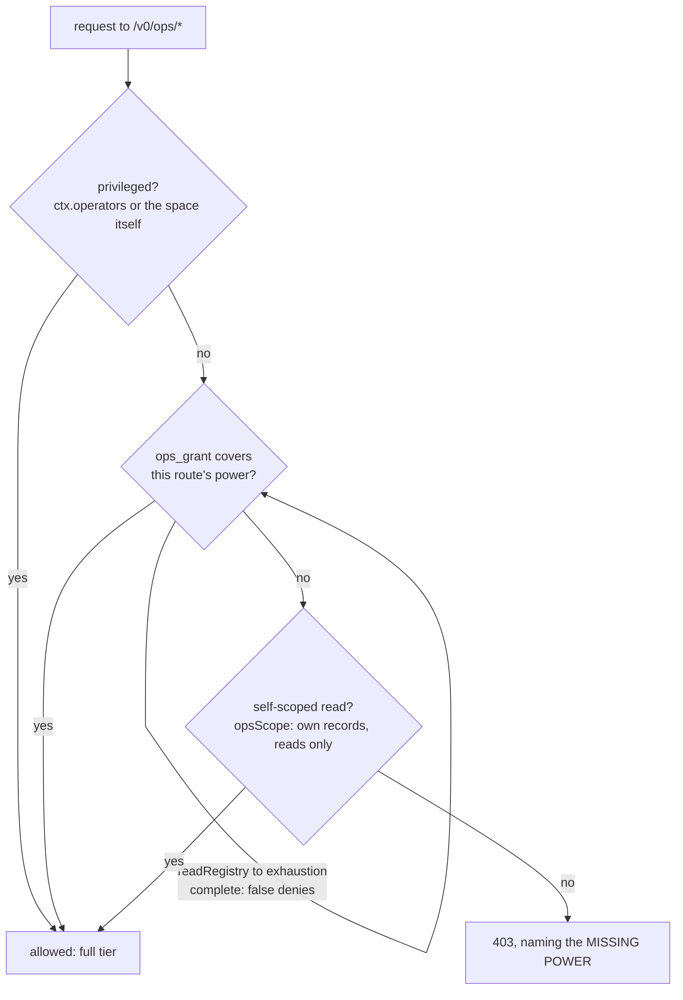

# Ops-plane tiers: powers as grant records (architecture)

> Status: BUILT (2026-08-06), all five phases: the `ops_grant` kind, the five powers, the
> three-way gate, reporting through `effectivePermissions`, the supervisor demotion, and the
> observer credential the MCP adapter defaults to. Source: `OPS_GRANT` + `validateOpsGrantDef`
> (`src/core/kinds.ts`), `Space.opsPowers` (`src/core/space.ts`), `requiredOpsPower` and the gate
> (`src/server/http.ts`), `provisionObserver` (`src/credentials.ts`). Decided: ops powers are
> RECORDS assigned by config operators. Rejected: a second config list (breeds a third, and dodges
> "express it through the substrate") and discipline-only (`radia login` for daily work; already
> possible, structurally weak). The powers being split are named in
> [design-auth.md](design-auth.md) "The operator bit: a power taxonomy". Read
> [gotchas.md](gotchas.md#grants-scopes-and-narrowed-answers) before touching enforcement.

## The problem it solves

`Space.isPrivileged` was one bit, and the deployment default handed it out ambiently: the
auto-provisioned credential is read by the CLI, the console and the MCP adapter, so "can run
`radia stats`" and "can shred payloads, clear taint, truncate the audit log and mint identities"
were the same authorization. Between self-scoped reads (`opsScope`) and everything there was
nothing, so the common middle roles (a dashboard, an auditor, an LLM debugging a space, an
on-call remediator) all got the top tier.

## Decision: powers are grant records

- Grants are already records here: revocation is a `retired: true` successor, assignment leaves
  an audit trail, state is watchable, and `effectivePermissions` reports it. A config list has
  none of that.
- The direction is fail-closed, which is what makes the stopping rule's bounded-read hazard
  benign: a lost or stale registry read DENIES an ops power, never keeps one alive.
- Bootstrap stays config. `ctx.operators` remains the root that writes `ops_grant` records,
  exactly as it is the root that mints agent definitions: records answer "who may act", config
  answers "who may create actors".

## The shape

A reserved `ops_grant` record: `{principal, operations}`, additive registry per principal
(`activeSet`, like `grant`), retire to revoke, resolved per request and never cached.

- **Not the `grant` kind wearing `kind: "ops"`.** design-auth already rejected an ops pseudo-kind,
  and none of `grant`'s machinery applies: no record kind, no `pattern`, no `combineMatch`, no
  write-side body check. Overloading would put a plane-word into every kind-scoped authorize path.
- **Write-protected like the other authorization kinds**: joins `WRITE_PROTECTED_KINDS` (which
  also puts it in `AUTHORIZATION_KINDS`, so watch revalidation re-checks on it; over-inclusion is
  the safe direction there). Only a config operator writes one, and it may not name a privileged
  principal, the same rule definitions enforce.
- **Never compacted, never swept**: joins `NEVER_COMPACT` in `core/gc.ts` (security-load-bearing,
  like `grant`), and reserved kinds are already outside retention.

The vocabulary, CLOSED, extended only when a real failure names the next entry:

| operation    | reaches                                                                                   |
|--------------|-------------------------------------------------------------------------------------------|
| `observe`    | every ops READ, unscoped: `READ_ONLY_OPS` plus integrity, erasures, dry-run, thread, anyone's permissions |
| `remediate`  | `POST /v0/ops/remediate`, the per-record reclaim/dead-letter/requeue transitions            |
| `sweep`      | live `POST /v0/ops/gc` (records, compaction, event truncation; dry-run is `observe`)        |
| `declassify` | `POST /v0/ops/records/{id}/declassify`                                                      |
| `purge`      | `POST /v0/ops/records/{id}/shred`                                                           |

NEVER in the vocabulary: `grant`/`signal`/`agent_*` writes, minting, `login`, revoke (power 6,
the escalation root) and the coordination bypass (power 7). Those stay config-operator, full tier
only. An `ops_grant` also grants NOTHING on the coordination plane: `observe` does not put, take
or query records; that stays kind-scoped ordinary grants.

## Enforcement

One place: the ops gate in `src/server/http.ts`, a three-way instead of a binary.

Privileged passes as before; otherwise the gate resolves the caller's `ops_grant` operations
(`readRegistry` to exhaustion; `complete: false` denies) and matches the route against the table
above; otherwise the existing `opsScope` self-scope path runs unchanged (it stays the tier below
`observe`: kind-scoped, own records, reads only). A refusal names the missing power in the 403
detail, because "forbidden" alone sends the caller to request a kind grant that cannot help,
which is the exhaustion loop the events endpoint's `withheldNote` already documents.

Reporting landed BEFORE enforcement: `effectivePermissions` / `GET /v0/ops/permissions` carry the
resolved powers first, so every plant asserts promise == enforcement through the same surface an
operator would check.

## The privileged set today

- `ctx.operators` and the space's in-process identity: unchanged, full tier.
- The supervisor: demoted out of `isPrivileged`. Kept set: `grant`/`signal` puts only
  (the carve-out in `Space.authorize`); powers arrive like anyone's, as `ops_grant` records an
  operator assigns. It lost purge, declassify, minting, `ops_grant`/`agent_*` writes and the
  coordination bypass, and GAINED bootability: it was fully privileged AND unmintable (a
  definition may not name a privileged principal), a god role nobody could authenticate as. Its
  grant-writes stay escalation-adjacent by design; the difference from the bit is that each one
  is a record in the audit trail.
- The dev/MCP default: `radia dev` provisions `agent:local-observer` (a definition whose token is
  stored under the `#observer` key, mint-only and revocable via `radia revoke`, reused across
  restarts and re-minted only when it stops resolving) plus an `observe` ops_grant assigned AT
  MINT, and two metadata `query` grants carried on the definition itself: `agent_run` (a run
  principal is `run:<ulid>` and carries no agent name, so without this the OTLP exporter's
  services were raw run ids) and `kind_def` (which kinds are reference data). Reads only; an
  observer from before these grants upgrades by `radia revoke agent:local-observer` + restart.
  `radia mcp` defaults to it (`RADIA_TOKEN` overrides; the operator token is only the fallback for
  a pre-observer file), so coordination through MCP 403s until an operator grants kinds: the
  chat's `grant_request` discipline, made the default posture. The CLI's read-only verbs
  (`OBSERVER_VERBS` in `cli.ts`) ride it too; coordination and destructive verbs keep the
  operator token.

## How it was built

Phase numbers are kept because other docs cite them.

1. **Taxonomy** in design-auth.md.
2. **The kind**: `OPS_GRANT` + `validateOpsGrantDef` (`core/kinds.ts`, vocabulary closed
   at write), `opsGrantKey` (`sdk/ts/registry.ts`), `Space.opsPowers` (fail-closed on an
   incomplete view), the privileged-principal refusal in `validateReservedBody`, `NEVER_COMPACT`
   membership, `opsPowers` on `effectivePermissions`. Plants: `suites/auth.ts` (closed bodies,
   union + retire, privileged short-circuit), `suites/gc.ts` (compaction refusal).
3. **`observe` at the gate**: the three-way in `http.ts` (`requiredOpsPower` + the gc
   either/or), self-scope path untouched.
4. **The write half**: `remediate`/`sweep`/`declassify`/`purge` per route; the live/dry
   gc split decided in `handleGc` where the body is parsed. Plants for 3+4:
   `http.test.ts` "each ops power opens exactly its verbs": the observe read table,
   refusals naming the power, declassify-cannot-shred and the reverse, sweep-opens-no-reads, no
   grant/ops_grant writes below full, no coordination bypass, retire-closes-next-request, and
   the permissions report equal to what the gate resolved.
5. **Defaults**: the supervisor demotion (`isPrivileged` shrinks; the `grant`/`signal`
   carve-out in `authorize`; plants in `suites/auth.ts` incl. "the demoted supervisor is a usable
   role") and the observer credential (`main.ts` provisioning, `#observer` in `credentials.ts`,
   the MCP default in `mcp/server.ts`, `OBSERVER_VERBS` in `cli.ts`; pinned by the source-read
   test in `defaults.test.ts`, like the `--auth` default).

## Non-goals

- No change to the coordination plane's grant model or the reserved-kind write rule.
- No sub-splitting of `observe` (metadata vs. bodies) until a real deployment names the failure;
  the three-views warning in [design-inspection.md](design-inspection.md) applies.
- No OIDC and no federation; the root stays the local config operator set.

## Risks

- **Promise vs. enforcement drift** is the named history of every grant defect here, which is why
  phase 2 shipped reporting before phase 3 shipped enforcement, and why the plants assert through
  `GET /v0/ops/permissions` rather than only through the gate.
- **Additive semantics**: `ops_grant` entries union like grants; retiring one entry must not
  resurrect an older same-content one (the `activeSet` tombstone rule; a planted regression, as
  compaction's was). The observer credential is the worked example of the corollary: assign at
  identity creation, never republish on a schedule, or a re-put outranks the tombstone once the
  idempotency window closes.
- **Pins that move**: `defaults.test.ts`, `http.test.ts` gate cases, `suites/selfscope.ts`,
  `suites/auth.ts`, the OpenAPI ops-plane descriptions (power-worded), and the docs site's
  authorization page ("Running the space is not one job").
