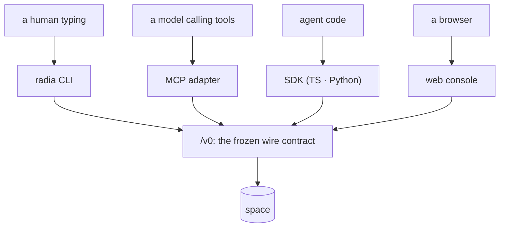

# Architecture: surfaces (CLI, MCP adapter, credentials, platform seam, distribution)

> Status: BUILT (M0 Phase 7). This is an `architecture-*` doc, not a `design-*` one. It
> describes what exists and points into `src/`. The code is authoritative; fix this doc when
> they disagree.

The ways into a space other than the HTTP API itself: what a human types, what a model calls,
where credentials come from, and how any of it reaches a machine. The wire protocol these all
speak is [design-api.md](design-api.md); the authorization model is
[design-auth.md](design-auth.md).



Every surface is a client of the same public API, and none reaches past it. If the CLI can do it, so
can anything else.

## The layering rule that shapes all of it

```
platform.ts          host operations (the only file that knows the runtime is Deno)
  ↑
credentials.ts       where a token comes from
  ↑
sdk/ts/client.ts     the public /v0 surface, as any external client sees it
  ↑
cli.ts   mcp/        the two surfaces, both strictly SDK consumers
  ↑
main.ts              dispatch, and the only place that terminates the process
```

Neither surface reaches past the SDK into `core/` or `storage/`. That is deliberate and
essential: **if the CLI can do it, an external client can too.** A verb that needed a
privileged shortcut would be evidence of a missing API, not a reason to add a backdoor.

## The entry point: `src/main.ts`

`radia dev` runs an embedded space plus the console, provisions an operator credential into the
shared file and prints its token. `radia serve` is the SAME space through `runSpace(args, posture)`
in a deployment's posture: no credential file, nothing on stdout, no console unless `--console`,
persistent storage required, `--auth open` refused as a usage error, and `--operator-token-file
<path>` (written owner-only) the one way to the operator bit; without it the token dies with the
process, which is right for a restart of a provisioned space. `radia mcp` is the adapter; anything
else is a CLI verb. Both space commands take `--config <file>`, a JSON object of the same flag
names without the dashes, folded into argv so a command-line flag wins, and `--ext`, which mounts
the `serve-ext` routes at `/ext/` on the space's own port under each caller's Bearer token.

**What the person must do next goes to stdout; what the process is goes to the logger.** A
`--log-file` would otherwise collect the operator token and the console sign-in link, and a token in
a log is a token in every backup of that log. `src/main.ts` is also where `configureLogging` runs,
once, before anything can log.

## Logging: `src/log.ts`

Process logging answers what THIS BUILD did (which credential resolved, why a sweep was slow, what
the config parsed to), which no record can. Four levels, `getLogger(<component>)`, text to STDERR
and JSONL to `--log-file` (`RADIA_LOG_LEVEL` / `RADIA_LOG_FILE`), synchronous with lost lines lost,
and a bounded ring buffer (`recentLogs`, 200 entries) for `radia doctor` when there is no file. It
reads NO configuration: `src/main.ts` configures it, which keeps `src/core` from importing a
surface's flag parsing. Stderr is load-bearing, since `radia mcp` speaks JSON-RPC on stdout. An
unwritable `--log-file` disables the file and says so once. Two rules decide record versus log: if
another agent could need it, it is a RECORD; a credential is never logged. `test/layering.test.ts`
refuses `console.*` in `src/core`/`server`/`storage`.

## The platform seam: `src/platform.ts`

Every non-portable host operation lives in one file: process (`args`, `exit`, `env`, `osName`),
files (`readTextFile`, `writeTextFile`, `mkdirp`, `removeFile`, `restrictToOwner`,
`moduleRelative`), **binary files** for artifact blobs (`writeBinaryFile`, `readBinaryFile`,
`readBinaryStream`, `fileSize`), standard streams (`stdin`, `writeStdout`, `writeStderr`), signals
(`onShutdown`), and HTTP in both directions: `serve` for the socket the space listens on,
`httpGetJson` for OIDC discovery and JWKS, and `httpRequest` for the S3 blob store, which needs four
verbs, headers it signs itself and a response body it streams to the caller.

The binary group is the seam's one exception to its own sync rule, documented there: artifact
payloads are megabyte-scale and read while serving a request, so downloads stream instead of
materializing a blob in memory.

Why: the CLAUDE.md invariant is *maximal platform independence*. `Deno.exit` and
`Deno.readTextFileSync` scattered through `src/` bind every module to one runtime for operations
every runtime has. Behind the seam, a Node or Bun port reimplements this file and nothing else.

**The seam is INJECTABLE.** The exported functions delegate to a backend object, Deno by default;
`setPlatformBackend` swaps it. `src/platform_browser.ts` is the Web-APIs backend and `src/browser.ts`
the browser entry (`bootBrowserSpace`: PGlite, memory blobs and `makeHandler` as the whole wire, no
socket). `deno task bundle-browser` builds the docs playground from it; its outputs are gitignored
and never committed ([plan-browser-space.md](plan-browser-space.md)).

Two deliberate exceptions, both documented at their call sites:

| Exception | File | Why it stays |
|-----------|------|--------------|
| `Deno.test` | `test/conformance/harness.ts` | A test-runner binding, not a runtime operation. A port swaps the harness, not the suites. |
| `Deno.connect` patch | `src/storage/postgres.ts` | Patches the *driver's* socket layer for `TCP_NODELAY`; only meaningful against deno-postgres, so it is adapter-local by nature. |

`examples/` is a third case, and not an exception so much as a different contract: examples
import **only** from `sdk/ts/`, never from `src/`, so they model what an external agent author
writes. They are Deno scripts by construction and use `Deno.*` directly.

Design notes worth keeping: file I/O is sync throughout (startup- and config-scale, never on a
request path, and sync keeps async colouring out of the call sites); `readTextFile` returns
`undefined` rather than throwing, because every caller treats missing as "no value";
`writeStdout` is sync because two interleaved async writes would corrupt the MCP frame stream.

### Invariants (subsystem-local)

- Nothing in `src/` outside `platform.ts` references `Deno.*`, except the two rows above.
- Nothing outside `src/main.ts` calls `exit`. Deeper code returns a status or throws
  `UsageError`, so a caller always gets the chance to clean up and every function stays testable.

## Flags, paths and the database lock: `src/flags.ts`, `src/paths.ts`, `src/lock.ts`

`src/flags.ts` is the shared CLI scanner: `flag`, `optionalFlag`, `flags`, `has`, `positional`.
`optionalFlag` is the bare-versus-valued distinction (`--db` alone is "persist, you pick where",
the empty string; `--db <path>` names the place), and a following token counts as the value only
if it does not start with `-`. A valueless switch must be in `VALUELESS` or `positional` eats the
token after it (`test/defaults.test.ts`; [gotchas.md](gotchas.md#surfaces-http-console-cli-and-the-sdks)).

`src/paths.ts` is the one runtime directory: everything a space writes (db, blobs, KEK, the seal
key) lands under `./.radia`, and `RADIA_DIR` moves it. Never name a runtime path at a call site.

`src/lock.ts` enforces ONE writer per local database: an OS advisory lock on `<db>.lock`
(`acquireDbLock`), taken before the adapter opens the files and released after it closes them. PGlite
has no locking of its own, so without it two `radia dev` on one directory both start and diverge with
nothing able to detect it afterwards. The kernel releases the lock when the holder dies, so a SIGKILL
leaves nothing stale; the loser reads the holder's pid and base URL out of the file (`lockRefusal`).
[plan-startup-ergonomics.md](plan-startup-ergonomics.md) item 1.

## Credentials: `src/credentials.ts`

`radia dev` mints an operator token at startup and writes it to a per-user file: `RADIA_CREDENTIALS`
if set, else `$XDG_STATE_HOME/radia/credentials.json`, `%APPDATA%\radia\…`, or `~/.radia/…`. Mode
`0600` where the platform has POSIX modes. Keyed by base URL, so several spaces coexist.

Resolution order for any client: `RADIA_TOKEN` → the stored credential for that base URL → none,
which is a `401` unless the space was started with `--auth open`.

**Every write to the file is locked and atomic** (`writeEntry`: an exclusive lock on a sibling
`.lock`, a rename from a temp file, and a refusal rather than a wipe when the file exists but does
not parse). A plain read-modify-write lost a developer's operator entry when a dozen test spaces
booted beside their running one (2026-09-04), and the other half of that fix is that nothing that
spawns a `dev` for a test writes the person's file: every such spawner sets `RADIA_CREDENTIALS` to a
temp path. `test/credentials.test.ts` runs twenty processes at one file.

**Four identities share the file, under separate keys.** The operator credential sits at the base
URL; a person's `radia login` sits at `<base>#login` (`storedLogin`/`saveLogin`); the OBSERVER sits
at `<base>#observer` (`storedObserver`/`saveObserver`): an `agent:local-observer` definition token,
mint-only and revocable, whose `ops_grant` holds `observe`, plus two metadata `query` grants on
the definition: `agent_run` (a run principal carries no agent name; the OTLP exporter resolves
services through these records) and `kind_def`
([architecture-ops-tiers.md](architecture-ops-tiers.md) phase 5); and a NAMED MCP session sits at
`<base>#session:<name>` (`storedSession`/`saveSession`), holding the run that session resumes on.
One key for all of them means a login would replace the operator entry, and the CLI's remediation
verbs, the chat's bootstrap and the MCP adapter would all start acting as whoever signed in last.

**An EMPTY variable is an ABSENT one**, and `??` gets that wrong. Harness configs and wrapper
scripts export every name they know about, empty ones included; keeping `""` reads as "the caller
chose an override" for one branch and "nothing was set" for the next, so an exported
`RADIA_TOKEN=` silently discarded the `RADIA_DEFINITION_TOKEN` beside it and the adapter came up as
the observer, which cannot coordinate. `resolveDefinitionToken` and the adapter both use `||`;
`test/exchange.test.ts` holds the guard.

**Who reads which:** `radia mcp` DEFAULTS to the observer (`RADIA_TOKEN` overrides; the operator
token is only the fallback for a file written before observers existed), so the model behind a
harness inspects the space and cannot write grants, coordinate ungranted, or destroy anything.
The CLI's read-only verbs (`OBSERVER_VERBS` in `cli.ts`: stats, events, doctor, erasures, flows,
integrity, permissions, get, lineage, children) ride the observer too; coordination and
destructive verbs keep the operator credential.

Keyed by base URL means keyed by HOST: a space on `127.0.0.1` has no credential under `localhost`,
even though both reach it. Every default in this repo says `127.0.0.1` for that reason.

**It is the USER's file, not a space's, so `radia credentials [--prune]` owns it**: the one CLI
verb about this machine rather than a space, and it never prints a token. `--prune` drops only what
a restart can rebuild (operator, `#observer`), never a `#login` durable half or a content key, and
PROBES each dormant base first, since an entry is rewritten only when a space starts and age alone
cannot tell a dead space from a long-running one (`credentialKind`; the trap is in
[gotchas.md](gotchas.md#surfaces-http-console-cli-and-the-sdks)).

The point is that **local development uses the same API shape as production**. There is no
"no tokens locally" mode to grow out of: the CLI, the MCP adapter, the Python SDK, the console and
the bundled examples all present `Authorization: Bearer` exactly as a deployed client does. Nothing
radia ships uses the no-header shortcut, which is now behind an explicit `--auth open`.

Operator tokens are never persisted as records (see `CredentialStore` in `src/core/auth.ts`), so
they die with the process. The file is therefore rewritten at every start and removed on shutdown,
which is why `src/main.ts` installs `onShutdown`. Without it, `SIGTERM` killed the process
before the `finally` ran, and the next command 401'd against a dead token with no explanation.

## Logging a PERSON in: `radia login`

The operator token above is the space's own credential, and for a long time it was the only human
one: a definition principal had to be `agent:`, and every `human:*` was privileged by name shape.
So the only way to be a person on a space was to be god. `radia login human:alice [--grant k:ops]…`
mints an ordinary session for a named human through the same bootstrap chain every agent uses
(definition → run token), privileged only if the space names them an operator.

**It keeps the DEFINITION token**, which it used to create and throw away. That is the durable half:
it cannot read or write anything (the space answers "a definition token does not authorize
coordination; mint a run first"), so it is safe on disk, and it mints a run whenever the short one
lapses. Without it a session lasted 15 minutes, stretched to 12 hours by renewing, and then the only
remedy was to run the command again, which nothing but a person at a keyboard can do.
`radia revoke <principal>` is the off switch, and the only one. See the exchange in
`sdk/ts/client.ts` and `test/exchange.test.ts`.

It exists because identity scope is worthless without distinct identities. An app that pins a
session's grants to `{owner: <principal>}` separates two people only if they ARE two principals;
sharing one constant (as `examples/chat` did with `agent:chat-user`) makes the pattern bind to the
same value for everybody. The chat consumes this via `RADIA_CHAT_TOKEN`.

**`radia login --sso` is the same slot filled by an IdP** ([plan-oidc.md](plan-oidc.md)): the
RFC 8252 loopback dance against the issuer the space's health advertises, landing an ordinary
run token in the `#login` entry, with NO definition token, deliberately. A lapsed SSO session
is one browser click, not a stored secret, and deprovisioning at the IdP ends terminal access
within one run ceiling. Everything downstream (the chat, the CLI verbs, `storedLogin`) reads it
identically; only the renewal story differs, and `keepAlive` covers a live process to the
ceiling either way. The mechanism (`ssoLogin` in `cli.ts`): a one-shot listener on
`127.0.0.1:8253` (the port is part of the IdP's registration; `--sso-port` for a space registered
elsewhere) behind a random-path short link, so the terminal prints ~40 characters and a probe of
`/` cannot spend the authorize round trip; the PKCE verifier and the nonce are checked CLI-side,
since only this process saw them. `--compact` prints the run token alone, for
`git clone http://you:$(radia login --sso --compact)@host/ws.git`.

It reports what the principal can ACTUALLY do, by asking `permissions` after minting, rather than
echoing the `--grant` flags it was passed. Grants may come from an earlier login or from an app
that assigns its own, so a report derived from argv would say "nothing yet" about a fully-granted
principal. That gap between a promise and the enforcement is the shape of every grant bug here.

The console does the same thing at `GET /`. Its Auth tab mints a person's session (operator only,
enforced by the server: a scoped session gets 403 on `/v0/agent-definitions`), shows the token once,
and can adopt it in the tab. Two rules the page holds to, both of which it previously broke by
assuming:

- **The token decides the identity, and the space is asked what that is.** A pasted token reports
  `run:…` at `/v0/health`; the console resolves the subject and `privileged` through
  `ops/permissions`. It used to render "operator token" purely because a token existed, so a console
  signed in as a scoped principal claimed authority it did not have.
- **A 403 is shown, never rendered as emptiness.** A scoped console cannot reach the ops plane, and
  a blanked stats panel is indistinguishable from a healthy idle space.

The minted token lives in a variable, not in an `onclick` attribute, so no credential is written
into the DOM as executable markup (`test/console.test.ts`).

`execPath()` is on the seam for ONE caller and says so: `radia team` writes a config file that some
OTHER program will run, and a bare `radia` in it depends on the reader's PATH. It is never used to
re-exec.

## Where a surface lives, and why it is a directory

`src/surfaces/` holds the CLI and the MCP adapter. They ship inside the `radia` binary and are not
the runtime: every one of their edges into `src/` is either shared host infrastructure
(`platform.ts`, `flags.ts`, `credentials.ts`, `paths.ts`) or a TYPE, which is erased. They reach a
space over `/v0` through the SDK, exactly as an external client does, and a shortcut through `Space`
would make them privileged in a way no other client can be.

That property held by habit for a milestone before it was load-bearing. It became load-bearing when
`workspace-git` needed somewhere legal to live: a workspace is a CONVENTION (`extensions/`), the
runtime must not know about it, and a client may compose it freely. Stating the rule positionally
makes the verb obviously fine where the same code in `src/surfaces/cli.ts` would have looked like a tier
inversion.

`test/layering.test.ts` enforces all of it: the runtime imports neither a surface nor an
extension, a surface takes no runtime value, an extension never imports `src/`, and nothing outside
`src/platform.ts` reaches for `Deno.*` (one documented exception, the Postgres socket patch).

## The CLI: `src/surfaces/cli.ts`

Five verb groups (inspect, coordinate, remediate, the identity verbs `login` / `permissions` /
`team`, and workspaces), plus `--json` on every one and `--url` to point elsewhere. `radia help` prints the
authoritative list with flags; it is not restated here, because a hand-copied verb list is the
drift this doc exists to avoid.

Discovery-first, per the CLAUDE.md corollary: `kinds` is a query for `kind_def` records, `lineage`
and `children` walk the graph, and no verb carries a table of known kinds.

`query` reads NEWEST first and hands over a `--cursor` to continue with. The cursor carries its own
direction, which is what removed a footgun from the printed continuation: it used to re-carry
`--oldest` at every hop, and dropping that one word turned page two around. `--cursor` with
`--after` or `--oldest` is a usage error, mirroring the space's 400.

The MCP adapter's `space_query` RELAYS the model's pattern, so it dispatches on it rather than
imposing a direction: a pattern carrying `order_by` goes to `queryOrdered`, anything else reads
oldest-first, which the tool description now states (descriptions are the docs here). It accepts
both spellings of that key, because the key is the model's and the adapter rebuilds the pattern, so
the wire's own near-miss refusal never sees it.

`team` is the one verb that sets a space up for somebody else's process to join
([extensions/ts/team.ts](../extensions/ts/team.ts)): it declares the shared kinds, mints one
DURABLE principal per name, and prints the harness config for that agent. Two of its behaviours are
refusals rather than conveniences. It REFUSES a second definition for an existing agent and names
`--rotate`, because a second one is not a rotation and looks like one: both tokens keep minting
while `radia revoke` reaches only the newest (`Space.definitionRecord` takes the newest record's
status). And `radia team` LISTS THE TEAM rather than every definition on the space: a real space
carries an app's workers, its logins and its probes, and listing all of them buried the four rows
the verb is about under twenty that it is not (`--all` is the escape). It reports the three ways
isolation ends, worst first: members whose grants carry no team pattern and therefore read every
team, crossers, and members holding `observe`.

`runs --for <principal> [--stop]` and `team remove` are the OFFBOARDING cascade, and both cover
the two run classes a person acts through: their own sessions (`agent_run{agent: X}`) and runs
workers hold on their behalf (`agent_run{actingFor: X}`). `team remove` also retires the member's
grants and ops powers, because a revoked definition cannot authenticate while `mintDelegatedRun`
still intersects that principal's live grants. Both decide "is this run live" on the DATABASE
clock: `expiresAt` is stamped by the space, so a fast local clock would read a live run as expired,
skip the stop, and leave it renewing itself to the 12h ceiling (`renewRun` checks the run's own
status, never the definition behind it). `revoke` is deliberately narrower: it stops a definition
MINTING, leaves live runs alone so a rotation does not kill workers mid-call, and is a no-op for an
SSO identity, which holds no definition. History and guard:
[gotchas.md](gotchas.md#grants-scopes-and-narrowed-answers), "A principal acts through TWO run
classes".

The claim lifecycle is composable rather than stateful: `take --json` prints the record together
with its lease, and `ack`/`nack`/`release` accept that object back, either as an argument or as
`-` to read stdin. So a shell pipeline drives a full claim without the CLI holding session state.

`workspaces` lists what trees exist: one line per name, with the file count, how many versions it
has been through, and a `FORKED` marker where a name has more than one head. It is not
`query workspace`, and the difference is the point: every VERSION is a record, so a raw query
returns three rows for a tree saved three times. The projection is latest-wins-minus-retired, the
same rule every registry here uses, and it reports `complete: false` rather than printing a prefix
that reads as a population.

`workspace-git <name> --dir <out>` is the verb that reaches outside the runtime, into
`extensions/ts/git.ts`, and it is the reason this layer is a directory rather than an argument. It
writes a BARE repository, so `git clone <out>` does the checkout; see
[design-workspaces.md](design-workspaces.md) for why git history is never imported, only trees (a
push into `git-serve`). It needs
`workspace: query` and `artifact: read_one`, and nothing more: an export reads exactly what its
principal could already read, which is why it takes the caller's credential rather than holding one.

`git-serve` is the same objects over HTTP, and the clearest case of what this layer is FOR: a CLI
verb that binds its own port and talks `/v0` like any other client, so `git clone` works with no
runtime change and no wire-contract entry. Authorization stays the caller's: the HTTP password is a
definition token, exchanged per fetch, or an SSO session's run token used as it is
(`clientForPassword` in `extensions/ts/git-http.ts` tries both), so a clone reads what that principal
can, and `radia revoke` or the run ceiling stops the next one. `radia git-credential` is git's
credential helper over the same file `radia login` writes, so a person logs in once and git asks
for the token itself rather than carrying it in a URL; git's `host` is the git server's and maps to
no space, so the helper answers for the CLI's own space (`--url` when there are several). It is
configured URL-SCOPED (`credential.http://127.0.0.1:7790.helper`) and refuses any host that is not
loopback or `--host`, because a helper git may ask about github.com is a helper that hands a radia
credential to github.com. `git push` is accepted fast-forward only, each commit becoming
a version under the same credential (design-workspaces.md, "Git").

Two things it taught, both about being a long-running process rather than about git.
`onShutdown` REPLACES the default behaviour of SIGINT and SIGTERM, so a handler that does nothing
leaves a server only SIGKILL can stop; use the abort-signal shape `radia dev` already has, since
`exit` outside `src/main.ts` is not allowed. And a space binds TWO ports (`--port` and the artifact
origin at `port + 1`), so the obvious neighbouring default collided with it every time.

`serve-ext` is the same slot generalised (`src/surfaces/extserve.ts`,
[plan-extension-http.md](plan-extension-http.md)): the extension conventions bound as HTTP routes
under `/ext/{extension}/v1/…`, for apps in languages the TS extensions cannot reach. It holds ZERO
credentials: every request runs under the caller's own Bearer token, run or definition (the SDK
exchanges the latter on its first refusal), so the facade adds no authority. The same routes
co-host on the space's own port with `radia dev|serve --ext`, through the one generic hook the
runtime gained (`ServerOptions.mount`, a `{prefix, handler}` pair that refuses `/v0/` and `/ui/`):
the entry point wires the surface's handler in as a VALUE, the runtime forwards the prefix and
learns nothing, and the mounted facade still relays `/v0` over loopback rather than touching
`Space`. Default port when standalone is 7791, since 7788+7789 are a space's two ports and
git-serve holds 7790. The route groups are workspace, capability, presence, turn (seed-and-wait),
promotion, host bindings, compartment audit, and `permissions/v1/scopes`, which surfaces the
caller's own pattern-scope fields so a stateless app can pass `scope` explicitly instead of
learning the label from a refusal the way the MCP adapter does. `test/extserve.test.ts` is the
guard: every case runs an operation through the binding OR the direct TS API and verifies it
through the other, and its python3-gated case drives `sdk/py/radia_ext.py`, the zero-choreography
Python wrapper the pip package ships as `radia.ext`.

The **workspace-agent verbs** (`promote`/`rollback`/`pins`/`bind`/`bindings`/`host`/`compartment`)
are the same move a third time, and the best illustration of what "a surface may import a
convention" buys: promotion is a grant rotation and a binding is a record, so all seven compose
`/v0` through `extensions/ts/` and the runtime gains nothing.
[architecture-workspace-agents.md](architecture-workspace-agents.md) has the table. `host` is the
long-running one, and it is a client that happens to run other people's code: it holds each
hosted agent's DEFINITION token (mint-only, so it cannot read, write or claim), mints each run,
and claims under that run, which is why one host serving ten agents needs none of their authority.
Two choices worth knowing. It is BROKERED by default, because that is the invoker leaving the jail
no way to reach the API, and a default that is merely convenient would be the wrong one here. And
`--agents -` reads the token map from stdin, since a credential passed as an argument is visible
in `ps` to every user on the box.
Building them also found a defect the layering guard catches by construction: three new valueless
switches (`--retire`, `--once`, `--no-broker`) were missing from `VALUELESS`, which would have made
`radia bind --retire <agent>` lose the agent while `radia bind <agent> --retire` worked.

`erasures [--undone]` reports every shred and whether its payload is still gone, and `doctor`
carries the same finding with the remedy attached. Both exist because shredding destroys the
runtime's copy rather than the ability to store those bytes, so an erasure can silently stop
holding; see [design-observability.md](design-observability.md).

`flows` prints the shapes of work MINED from lineage, which is the only verb that answers "what does
this space do" rather than "what is in it". Its two granularity flags are not cosmetic: a mined
diagram looks equally complete however it is set, so the output prints the scan size and every
incompleteness note rather than leaving the reader to infer either. See
[design-inspection.md](design-inspection.md).

`integrity` verifies the event chain and names the FIRST divergence rather than a verdict, because
"the chain is invalid" is not something anyone can act on. It prints the caveat when the chain is
unsigned, since an unsigned chain catches corruption and careless edits but not a rewrite. `doctor`
carries the same finding, and names the chain even when it is healthy: an all-clear that omits a
check it ran claims more than it checked.

`runCli` returns an exit code and never terminates the process itself. One trap it works around:
`GET /v0/health` is public, so a *rejected* token still returns 200 with `principal=anonymous`.
Without the explicit warning in the `health` output that reads as "no credential" when it actually
means "bad credential".

## The MCP adapter: `src/surfaces/mcp/`

`radia mcp` serves the space to an MCP-capable harness over stdio: newline-delimited JSON-RPC 2.0,
19 tools. `server.ts` is the transport and dispatch; `tools.ts` is the tool definitions;
`config.ts` renders the harness config that points an agent here; `scope.ts` fills in body fields
the caller's own grants require; `trace.ts` is `--trace`.

**`--trace <file>` records what the model ASKED FOR, which nothing else can see.** A `take` appends
its event only after it wins a record and reads append none, so a claim that matched nothing is
invisible to the event log, to lineage and to `radia flows`: the fruitless call is exactly the one a
lab needs (agent_docs/plan-agent-lab.md). One JSONL line per call, at the single `tools/call`
dispatch so a tool added later is traced without anybody remembering to. A FILE, never records in
the space, because the space is the thing under observation and trace records would land in its own
flows, stats, chain and registry budgets. Off unless asked for, and a failed write disables tracing
for the process rather than failing the call it observes. `classify` reads the tool's text answer
back and is NARROW on purpose: an empty array and the adapter's own two "found nothing" sentences
are `empty`, anything it cannot read is `ok`, because over-reporting `empty` puts false findings in
front of a reader.

**It runs as the OBSERVER by default** ([architecture-ops-tiers.md](architecture-ops-tiers.md) phase 5): the
stored `#observer` credential, holding the `observe` ops power and no coordination grants, so the
model inspects the space and a `space_put`/`space_take` 403s until an operator grants kinds.
`RADIA_TOKEN` overrides for a caller that wants a differently-scoped session; the operator token
is only the fallback for a credentials file written before observers existed.

Two properties carry the design:

**Credentials stay outside the model context, and that claim is about THIS PROCESS.** The adapter
attaches the token itself; none appears in a tool schema, a tool result, or an error, and
`errorText` reduces a `RadiaClientError` to the server's RFC 9457 detail. What it does NOT mean is
that a model cannot obtain the token: it sits in the harness's config file or its environment, and
an agent with a file reader or a shell can open both. One did, the first time a tool refused it
something it needed. So the guarantee is "nothing here hands the model a credential"; the thing
that bounds a leaked one is its grants.

**A refusal owes the caller a next step, and BOTH directions needed one.** `space_get_artifact`
used to refuse binary and oversized payloads with "use a client that can download it" while the
model WAS the client, so the model went looking for the credential instead. `link: true` mints the
runtime's own single-artifact download CAPABILITY and returns the URL: bytes stay out of the context
window (what the refusal was protecting) and the model is not left to improvise.

`space_put_artifact` had the mirror gap and produced the mirror failure. It took `text` or `base64`
only, so an 85 KB image was 113 KB of base64; an agent judged that too big to shuttle, tried to curl
`POST /v0/artifacts`, hit `auth_required`, and went into its harness config for the definition
token. It now takes `link: true` and mints an UPLOAD CAPABILITY, which is the symmetric answer and
the one that assumes nothing: `path` was built first and reads a file THIS PROCESS can see, which
is true for a stdio harness on one machine and false for a remote agent, a browser or a container.
Both remain; the link is the one to reach for.

`POST /v0/artifacts/capability` + `PUT /v0/a/{capability}` are the runtime half, and what makes a
WRITE capability as bounded as a read one is that the holder supplies ONLY bytes. Author, media
type, filename, parents and app fields are all fixed at mint, by a caller whose `put` grant and
pattern scope were checked there, so a leaked upload URL cannot change a team label, forge lineage,
or write as somebody else. It is SINGLE USE, unlike a download: a download opens something that
already exists and may be fetched until it expires, while an upload that replayed would be an
unbounded write channel. `digest` and `size` are not knowable at mint, so a pattern naming either
is refused rather than deferred, which is the same answer the direct upload gives.

A URL rather than a local file, and the difference is not convenience. Writing bytes to disk
assumes whatever reads them shares a filesystem with the adapter, which holds for a stdio harness
on a laptop and fails for anything else, and it turns a pure client into an arbitrary-file writer.
The capability already exists for this exact problem (a browser cannot put an Authorization header
on an ``), names ONE artifact, and expires, which is what makes it safe in a context
window where a credential is not. `artifactCapability` returns an ABSOLUTE url whenever the space
runs a separate artifact origin, which is the default; prefixing it unconditionally produced
`http://space:7881http://space:7882/...`.

**Leases heartbeat internally.** `space_take` returns an opaque `claimId`; the fenced lease stays
in the adapter and is renewed at lease/3. This exists because an LLM turn is not a process: nothing
of the model runs between tool calls, so it cannot heartbeat. Without the adapter holding the lease
you must choose between leases long enough to survive a thinking model (so a genuinely crashed
worker blocks a record for an hour) and a model that loses its claim constantly. Settling by
`claimId` stops the heartbeat; a double-settle returns `isError` rather than killing the session.

Tool descriptions in `tools.ts` are the documentation. A model learns *how* to use a tool from
its description, never from a system prompt that teaches the space. Kinds are discovered via
`space_kinds`, so a kind declared after startup is immediately usable.

**Both protocol eras are served.** MCP 2026-07-28 made the protocol STATELESS: no `initialize`
handshake, per-request `_meta` carrying `io.modelcontextprotocol/protocolVersion` and
`clientCapabilities`, and `server/discover` for capabilities. The adapter answers `server/discover`
AND keeps `initialize`, which the spec's compatibility matrix calls dual-era and is the only
posture that works for every client era. Keeping the handshake is not inertia: the reference SDK's
client defaults to the 2025 handshake "byte for byte", probing is opt-in, and no deprecation date
exists on either side, so only a client that deliberately pins modern would ever fail against a
legacy-only server. A version we do not speak is refused with `UnsupportedProtocolVersionError`
(-32022) NAMING what we do speak, so the client can retry rather than fail blind. Every result
carries `resultType: "complete"`, which is required in the modern era and which older clients
ignore (an absent one means exactly that).

**A NAMED SESSION keeps its principal across restarts, and now also its CLAIMS.** `--session <name>` (or `RADIA_SESSION`)
stores the run under a `#session:` credential entry and resumes it, with the durable half behind it
so the session still recovers once that run passes its 12h ceiling. Statelessness has ONE real
bite here: a `claimId` only its minting process could settle. `recoverClaim` (`server.ts`)
rederives the lease from the envelope (the id embeds the record id and epoch) instead of storing
anything, gated on the RUN matching because a settle is owner-bound, which is what makes `--session`
load-bearing for conformance and not only for attribution. The same split decides exit: an
anonymous session RELEASES its claims on shutdown (nothing later can settle them), a named one keeps
them and says how many, since giving the record back hands a teammate half-done work. The name is SUPPLIED, not
derived: no harness exposes a session identity portably, and guessing one from a pid or a cwd gives
a different principal every restart, which is the thing it exists to prevent. For attribution that
outlives a day the unit is the AGENT rather than the run, which is what
[extensions/ts/team.ts](../extensions/ts/team.ts) gives each session.

**The generated harness config names THE BINARY THAT WROTE IT**, absolute (`config.ts`). A block
saying `"command": "radia"` works only if the harness's PATH has it, which is the one thing a
generated config cannot check, and the failure is a server the harness reports as failed with no
reason a person can act on. A PATH SCAN was tried and REJECTED for the mirror reason: it can name a
different build than the one writing the block, and a stale install speaks an older wire contract
while still starting cleanly. Running from source has no binary to name, so it reports `fromSource`
and the CLI sends the reader to `deno task compile` rather than emitting a config pinned to a
checkout's path.

**A write is filled in from the caller's own grant, LEARNED FROM A REFUSAL** (`scope.ts`). A
pattern-scoped grant bounds writes as well as reads, so a body must carry the field the pattern
names, and the runtime will not supply it (a body is the client's claim). Reading your own grants
up front and stamping every write is wrong: `EffectivePermissions.kinds[].patterns` unions the
patterns of ALL grants on a kind whatever operation they permit, so a scoped READ grant beside an
unscoped write grant would add a label the record need not carry, narrowing who may read it. Only a
refusal proves the field is REQUIRED, so a write goes out as the model wrote it and only a rejected
one is retried filled in; the scope is then remembered per kind for the process. Ambiguity is
ASKED about, never guessed: a member of two teams gets both names back.

`radia artifact put <file|-> | get <id> [--out <path|->]` moves bytes in and out of a terminal, so
"if the CLI can do it, an external client can too" now holds for payloads too. It had held in one
direction only: artifacts were reachable from an SDK and from the MCP adapter, and from a shell only
by hand-rolling `curl` with a token on the command line, which is what an agent tried and what its
harness's own classifier refused. `put` takes the media type from the EXTENSION when not stated,
since that is what decides whether the receiving side can render it; stdout on `get` is opt-in
(`--out -`), because a terminal is not a file and a megabyte of JPEG written to one wedges the
session.

The CLI has the full set: `radia reclaim|dead-letter|requeue` take either a record id or `--all`
with an envelope selector (`--stale`, `--limit`, `--drain`), so draining a backlog is one call per
page rather than one per record.

Known gap: the MCP adapter exposes `space_doctor` (diagnosis) but no remediation verbs
(`reclaim`/`dead-letter`/`requeue`/`declassify`). Those sit behind `/v0/ops/*` and are grant-gated,
so exposing them to a model is a deliberate decision rather than an oversight. It does mean a
model can report a stuck lease and do nothing about it.

### Invariants (subsystem-local)

- stdout carries protocol frames only. Every log line goes to stderr, or the harness sees a
  corrupt stream. Writes are synchronous so frames cannot interleave.
- A raw `Lease` never crosses into a tool result. The model gets a `claimId`.

## Tasks: `deno.json`

Tasks are grouped and verb-first: `dev*` runs a space, `cli` is the CLI from a checkout
(`deno task cli health`), `check`/`test*` verify (`test` is the aggregate; `test:quick`,
`test:runtime`, `test:conformance[:pg|:s3]`, `test:extensions`, `test:lab`, `test:chat`,
`test:analysis`, `test:mud`), `bench`/`profile` measure, `compile`/`release`/`bundle-*` build.
`bump` (`scripts/bump-version.ts`) stamps the next `YYYY.M.COUNTER` version into every file that
carries it (`deno.json`, `src/version.ts`, `docs/install.sh`, `docs/index.html`, `sdk/README.md`)
and PRINTS the git tag and push commands, running none; an explicit version is the optional
argument. `test/tasks.test.ts` and `test/docs.test.ts` hold the five files to one string.

## Distribution: `scripts/build-release.sh`

`deno task release` compiles four targets (Linux and macOS, x64 and arm64; native Windows is
unsupported, WSL2 runs the Linux binary) and stages the SDK packages: `dist/npm/radia` (TS SDK +
`extensions/` as source) and `dist/pypi` (the Python SDK, published as `radia-space` since the bare
PyPI name is taken; it still imports as `radia`). Since 2026-09-02 both publish as RELEASE ASSETS
on the same tag: `release.yml` packs them (`npm pack` + `scripts/build-wheel.py`, stdlib only) into
the same `SHA256SUMS`, installs pin the release URL, and nothing goes to npm or PyPI (deferred, not
forsworn: [design-storage.md](design-storage.md) "Distribution" has the reasons and the
trusted-publishing re-entry path). Neither carries a binary or launcher:
the binary's one supported install is `curl | sh` (`docs/install.sh`, downloading the gzipped
release assets `.github/workflows/release.yml` attaches to a `v*` tag and verifying them against
the release's `SHA256SUMS`; `test/docs.test.ts` holds the target list, the asset names, the sums file
and the documented install URLs to the version as a contract between the three files, and
`deno task bump` is what stamps them). A published SDK asset is NEVER re-uploaded, since npm
lockfile integrity and pip `#sha256` pins break retroactively: a bad asset means a new release
(`release.yml`).

`radia update` (`src/surfaces/update.ts`) is the SECOND reader of that contract, and the reason the
guard names three files rather than two. It replaces this binary with a release build and verifies
the same way, which makes it the upgrade path a person actually has: re-running the installer works
and requires knowing a release exists, which nothing said. `--check` reports and exits 1 when one
does, so a schedule is the operator's to write rather than a phone-home on `radia dev`.

Three properties are worth knowing before touching it, each a failure it already refuses:

- **It refuses unless `isStandalone()`.** From a checkout `execPath()` names the `deno` executable,
  so `deno task cli update` would replace it. That is the worst outcome the verb has.
- **`buildTarget()` IS the release asset name.** `Deno.build.target` is the triple the binary was
  compiled for, so there is no uname mapping to drift and no musl check to write: a binary that is
  running is one this machine can run. `docs/install.sh` needs both because it runs before there is
  a binary to ask.
- **The temp file goes in the TARGET directory, and the download runs before the rename.** `/tmp`
  is usually another mount and `rename` across filesystems fails `EXDEV`; the pre-flight is what
  keeps a wrong-architecture build from becoming the `radia` on a PATH. Both rules come from the
  installer. An unwritable destination names the path and offers `RADIA_INSTALL_DIR`, never `sudo`.

Signing is designed and DEFERRED, on a checked finding rather than on effort: `radia.sh`, the
release assets and any signing key all sit under one GitHub trust root, so a signature adds nothing
against the party it is normally sold against. The design, and the three triggers that would change
that, are in [plan-self-update.md](plan-self-update.md).

`--include` must list every runtime asset (`src/ui/index.html` and `src/ui/vendor/blitzoom.bundle.js`),
or the binary boots and then 404s. `deno task compile` carries the same flags for the single-binary
build.

The npm package is the TypeScript SDK and `extensions/` shipped as SOURCE, so an agent
author who has `radia` has the client and the conventions built on it with
nothing to compile. One trap the build has to handle: an extension imports the SDK as
`../../sdk/ts/client.ts` in the repo and `../sdk/` once staged, so the script rewrites the path.
Nothing type-checks the staged tree, so a wrong path there would be a silent break rather than a
build failure. The two are versioned differently on purpose (the SDK mirrors the frozen wire
contract; an extension is a convention that evolves), which is why they are separate directories in
the package rather than one.

**Verified 2026-08-30:** the `curl | sh` path ran end to end against the real `v2026.8.0`
release (download, checksum, `radia version` reporting the tag), and CI cross-compiled all four
targets. **Unverified:** the three non-Linux-x64 binaries have not been executed, and neither
SDK package has been published to a registry, so their staged metadata stays best-effort.
