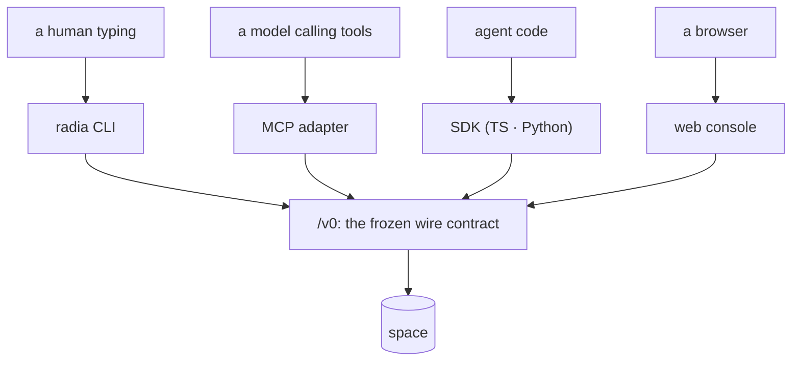

# Architecture: surfaces (CLI, MCP adapter, credentials, platform seam, distribution)

> Status: BUILT (M0 Phase 7). This is an `architecture-*` doc, not a `design-*` one. It
> describes what exists and points into `src/`. The code is authoritative; fix this doc when
> they disagree.

The ways into a space other than the HTTP API itself: what a human types, what a model calls,
where credentials come from, and how any of it reaches a machine. The wire protocol these all
speak is [design-api.md](design-api.md); the authorization model is
[design-auth.md](design-auth.md).



Every surface is a client of the same public API, and none reaches past it. If the CLI can do it, so
can anything else.

## The layering rule that shapes all of it

```
platform.ts          host operations (the only file that knows the runtime is Deno)
  ↑
credentials.ts       where a token comes from
  ↑
sdk/ts/client.ts     the public /v0 surface, as any external client sees it
  ↑
cli.ts   mcp/        the two surfaces, both strictly SDK consumers
  ↑
main.ts              dispatch, and the only place that terminates the process
```

Neither surface reaches past the SDK into `core/` or `storage/`. That is deliberate and
essential: **if the CLI can do it, an external client can too.** A verb that needed a
privileged shortcut would be evidence of a missing API, not a reason to add a backdoor.

## The platform seam: `src/platform.ts`

Every non-portable host operation lives in one file: process (`args`, `exit`, `env`, `osName`),
files (`readTextFile`, `writeTextFile`, `mkdirp`, `removeFile`, `restrictToOwner`,
`moduleRelative`), **binary files** for artifact blobs (`writeBinaryFile`, `readBinaryFile`,
`readBinaryStream`, `fileSize`), standard streams (`stdin`, `writeStdout`, `writeStderr`), signals
(`onShutdown`), and HTTP (`serve`).

The binary group is the seam's one exception to its own sync rule, documented there: artifact
payloads are megabyte-scale and read while serving a request, so downloads stream instead of
materializing a blob in memory.

Why: the CLAUDE.md invariant is *maximal platform independence*. `Deno.exit` and
`Deno.readTextFileSync` scattered through `src/` bind every module to one runtime for operations
every runtime has. Behind the seam, a Node or Bun port reimplements this file and nothing else.

Two deliberate exceptions, both documented at their call sites:

| Exception | File | Why it stays |
|-----------|------|--------------|
| `Deno.test` | `conformance/harness.ts` | A test-runner binding, not a runtime operation. A port swaps the harness, not the suites. |
| `Deno.connect` patch | `src/storage/postgres.ts` | Patches the *driver's* socket layer for `TCP_NODELAY`; only meaningful against deno-postgres, so it is adapter-local by nature. |

`examples/` is a third case, and not an exception so much as a different contract: examples
import **only** from `sdk/ts/`, never from `src/`, so they model what an external agent author
writes. They are Deno scripts by construction and use `Deno.*` directly.

Design notes worth keeping: file I/O is sync throughout (startup- and config-scale, never on a
request path, and sync keeps async colouring out of the call sites); `readTextFile` returns
`undefined` rather than throwing, because every caller treats missing as "no value";
`writeStdout` is sync because two interleaved async writes would corrupt the MCP frame stream.

### Invariants (subsystem-local)

- Nothing in `src/` outside `platform.ts` references `Deno.*`, except the two rows above.
- Nothing outside `src/main.ts` calls `exit`. Deeper code returns a status or throws
  `UsageError`, so a caller always gets the chance to clean up and every function stays testable.

## Credentials: `src/credentials.ts`

`radia dev` mints an operator token at startup and writes it to a per-user file: `RADIA_CREDENTIALS`
if set, else `$XDG_STATE_HOME/radia/credentials.json`, `%APPDATA%\radia\…`, or `~/.radia/…`. Mode
`0600` where the platform has POSIX modes. Keyed by base URL, so several spaces coexist.

Resolution order for any client: `RADIA_TOKEN` → the stored credential for that base URL → none
(falling back to the open-mode no-header operator default).

The point is that **local development uses the same API shape as production**. There is no
"no tokens locally" mode to grow out of: the CLI, the MCP adapter, and the Python SDK all present
`Authorization: Bearer` exactly as a deployed client does. The no-header default still exists for
`curl` and the browser console, but nothing radia ships depends on it.

Operator tokens are never persisted as records (see `CredentialStore` in `src/core/auth.ts`), so
they die with the process. The file is therefore rewritten at every start and removed on shutdown,
which is why `src/main.ts` installs `onShutdown`. Without it, `SIGTERM` killed the process
before the `finally` ran, and the next command 401'd against a dead token with no explanation.

## The CLI: `src/cli.ts`

Verbs: `health stats doctor kinds get lineage children events watch put query read-one take ack
nack release`, plus `--json` on every one and `--url` to point elsewhere.

Discovery-first, per the CLAUDE.md corollary: `kinds` is a query for `kind_def` records, `lineage`
and `children` walk the graph, and no verb carries a table of known kinds.

The claim lifecycle is composable rather than stateful: `take --json` prints the record together
with its lease, and `ack`/`nack`/`release` accept that object back, either as an argument or as
`-` to read stdin. So a shell pipeline drives a full claim without the CLI holding session state.

`runCli` returns an exit code and never terminates the process itself. One trap it works around:
`GET /v0/health` is public, so a *rejected* token still returns 200 with `principal=anonymous`.
Without the explicit warning in the `health` output that reads as "no credential" when it actually
means "bad credential".

## The MCP adapter: `src/mcp/`

`radia mcp` serves the space to an MCP-capable harness over stdio: newline-delimited JSON-RPC 2.0,
15 tools. `server.ts` is the transport and dispatch; `tools.ts` is the tool definitions.

Two properties carry the design:

**Credentials stay outside the model context.** The adapter attaches the token itself. None
appears in a tool schema, a tool result, or an error. `errorText` deliberately reduces a
`RadiaClientError` to the server's RFC 9457 detail. A model driving this cannot read, log, or be
injected into exfiltrating the credential it acts under.

**Leases heartbeat internally.** `space_take` returns an opaque `claimId`; the fenced lease stays
in the adapter and is renewed at lease/3. This exists because an LLM turn is not a process: nothing
of the model runs between tool calls, so it cannot heartbeat. Without the adapter holding the lease
you must choose between leases long enough to survive a thinking model (so a genuinely crashed
worker blocks a record for an hour) and a model that loses its claim constantly. Settling by
`claimId` stops the heartbeat; a double-settle returns `isError` rather than killing the session.

Tool descriptions in `tools.ts` are the documentation. A model learns *how* to use a tool from
its description, never from a system prompt that teaches the substrate. Kinds are discovered via
`space_kinds`, so a kind declared after startup is immediately usable.

Known gap: neither the CLI nor the MCP adapter has artifact verbs. Bytes are reachable only over
HTTP (`POST /v0/artifacts`, `GET /v0/artifacts/{id}`) or through an SDK, so "if the CLI can do it,
an external client can too" holds in one direction only for payloads. A `radia artifact
put/get` pair would close it; base64 in an MCP tool result would not (it would put the payload
back inside a record, which is the thing artifacts exist to avoid).

The CLI has the full set: `radia reclaim|dead-letter|requeue` take either a record id or `--all`
with an envelope selector (`--stale`, `--limit`, `--drain`), so draining a backlog is one call per
page rather than one per record.

Known gap: the MCP adapter exposes `space_doctor` (diagnosis) but no remediation verbs
(`reclaim`/`dead-letter`/`requeue`/`declassify`). Those sit behind `/v0/ops/*` and are grant-gated,
so exposing them to a model is a deliberate decision rather than an oversight. It does mean a
model can report a stuck lease and do nothing about it.

### Invariants (subsystem-local)

- stdout carries protocol frames only. Every log line goes to stderr, or the harness sees a
  corrupt stream. Writes are synchronous so frames cannot interleave.
- A raw `Lease` never crosses into a tool result. The model gets a `claimId`.

## Distribution: `scripts/build-release.sh`

`deno task release` compiles five targets and stages the esbuild/uv shape: `dist/npm/radia` (a
launcher plus `optionalDependencies` on per-platform packages) and `dist/pypi` (wheel source whose
launcher `execv`s the bundled binary; `exec` matters, so `radia mcp`'s stdio stays a direct pipe).

`--include` must list every runtime asset (`src/ui/index.html` and `src/ui/vendor/blitzoom.bundle.js`),
or the binary boots and then 404s. `deno task compile` carries the same flags for the single-binary
build.

**Unverified:** `npx radia dev` and `pipx run radia dev` have never been executed end to end.
That needs a registry publish. Only the host target has been compiled; the four cross-compiled
targets and the staged package metadata are best-effort until someone publishes once.
