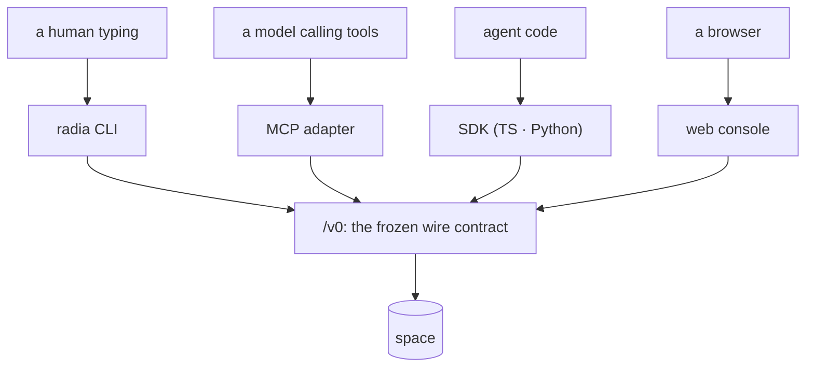

# Architecture: surfaces (CLI, MCP adapter, credentials, platform seam, distribution)

> Status: BUILT (M0 Phase 7). This is an `architecture-*` doc, not a `design-*` one. It
> describes what exists and points into `src/`. The code is authoritative; fix this doc when
> they disagree.

The ways into a space other than the HTTP API itself: what a human types, what a model calls,
where credentials come from, and how any of it reaches a machine. The wire protocol these all
speak is [design-api.md](design-api.md); the authorization model is
[design-auth.md](design-auth.md).



Every surface is a client of the same public API, and none reaches past it. If the CLI can do it, so
can anything else.

## The layering rule that shapes all of it

```
platform.ts          host operations (the only file that knows the runtime is Deno)
  ↑
credentials.ts       where a token comes from
  ↑
sdk/ts/client.ts     the public /v0 surface, as any external client sees it
  ↑
cli.ts   mcp/        the two surfaces, both strictly SDK consumers
  ↑
main.ts              dispatch, and the only place that terminates the process
```

Neither surface reaches past the SDK into `core/` or `storage/`. That is deliberate and
essential: **if the CLI can do it, an external client can too.** A verb that needed a
privileged shortcut would be evidence of a missing API, not a reason to add a backdoor.

## The platform seam: `src/platform.ts`

Every non-portable host operation lives in one file: process (`args`, `exit`, `env`, `osName`),
files (`readTextFile`, `writeTextFile`, `mkdirp`, `removeFile`, `restrictToOwner`,
`moduleRelative`), **binary files** for artifact blobs (`writeBinaryFile`, `readBinaryFile`,
`readBinaryStream`, `fileSize`), standard streams (`stdin`, `writeStdout`, `writeStderr`), signals
(`onShutdown`), and HTTP (`serve`).

The binary group is the seam's one exception to its own sync rule, documented there: artifact
payloads are megabyte-scale and read while serving a request, so downloads stream instead of
materializing a blob in memory.

Why: the CLAUDE.md invariant is *maximal platform independence*. `Deno.exit` and
`Deno.readTextFileSync` scattered through `src/` bind every module to one runtime for operations
every runtime has. Behind the seam, a Node or Bun port reimplements this file and nothing else.

Two deliberate exceptions, both documented at their call sites:

| Exception | File | Why it stays |
|-----------|------|--------------|
| `Deno.test` | `conformance/harness.ts` | A test-runner binding, not a runtime operation. A port swaps the harness, not the suites. |
| `Deno.connect` patch | `src/storage/postgres.ts` | Patches the *driver's* socket layer for `TCP_NODELAY`; only meaningful against deno-postgres, so it is adapter-local by nature. |

`examples/` is a third case, and not an exception so much as a different contract: examples
import **only** from `sdk/ts/`, never from `src/`, so they model what an external agent author
writes. They are Deno scripts by construction and use `Deno.*` directly.

Design notes worth keeping: file I/O is sync throughout (startup- and config-scale, never on a
request path, and sync keeps async colouring out of the call sites); `readTextFile` returns
`undefined` rather than throwing, because every caller treats missing as "no value";
`writeStdout` is sync because two interleaved async writes would corrupt the MCP frame stream.

### Invariants (subsystem-local)

- Nothing in `src/` outside `platform.ts` references `Deno.*`, except the two rows above.
- Nothing outside `src/main.ts` calls `exit`. Deeper code returns a status or throws
  `UsageError`, so a caller always gets the chance to clean up and every function stays testable.

## Credentials: `src/credentials.ts`

`radia dev` mints an operator token at startup and writes it to a per-user file: `RADIA_CREDENTIALS`
if set, else `$XDG_STATE_HOME/radia/credentials.json`, `%APPDATA%\radia\…`, or `~/.radia/…`. Mode
`0600` where the platform has POSIX modes. Keyed by base URL, so several spaces coexist.

Resolution order for any client: `RADIA_TOKEN` → the stored credential for that base URL → none,
which is a `401` unless the space was started with `--auth open`.

**Two identities share the file, under separate keys.** The operator credential sits at the base
URL; a person's `radia login` sits at `<base>#login` (`storedLogin`/`saveLogin`). One key for both
means the login replaces the operator entry, and the CLI's remediation verbs, the chat's bootstrap
and the MCP adapter all start acting as whoever signed in last.

Keyed by base URL means keyed by HOST: a space on `127.0.0.1` has no credential under `localhost`,
even though both reach it. Every default in this repo says `127.0.0.1` for that reason.

The point is that **local development uses the same API shape as production**. There is no
"no tokens locally" mode to grow out of: the CLI, the MCP adapter, the Python SDK, the console and
the bundled examples all present `Authorization: Bearer` exactly as a deployed client does. Nothing
radia ships uses the no-header shortcut, which is now behind an explicit `--auth open`.

Operator tokens are never persisted as records (see `CredentialStore` in `src/core/auth.ts`), so
they die with the process. The file is therefore rewritten at every start and removed on shutdown,
which is why `src/main.ts` installs `onShutdown`. Without it, `SIGTERM` killed the process
before the `finally` ran, and the next command 401'd against a dead token with no explanation.

## Logging a PERSON in: `radia login`

The operator token above is the space's own credential, and for a long time it was the only human
one: a definition principal had to be `agent:`, and every `human:*` was privileged by name shape.
So the only way to be a person on a space was to be god. `radia login human:alice [--grant k:ops]…`
mints an ordinary session for a named human through the same bootstrap chain every agent uses
(definition → run token), privileged only if the space names them an operator.

**It keeps the DEFINITION token**, which it used to create and throw away. That is the durable half:
it cannot read or write anything (the space answers "a definition token does not authorize
coordination; mint a run first"), so it is safe on disk, and it mints a run whenever the short one
lapses. Without it a session lasted 15 minutes, stretched to 12 hours by renewing, and then the only
remedy was to run the command again, which nothing but a person at a keyboard can do.
`radia revoke <principal>` is the off switch, and the only one. See the exchange in
`sdk/ts/client.ts` and `conformance/exchange.test.ts`.

It exists because identity scope is worthless without distinct identities. An app that pins a
session's grants to `{owner: <principal>}` separates two people only if they ARE two principals;
sharing one constant (as `examples/chat` did with `agent:chat-user`) makes the pattern bind to the
same value for everybody. The chat consumes this via `RADIA_CHAT_TOKEN`.

It reports what the principal can ACTUALLY do, by asking `permissions` after minting, rather than
echoing the `--grant` flags it was passed. Grants may come from an earlier login or from an app
that assigns its own, so a report derived from argv would say "nothing yet" about a fully-granted
principal. That gap between a promise and the enforcement is the shape of every grant bug here.

The console does the same thing at `GET /`. Its Auth tab mints a person's session (operator only,
enforced by the server: a scoped session gets 403 on `/v0/agent-definitions`), shows the token once,
and can adopt it in the tab. Two rules the page holds to, both of which it previously broke by
assuming:

- **The token decides the identity, and the space is asked what that is.** A pasted token reports
  `run:…` at `/v0/health`; the console resolves the subject and `privileged` through
  `ops/permissions`. It used to render "operator token" purely because a token existed, so a console
  signed in as a scoped principal claimed authority it did not have.
- **A 403 is shown, never rendered as emptiness.** A scoped console cannot reach the ops plane, and
  a blanked stats panel is indistinguishable from a healthy idle space.

The minted token lives in a variable, not in an `onclick` attribute, so no credential is written
into the DOM as executable markup (`conformance/console.test.ts`).

## Where a surface lives, and why it is a directory

`src/surfaces/` holds the CLI and the MCP adapter. They ship inside the `radia` binary and are not
the runtime: every one of their edges into `src/` is either shared host infrastructure
(`platform.ts`, `flags.ts`, `credentials.ts`, `paths.ts`) or a TYPE, which is erased. They reach a
space over `/v0` through the SDK, exactly as an external client does, and a shortcut through `Space`
would make them privileged in a way no other client can be.

That property held by habit for a milestone before it was load-bearing. It became load-bearing when
`workspace-git` needed somewhere legal to live: a workspace is a CONVENTION (`extensions/`), the
runtime must not know about it, and a client may compose it freely. Stating the rule positionally
makes the verb obviously fine where the same code in `src/cli.ts` would have looked like a tier
inversion.

`conformance/layering.test.ts` enforces all of it: the runtime imports neither a surface nor an
extension, a surface takes no runtime value, an extension never imports `src/`, and nothing outside
`src/platform.ts` reaches for `Deno.*` (one documented exception, the Postgres socket patch).

## The CLI: `src/surfaces/cli.ts`

Five verb groups (inspect, coordinate, remediate, the two identity verbs `login` / `permissions`,
and workspaces), plus `--json` on every one and `--url` to point elsewhere. `radia help` prints the
authoritative list with flags; it is not restated here, because a hand-copied verb list is the
drift this doc exists to avoid.

Discovery-first, per the CLAUDE.md corollary: `kinds` is a query for `kind_def` records, `lineage`
and `children` walk the graph, and no verb carries a table of known kinds.

The claim lifecycle is composable rather than stateful: `take --json` prints the record together
with its lease, and `ack`/`nack`/`release` accept that object back, either as an argument or as
`-` to read stdin. So a shell pipeline drives a full claim without the CLI holding session state.

`workspaces` lists what trees exist: one line per name, with the file count, how many versions it
has been through, and a `FORKED` marker where a name has more than one head. It is not
`query workspace`, and the difference is the point — every VERSION is a record, so a raw query
returns three rows for a tree saved three times. The projection is latest-wins-minus-retired, the
same rule every registry here uses, and it reports `complete: false` rather than printing a prefix
that reads as a population.

`workspace-git <name> --dir <out>` is the verb that reaches outside the runtime, into
`extensions/ts/git.ts`, and it is the reason this layer is a directory rather than an argument. It
writes a BARE repository, so `git clone <out>` does the checkout; see
[design-workspaces.md](design-workspaces.md) for why the projection is export-only. It needs
`workspace: query` and `artifact: read_one`, and nothing more: an export reads exactly what its
principal could already read, which is why it takes the caller's credential rather than holding one.

`git-serve` is the same objects over HTTP, and the clearest case of what this layer is FOR: a CLI
verb that binds its own port and talks `/v0` like any other client, so `git clone` works with no
runtime change and no wire-contract entry. Authorization stays the caller's, since a definition
token is the HTTP password and the server exchanges it per fetch, so a clone reads what that
principal can
and `radia revoke` stops the next one. Read-only; push is refused in words.

Two things it taught, both about being a long-running process rather than about git.
`onShutdown` REPLACES the default behaviour of SIGINT and SIGTERM, so a handler that does nothing
leaves a server only SIGKILL can stop; use the abort-signal shape `radia dev` already has, since
`exit` outside `src/main.ts` is not allowed. And a space binds TWO ports (`--port` and the artifact
origin at `port + 1`), so the obvious neighbouring default collided with it every time.

`erasures [--undone]` reports every shred and whether its payload is still gone, and `doctor`
carries the same finding with the remedy attached. Both exist because shredding destroys the
runtime's copy rather than the ability to store those bytes, so an erasure can silently stop
holding; see [design-observability.md](design-observability.md).

`flows` prints the shapes of work MINED from lineage, which is the only verb that answers "what does
this space do" rather than "what is in it". Its two granularity flags are not cosmetic: a mined
diagram looks equally complete however it is set, so the output prints the scan size and every
incompleteness note rather than leaving the reader to infer either. See
[design-inspection.md](design-inspection.md).

`integrity` verifies the event chain and names the FIRST divergence rather than a verdict, because
"the chain is invalid" is not something anyone can act on. It prints the caveat when the chain is
unsigned, since an unsigned chain catches corruption and careless edits but not a rewrite. `doctor`
carries the same finding, and names the chain even when it is healthy: an all-clear that omits a
check it ran claims more than it checked.

`runCli` returns an exit code and never terminates the process itself. One trap it works around:
`GET /v0/health` is public, so a *rejected* token still returns 200 with `principal=anonymous`.
Without the explicit warning in the `health` output that reads as "no credential" when it actually
means "bad credential".

## The MCP adapter: `src/surfaces/mcp/`

`radia mcp` serves the space to an MCP-capable harness over stdio: newline-delimited JSON-RPC 2.0,
15 tools. `server.ts` is the transport and dispatch; `tools.ts` is the tool definitions.

Two properties carry the design:

**Credentials stay outside the model context.** The adapter attaches the token itself. None
appears in a tool schema, a tool result, or an error. `errorText` deliberately reduces a
`RadiaClientError` to the server's RFC 9457 detail. A model driving this cannot read, log, or be
injected into exfiltrating the credential it acts under.

**Leases heartbeat internally.** `space_take` returns an opaque `claimId`; the fenced lease stays
in the adapter and is renewed at lease/3. This exists because an LLM turn is not a process: nothing
of the model runs between tool calls, so it cannot heartbeat. Without the adapter holding the lease
you must choose between leases long enough to survive a thinking model (so a genuinely crashed
worker blocks a record for an hour) and a model that loses its claim constantly. Settling by
`claimId` stops the heartbeat; a double-settle returns `isError` rather than killing the session.

Tool descriptions in `tools.ts` are the documentation. A model learns *how* to use a tool from
its description, never from a system prompt that teaches the substrate. Kinds are discovered via
`space_kinds`, so a kind declared after startup is immediately usable.

Known gap: neither the CLI nor the MCP adapter has artifact verbs. Bytes are reachable only over
HTTP (`POST /v0/artifacts`, `GET /v0/artifacts/{id}`) or through an SDK, so "if the CLI can do it,
an external client can too" holds in one direction only for payloads. A `radia artifact
put/get` pair would close it; base64 in an MCP tool result would not (it would put the payload
back inside a record, which is the thing artifacts exist to avoid).

The CLI has the full set: `radia reclaim|dead-letter|requeue` take either a record id or `--all`
with an envelope selector (`--stale`, `--limit`, `--drain`), so draining a backlog is one call per
page rather than one per record.

Known gap: the MCP adapter exposes `space_doctor` (diagnosis) but no remediation verbs
(`reclaim`/`dead-letter`/`requeue`/`declassify`). Those sit behind `/v0/ops/*` and are grant-gated,
so exposing them to a model is a deliberate decision rather than an oversight. It does mean a
model can report a stuck lease and do nothing about it.

### Invariants (subsystem-local)

- stdout carries protocol frames only. Every log line goes to stderr, or the harness sees a
  corrupt stream. Writes are synchronous so frames cannot interleave.
- A raw `Lease` never crosses into a tool result. The model gets a `claimId`.

## Distribution: `scripts/build-release.sh`

`deno task release` compiles five targets and stages the esbuild/uv shape: `dist/npm/radia` (a
launcher plus `optionalDependencies` on per-platform packages) and `dist/pypi` (wheel source whose
launcher `execv`s the bundled binary; `exec` matters, so `radia mcp`'s stdio stays a direct pipe).

`--include` must list every runtime asset (`src/ui/index.html` and `src/ui/vendor/blitzoom.bundle.js`),
or the binary boots and then 404s. `deno task compile` carries the same flags for the single-binary
build.

The npm package carries more than the launcher: the TypeScript SDK and `extensions/` ship as SOURCE
beside it, so an agent author who has `radia` has the client and the conventions built on it with
nothing to compile. One trap the build has to handle: an extension imports the SDK as
`../../sdk/ts/client.ts` in the repo and `../sdk/` once staged, so the script rewrites the path.
Nothing type-checks the staged tree, so a wrong path there would be a silent break rather than a
build failure. The two are versioned differently on purpose (the SDK mirrors the frozen wire
contract; an extension is a convention that evolves), which is why they are separate directories in
the package rather than one.

**Unverified:** `npx radia dev` and `pipx run radia dev` have never been executed end to end.
That needs a registry publish. Only the host target has been compiled; the four cross-compiled
targets and the staged package metadata are best-effort until someone publishes once.
