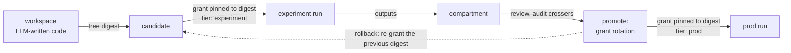
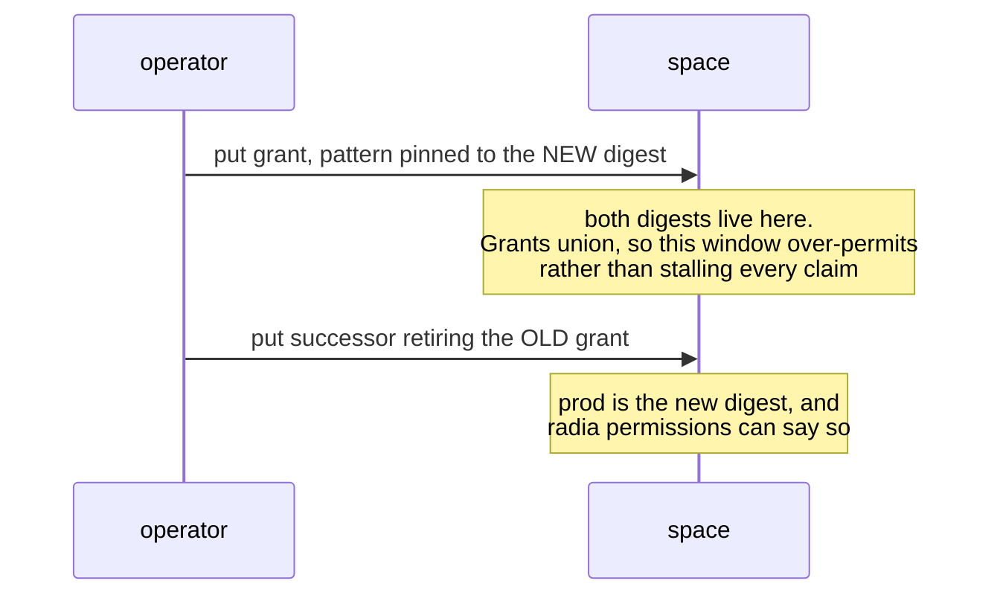
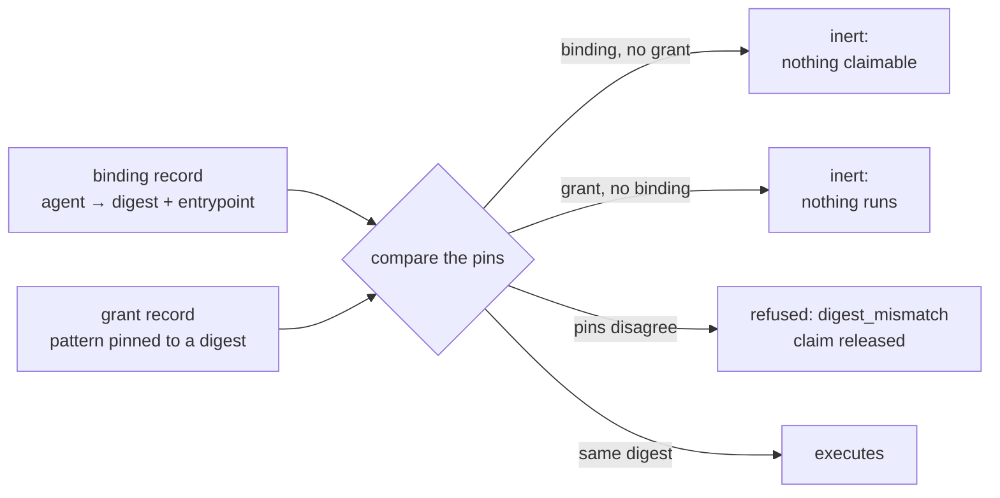
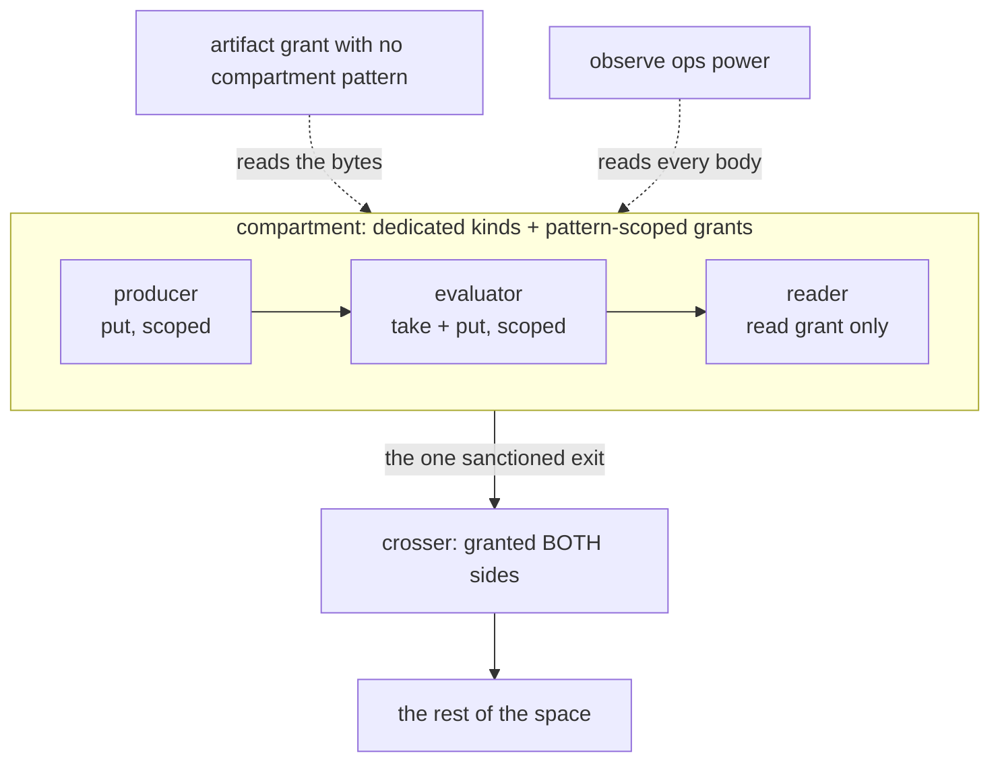
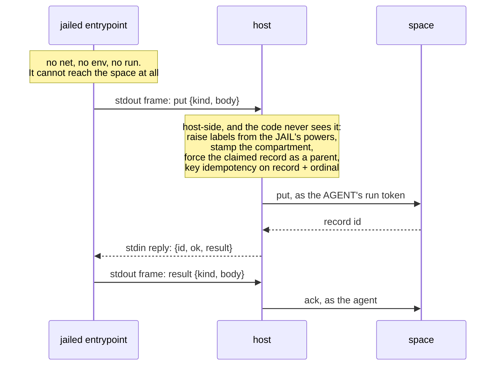
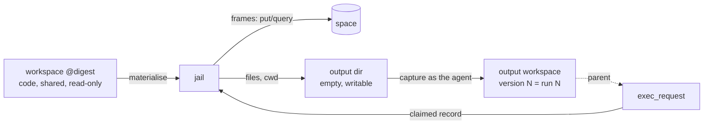

# Workspace agents, and promotion as grant rotation (architecture)

> Status: BUILT (2026-08-06), all six phases. Every line of it is `extensions/` tier and a CLIENT:
> containment needed no runtime change. Source: `extensions/ts/promotion.ts`, `host.ts`,
> `broker.ts`, `compartment.ts`; contracts in `extensions/conformance/` plus
> `conformance/suites/compartment.ts`. Read [design-auth.md](design-auth.md) (grants, pattern
> scoping in both directions), [design-execution.md](design-execution.md),
> [design-workspaces.md](design-workspaces.md) and [plan-workspaces.md](plan-workspaces.md)
> first: this composes them and adds almost nothing.

## Contents
- What this is
- What is enforced, and by what
- Decisions
- Promotion is a grant rotation
- The compartment
- Binding, host, broker
- How it was built, phase by phase
- Mechanical footnotes
- Risks
- Rejected

## What this is

Two halves, and the second is a prerequisite for the first's strongest claim.

**The pipeline.** LLM-written code lives in a workspace; a candidate is its content-addressed
tree digest. It runs against protected data in an experiment tier, and its outputs land in a
COMPARTMENT: kinds and grant patterns that other agents join by holding the right grants, so
they read, claim and build on the work, while a producer inside can write nowhere else. Carrying
anything OUT takes a principal deliberately granted both sides. A review promotes the digest, and
prod runs it. Promotion, rollback and kill are record writes.



**Workspace agents.** An agent is not a deployed process. It is an `agent_definition` plus a
**binding** (`{agent, workspaceDigest, entrypoint, sandboxPattern}`) plus a generic host fleet
that runs any binding, so defining an agent is a `put`. This closes the last dogfooding gap: a
worker's CODE was the one part of an agent living outside the substrate.

The dependency runs one way and must not be forgotten. Grants contain whatever the CREDENTIAL
does, so the compartment is only as good as the jailed code's inability to act under some other
credential. The broker is what makes that structural, by leaving the entrypoint no way to reach
the API at all.

## What is enforced, and by what

This began as a CLAIM LEDGER: every row a promise the design made that the enforcement did not
keep, which is the defect class this codebase produces most often (see
[plan-audit-remediation.md](plan-audit-remediation.md): "every grant bug so far was a promise
that did not match the enforcement"). Kept in its resolved form, because the reason a mechanism
is the one it is reads better beside the claim that failed:

| The claim as first written | What actually enforces it |
|---|---|
| a taint label contains the data | Nothing: it bars claims but not reads, is opt-in per grant, and unions only the DECLARED parents. Grants contain it better and need no runtime change (D1) |
| the runner attests containment on its output | Structural, not attested: `bodyMatchesGrant` binds the put handler (`handlers/records.ts`), artifact writes (`handlers/artifacts.ts`) and ack-emitted results (`space.ts`) |
| outputs are "quarantined" | Wrong word, since it implies a human-only gate. A COMPARTMENT, which agents join by grant (D2) |
| zero runtime changes | True for containment. `WRITE_PROTECTED_KINDS` and `NEVER_COMPACT` are code sets, so joining either is a runtime change; zero-change equivalents cover everything below prod tier (D3) |
| the digest pin is enforced | Enforced for SUBMITTING and CLAIMING. That the host then executes those bytes is host discipline: the runtime executes nothing, by design |

The bill came to zero runtime surface for containment, plus the conventions below, plus an
extensions-tier host and broker.

## Decisions

- **D1. The compartment is KINDS plus GRANT PATTERNS, never a taint label.** A dedicated kind per
  compartment record type is default-deny by construction: no pre-existing grant can name a kind
  that did not exist, so nothing is retrofitted, and it bars reads and claims alike. Patterns do
  the finer work inside the compartment (per dataset, per tier) and are mandatory for artifacts,
  which cannot get a new kind because `artifact` is reserved. Both are enforced server-side, on
  reads by `combineMatch` and on every write path by `bodyMatchesGrant`. Never contain a class of
  data with a label; see Rejected and [design-taint.md](design-taint.md).
- **D2. A compartment, not a quarantine, and never a human-only gate.** Other agents read and
  build on protected-derived output as a matter of course: membership is ordinary authorization
  (a read grant admits a reader, a take grant admits a claimer, a put grant scoped to the
  compartment admits a producer that can write nowhere else). What is controlled is who joins and
  what leaves. Stating it as "only a human can see it" is neither the mechanism nor the intent,
  and would make the compartment useless for the agents doing the work.
- **D3. The binding kind is operator-only by grant ABSENCE first, by code later.** No principal
  is ever granted `put` on it, and it declares no `contentKey` (so `core/gc.ts` never compacts
  it: compaction only touches keyed kinds). Both properties hold with no runtime change. Before
  anything PROD-tier depends on a binding, it joins `WRITE_PROTECTED_KINDS`, because grant
  absence is a policy an operator can reverse and write protection is a guard.
- **D4. The host claims under each hosted agent's own run token, never its own.** The rejected
  alternative (host claims as itself, dispatches internally) needs the union of every hosted
  agent's grants, which is a mini-operator, and flattens `created_by`, `lease_owner` and
  `delegation_context` into one principal.
- **D5. The entrypoint never holds a credential or a lease.** It proposes; the host executes
  under the agent's token. Same shape as the MCP adapter, and for the same reason.
- **D6. Rotation is grant-then-retire.** Both digests are briefly live (grants union, the safe
  direction). Retire-first leaves a window where nothing can be claimed.
- **D7. Nothing privileged touches the data plane.** An operator bypasses grants entirely, so a
  digest pin binds only scoped agents. And the `observe` ops power reads every record BODY
  (`handleGetRecord`), so an observer is a data-plane reader here: never grant it inside the
  protected domain, including the default MCP observer credential.

## Promotion is a grant rotation

A candidate is a tree digest. Immutable by construction: an edit is a fork with a different
digest, which is named by no grant and therefore authorizes nothing.

The prod runner's grant to claim work is pattern-scoped to the promoted digest, and the
requester's grant to write requests is scoped the same way:

```json
{"principal": "agent:prod-runner", "kind": "exec_request", "operations": ["take"],
 "pattern": {"workspace": "sha256:abc…", "tier": "prod"}}
```

Promotion writes a grant naming the new digest and retires the old one, in that order (D6):



Both are successor records, so the promotion history is audited, watchable, revocable, and
inspectable through `effectivePermissions` before it is trusted. `radia permissions
agent:prod-runner` answers "what is prod running right now" from the enforcement path rather
than from a deploy log.

No deploy endpoint, no environment config, no CI state: the promotion state IS the grant
registry, so the event chain and the seal cover it for free.

**Two locks, each inert alone, and they must also AGREE:**



A hijacked binding without a matching grant claims nothing. A granted digest without a binding
runs nothing. The binding is the escalation root, so the grant-side pin is the second lock. The
disagreement case was not predicted by the design and is the hijack the two locks exist to
prevent, wearing the shape of a misconfiguration.

## The compartment

A COMPARTMENT, not a quarantine: the agents doing the work are inside it. An inspector that has
to be a person is the failure [design-inspection.md](design-inspection.md) names, and it would be
the wrong answer here too.



- **Inside, work composes normally.** An evaluator claims a result, an aggregator summarizes
  several, a checker validates them. Each holds a take grant on the compartment's kinds and a put
  grant scoped to the same compartment, so the chain keeps working and none of them can write
  anywhere else. Read-only members hold only a read grant.
- **Containment is WRITE-SIDE, which is the half usually got wrong.** `bodyMatchesGrant` refuses
  a producer's write outside its pattern on the put path, the artifact path and the ack-emitted
  result. `combineMatch` decides who sees what. Both are server-side, so a client's own pattern
  can only narrow further.
- **Leaving takes a principal granted BOTH sides, and that is the whole gate.** Never grant one
  principal both sides except the one whose job that is. There is no second mechanism behind that
  rule, so a mis-written grant is the leak; `auditCompartment` names every principal holding
  both, which is the audit to run at promotion.
- **The two dotted doors are not grants on the compartment's kinds**, which is why an audit that
  only reads those misses them: an unscoped `artifact` grant reaches the bytes, and `observe`
  reads every body in the space.
- **Protected bytes are artifacts, never record bodies.** Already the erasure invariant, and it
  earns its keep twice here: bytes are encryptable with a destroyable key, and an accidental copy
  can be shredded with `erasures` detecting a return. The scoping rule bites: a shredded
  artifact's plaintext digest survives in an unerasable body, so short low-entropy values (a
  name, an identifier) must never become artifacts at all. That is a convention the runtime
  cannot check.

## Binding, host, broker

- **Binding**: a latest-wins registry entry `{agent, workspaceDigest, entrypoint, sandboxPattern,
  outputWorkspace}`. `outputWorkspace` is where a run's FILES land, and its absence means the run
  gets no writable path at all (5d). Cutover is per claim; in-flight leases finish under the digest pinned when
  they were claimed; retirement is the off switch.
- **Host**: an `extensions/` client like `git-serve`, not runtime. It holds the definition tokens
  of its assigned agents (setup, the same category as the chat launcher spawning its fleet),
  mints each run, claims under that run (D4), materializes the digest into the jail its
  `sandboxPattern` selects (a sandbox is a record matched by properties, per
  [design-execution.md](design-execution.md)), and invokes the entrypoint with the claimed record.
- **Broker**: the entrypoint's only way out for RECORDS. Bytes leave the other way, as files in the
  output tree, so nothing binary is ever encoded into a frame or a body (5d).



Two properties follow, and they are the reason this is not "FaaS on a tuple space":

- **The code cannot lie about what it touched.** The host knows the jail's declared properties,
  so it raises the existing labels mechanically (filesystem-capable ⇒ `file`, network ⇒ `net`)
  and stamps the compartment field on everything the entrypoint emits. The writer never gets to
  say. Forcing the claimed record as a parent does more than preserve labels: the runtime then
  computes `foreign` itself, because the output is derived from a record another principal wrote.
- **Effectively-once, by construction.** With no egress but the broker, the host derives
  idempotency keys from `(claimed record id, output ordinal)`, so a retried attempt's puts
  dedupe. Bounded by `idempotencyRetentionSeconds` (7 days), not forever. This sentence
  over-claimed for a day: keys were scoped to the `run:*` principal, so the dedupe held only
  within one run token and a retry after a re-mint or a host restart duplicated. Closed by audit
  Package U (2026-08-09): keys scope to the AGENT behind the run, which is exactly the retry
  that needs the stored row. An entrypoint whose
  sandbox permits outside effects is exactly where a reviewer should look, and the sandbox
  pattern makes that visible in the grant.

The broker protocol crosses the project's biggest trust boundary (model-written code against
agent authority), so by this repo's own rule it is a NORMATIVE surface with a conformance
contract in `extensions/conformance/`, not a regression net. The channel itself is UNTRUSTED and
nothing depends on otherwise: jailed code can print a forged frame and gains nothing, because
every rule above is applied host-side.

**Any language, any backend, and the two are INDEPENDENT.** A language contributes a SHIM
(`RUNTIMES`, about thirty lines each for JavaScript and Python) and nothing else, since the host
side never learns which language asked. The jail comes from the `sandbox` RECORD a binding's
`sandboxPattern` resolves to (`resolveSandbox`): Deno is safe by ABSENCE of flags, bubblewrap by
PRESENCE of them and runs any interpreter. Conflating the two is how "python means bubblewrap"
becomes a rule nobody wrote down.

## The operator surface

Seven CLI verbs, all of them CLIENTS composing `/v0` the way `workspace-git` does, so the runtime
gains nothing and the wire contract gains no entry:

| verb | what it does |
|---|---|
| `promote <digest> --tier <t> --pin <p>:<ops>` | the grant rotation. Declares `exec_request` first, since a pattern may only name declared paths and an undeclared kind makes every pin fail to compile |
| `rollback` | the same call, named for the intent |
| `pins <principal> --tier <t>` | what that principal is pinned to, read from the grants. Two digests is reported as a rotation in flight, never collapsed to a "current" |
| `bind <agent> --digest --entrypoint` | the escalation root. Prints whether the grant AGREES, so an inert binding or a `digest_mismatch` is visible at write time rather than at claim time |
| `bind <agent> --retire` | the off switch |
| `bindings` | every live binding |
| `host --agent <p>=<token>` | runs bound agents' code as them. BROKERED by default, since that is the invoker that leaves the jail no way to reach the API. `--agents -` takes the token map on stdin, keeping it out of `ps` |
| `compartment --inside <kinds>` | the audit, including the two doors that are not grants |

The deferral this replaced ("the extension is the contract, the verb would be convenience") was
wrong in one specific way: with no verb, the only way to promote or host was to write TypeScript
against `extensions/ts/`, so the enforcement path had no operator surface at all and the chat
could reach none of it.

Verified end to end against a live space (18 checks: rotation, both locks agreeing and
disagreeing, the brokered write attributed to the agent, retire, stdin tokens, malformed pins).
NOT covered by an automated test, in common with every other CLI verb: nothing under
`conformance/` drives `runCli`.

## How it was built, phase by phase

Ordered by MODEL RISK, the [plan-workspaces.md](plan-workspaces.md) rule: the question most
likely to be answered "no" comes first. Phases 1 to 3 wrote NO runtime code and little of any
kind (conventions, and the tests that prove them); 4 to 6 are the build. The numbering is kept
because eight source files cite it, and because the plants are the part worth re-reading.

**1. Does the compartment hold, with nothing new? It does.**
Shipped: `conformance/suites/compartment.ts`, five cases on both adapters, driving the HANDLERS
because enforcement is at the HTTP boundary and only there (a test calling `space.put` would pass
while the boundary leaked). Answered: a kind nobody was granted is closed for query, take and put
while the grants that principal DOES hold keep working; a member reads, claims and chains an
ack-emitted result inside the compartment; a producer's write outside its pattern is refused on
all three paths, and omitting the field is not a way out; a read narrows, says it narrowed, and a
client pattern asking for another compartment returns nothing; crossing out takes a principal
granted both sides, which `effectivePermissions` names.
Both write-side guards were proved against planted regressions (disabling `bodyMatchesGrant` in
`handlers/records.ts`, then in `Space.ack`, fails exactly the write-path case and nothing else).
The convention this pins, for anyone extending it: a compartment is a DEDICATED KIND, its members
are grants pattern-scoped on a `compartment` field, and artifacts join by REDECLARING the
reserved `artifact` kind with `compartment` added to its indexed paths, since a pattern may only
name declared paths and `artifact` cannot be replaced.

**2. Does digest-pinned promotion work? It does.**
Shipped: `extensions/ts/promotion.ts` (`EXEC_REQUEST_KIND` with `workspace` and `tier` indexed,
`promote`, `rollback`, `pinnedDigests`) and `extensions/conformance/promotion.test.ts`, five
cases against a real space, because a pin is tested by trying to submit and claim at an
unpromoted digest and only a running space can be asked.
Answered: an unpromoted digest is refused at the WRITE (the submitter's pattern) and yields
nothing at the CLAIM (the runner's), while the operator can see the record so the test cannot
pass by having written nothing; rotation closes the old digest on both sides; rollback to a
retired digest actually grants and repeating it writes nothing; a tier rotates alone, leaving
another tier's pin and unrelated grants untouched.
Both footguns are proved against planted regressions, and the ORDER one taught something: the
obvious test could not see it. Retire-first ends in the same state, so asserting on the state
after the call passes either way, and the suite did. The window is inside the call, so what the
test asserts is the ORDER OF WRITES, through a recording client. Written the natural way, this
phase would have shipped a guard that could never fail.

**3. Does the exit gate compose? It does, and the phase changed shape on contact.**
As written, its "done when" was already true: phase 1 proved the enforcement (a member cannot
write outside, a principal granted both sides can). What was missing is the other half any rule
like this needs, and the half that makes it more than a sentence: a way to FIND the principals
who hold both, since there is no second mechanism behind the rule and a mis-written grant is the
leak.
Shipped: `extensions/ts/compartment.ts` (`auditCompartment`, `unexpectedCrossers`) and
`extensions/conformance/compartment.test.ts`. The audit reports the boundary's three doors, only
one of which is obvious: crossers (read inside, write outside), artifact grants with no
compartment pattern (`artifact` is reserved, so it is scoped by pattern or not at all), and ops
POWERS, which are no grant at all. Its caveats say what it cannot see, starting with privileged
principals, who are named in config rather than in records.
`unexpectedCrossers(expected)` is the promotion checklist as a function rather than a paragraph
nobody runs. `request_grant` stays where it is: an app-level tool in the chat example, not a
general convention to build on.
Plant: replacing the registry projection with a raw scan fails the retired-grant case and nothing
else, which is the failure that matters, because an audit reporting a crossing revoked months ago
is one nobody believes when it is finally right.
It also found something on its first real run. `agent:local-observer` holds `observe` in EVERY
space, so a real deployment starts with a principal that reads every body in every compartment.
That is D7 stated as a rule; the audit puts it on the first line of the answer, and the test
asserts it rather than treating it as a fixture.

**4. Can a generic host run someone else's code as that someone? It can.**
Shipped: the `binding` kind (D3: no `contentKey`, so it never compacts) and
`extensions/ts/host.ts` (`readBindings`, `WorkspaceHost.tick`, `sandboxInvoker`), with
`extensions/conformance/host.test.ts`. The invoker is PLUGGABLE, which is both how the identity
cases stay independent of execution and how phase 5 replaces the default with the brokered one.
The default materialises the tree and runs the entrypoint in the Deno jail with the record
interpolated: read-only, no network, result returned rather than written, and the host acks it as
the agent.
Answered: one host serving two agents produces results authored by BOTH agents, each carrying its
own delegation chain, with the host holding no identity in the space; a binding whose agent holds
no grant reports `refused` and leaves the work claimable; a granted digest with no binding does
nothing, and writing the binding later makes the same space run.
Plant: making the host claim as ITSELF fails the attribution case and the refusal case, and
nothing else.
**A fourth case the plan did not predict**, and the one drawn above: both locks present and
DISAGREEING. The host refuses that pairing, releases the claim so a correctly bound host can take
it, and reports `digest_mismatch`. Two locks are necessary and not sufficient.

**5. Can the jail be denied the token? It can, and the line below is cleared.**
Shipped: `extensions/ts/broker.ts` (the frame protocol, NORMATIVE) with
`extensions/conformance/broker.test.ts` as its contract, twelve cases.
No shim is imported and none is materialised: the boot program is generated, because the tree is
content-addressed and adding a file to it would change the digest that identifies the code.
Answered: from inside the jail, `fetch`, `Deno.env`, reading the credentials file and spawning a
process are all permission-denied while the broker works; a brokered write is authored by the
agent; a filesystem-capable jail's output carries `file` and the host's compartment stamp,
neither of which the code said; a retried attempt's writes dedupe on
`(claimed record, output ordinal)`.
Plant: opening the jail with `--allow-net --allow-env` fails the probe with "the jail reached the
space through fetch".
One thing building it settled: the jail's flags now live in ONE place (`jailArgs` in
`sandbox.ts`), because `runCode` feeds a program through stdin, which the broker cannot do since
stdin is its response channel, and a second copy of the permission flags would have been a second
security boundary to keep in step.

**5a. Any language, any backend.** The first cut ran JavaScript in the Deno jail and nothing else,
which reads as a protocol limit and is not one. Language and jail are now chosen independently
(see "Binding, host, broker"). EVERY BACKEND NEEDS ITS OWN ESCAPE PROBE: the Deno probe proves
nothing about bwrap, one forgotten `--unshare-all` from an open jail. Both are in the contract
and both were proved against a plant.

**5b. The channel: a private pipe pair, arrived at in two steps.** Stdout was the only channel
`Command` offered, so the protocol shared a stream with the entrypoint's own printing, and an
entrypoint that prints is NORMAL. Reproduced against this code before fixing it: output with no
trailing newline (`print(..., end="")`, a progress bar) prepends itself to the next frame, which then
no longer starts its line, is read as chatter, and the jail blocks on an answer that never comes
until a timeout naming the wrong cause. The first fix was three framing rules, each with a contract
case: a leading newline before every frame, a long printable marker starting the line
(`RADIA-BROKER/1:`, after `\x01broker:` proved to be the wrong thing to ask another implementation
to emit), and a marker found MID-line diagnosed as definite interleaving.

The second fix removed the sharing instead of managing it, and the question that got there was "why
do we need stdout at all". A dedicated fd was always the honest ideal and had been declined because
`Command` exposes no portable extra one. That reasoning missed the filesystem: **a FIFO is the extra
fd, reached by path.** The host makes two pipes in a control directory, passes the paths to the shim,
and a frame is one line of JSON with no marker and no rules, because nothing else writes there. All
three framing rules were deleted rather than ported, which is the check that it was the right
direction.

What decided it over a unix socket is WHICH SIDE PAYS. Measured: Deno gates unix sockets behind
`--allow-net` (scopable to one path, verified not to restore TCP), but the jail's no-network posture
is proved by that flag's ABSENCE, and a capability on the untrusted side costs more than one on the
trusted side. A FIFO needs only read and write on one directory, which a run with an output tree
already has. The cost lands on the HOST instead: there is no Deno API for `mkfifo`, so a host that
brokers needs `--allow-run` to cover one coreutils binary. Found the hard way, by a chat worker
launched `--allow-run=deno` failing with nothing to read.

Deadlock is what a pipe gets wrong, and it is handled at the open: a FIFO open blocks until the other
end opens, so the host opens both ends of both pipes (O_RDWR) BEFORE spawning, which never blocks and
means the child's opens never block either. Planting the naive open hangs every case in the suite,
not one. The price is that the host never sees EOF, so the read loop ends on the result frame, or on
the child exiting plus a 50ms quiet window (paid only on the failure path). Stdout and stderr are now
purely diagnostics, each drained to a bounded tail, so a flood is absorbed rather than fatal; the 4MB
cap moved onto the pipe, which is the one stream the host must still buffer.

**5c. The other half of the stream: stderr and exit codes.** Asked directly, and neither was
really handled. Stderr was buffered UNBOUNDED, so the stdout cap guarded one stream while the
other stayed open, and it reached exactly one failure message: the empty-result one. Timeout,
channel corruption and flood all reported the symptom with the traceback discarded, on the paths
that need a diagnosis most. The exit code was never read at all, so a result frame followed by a
non-zero exit acked clean. Now: stderr is capped at 64KB kept from the TAIL (a Python traceback's last
line is the useful one; the clip into the failure message keeps BOTH ends, because a JavaScript
uncaught error puts its message FIRST and 600 characters of stack pushed it off the front) and drained past the cap, since a reader that stops blocks the child on a
full pipe instead of killing it; every failure carries it; and the exit code is reported after a
250ms grace for a natural exit, which is needed because a kill only erases the code of a process
still running. A result plus a failing exit is now a failure, and retry is safe since the writes
it already made replay on their ordinal key.
The bug found on the way is the one worth remembering: `WorkspaceHost` truncated the failure to
its FIRST 300 characters, cutting off the tail the broker had gone to trouble to keep. Two caps,
both defensible alone, opposite ends, no cause left between them.

**5d. Where a run's BYTES go: a second tree, never the one it runs from.** The frame channel is
lines of JSON, so binary output had no path at all, and the obvious fixes were both wrong: base64 in
a result body breaks the invariant that artifact bytes never travel inside a record, and a
length-prefixed binary frame makes every future shim implement a second parser. The answer is that a
run SAVES A FILE, which is binary, named, versioned, erasable and git-exportable for free, and needs
nothing added to the protocol. What building it clarified is that the file cannot go in the tree the
run was materialised from: that directory is the agent's CODE, shared between concurrent claims by
`treeCache` and pinned by the digest promotion rotates, so writing into it races a neighbour and
changes the identity the pin refers to. So a run writes to a DIFFERENT tree than it runs from.



`Binding.outputWorkspace` names it, and its ABSENCE means no writable path at all, which is the
posture with no capability to reason about. The output tree is the run's CWD, so saving a file is
`writeFile("chart.png", …)` or `open("chart.png","wb")` with nothing added to the entrypoint
signature and nothing per-language; the code tree is reached by absolute path (`import.meta.dirname`,
`__file__`), which is how a module should find its own data anyway. Capture runs BEFORE the ack, so a
run whose outputs could not be stored nacks and retries under the at-least-once contract it already
lives under, and it writes as the AGENT with the claimed record as a parent, so `children(request)`
answers "what bytes did this produce". Each version is that run's outputs rather than an
accumulation: the directory starts empty, so version N answers "what did run N produce" and the chain
carries the history. A run that writes nothing produces no version, not an empty one. Contract cases:
the binary round-trip (0x00 and 0xff, the bytes a line channel would mangle), the three-run replace
sequence, and the plant that matters, an entrypoint trying to overwrite its own `main.ts` and
reporting whether it got away with it.

**6. Warm pools per promoted digest.**
Shipped: `treeCache` in `extensions/ts/host.ts`, used by both invokers, keyed by digest and
caching the PROMISE so two claims for one digest share a materialisation rather than racing to
write the same files. LRU, four entries by default, which covers a rotation, a rollback and a
spare.
Measured (in-process, one small file per entry, artifacts over HTTP):

| tree      | cold materialise | warm   |
|-----------|------------------|--------|
| 1 file    | 5ms              | 0.00ms |
| 20 files  | 34ms             | 0.00ms |
| 100 files | 143ms            | 0.00ms |

So the saving is the whole materialisation and scales with the tree, while the jail spawn (~25ms)
is unchanged: end to end, a one-file entrypoint went 41ms cold to 29ms warm, and a hundred-file
tree would save an order of magnitude more. A one-file benchmark would have made this look
pointless, which is why the table has three rows.
**What is NOT pooled, deliberately: the process.** "Different code is a different digest" covers
CODE, not STATE, and a jail reused between claims carries globals, open handles and whatever the
last run left in memory. A pool of live interpreters is a different proposition with a different
safety case, and it does not get to borrow this one.
The correctness claim is tested as the thing that would break it: promote different code and the
SAME host runs the new version (`hits: 1, misses: 2`), because the digest is part of the key.
Building it moved one thing: the per-record boot program now lives in its own temp directory
rather than in the tree, since a shared tree cannot hold a file that differs per claim.

**The line that gated real protected data, kept because it applies again.** Before phase 5 a
jailed process could reach the API with whatever credential it could read, and the compartment
bound only the grants that credential held. CLEARED on 2026-08-06 for the Deno jail: the probe
passes and the plant fails it. Any NEW runner inherits the rule rather than the conclusion, since
a second backend is not covered by another backend's probe.

## Mechanical footnotes

1. A grant `pattern` may only name declared indexed paths of the kind, so `exec_request` must
   index `workspace` and `tier` as `keyword` or the pin never compiles.
2. Rollback re-declares a retired content key, which is the registry REVIVE case: without the
   `:after:<recordId>` idempotency suffix the write replays the retirement and reports success
   while granting nothing.
3. Declassify still has a job here, just not containment: the host raises `file` and `net` from
   the jail's properties, so an exporter whose grants bar those needs them cleared. It emits a
   successor of the SAME kind with the remaining labels, so it never moves a record between
   compartments; crossing is a write by a principal granted both sides.
4. The digest stamped on outputs is host-attested `clientMeta`, one notch below server-assigned
   metadata. State that in the binding contract rather than letting a reader assume otherwise.
5. Experiment-tier ephemera (logs, chunks, intermediate outputs) declares
   `defaultRetentionSeconds` on its kinds and sweeps itself through the amortized write-path GC.

## Risks

- **The binding is an escalation root.** Whoever writes one chooses what code runs under an
  identity's authority. D3 is the answer, and the grant-side pin is why there are two locks.
- **The host is a credential concentrator.** It holds the durable half for every agent it hosts,
  so one compromised host mints runs for all of them. Definition tokens are mint-only, which
  bounds the blast; shard hosts by trust domain rather than running one fleet for everything.
- **`observe` reads bodies.** D7. Worth restating because the ops-tier work made an observer the
  DEFAULT credential for the MCP adapter and the CLI's read verbs.
- **An artifact digest is a confirmation oracle.** An observer that can read artifact RECORDS
  learns plaintext digests without holding the bytes. Same root as the erasure scoping rule.
- **EVERY artifact grant in the space is part of this boundary.** `artifact` is reserved, so a
  compartment cannot get its own artifact kind, and an existing broad `artifact` grant reads
  protected artifact records and fetches their bytes. Pattern-scope every artifact grant on a
  compartment field, and audit the existing ones before ingesting anything. This is the one place
  where the no-retrofit property of dedicated kinds does not apply, and it is the most likely way
  this design leaks in practice.
- **A dual-grant principal is the whole exit, so a mis-written grant IS the leak.** There is no
  second mechanism behind it. `auditCompartment` naming both sides is the check; run it as part
  of promotion rather than trusting the grant that was written.
- **An exporter or declassifier may be an agent, and that is where to be careful.** Nothing in
  the substrate requires a person, and a deterministic aggregator that provably cannot emit rows
  is a better exit gate than a tired human. An LLM-DRIVEN one is different, because prompt
  injection reaches the act that crosses the boundary. Prefer a deterministic exporter or a
  person; give analysis agents compartment grants, never both sides and never the power.
- **The jail is not the substrate's.** Radia governs authorization and flow; isolation is the
  runner's, and [design-execution.md](design-execution.md)'s measurement (bwrap three orders of
  magnitude weaker than the Deno jail on filesystem) is the real security decision. Radia makes
  the choice legible, not strong.

## Rejected

- **A deploy endpoint, an environment table, or CI state.** The promotion state is the grant
  registry; anything else is a second source of truth that the event chain does not cover.
- **A taint label as the containment mechanism.** It bars claims but not reads, is opt-in per
  grant (so one unscoped grant turns it off), and unions only the declared parents. Grants do the
  job with nothing added. Full argument in [design-taint.md](design-taint.md).
- **A `classification` body field on a kind that already exists, without a dedicated kind.** Every
  grant already written on that kind reads the new records, so containment would depend on
  retrofitting grants nobody has a list of. Patterns subdivide a compartment; they do not carve
  one out of an existing kind.
- **The host claiming as itself and dispatching.** D4.
- **Protected bytes in record bodies.** No erasure path, and `observe` reads bodies.
- **A dedicated file descriptor for the broker channel.** 5b.
- **Git as the storage of record for candidates.** Already rejected in
  [design-workspaces.md](design-workspaces.md); restated because a promotion pipeline invites it.
  Export stays one way, and the sha256 digest stays authoritative.
