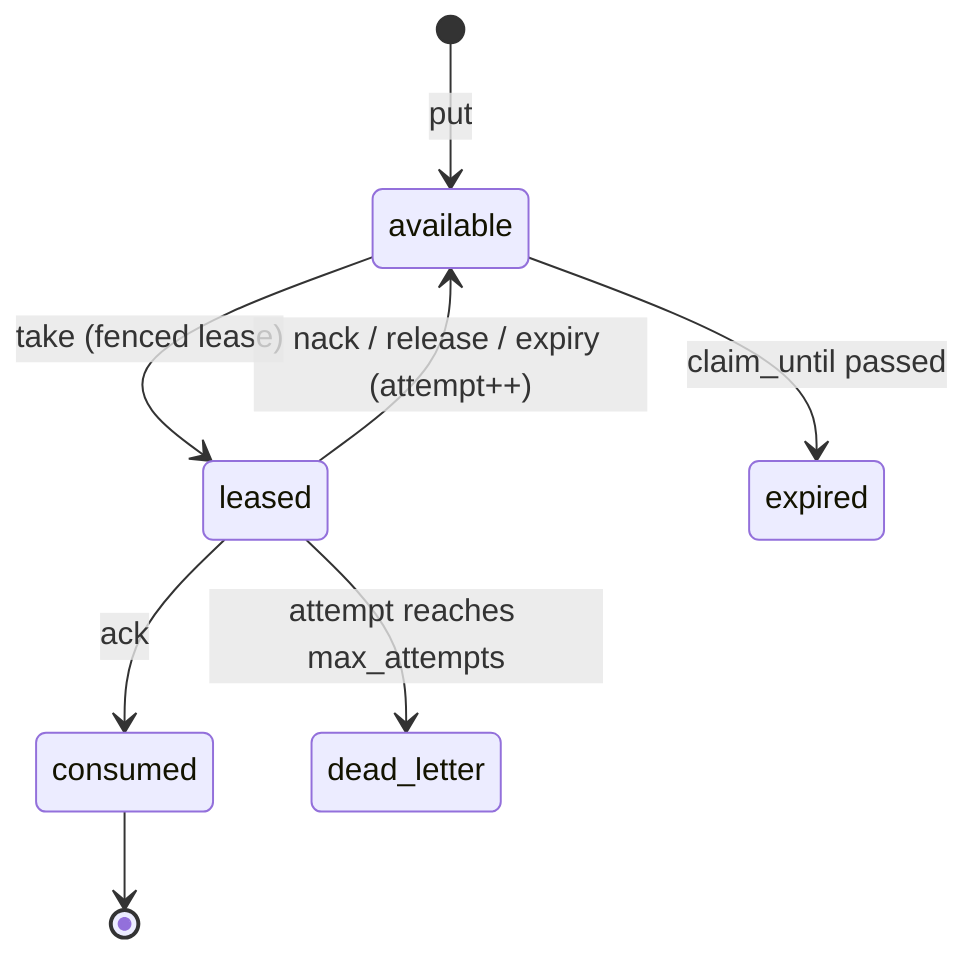

# Delivery semantics and core API (design)

Spec and rationale for the delivery guarantee, leases, idempotency, the API surface,
the wire protocol, and the client agent loop. Origin: outline §4–5. Not yet implemented.

## Contents
- Invariants
- The guarantee
- Leases with fencing
- Idempotency (ordering is load-bearing)
- API surface (ten operations)
- Wire protocol
- Agent loop (client contract)

## Invariants

Cross-cutting versions of the first two are in [CLAUDE.md](../CLAUDE.md); the detail
here is authoritative.

- At-least-once execution with at most one valid lease at a time. Physical execution may
  overlap after lease expiry.
- Idempotency is checked **before** lease validation, for every state-changing operation.
- `take(record_id=...)` is a selector, never a bypass: the server re-verifies template,
  grants, admission, availability, and `claim_until`.
- Client disconnect releases nothing. Only leases hold state.
- Pagination is keyset over immutable sort keys, not snapshot.

## The guarantee

> At-least-once execution with at most one valid lease at a time. Physical execution may
> overlap after lease expiry, because a fenced worker may continue running until it
> observes `lease_lost`.

Atomic consume-and-emit protects **space state, not external side effects**: an agent
can send an email and crash before `ack`. Side-effecting agents require idempotency at
the effect boundary, an outbox, or a transactional tool gateway (a candidate second
product surface — see [gotchas.md](gotchas.md)).

## Leases with fencing

The envelope state machine, with the operation driving each transition:



`take` returns `{record, lease: {lease_id, epoch, owner_run, expires_at}}`.

- `renew` / `ack` / `nack` / `release` present `lease_id + epoch`; a mismatch returns a
  distinct **`lease_lost`** status (not an error).
- Expiry → `available`, `attempt += 1`, backoff via `available_at`.
- **Attempt semantics per path:** `nack` +1 (agent backoff); expiry +1 (policy backoff);
  `release` +0 (cooperative cancel — an explicit operation, not a client-chosen nack
  flavor; server policy may override the +0).
- Max cumulative lease duration per (record, run): a wedged-but-alive process cannot
  renew forever.
- **Late results:** `ack` either succeeds transactionally or fails without emitting its
  result. A fenced worker preserving late output uses an explicit diagnostic
  operation/record type — never a side-channel commit inside a failed ack.
- After `max_attempts` → `dead_letter`.

## Idempotency (ordering is load-bearing)

For every state-changing operation:

```
lookup (principal, operation, idempotency_key)
  found + same request hash   -> return stored response      # BEFORE lease validation
  found + different hash      -> idempotency_conflict
  absent                      -> validate lease/eligibility, execute, store response
```

Rationale: `ack` commits, the HTTP response is lost, the agent retries — the task is now
consumed and the lease invalid; validating the lease first would falsely return
`lease_lost` for a succeeded operation. Stored responses include generated result IDs;
concurrent same-key requests serialize. All state-changing operations accept idempotency
keys; stale `nack` retries may be terminal.

## API surface (ten operations)

```
put(record, idempotency_key) -> id
read_one(template) -> record | null
query(template, cursor, limit) -> page          # keyset cursor, see below
take(template | record_id, lease_s, block, timeout) -> {record, lease} | null
ack(lease, result_record?, idempotency_key) -> ok | lease_lost | idempotency_conflict
nack(lease, reason, backoff_s) -> ok | lease_lost
release(lease, reason) -> ok | lease_lost       # cooperative cancel, attempt +0
renew(lease) -> lease' | lease_lost
watch(template) -> watch_id / event stream
control-plane ops (kinds, templates, definitions, runs — see design-auth.md)
```

- **`take(record_id=...)` is only an efficient selector, never a bypass.** The server
  re-verifies: a registered template of this run matches the record; grants permit the
  take; scheduler admission exists (in scheduler mode); the record is `available` and
  within `claim_until`.
- **Pagination is keyset, not snapshot.** Stable with respect to the selected *immutable*
  sort keys (`created_at`, record ID); runtime eligibility is evaluated per page fetch.
  `effective_priority` is mutable under aging, so it is not a cursor key — aging
  influences scheduler admission, not cursor order. "Snapshot cursor" is reserved for a
  real snapshot implementation, deferred.
- **Long-poll cancellation:** client disconnect releases nothing; only leases hold
  state. Reactive mode retains priority aging so low-priority work cannot starve.

## Wire protocol

HTTP + JSON, OpenAPI-first; long-poll for blocking ops.

- Watch: `POST /watches` → `GET /watches/{id}/events` (SSE, event cursor, resumption).
  **Cursor older than retained events → 410 `cursor_expired`:** the client performs a
  catch-up query and opens a new watch.
- Watches are **ephemeral run resources** (die with the run). Durable subscriptions are
  deferred.
- Templates are never in query strings.
- Errors: RFC 9457. `lease_lost` and lost-race are distinct non-error statuses.
- LISTEN/NOTIFY is wakeup only; the event log is truth.
- Layering: Postgres → runtime (sole DB client) → protocol → {SDKs, MCP adapter, CLI}.
  The CLI uses only the public API.
- SDKs hand-write the heartbeat (renew at lease/3; stop when work dies) and the loop
  harness; Python + TS polished, others generated. The MCP adapter holds credentials
  outside the model context and heartbeats internally.

## Agent loop (client contract)

```python
async def agent_loop(space, run):
    async for hint in space.watch(run.templates):
        claimed = await space.take(record_id=hint.record_id, lease_s=run.lease_s)
        if claimed is None:
            continue                                   # lost race / not admitted: normal
        hb = start_lease_renewal(space, claimed.lease)
        try:
            result = await run_llm_step(claimed.record)
            status = await space.ack(claimed.lease, result_record=result,
                                     idempotency_key=key_for(claimed))
            if status == "lease_lost":
                log_fenced(claimed)                    # duplicate work possible: at-least-once
        except CancelRequested:
            await space.release(claimed.lease, reason="preempted")
        except RetryableError as e:
            await space.nack(claimed.lease, reason=str(e), backoff_s=backoff(claimed.record))
        finally:
            hb.cancel()
```
