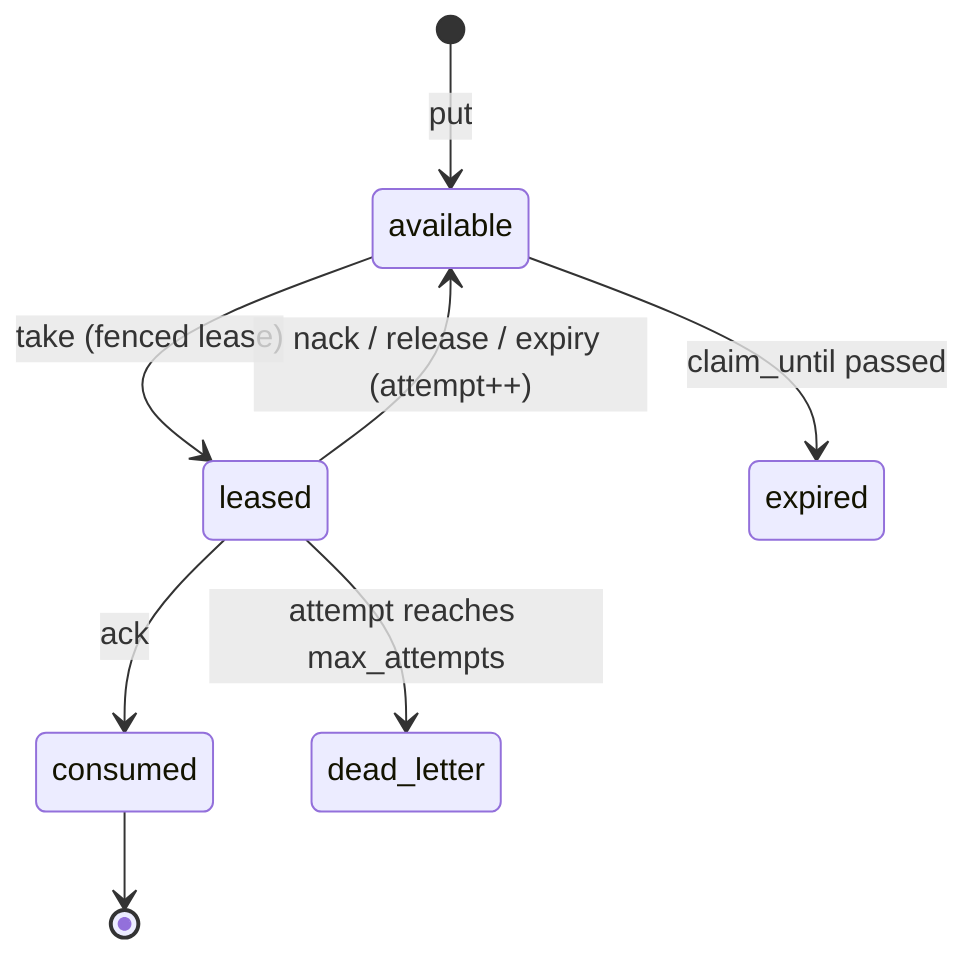

# Delivery semantics and core API (design)

Spec and rationale for the delivery guarantee, leases, idempotency, the API surface,
the wire protocol, and the client agent loop. Origin: outline §4–5.

**M0/M1 status (implemented):** the guarantee, fenced leases, idempotency-before-lease,
and all ten operations are built: HTTP handlers in `src/server/handlers/`, the service in
`src/core/space.ts`, lease/settlement in the adapters, claim ranking in `src/core/take.ts`.
Watches are implemented (see Wire protocol below), as is the artifact payload plane (below), and
`query` takes a keyset cursor (`after`/`dir`; see [design-matching.md](design-matching.md)).
**Not implemented:** long-poll blocking on `take` (M1).

## Contents
- Invariants
- The guarantee
- Leases with fencing
- Idempotency (ordering is critical)
- API surface (ten operations)
- Stability policy: what "frozen" covers
- Wire protocol
- Agent loop (client contract)

## Invariants

Cross-cutting versions of the first two are in [CLAUDE.md](../CLAUDE.md); the detail
here is authoritative.

- At-least-once execution with at most one valid lease at a time. Physical execution may
  overlap after lease expiry.
- Idempotency is checked **before** lease validation, for every state-changing operation.
- `take(record_id=...)` is a selector, never a bypass: the server re-verifies pattern,
  grants, admission, availability, and `claim_until`.
- Client disconnect releases nothing. Only leases hold state. A WATCH is the same rule seen from the
  other side: it survives a disconnect so the client can resume from its cursor, and is dropped only
  after an idle window with nothing attached (`watchIdleSeconds`), with `maxWatchesPerPrincipal` as
  the ceiling.
- Pagination is keyset over immutable sort keys, not snapshot.

## The guarantee

> At-least-once execution with at most one valid lease at a time. Physical execution may
> overlap after lease expiry, because a fenced worker may continue running until it
> observes `lease_lost`.

Atomic consume-and-emit protects **space state, not external side effects**: an agent
can send an email and crash before `ack`. Side-effecting agents require idempotency at
the effect boundary, an outbox, or a transactional tool gateway (a candidate second
product surface; see [gotchas.md](gotchas.md)).

"Until it observes `lease_lost`" is a real observation point, not a figure of speech: both SDK
loops hand the handler a cancellation channel (TS `AbortSignal`, Python `threading.Event`) that
fires as soon as the renewal heartbeat is answered `lease_lost` — or 401/403, where a stopped or
quarantined run lands, since revoking the run kills its token before anything can answer
`lease_lost`. Until 2026-08-04 the heartbeats discarded that answer, which made the sentence above
unmeetable through the SDKs: the first observable sign of a fence was the final ack, after every
side effect had already happened. See [sdk/README.md](../sdk/README.md) and
[plan-audit-remediation.md](plan-audit-remediation.md), package H.

## Leases with fencing

The envelope state machine, with the operation driving each transition:



`take` returns `{record, lease: {lease_id, epoch, owner_run, expires_at}}`.

- `renew` / `ack` / `nack` / `release` present `lease_id + epoch`; a mismatch returns a
  distinct **`lease_lost`** status (not an error).
- Expiry → `available`, `attempt += 1`, backoff via `available_at`.
- **Attempt semantics per path:** `nack` +1 (agent backoff); expiry +1 (policy backoff);
  `release` +0 (cooperative cancel: an explicit operation, not a client-chosen nack
  flavor; server policy may override the +0).
- Max cumulative lease duration per (record, run): a wedged-but-alive process cannot
  renew forever.
- **Late results:** `ack` either succeeds transactionally or fails without emitting its
  result. A fenced worker preserving late output uses an explicit diagnostic
  operation/record type, never a side-channel commit inside a failed ack.
- After `max_attempts` → `dead_letter`.

## Idempotency (ordering is critical)

For every state-changing operation:

```
lookup (principal, operation, idempotency_key)
  found + same request hash   -> return stored response      # BEFORE lease validation
  found + different hash      -> idempotency_conflict
  absent                      -> validate lease/eligibility, execute, store response
```

Rationale: `ack` commits, the HTTP response is lost, the agent retries. The task is now
consumed and the lease invalid, and validating the lease first would falsely return
`lease_lost` for a succeeded operation. Stored responses include generated result IDs;
concurrent same-key requests serialize. All state-changing operations accept idempotency
keys; stale `nack` retries may be terminal.

## API surface (ten operations)

```
put(record, idempotency_key) -> id
read_one(pattern) -> record | null
query(pattern, cursor, limit) -> page          # keyset cursor, see below
take(pattern | record_id, lease_s, block, timeout) -> {record, lease} | null
ack(lease, result_record?, idempotency_key) -> ok | lease_lost | idempotency_conflict
nack(lease, reason, backoff_s) -> ok | lease_lost
release(lease, reason) -> ok | lease_lost       # cooperative cancel, attempt +0
renew(lease) -> lease' | lease_lost
watch(pattern) -> watch_id / event stream
control-plane ops (kinds, patterns, definitions, runs; see design-auth.md)
ops plane      (stats, events, envelope query, diagnostics, remediation; see design-observability.md)
```

**Artifacts are a payload plane beside these verbs, not an eleventh one.** `POST /v0/artifacts`,
`GET /v0/artifacts/{id}` and `POST /v0/artifacts/{id}/capability` move BYTES; the coordination
still happens through `put`/`take`/`query` on the `artifact` *record* they produce. This is why
there is no `put_artifact` verb in the list above. An artifact is a record with its payload
stored out of line, so nothing about matching, leasing or authorization is special-cased for it.
See [design-data-model.md](design-data-model.md) §2.4.

- **`take(record_id=...)` is only an efficient selector, never a bypass.** The server
  re-verifies: a registered pattern of this run matches the record; grants permit the
  take; scheduler admission exists (in scheduler mode); the record is `available` and
  within `claim_until`.
- **Pagination is keyset, not snapshot.** Stable with respect to the selected *immutable*
  sort keys (`created_at`, record ID); runtime eligibility is evaluated per page fetch.
  `effective_priority` is mutable under aging, so it is not a cursor key. Aging
  influences scheduler admission, not cursor order. "Snapshot cursor" is reserved for a
  real snapshot implementation, deferred.
- **Long-poll cancellation:** client disconnect releases nothing; only leases hold
  state. Reactive mode retains priority aging so low-priority work cannot starve.

## Stability policy: what "frozen" covers

`openapi/radia.yaml` is the frozen wire contract, but only the validated parts are frozen.
The rule: freeze the data-plane core, and mark control-plane and auth experimental until they
are exercised. Never freeze a surface no client has used.

Frozen as **v0-stable** (additive-only: new optional fields and new enum values
allowed, no removals or renames):

- the nine data-plane verbs: `put`, `read_one`, `query`, `take`, `ack`, `nack`,
  `release`, `renew`, `watch`;
- record / runtime-envelope / lease JSON shapes;
- status values `lease_lost`, `idempotency_conflict`, and the `dead_letter` state;
- the RFC 9457 error model;
- the matching operator whitelist and its divergence semantics (see
  [design-matching.md](design-matching.md)).

Marked **experimental** (may change without a major bump):

- control-plane: kinds, patterns, agent-definitions, runs, grants;
- auth and credential exchange (auto-provisioned locally; see design-auth.md).

Mechanism:

- **Per-element `x-stability: stable | beta | experimental`** on every operation and
  schema in the spec, so stability is granular and self-documenting.
- **SemVer 0.x**, where `0.x` signals the whole surface may still move; the additive-only
  rule above is what makes the frozen subset dependable within 0.x.
- **Reserved names now** so later additions aren't breaking: the deferred operators
  (`$ne`, `$nin`, `$not`, `$prefix`, full-text) and room for future status values are
  reserved; frozen request bodies use `additionalProperties: false`.
- **Version signaling** via a `/v0/` path prefix (or `Radia-Api-Version` header) so
  clients pin.

This honors the CLAUDE.md invariant *the wire contract is what's frozen, not the
implementation* for the parts M0 actually exercises, without committing to the
grant/auth/scheduler shapes that aren't validated until M1–M3.

## Wire protocol

HTTP + JSON, OpenAPI-first; long-poll for blocking ops.

**Two planes under `/v0` (implemented):** the frozen coordination verbs live at `/v0/*`
(records put/read_one/query, `takes`, `leases/*`, `watches`, `health`); the
experimental **observability + control** surface lives under `/v0/ops/*` (`stats`, `events`,
`diagnostics`, envelope query `records?state=…`, record introspection
`records/{id}[/envelope|/lineage|/graph]`, and remediation
`records/{id}/{reclaim|dead-letter|requeue|declassify}`). The prefix split carries both the
stability boundary and the auth boundary. `/v0/ops/*` is **power-gated (enforced)**: an operator
holds everything; anyone else holds the powers its `ops_grant` records assign (`observe` opens the
reads unscoped, `remediate`/`sweep`/`declassify`/`purge` each open one write verb), with the
self-scoped read tier below that; requests authenticate with `Authorization: Bearer <run-token>`
(no header → `401`, unless the space
was started with the explicit `--auth open`). See [design-auth.md](design-auth.md) and
[architecture-ops-tiers.md](architecture-ops-tiers.md). **Kinds are not a verb:** a kind declaration is a `kind_def`
record on the coordination plane (`put` it, `query {kind:kind_def}` to discover), with no
`/v0/kinds` endpoint. Principle: express features through the space (records, queries,
content-routing) rather than as scattered endpoints; see [CLAUDE.md](../CLAUDE.md)
"Design principle".

- Watch: `POST /watches` → `GET /watches/{id}/events` (SSE, event cursor, resumption).
  **Cursor older than retained events → 410 `cursor_expired`:** the client performs a
  catch-up query and opens a new watch. **M1 status (implemented):** backed by the event
  log + an in-process `Notifier` (the LISTEN/NOTIFY-equivalent wakeup; `src/core/notifier.ts`);
  `Space.matchesEvent` filters events to available records matching the watch pattern
  (wakeup-by-kind, plus predicates via a record fetch); resumption via `Last-Event-ID` or
  `?cursor=`. The 410 check is live (`Space.eventHorizon`, sentinel-exempt: `"0"`/absent never
  410s, or the SDKs' reset-to-`"0"` recovery would loop); it finds nothing to refuse until the M2
  event sweep creates a horizon. SDK:
  `client.watch()` (async generator); `agentLoop` consumes it (event-driven, poll fallback). Watch
  creation is **grant-gated** (`Space.authorizeWatch`, `403 forbidden` without a grant on the kind);
  `agentLoop` treats a `403` as a permanent config error, logging it loudly and relying on the poll
  fallback, while a transient watch drop is retried. (For the `agentLoop` pattern this never fires:
  the loop watches the kinds it `take`s, and the required `take` grant already authorizes the watch.)
- Watches are **ephemeral run resources** (die with the run). Durable subscriptions are
  deferred.
- Patterns are never in query strings.
- Errors: RFC 9457. `lease_lost` and lost-race are distinct non-error statuses.
- LISTEN/NOTIFY is wakeup only; the event log is truth.
- Layering: Postgres → runtime (sole DB client) → protocol → {SDKs, MCP adapter, CLI}.
  The CLI uses only the public API.
- SDKs hand-write the heartbeat (renew at lease/3; stop when work dies) and the loop
  harness; Python + TS polished, others generated. The MCP adapter holds credentials
  outside the model context and heartbeats internally.
- **BUILT (M0 Phase 7).** TS and Python SDKs at parity (`sdk/`), the CLI (`src/surfaces/cli.ts`), and
  the MCP adapter (`src/surfaces/mcp/`) all ship. See
  [architecture-surfaces.md](architecture-surfaces.md) for how each one works and what the
  credential/lease containment actually buys.

## Agent loop (client contract)

```python
async def agent_loop(space, run):
    async for hint in space.watch(run.patterns):
        claimed = await space.take(record_id=hint.record_id, lease_s=run.lease_s)
        if claimed is None:
            continue                                   # lost race / not admitted: normal
        hb = start_lease_renewal(space, claimed.lease)
        try:
            result = await run_llm_step(claimed.record)
            status = await space.ack(claimed.lease, result_record=result,
                                     idempotency_key=key_for(claimed))
            if status == "lease_lost":
                log_fenced(claimed)                    # duplicate work possible: at-least-once
        except CancelRequested:
            await space.release(claimed.lease, reason="preempted")
        except RetryableError as e:
            await space.nack(claimed.lease, reason=str(e), backoff_s=backoff(claimed.record))
        finally:
            hb.cancel()
```
