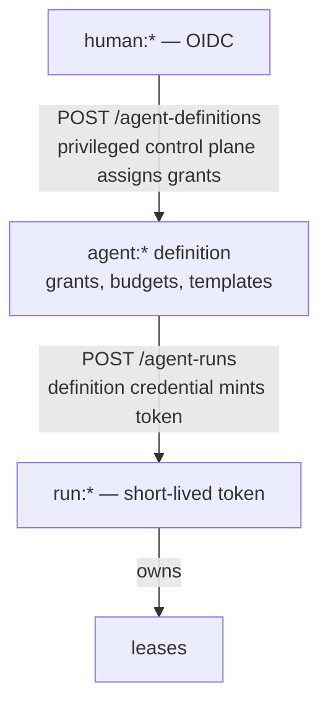
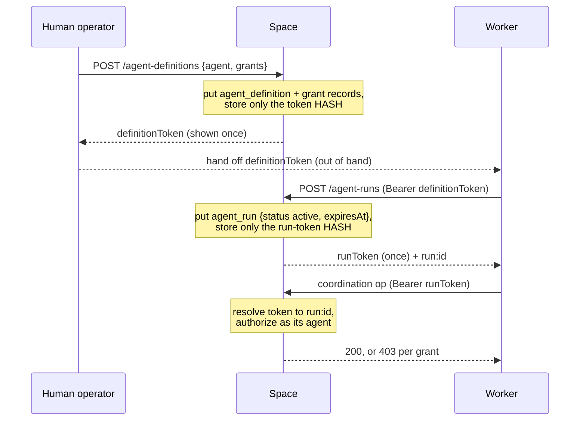
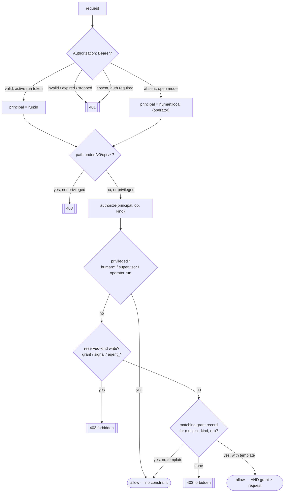
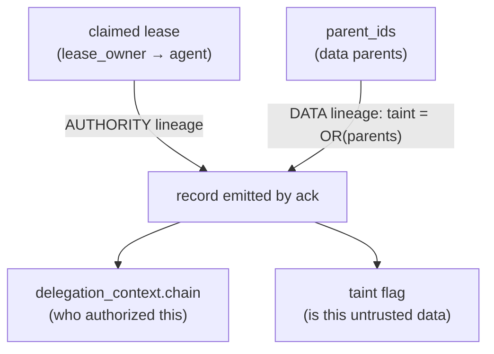
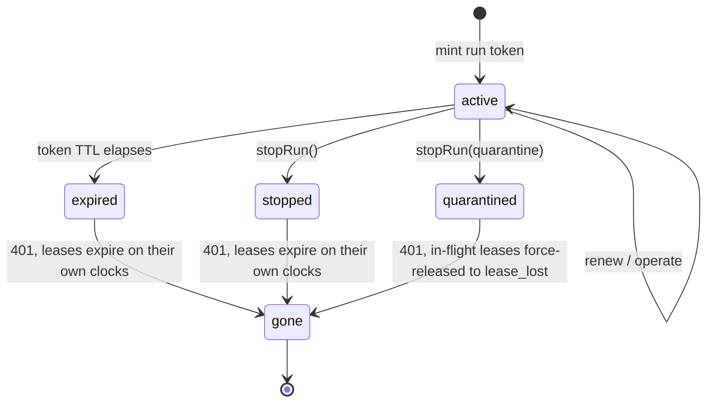

# Identity, authorization, safety (design)

Spec and rationale for principals, grants, delegation, taint, revocation, and budgets.
Origin: outline §8.

**M1 status (grants + bootstrap chain + run tokens built):** kind-scoped **grants are records**
(reserved `grant` kind; body `{principal, kind, operations}`, indexed on principal+kind, never
wildcard — `src/core/kinds.ts`). `Space.authorize(principal, op, kind)` enforces them and
`Space.isPrivileged` marks operators (`human:*` or the one configured supervisor,
`SpaceContext.supervisor`, default `agent:supervisor`). Enforcement is wired at the HTTP
boundary (`src/server/http.ts` + the record/take/watch handlers): coordination `put`/`take`/
`query`/`read_one` call `authorize`, and **`watch`** calls `Space.authorizeWatch` (a watch is
allowed if the principal holds ANY grant on the kind — it is a participant — and the grant
template is AND-ed into the watch match, so it wakes only on records inside its scope; no grant →
`forbidden`). `/v0/ops/*` requires a privileged principal; writing a reserved control kind
(`grant`/`signal`/`agent_*`) requires privilege — grants are **assigned, never self-declared**.
Every coordination verb is now grant-gated; there is no unauthenticated observe path.

The **bootstrap chain is built** (`src/core/auth.ts`, `src/server/handlers/agents.ts`):
`POST /v0/agent-definitions` (operator) creates an `agent_definition` record, optionally
assigns its grants, and returns a **definition token** (once); `POST /v0/agent-runs` presents
that definition token (`Authorization: Bearer`) and mints a short-lived **run token** +
`agent_run` record; `POST /v0/agent-runs/{id}/stop` stops a run. Requests authenticate with
`Authorization: Bearer <run-token>` → a `run:*` principal that **inherits its agent
definition's grants** (`Space.grantSubject` maps `run:` → its `agent:`). Tokens are secrets:
only their sha256 **hash** is stored (in the record body — a hash is not a secret), and the
credential index is a cache over `agent_definition`/`agent_run` records, rebuilt by
`Space.loadCredentials` at startup (the same cache-over-records pattern as kinds). The records are
the **authority**, not the cache: on a cache MISS `Space.resolveToken` hydrates the one credential
from the records by token hash (`agent_*` indexed on `tokenHash`, honoring a later stop successor)
and retries — so a token minted on another instance, or one the startup load capped, still resolves
instead of failing. Expiry uses
the DB clock (`SpaceContext.runTokenSeconds`, default 900s). `Authorization: Bearer <token>`
is the **only** auth channel. In **open mode** (the default) a request with no header is the
operator `human:local`, so local dev/UI/examples stay open; to act as a scoped principal, mint a
real run token (there is no impersonation shortcut). The bundled dev console **holds an operator
token**: the server mints one at startup (`Space.mintOperatorToken` — resolves to `human:local`,
server-lifetime, not a record) and bakes it into the served page, so the console authenticates via
`Authorization: Bearer` like any client rather than relying on the no-header default.
`GET /v0/health` echoes the resolved `principal`. SDK: `new RadiaClient(url, {token})` /
`.withToken()`, `client.createAgentDefinition/createRun/stopRun/grant`. Conformance:
`conformance/suites/auth.ts`.

**Bind + auth hardening (`radia dev`):** the server binds **loopback (`127.0.0.1`) by default** —
the no-header operator shortcut is only safe locally; `--host 0.0.0.0` deliberately exposes it.
`--auth required` (`src/main.ts` → `ServerOptions.authRequired`) drops the no-header shortcut: a
request with no bearer token is rejected `401 auth_required` (`resolveAuth` in `src/server/http.ts`).
`GET /` (the console) and `GET /v0/health` stay public so the console can still bootstrap — it then
authenticates with its baked operator token, and required mode prints that token at startup for
`curl` use. Caveat: `GET /` serves the console with the operator token embedded, so `--auth
required` over an exposed `--host` still hands that token to anyone who fetches `/`; for a genuinely
locked-down exposed deployment, front `/` with a proxy or run without the bundled console. The
loopback default keeps the common (local) case safe without either.

**Per-run lease ownership + revocation (built):** a lease is owned by the claiming principal
(`take` threads it into `lease_owner`; a run token → `run:*`). A **stopped** run's token stops
resolving (`run_stopped` → 401) and an **expired** token stops resolving (`token_expired` →
401) — no new operations. `stopRun` is graceful by default (held leases expire on their own
clocks); `stopRun({quarantine:true})` (HTTP: `POST /v0/agent-runs/{id}/stop` with
`{quarantine:true}`) is **emergency revocation** — `StorageAdapter.quarantineLeasesOf` force-
releases the run's in-flight leases now (epoch-bumped, so a late `ack`/`renew` fences out as
`lease_lost`). Settlement is also **owner-bound**: a non-operator principal that presents a lease
it doesn't own fences out as `lease_lost` on **every** settle verb — `ack`/`nack`/`release`/`renew`
(`Space.ownerGuard`, defense-in-depth on the `leaseId`+`epoch` fencing). This closes lease-leak
impersonation (an ack-emitted result carries the *owner's* authority + delegation chain) and
lease-leak DoS (a stranger driving another agent's task to available/dead-letter). The rejection is
the same opaque `lease_lost` fencing returns (never a distinguishable error — that would leak lease
existence), but is logged server-side so a misconfigured agent — which would otherwise see only
"fenced" and retry forever — is diagnosable.

**Provenance is the resolved caller (built):** `created_by`, the event `run_id`, and the
idempotency scope are the principal the handler resolved (a run token → `run:*`, no header →
`human:local`), threaded into `put`/`ack`/settle — not the space's static identity. So attribution
is real, and idempotency keys are **per principal** (two agents reusing one `Idempotency-Key` no
longer collide). In-process callers (conformance, examples) omit the principal and default to the
space identity.

**Template-scoped grants (built):** a `grant` may carry a `template` (a match object); a
principal's read/take is then `grant ∧ request`, computed server-side — the handler ANDs the
grant template(s) into the request via `combineMatch` (`src/core/matching.ts`). Multiple grants
union (an unrestricted grant widens back to the whole kind); `Space.authorize` returns the
constraint (`null` = unrestricted, else the template list). Applies to `query`/`read_one`/
`take` (`grant ∧ request` via `combineMatch`) and to `put` (write-side: the record body must
satisfy the grant template, checked with `Space.bodyMatchesGrant` in the put handler and on
ack-emitted results).

**Delegation (built):** work emitted via `ack` under a managed run's lease carries a
server-derived `delegation_context` `{chain, origin}` (`Space.deriveDelegation`) — the authority
chain accumulates the acting agents along the delegation path, from the record's authoritative
`lease_owner`, **never** from `parent_ids`. Emitting a result is authorized as a `put` for the
acting agent (`Space.ack` calls `authorize(owner, "put", kind)`), closing the gap where
ack-emitted records bypassed put-authorization. This is pipeline-friendly: each hop needs only
its own grant, and the chain records the path (see [design-data-model.md](design-data-model.md)).

**Deferred to later M1–M3:** real OIDC for `human:*` and the `agent-definitions` credential
(the operator boundary is the auto-provisioned local default, not federated identity); the
stricter **chain-intersection** delegation policy (effective permission = intersection of the
whole chain's grants — rejected as a hard default because it breaks legitimate pipelines; it
belongs with taint composition); per-principal **trust classification** (auto-tainting untrusted
principals' puts — now unblocked, since the resolved caller *is* threaded into `put`/`created_by`;
the current taint model is propagation + client-raise + declassify); and **budget** enforcement.
The examples also run tool-workers as **OS-permission-scoped subprocesses** (`--allow-read`/net, no
env) — a real but out-of-band isolation layer, complementary to grants.

## Contents
- Invariants
- Principals
- Bootstrap
- Grants
- Authorization flow (the request path)
- Delegation
- Taint
- Revocation semantics
- Budgets
- Deferred

## Invariants

Cross-cutting versions are in [CLAUDE.md](../CLAUDE.md); detail here is authoritative.

- Grants are kind-scoped, never wildcard, and assigned by a privileged control plane,
  never self-declared.
- `signal` and grant management are writable only by `human:*` and one supervisor agent.
- `delegation_context` is server-derived from the claimed lease; data parents contribute
  no authority.
- Taint clears only via privileged **declassify**. Ordinary agents cannot write
  `taint: false`.

## Principals

- `human:*` (OIDC)
- `agent:*` (a definition: grants, budgets, templates)
- `run:*` (an instance)

Leases belong to runs. Grants flow down the bootstrap chain; they are never
self-declared:

## Bootstrap — grants assigned, never self-declared

- `POST /v0/agent-definitions` — a privileged (operator) control plane creates a definition
  and assigns its grants; returns a **definition token** (once). **Built.**
- `POST /v0/agent-runs` — a definition token mints a short-lived **run token** + `agent_run`
  record. **Built.**
- `POST /v0/agent-runs/{id}/stop` — stops a run (operator or the run's own token); the token
  stops resolving. **Built.**

Definitions and runs **are records** (`agent_definition` / `agent_run`), expressed through the
substrate like grants and kinds — only the token *hash* is stored, never the plaintext. Source:
`src/core/auth.ts` (`CredentialStore`, `mintCredential`), `src/server/handlers/agents.ts`.

Manifest capability claims are descriptive, not authorization. On k8s, prefer workload
identity (SPIFFE / projected SA tokens). The MCP adapter keeps credentials out of the
model context.

## Grants

Kind-scoped verbs, never wildcard. Template-scoped grants: the effective query is
`grant ∧ requested template`, **computed server-side** (see
[design-matching.md](design-matching.md)).

A grant **is a record** of the reserved `grant` kind (`{principal, kind, operations}`) —
assigned by a human/supervisor `put`-ing one, discovered by the authorizer via a `query`, not a
config table or a bespoke endpoint. Another instance of expressing a feature through the
substrate (see [CLAUDE.md](../CLAUDE.md) "Design principle"): the same immutability, event-log
visibility, and watchability every record has apply to authorization state. Wildcard kinds are
rejected at `put` (`wildcard_grant`); kind + op scoping is enforced in `Space.authorize`.
**Template scoping is built (read and write):** a grant's optional `template` is AND-ed into the
principal's read/take (`grant ∧ request`, `combineMatch`) and, on `put`, the record body must
satisfy the template (`Space.bodyMatchesGrant`, in the put handler and on ack-emitted results) —
so a scoped principal both *sees* and *writes* only records inside its template. Multiple grants
union, an unrestricted grant widens to the whole kind. See [design-matching.md](design-matching.md).

## Authorization flow (the request path)

Every request resolves a principal, passes the ops-plane gate, then runs `authorize`. A `run:*`
principal authorizes as its **agent** (`grantSubject` — grants inherit down the chain), so the
grant lookup is keyed by `(subject, kind, op)`.

## Delegation

`delegation_context` (see [design-data-model.md](design-data-model.md)) is server-derived
from the claimed lease. **Built (M1):** on `ack`, `Space.deriveDelegation` reads the leased
record's authoritative `lease_owner`, maps it to its agent, and extends the leased record's own
chain — `{chain, origin}` accumulates the authority path (never data parents). Emitting the
result is authorized as the acting agent's `put` for that kind.

A record has **two independent lineages that never cross**: authority flows down the *lease*
(delegation), untrust flows down the *data parents* (taint). Deriving data from a privileged
record grants nothing.

The two never cross: a tainted (untrusted) data parent still grants no authority, and a
privileged authority chain does not launder taint.

The design end state is that *effective permission on delegated
work = intersection of the authorization chain's grants* — but a hard chain-intersection gate is
**deferred**: it would block legitimate pipelines (a → b, where b legitimately produces a kind a
cannot), so M1 enforces the acting agent's own `put` grant and keeps the chain as the authority
record. Intersection composes with taint (M3): sensitive consumers may constrain both lineages.

## Download capabilities — a delegated read, not a credential

Artifact bytes need one authorization shape the rest of the API does not: a browser cannot attach
an `Authorization` header to ``. `POST /v0/artifacts/{id}/capability` mints a token that
is deliberately the weakest thing that solves it — **scoped to one artifact**, valid for minutes,
held in memory (so it dies with the process), and issued only to a caller who could already read
that artifact. It grants no operation, names no principal, and opens nothing else: with a
capability attached, `/v0/records` and `/v0/ops/*` still `401` under `--auth required`.

Read it as *delegation of a read the holder already had*, in the same family as
`delegation_context` — authority that narrows as it travels, never widens. The record id in the
URL stays stable forever; only the capability expires, which is why a client that needs a durable
link should print the plain artifact URL and let the viewer authenticate normally.

## Taint — server-computed

**Built (M1):** taint is untrusted **data** lineage, server-computed at commit
(`Space.computeTaint`, used by put and ack): a record is tainted if a client **raised** it
(`taint:true` — the source attestation) or **any `parent_ids` data parent is tainted**. It
propagates through `ack` (the leased record is a data parent, so a tainted task → tainted
result). A client may only *raise* taint; `taint:false` from a client is ignored — clearing
requires a privileged **declassify** (`POST /v0/ops/records/{id}/declassify`, operator-gated),
which emits a **clean successor** (same body, `taint:false`, tainted original as its data
parent). A sensitive consumer avoids tainted work with `take {requireUntainted}` (a claim-time
taint barrier, `core/take.ts`). See [design-data-model.md](design-data-model.md) "Provenance vs.
authority". Deferred: per-principal trust classification (auto-tainting untrusted principals'
puts) and the taint-composed chain-intersection policy (M3).

## Revocation semantics

Defined explicitly, not implied. A run's token stops resolving in every terminal state (→ 401);
they differ in what happens to the run's **in-flight leases**:

- **Run stopped:** no new operations or renewals; held leases expire on their own clocks
  (quickly, since renewal has stopped). **Built** (`stopRun`, token stops resolving).
- **Grant revoked:** no new claims; an in-flight `ack` is allowed under the **policy
  version captured at lease issuance** (default), unless quarantined.
- **Emergency quarantine:** deny all writes from the principal and invalidate its leases
  immediately; late `ack`s fence out as `lease_lost`. **Built** for leases
  (`stopRun({quarantine:true})` → `quarantineLeasesOf`, epoch bump); the blanket write-deny for
  a still-live principal is subsumed by stopping its run (token stops resolving).
- **Token expiry mid-task:** the run refreshes via its definition credential; refresh
  failure degrades to "run stopped".

## Budgets

Observability via records; enforcement via transactional reservation + settlement (see
[design-scheduler.md](design-scheduler.md)). Two readers of the same budget record must
not both spend it.

## Deferred

Boundary signing and agent-held keys (federation-time; rationale in
[design-observability.md](design-observability.md) and [gotchas.md](gotchas.md)) ·
recipient-keyed encryption as a runtime feature · field-level ACLs · multi-tenancy (one
space per team for now).
