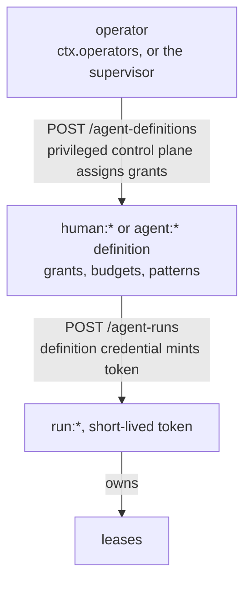
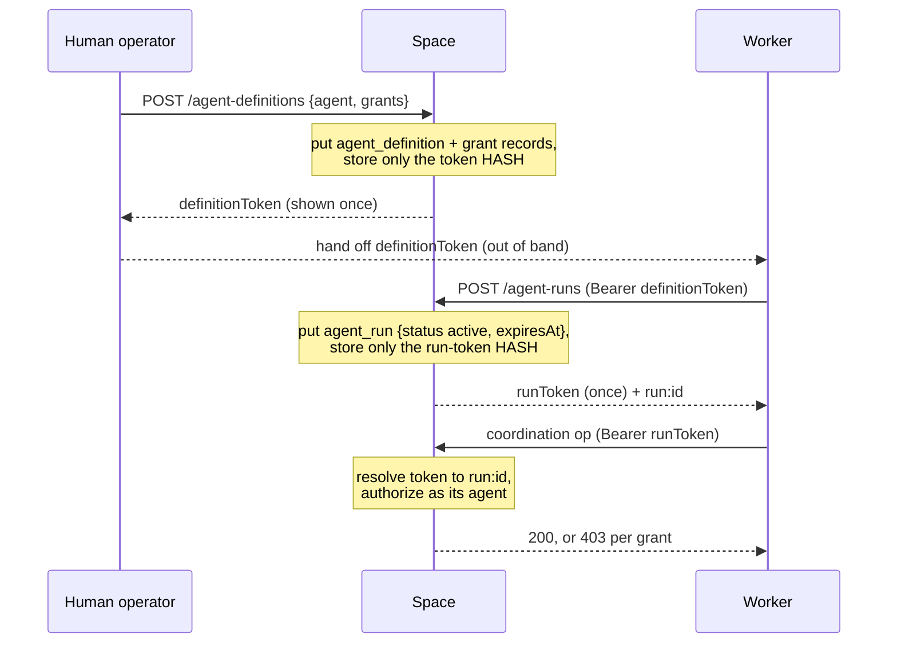
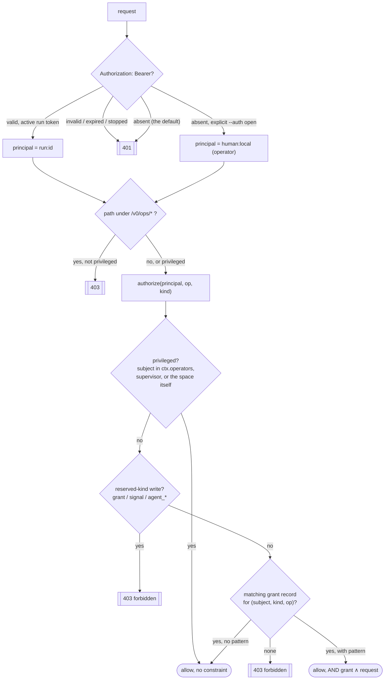
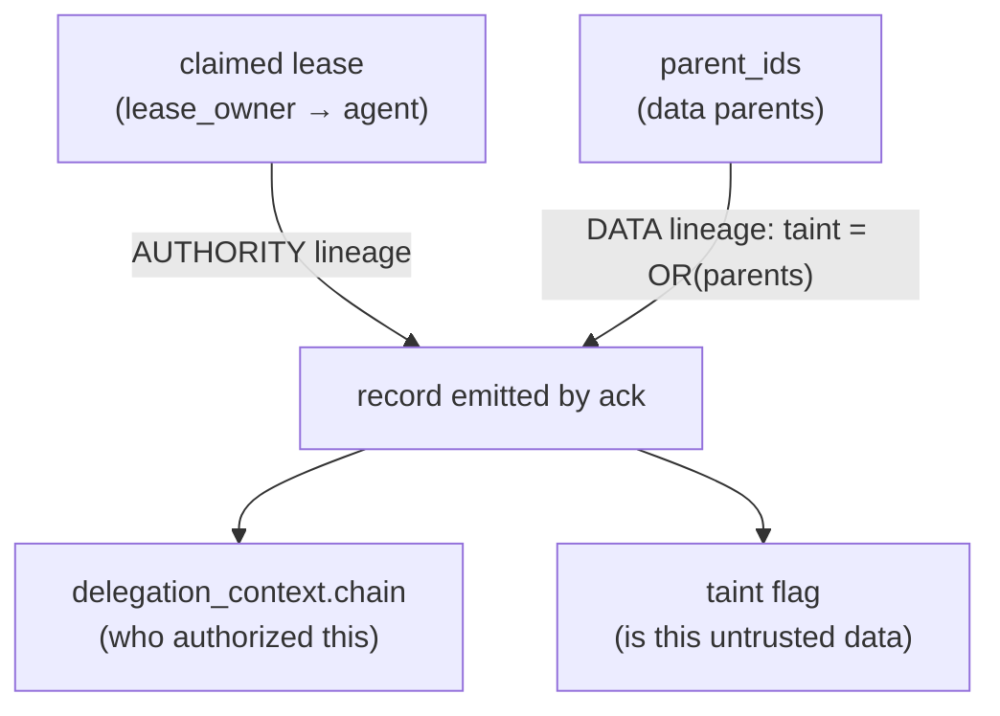
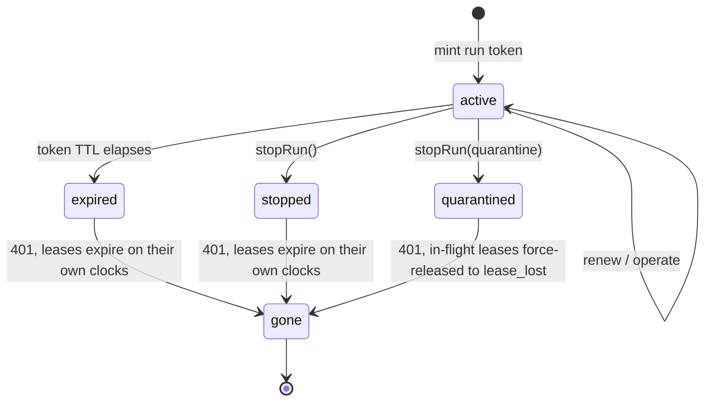

# Identity, authorization, safety (design)

Spec and rationale for principals, grants, delegation, taint, revocation, and budgets.
Origin: outline §8.

**M1 status (grants + bootstrap chain + run tokens built):** kind-scoped **grants are records**
(reserved `grant` kind; body `{principal, kind, operations}`, indexed on principal+kind, never
wildcard; `src/core/kinds.ts`). `Space.authorize(principal, op, kind)` enforces them and
`Space.isPrivileged` marks operators: a principal NAMED in `SpaceContext.operators` (default
`["human:local"]`, the no-header dev identity), the one configured supervisor
(`SpaceContext.supervisor`, default `agent:supervisor`), or the space's own identity. It is a named
set, not a name shape: `human:` is a namespace, not a privilege. That was the earlier rule, and it
meant a space could not have ordinary people on it at all, so the only human credential available
was god-mode. Enforcement is wired at the HTTP
boundary (`src/server/http.ts` + the record/take/watch handlers): coordination `put`/`take`/
`query`/`read_one` call `authorize`, and **`watch`** calls `Space.authorizeWatch` (a watch is
allowed if the principal holds ANY grant on the kind, which makes it a participant, and the grant
pattern is AND-ed into the watch match, so it wakes only on records inside its scope; no grant →
`forbidden`). `/v0/ops/*` requires a privileged principal; writing a reserved control kind
(`grant`/`signal`/`agent_*`) requires privilege, meaning an operator or the supervisor: a logged-in
`human:alice` is refused like any other principal. Grants are **assigned, never self-declared**.
Every coordination verb is grant-gated; there is no unauthenticated observe path.

The **bootstrap chain is built** (`src/core/auth.ts`, `src/server/handlers/agents.ts`):
`POST /v0/agent-definitions` (operator) creates an `agent_definition` record, optionally
assigns its grants, and returns a **definition token** (once); `POST /v0/agent-runs` presents
that definition token (`Authorization: Bearer`) and mints a short-lived **run token** +
`agent_run` record; `POST /v0/agent-runs/{id}/stop` stops a run. Requests authenticate with
`Authorization: Bearer <run-token>` → a `run:*` principal that **inherits its agent
definition's grants** (`Space.grantSubject` maps `run:` → its `agent:`). Tokens are secrets:
only their sha256 **hash** is stored (in the record body, since a hash is not a secret). Credentials are
**not cached**: `Space.resolveToken` asks the space on every authenticated request, reading the
newest `agent_definition`/`agent_run` record for that token hash (`agent_*` indexed on `tokenHash`;
a stop is a successor carrying the same hash, so one lookup sees it). The rule the design turns on
is *cache what cannot change, never cache what can be revoked*. A stopped run, an expired token
and a withdrawn grant must all be **discovered**, not remembered. What `CredentialStore` holds is
one immutable fact (which agent a run instantiates) plus operator tokens, which are
process-lifetime by design and never records. Never rebuild a credential index at startup: a
bounded read of an unbounded log lets a stopped run's token keep working after a restart on a busy
space, which fails open and silently. A token minted on one instance authenticates on another immediately,
with no replay. Expiry uses
the DB clock (`SpaceContext.runTokenSeconds`, default 900s). `Authorization: Bearer <token>`
is the **only** auth channel, and exactly two token kinds authorize it (`ResolvedToken.kind`): a
**run** token, and the **operator** token. A **definition** token authorizes one thing only,
minting a run, and is rejected everywhere else, because it is long-lived and accepting it would
hand out unexpiring coordination authority. **`--auth required` is the default.** A request with no header is `401 auth_required`. Under
`--auth open`, which is now an explicit choice, that request is instead the operator `human:local`.
Open mode is a genuine hole (it authorizes every verb for typing nothing), so nothing radia ships
relies on it: the CLI, the MCP adapter, the console and the examples all present a token. To act as
a scoped principal, mint a real run token; there is no impersonation shortcut. `radia login human:alice` does exactly
that for a PERSON, through the same chain (`src/cli.ts`), and the console's Auth tab does it in the
browser. That is what makes identity-scoped grants usable: a grant pinned to `{owner: <principal>}`
separates two people only if they are two principals, so an app that shares one constant between
everyone (as `examples/chat` did with `agent:chat-user`) has a scope that binds to the same value
for all of them. `Space.mintOperatorToken` mints the
operator credential at startup. It resolves to the space's own principal, is server-lifetime, and
is not a record; `radia dev` writes it where the CLI and the MCP adapter read it. Never resolve it
as a definition token: that would let a leaked operator credential mint a run and become durable.
`GET /v0/health` echoes the resolved `principal`. SDK: `new RadiaClient(url, {token})` /
`.withToken()`, `client.createAgentDefinition/createRun/stopRun/grant`. Conformance:
`conformance/suites/auth.ts`.

**Bind + auth hardening (`radia dev`):** the server binds **loopback (`127.0.0.1`) by default**, and
`--host 0.0.0.0` deliberately exposes it. `--auth` defaults to **required** (`src/main.ts` →
`ServerOptions.authRequired`): a request with no bearer token is rejected `401 auth_required`
(`resolveAuth` in `src/server/http.ts`). `--auth open` opts back into the no-header operator
shortcut, which is only ever safe locally.
`GET /` (the console) and `GET /v0/health` stay public so the console can still bootstrap. **Never
inject a credential into the served page**: it is public, so anything baked in is readable by
anyone who can reach the port, and a harvested operator token authorizes every verb. The console
requires a token in EVERY mode, not only `--auth required`: it shows a sign-in screen until one is
present and `api()` refuses to send an unauthenticated request, so the no-header shortcut stays
reachable from `curl` and unreachable from the browser. `radia dev` prints one at startup for that.
The token it holds is any session token, an operator's or a person's, and the console resolves WHO
it is through `GET /v0/ops/permissions` rather than assuming a token means operator.

A run token expires on its own clock, so the console treats a `401` as the ordinary end of a session
and returns to sign-in. Worth knowing why that needed handling: `/v0/health` is public, but a
PRESENTED token must still resolve, so an expired one `401`s on the very endpoint a client uses to
prove the space is up. Read naively that says "offline", which names the wrong thing and offers no
way to re-authenticate. That assumption was the bug: a console signed in as a scoped principal still labelled
itself "operator token", which is the promise-vs-enforcement gap every grant defect here has had.

**Per-run lease ownership + revocation (built):** a lease is owned by the claiming principal
(`take` threads it into `lease_owner`; a run token → `run:*`). A **stopped** run's token stops
resolving (`run_stopped` → 401) and an **expired** token stops resolving (`token_expired` →
401): no new operations. `stopRun` is graceful by default (held leases expire on their own
clocks); `stopRun({quarantine:true})` (HTTP: `POST /v0/agent-runs/{id}/stop` with
`{quarantine:true}`) is **emergency revocation**. `StorageAdapter.quarantineLeasesOf` force-
releases the run's in-flight leases now (epoch-bumped, so a late `ack`/`renew` fences out as
`lease_lost`). Settlement is also **owner-bound**: a non-operator principal that presents a lease
it doesn't own fences out as `lease_lost` on **every** settle verb: `ack`/`nack`/`release`/`renew`
(`Space.ownerGuard`, defense-in-depth on the `leaseId`+`epoch` fencing). This closes lease-leak
impersonation (an ack-emitted result carries the *owner's* authority + delegation chain) and
lease-leak DoS (a stranger driving another agent's task to available/dead-letter). The rejection is
the same opaque `lease_lost` fencing returns (never a distinguishable error, which would leak lease
existence), but is logged server-side so a misconfigured agent, which would otherwise see only
"fenced" and retry forever, is diagnosable.

**Provenance is the resolved caller (built):** `created_by`, the event `run_id`, and the
idempotency scope are the principal the handler resolved (a run token → `run:*`, no header →
`human:local`), threaded into `put`/`ack`/settle, not the space's static identity. So attribution
is real, and idempotency keys are **per principal** (two agents reusing one `Idempotency-Key` do
not collide). In-process callers (conformance, examples) omit the principal and default to the
space identity.

**Pattern-scoped grants (built):** a `grant` may carry a `pattern` (a match object); a
principal's read/take is then `grant ∧ request`, computed server-side: the handler ANDs the
grant pattern(s) into the request via `combineMatch` (`src/core/matching.ts`). Multiple grants
union (an unrestricted grant widens back to the whole kind); `Space.authorize` returns the
constraint (`null` = unrestricted, else the pattern list). Applies to `query`/`read_one`/
`take` (`grant ∧ request` via `combineMatch`) and to `put` (write-side: the record body must
satisfy the grant pattern, checked with `Space.bodyMatchesGrant` in the put handler and on
ack-emitted results).

**Delegation (built):** work emitted via `ack` under a managed run's lease carries a
server-derived `delegation_context` `{chain, origin}` (`Space.deriveDelegation`). The authority
chain accumulates the acting agents along the delegation path, from the record's authoritative
`lease_owner`, **never** from `parent_ids`. Emitting a result is authorized as a `put` for the
acting agent (`Space.ack` calls `authorize(owner, "put", kind)`), so an ack-emitted record never
bypasses put-authorization. This is pipeline-friendly: each hop needs only its own grant, and the
chain records the path (see [design-data-model.md](design-data-model.md)).

**Deferred to later M1–M3:** real OIDC for `human:*` and the `agent-definitions` credential
(the operator boundary is the auto-provisioned local default, not federated identity); the
stricter **chain-intersection** delegation policy (effective permission = intersection of the
whole chain's grants, rejected as a hard default because it breaks legitimate pipelines; it
belongs with taint composition); per-principal **trust classification** (auto-tainting untrusted
principals' puts, which nothing blocks, since the resolved caller *is* threaded into
`put`/`created_by`; the taint model is propagation + client-raise + declassify); and **budget**
enforcement.
The examples also run tool-workers as **OS-permission-scoped subprocesses** (`--allow-read`/net, no
env), a real but out-of-band isolation layer, complementary to grants.

## Contents
- Invariants
- Principals
- Bootstrap
- Grants
- Authorization flow (the request path)
- Delegation
- Taint
- Revocation semantics
- Self-scoped ops grants (specified, unbuilt)
- Budgets
- Deferred

## Invariants

Cross-cutting versions are in [CLAUDE.md](../CLAUDE.md); detail here is authoritative.

- Grants are kind-scoped, never wildcard, and assigned by a privileged control plane,
  never self-declared.
- `signal` and grant management are writable only by an OPERATOR (a principal named in
  `SpaceContext.operators`) or the supervisor agent. Not by every `human:*`: a logged-in person is
  an ordinary principal.
- `delegation_context` is server-derived from the claimed lease; data parents contribute
  no authority.
- Taint clears only via privileged **declassify**. Ordinary agents cannot write
  `taint: false`, and a declassify records the principal that performed it.
- A grant may bar tainted work with `scope: {taint: "none"}`. `requireUntainted` on a take is the
  worker's own flag, so on its own it is a convention; the grant-side barrier is what an operator
  imposes. It applies only when every applicable grant carries it, because grants union.

## Principals

- `human:*` (a person; OIDC deferred, `radia login` today)
- `agent:*` (a definition: grants, budgets, patterns)
- `run:*` (an instance)

The namespace says what KIND of principal it is, never what it may do. Privilege is the named set in
`SpaceContext.operators` plus the supervisor, so `human:alice` is an ordinary principal that holds
exactly the grants assigned to it, and `agent:supervisor` is privileged while looking like any other
agent. Reading privilege off the prefix is the mistake this design used to make.

A person and an agent take the SAME path to a credential: a definition (which may be a `human:` or
an `agent:` principal) mints short-lived run tokens. So there is one bootstrap chain to reason
about, not a human one beside a machine one, and a person's session expires like a worker's.

Leases belong to runs. Grants flow down the bootstrap chain; they are never
self-declared:



## Bootstrap: grants assigned, never self-declared

- `POST /v0/agent-definitions`: a privileged (operator) control plane creates a definition
  and assigns its grants; returns a **definition token** (once). The principal may be `agent:` or
  `human:`. **Built.**
- `POST /v0/agent-runs`: a definition token mints a short-lived **run token** + `agent_run`
  record. **Built.**
- `POST /v0/agent-runs/{id}/stop`: stops a run (operator or the run's own token); the token
  stops resolving. **Built.**



Definitions and runs **are records** (`agent_definition` / `agent_run`), expressed through the
substrate like grants and kinds. Only the token *hash* is stored, never the plaintext. Source:
`src/core/auth.ts` (`CredentialStore`, `mintCredential`), `src/server/handlers/agents.ts`.

Manifest capability claims are descriptive, not authorization. On k8s, prefer workload
identity (SPIFFE / projected SA tokens). The MCP adapter keeps credentials out of the
model context.

## Grants

Kind-scoped verbs, never wildcard. Pattern-scoped grants: the effective query is
`grant ∧ requested pattern`, **computed server-side** (see
[design-matching.md](design-matching.md)).

A grant **is a record** of the reserved `grant` kind (`{principal, kind, operations}`),
assigned by a human/supervisor `put`-ing one, discovered by the authorizer via a `query`, not a
config table or a bespoke endpoint. Another instance of expressing a feature through the
substrate (see [CLAUDE.md](../CLAUDE.md) "Design principle"): the same immutability, event-log
visibility, and watchability every record has apply to authorization state. Wildcard kinds are
rejected at `put` (`wildcard_grant`); kind + op scoping is enforced in `Space.authorize`.
**Pattern scoping is built (read and write):** a grant's optional `pattern` is AND-ed into the
principal's read/take (`grant ∧ request`, `combineMatch`) and, on `put`, the record body must
satisfy the pattern (`Space.bodyMatchesGrant`, in the put handler and on ack-emitted results),
so a scoped principal both *sees* and *writes* only records inside its pattern. Multiple grants
union, an unrestricted grant widens to the whole kind. See [design-matching.md](design-matching.md).

The two directions answer different questions and use different machinery:

| Direction  | Mechanism          | Question                                    | Where                                                     |
|------------|--------------------|---------------------------------------------|-----------------------------------------------------------|
| Write      | `bodyMatchesGrant` | May this principal *produce* this content?  | `handlers/records.ts` (put), `handlers/artifacts.ts`, and `Space.ack` for emitted results, before anything is consumed |
| Read/claim | `combineMatch`     | Which records may this principal *observe*? | `handlers/records.ts` (query, read_one), `handlers/leases.ts` (take, including a synthesized pattern for a take by record id), `handlers/watches.ts` |

An uncompilable grant pattern grants nothing (fail-closed). On the read side the AND is applied
server-side *after* the client's own pattern, so a wrong or malicious client pattern can only
narrow what it sees.

A grant may also carry `scope`, the envelope-side selector for the fields a `pattern` is forbidden
to see (`{createdBy: "self"}`, `{taint: "none"}`). It is a closed enum vocabulary that only
authorization reads. Never extend `pattern` to reach envelope state instead; see
[design-matching.md](design-matching.md) "What patterns cannot express".

**Enforcement is at the HTTP boundary, and only there.** The handlers resolve the constraint and
apply it; `Space.take`/`Space.query` do no grant work of their own, and the ack-side body check
inside `Space.ack` runs only against a constraint the handler passed in. An in-process consumer of
`Space` (embedded mode, an example launcher, the conformance suite) bypasses grants entirely. Read
every "the runtime enforces X" here as "the HTTP boundary enforces X".

## Authorization flow (the request path)

Every request resolves a principal, passes the ops-plane gate, then runs `authorize`. A `run:*`
principal authorizes as its **subject** (`grantSubject`; grants inherit down the chain), which is
the `agent:` or `human:` the run instantiates, so the grant lookup is keyed by
`(subject, kind, op)`. That mapping is also the only trustworthy way to learn who a session is:
`GET /v0/health` reports the credential (`run:…`), and `GET /v0/ops/permissions` reports the
subject behind it. A client that wants to display or scope by identity asks for the second.



## Delegation

`delegation_context` (see [design-data-model.md](design-data-model.md)) is server-derived
from the claimed lease. **Built (M1):** on `ack`, `Space.deriveDelegation` reads the leased
record's authoritative `lease_owner`, maps it to its agent, and extends the leased record's own
chain. `{chain, origin}` accumulates the authority path (never data parents). Emitting the
result is authorized as the acting agent's `put` for that kind.

A record has **two independent lineages that never cross**: authority flows down the *lease*
(delegation), untrust flows down the *data parents* (taint). Deriving data from a privileged
record grants nothing.



The two never cross: a tainted (untrusted) data parent still grants no authority, and a
privileged authority chain does not launder taint.

The design end state is that *effective permission on delegated
work = intersection of the authorization chain's grants*, but a hard chain-intersection gate is
**deferred**: it would block legitimate pipelines (a → b, where b legitimately produces a kind a
cannot), so M1 enforces the acting agent's own `put` grant and keeps the chain as the authority
record. Intersection composes with taint (M3): sensitive consumers may constrain both lineages.

## Download capabilities: a delegated read, not a credential

Artifact bytes need one authorization shape the rest of the API does not: a browser cannot attach
an `Authorization` header to ``. `POST /v0/artifacts/{id}/capability` mints a token that
is deliberately the weakest thing that solves it: **scoped to one artifact**, valid for minutes,
held in memory (so it dies with the process), and issued only to a caller who could already read
that artifact. It grants no operation, names no principal, and opens nothing else: with a
capability attached, `/v0/records` and `/v0/ops/*` still `401` under `--auth required`.

Read it as *delegation of a read the holder already had*, in the same family as
`delegation_context`: authority that narrows as it travels, never widens. The record id in the
URL stays stable forever; only the capability expires, which is why a client that needs a durable
link should print the plain artifact URL and let the viewer authenticate normally.

## Taint: server-computed

**Built (M1):** taint is untrusted **data** lineage, server-computed at commit
(`Space.computeTaint`, used by put and ack): a record is tainted if a client **raised** it
(`taint:true`, the source attestation) or **any `parent_ids` data parent is tainted**. It
propagates through `ack` (the leased record is a data parent, so a tainted task → tainted
result). A client may only *raise* taint; `taint:false` from a client is ignored. Clearing
requires a privileged **declassify** (`POST /v0/ops/records/{id}/declassify`, operator-gated),
which emits a **clean successor** (same body, `taint:false`, tainted original as its data
parent). A sensitive consumer avoids tainted work with `take {requireUntainted}` (a claim-time
taint barrier, `core/take.ts`). See [design-data-model.md](design-data-model.md) "Provenance vs.
authority". Deferred: per-principal trust classification (auto-tainting untrusted principals'
puts) and the taint-composed chain-intersection policy (M3).

The grant-side barrier (invariant above) is `Space.taintBarrier`: it reports whether every
applicable grant carries `scope: {taint: "none"}`, and `handleTake` ORs the answer into the
caller's own `requireUntainted`, so the principal cannot decline it.

**Known limits of the model, both real today:**

- Taint is **one bit with no provenance**. A client-raised taint and an inherited one are
  indistinguishable, and nothing records which parent raised it. Re-deriving "untrusted because of
  which parent" means walking lineage and reading each ancestor's bit, which is ambiguous once more
  than one ancestor is tainted.
- Taint is envelope state, so **no pattern can filter on it** in a query, a watch, or a grant
  pattern ([design-matching.md](design-matching.md)). Classification is enforced at claim time but
  is invisible to the language used for routing.

## Revocation semantics

Defined explicitly, not implied. A run's token stops resolving in every terminal state (→ 401);
they differ in what happens to the run's **in-flight leases**:



- **Run stopped:** no new operations or renewals; held leases expire on their own clocks
  (quickly, since renewal has stopped). **Built** (`stopRun`, token stops resolving).
- **Grant revoked:** no new claims; an in-flight `ack` is allowed under the **policy
  version captured at lease issuance** (default), unless quarantined.
- **Emergency quarantine:** deny all writes from the principal and invalidate its leases
  immediately; late `ack`s fence out as `lease_lost`. **Built** for leases
  (`stopRun({quarantine:true})` → `quarantineLeasesOf`, epoch bump); the blanket write-deny for
  a still-live principal is subsumed by stopping its run (token stops resolving).
- **Token expiry mid-task:** the run refreshes via its definition credential; refresh
  failure degrades to "run stopped".

## Self-scoped ops grants: SPECIFIED, UNBUILT

The asymmetry this closes: **every reflexive capability is currently reserved to the outside.**
Reading your own process state needs operator privilege, so a participant can be observed and
interrupted but cannot observe or interrupt itself
([research-self-modeling.md](research-self-modeling.md)). A scoped session asked "what did I create
in this space" and got three 403s.

It is deliberately **not** pattern-scoped grants extended. A grant `pattern` narrows a **body**
match, and the fields a self-scope needs (`created_by`, envelope state, attempt counts) are
precisely what the routing language is forbidden to see. That prohibition is what keeps patterns
analyzable data, so this adds a **second, closed vocabulary beside it** rather than a placeholder
inside it.

### What "self" resolves to

Server-derived from the caller's token, never a body field, never client-supplied.

| Anchor  | Resolves to | Use |
|---------|-------------|-----|
| `agent` | `grantSubject(principal)`, the agent behind the run | durable identity: "records I authored", across token re-mints |
| `run`   | the presented run principal | this process: "leases I hold right now" |

**`agent` is the default, and the reason is a real trap.** `created_by` stores `ctx.principal`,
which for a token-bearing session is `run:<ulid>`, and run tokens are short-lived and re-minted.
String-comparing `created_by` to the caller would answer "what did I create" with *only what this
token created*, silently omitting the same agent's earlier work. So the comparison is
`agentForRun(created_by) == agentForRun(caller)`, not `created_by == caller`.

### The vocabulary

A closed set, extended only when a real failure names the field it needs. That is the discipline
[research-self-modeling.md](research-self-modeling.md) asks for, since designing the selector first
is guessing. Two entries, each justified by an observed failure:

| Selector | Meaning | Evidence it is needed |
|---|---|---|
| `createdBy: "self"` | records whose author resolves to my agent | "what did I create in this space" → 403 |
| `leaseOwner: "self"` | records my RUN currently holds | a worker reporting its own stuck work (build order step 3/5) |

Deferred until something needs them: `delegatedBy` (work emitted under my lease, which needs the
`delegation_context` shape settled), and any envelope *value* predicate (`state`, `attempt`), which
the existing ops selectors already express and which a self-scope only has to intersect with.

### Where it lives on the record

A sibling field, not a magic value inside `pattern`:

```json
{"principal": "agent:chat-user", "kind": "artifact", "operations": ["query"],
 "scope": {"createdBy": "self"}}
```

`pattern` stays body-only and keeps compiling through the same oracle; `scope` is enum-valued data
that only authorization reads. Nothing new enters the matching language, so `compilePattern`,
`matchesRecord` and the pushdown contract are untouched.

### Where it is enforced

**The ops plane first, and only there.** That is what the name means, it is where the failure was,
and it keeps the change off the hot claim path. `/v0/ops/*` is gated today by a single
`isPrivileged` check (`src/server/http.ts`); it becomes "privileged **or** the principal holds a
`scope`d grant for what this request touches", with the scope ANDed into the handler's selector.

Per-endpoint disposition, because they do not all behave the same:

| Endpoint | Self-scopable | Why |
|---|---|---|
| `ops/records` (envelope query), `ops/records/{id}`, `/envelope`, `/lineage`, `/children`, `/graph` | yes | per-record; the scope filters or refuses |
| `ops/events` | yes, filtered by `runId` (events the caller CAUSED) | under-returns on purpose: an event another agent caused on your record is not shown, because resolving each event's record to check its author is a lookup per event on the busiest read in the plane. Note that filtering breaks cursor paging, since an empty page is how callers detect the end of the log, so the handler scans forward across raw pages and reports `nextAfter` from the last RAW event examined |
| `ops/stats`, `ops/diagnostics` | yes, as a GENUINE self-aggregate | not a filtered whole-space total; the aggregate is *computed over the scope*. A filtered-after total would leak other agents' activity as counts, and a whole-space total answered to a scoped caller is simply wrong |
| `ops/remediate`, `ops/admin`, `ops/declassify` | **no** | these are the interrupt half (build order step 5) and a write. Declassify especially: taint clears only via privileged declassify, so a self-scope must never reach it |

**The coordination plane is narrowed for READS** (`query`/`read_one`), because that is the plane an
agent actually reads records through. Scoping only the ops plane leaves an approval promising "its
own records" returning every record of the kind. `take` stays excluded: post-filtering a claim
would mean claiming a record and then rejecting it, which is not a filter.

Because grants **union**, the author restriction applies only when EVERY applicable grant on the
kind is self-scoped. One unscoped grant already permits other authors' records, so filtering would
deny something granted. Practically, a narrow grant added beside a broad one accomplishes
nothing, which is why an approval that offers "own records only" has to withdraw the wider grant.

### Which grant authorizes ops access

Ops access is **still kind-scoped**. There is no `ops` pseudo-kind, because that is a wildcard
wearing a different hat. A non-operator reaches the ops plane for exactly the kinds where it holds
a `query` grant carrying a self `scope`, and sees only its own records of those kinds:

```json
{"principal": "agent:chat-user", "kind": "artifact", "operations": ["query"],
 "scope": {"createdBy": "self"}}
```

So `ops/stats` for that principal returns counts for `artifact` and nothing else, over its own
records only. Grant a second kind, and a second row appears. The aggregate's *shape* therefore
carries no information the caller was not already entitled to.

### How the aggregate is computed

"Records whose author resolves to my agent" cannot be evaluated in SQL: the run → agent mapping
lives in `agent_run` records, not in a column. So the runtime resolves the agent's run principals
FIRST (`Space.runPrincipalsOf`, a query over `agent_run` by `agent`) and pushes `created_by IN (…)`
down, which is exact and indexable. The alternative, denormalizing an `agent` column onto every
record, was rejected for now: it duplicates authority-adjacent data onto immutable records and
needs a migration, for a lookup the run records already answer.

That choice makes one constraint explicit, and it is cheap now and awkward later: **`agent_run`
records must be treated as durable by retention GC.** They are the only thing that maps an old
`created_by` back to its agent, so sweeping them would make a record invisible to its own author.

### Non-goals

- Not a way to see another agent's records, in aggregate or otherwise.
- Not authority inheritance. Reading what you authored grants nothing further: **provenance is not
  authority**, and `created_by` is provenance.
- Not the interrupt half. Quarantining yourself needs step 5 or a non-privileged alarm kind.

### Known risks

- **Resolution depends on `agent_run` records.** Decided above: `agent_run` records are durable,
  and retention GC must not sweep them. The fallback if that ever changes is a stored agent stamp
  on the record.
- **A scoped aggregate is cheaper to get wrong than a scoped list.** A filter applied after
  aggregation is invisible in the output; the number just looks plausible. The conformance case
  for this asserts a scoped principal's counts against a space containing another agent's records,
  which is the only way the difference shows.
- **Not every 403 is self-scope material.** In the observed transcript, `space_stats` and
  `space_children` were ops denials, but `space_kinds` was an ordinary coordination-plane denial
  (`kind_def: query`): kind declarations are nobody's "own". Those need a normal grant, which is
  what `grant_request` is for. Conflating the two would over-scope the fix.

## Budgets

Observability via records; enforcement via transactional reservation + settlement (see
[design-scheduler.md](design-scheduler.md)). Two readers of the same budget record must
not both spend it.

## Deferred

Boundary signing and agent-held keys (federation-time; rationale in
[design-observability.md](design-observability.md) and [gotchas.md](gotchas.md)) ·
recipient-keyed encryption as a runtime feature · field-level ACLs · multi-tenancy (one
space per team for now).
