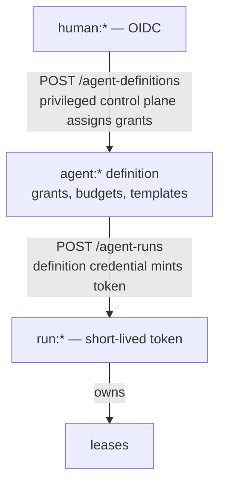

# Identity, authorization, safety (design)

Spec and rationale for principals, grants, delegation, taint, revocation, and budgets.
Origin: outline §8. Not yet implemented.

## Contents
- Invariants
- Principals
- Bootstrap
- Grants
- Delegation
- Taint
- Revocation semantics
- Budgets
- Deferred

## Invariants

Cross-cutting versions are in [CLAUDE.md](../CLAUDE.md); detail here is authoritative.

- Grants are kind-scoped, never wildcard, and assigned by a privileged control plane,
  never self-declared.
- `signal` and grant management are writable only by `human:*` and one supervisor agent.
- `delegation_context` is server-derived from the claimed lease; data parents contribute
  no authority.
- Taint clears only via privileged **declassify**. Ordinary agents cannot write
  `taint: false`.

## Principals

- `human:*` (OIDC)
- `agent:*` (a definition: grants, budgets, templates)
- `run:*` (an instance)

Leases belong to runs. Grants flow down the bootstrap chain; they are never
self-declared:

## Bootstrap — grants assigned, never self-declared

- `POST /agent-definitions` — a privileged control plane assigns grants.
- `POST /agent-runs` — a definition credential mints a short-lived run token.
- `POST /agent-runs/{id}/stop`.

Manifest capability claims are descriptive, not authorization. On k8s, prefer workload
identity (SPIFFE / projected SA tokens). The MCP adapter keeps credentials out of the
model context.

## Grants

Kind-scoped verbs, never wildcard. Template-scoped grants: the effective query is
`grant ∧ requested template`, **computed server-side** (see
[design-matching.md](design-matching.md)).

## Delegation

`delegation_context` (see [design-data-model.md](design-data-model.md)) is server-derived
from the claimed lease. Effective permission on delegated work = intersection of the
*authorization chain's* grants; data parents contribute nothing. It composes with taint:
taint is untrusted **data** lineage; delegation is **authority** lineage; sensitive
consumers may constrain both.

## Taint — server-computed

Derived from principal trust classification, mandatory parent linkage at `ack`, and
server-side propagation. A direct `put` from applicable principals defaults tainted
absent source attestation. Clearing requires a privileged **declassify**.

## Revocation semantics

Defined explicitly, not implied:

- **Run stopped:** no new operations or renewals; held leases expire on their own clocks
  (quickly, since renewal has stopped).
- **Grant revoked:** no new claims; an in-flight `ack` is allowed under the **policy
  version captured at lease issuance** (default), unless quarantined.
- **Emergency quarantine:** deny all writes from the principal and invalidate its leases
  immediately; late `ack`s fence out as `lease_lost`.
- **Token expiry mid-task:** the run refreshes via its definition credential; refresh
  failure degrades to "run stopped".

## Budgets

Observability via records; enforcement via transactional reservation + settlement (see
[design-scheduler.md](design-scheduler.md)). Two readers of the same budget record must
not both spend it.

## Deferred

Boundary signing and agent-held keys (federation-time; rationale in
[design-observability.md](design-observability.md) and [gotchas.md](gotchas.md)) ·
recipient-keyed encryption as a runtime feature · field-level ACLs · multi-tenancy (one
space per team for now).
