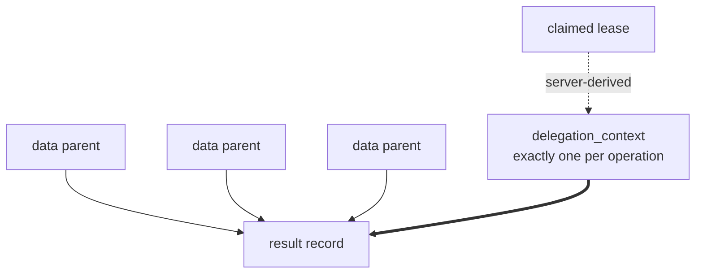
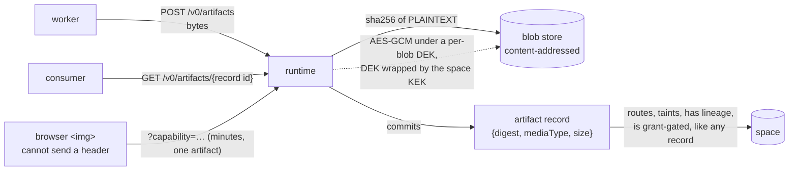

# Data model (design)

Spec and rationale for Radia's core data model. Origin: outline §2.

**M0 status (implemented):** the record + `record_runtime` split, ULID ids, `body_sha256`,
the client-vs-runtime metadata split, and `parent_ids` lineage live in
`src/core/record.ts` (`buildRecord`), `src/storage/adapter.ts` (types), `src/storage/row.ts`
(mapping), and the two adapters. Kinds/indexing: `src/core/kinds.ts`. `delegation_context`
(authority lineage) and `taint` (data lineage) are both built (M1); see "Provenance vs.
authority" below. **Artifacts / blob storage (§2.4) are built (M1), with optional encryption at
rest**. See the section below for what landed and what did not.

## Contents
- Invariants
- Record vs. runtime envelope
- Timing fields
- Client vs. runtime-authoritative metadata
- Provenance vs. authority
- Kind conventions
- Resource limits
- Artifact references

## Invariants

Subsystem-local rules. Cross-cutting rules (immutability, the client/runtime split,
provenance ≠ authority) are stated once in [CLAUDE.md](../CLAUDE.md). Read those too.

- One `record_runtime` row per record. The envelope is the only mutable state.
- Denormalized routing fields (`kind`, `deadline_at`, hot paths) are copied into
  `record_runtime` transactionally at commit and are never client-editable.
- Content "updates" are consume + emit successor. Dead-lettering sets
  `state = dead_letter` and preserves `kind`.
- Every record carries `body_sha256` over plaintext (needed for artifacts, dedup, and
  no-progress detection; see [design-observability.md](design-observability.md)).

## Record vs. runtime envelope

Two structures per unit of work: immutable content, and a mutable claim-state envelope.

```
record                       # immutable after commit
  id             ULID
  kind           discriminator; never rewritten
  body           JSON (large payloads via artifacts, below)
  client_meta    confidence?, requested_priority?, app fields (client-submitted claims)
  runtime_meta   created_by, delegation_context, parent_ids[], taint,
                 schema_version, created_at        (server-assigned, authoritative)
  deadline_at?   application-level deadline (business semantics / scheduler signal)
  retention_until?  content GC eligibility

record_runtime               # mutable envelope, one row per record
  record_id
  kind, deadline_at, hot routing fields   # DENORMALIZED from record, server-assigned
                                          # transactionally at commit, never client-editable
  state          available | leased | consumed | dead_letter | expired
  attempt        int
  available_at   delayed visibility / retry backoff
  claim_until    no NEW claims after this time
  effective_priority   server-computed (see design-scheduler.md); aged by sweeper
  lease_id, lease_epoch, lease_owner (run id), leased_until
```

The split is what makes immutable content coexist with churning claim state, and it is
what lets the hot claim path be a single-table index (see
[design-storage.md](design-storage.md)).

## Timing fields

Five distinct concepts, never overloaded onto one field:

| Field             | Meaning                                    |
|-------------------|--------------------------------------------|
| `available_at`    | eligibility (delayed visibility, backoff)  |
| `claim_until`     | no new claims after this time              |
| `deadline_at`     | business deadline / scheduler signal       |
| `retention_until` | content GC eligibility                     |
| `leased_until`    | current lease expiry                       |

Retention expiry does **not** invalidate an in-flight valid lease. Administrative GC
never discards valid completed work.

## Client vs. runtime-authoritative metadata

A hard API split. Server-controlled always: `created_by`, `delegation_context`,
`created_at`, `schema_version` (post-validation), `taint`, `effective_priority`, all
lease fields. Clients submit only *claims* (`confidence`, `requested_priority`); the
runtime decides what they are worth. This is what stops an agent from, e.g., declaring
its own priority or authorship. **`created_by` is the server-RESOLVED caller** (the handler's
resolved principal: a run token → `run:*`, no header → `human:local`), threaded into
`put`/`ack`; it also scopes idempotency (per principal) and the event `run_id`. In-process
callers default to the space's own identity.

## Provenance vs. authority

Two separate structures, deliberately not merged:

- **`parent_ids`**: data/causality lineage only. All parents must exist at commit;
  self-parenting is rejected. Because parents pre-exist and records are immutable, the
  lineage DAG is **acyclic by construction**.
- **`delegation_context`**: the authorization chain for this operation,
  server-derived from the claimed task/lease, never freely client-supplied. A result
  may have many data parents but exactly one authorization context. **M1 status (built):**
  set on records emitted via `ack` under a **managed run's** lease (`src/core/space.ts`
  `deriveDelegation`): `{chain, origin}`, where `chain` accumulates the acting agents along
  the delegation path (from the record's authoritative `lease_owner` → its agent) and `origin`
  is the leased record it was delegated from. Derived from the lease, **never** from
  `parent_ids`. Operator/root-owned work carries none (full authority). Emitting a result is
  authorized as a `put` for the acting agent, so an ack-emitted record never bypasses
  put-authorization. The stricter *chain-intersection* policy composes with taint
  (M3). See [design-auth.md](design-auth.md).

A result may have many data parents but exactly one authorization context:



Deriving data from a privileged record grants nothing. Intersecting authority across
arbitrary data parents is neither meaningful nor attempted. See
[design-auth.md](design-auth.md) for how `delegation_context` drives permission.

**`taint` is the mirror image. It follows the DATA lineage that authority ignores.** M1
status (built): a record is tainted if a client raised it (`taint:true`, source attestation)
or **any `parent_ids` parent is tainted** (`Space.computeTaint`, on put and ack, so a tainted
task yields a tainted result). A client can only ever *raise* taint; clearing requires a
privileged **declassify** (`Space.declassify` → a clean successor with the tainted original as
its data parent). A sensitive consumer skips tainted work with `take {requireUntainted}`. So
the two lineages are complementary: authority flows down the **lease** (delegation), untrust
flows down **data parents** (taint), and neither leaks into the other.

## Kind conventions

`task` · `fact` / `hypothesis` · `request` / `bid` / `award` (see
[design-marketplace.md](design-marketplace.md)) · `result` · `signal` (privileged
writers only).

## Resource limits

**M1 status: mostly unbuilt.** The intent stands: an indexed query can still be expensive, so
limits are not optional, and they belong at commit/registration. Only two are enforced so far:

- **pattern `$and`/`$or` nesting depth ≤ 3**: `MAX_DEPTH` in `src/core/matching.ts`, raised as
  `too_deep` at compile.
- **artifact bytes**, default 32 MiB: `SpaceContext.maxArtifactBytes` (`src/core/space.ts`),
  returned as `413 artifact_too_large` by `src/server/handlers/artifacts.ts`.

Still to build, tracked as the unchecked M1 item "resource limits enforced" in
[plan-milestones.md](plan-milestones.md): max record and pattern size · body field depth ·
predicate count · `$or` branch count · array cardinality · registered patterns per agent ·
watches per run · slow-lane time and row-scan budgets · SSE buffer/backpressure limits.

The gap with a live consumer is **record body size**: nothing rejects a large body, so the
cross-cutting invariant that artifact bytes never travel inside a record (see
[CLAUDE.md](../CLAUDE.md)) is today a convention the runtime does not enforce. A base64 payload in
a body defeats matching, windowing and every size assumption downstream, and it will be accepted.

## Artifact references

**M1 status: built.** `src/storage/blobs.ts` (the `BlobStore` port + memory/filesystem impls),
`src/core/kinds.ts` (`ARTIFACT`, `validateArtifactDef`), `Space.putArtifact`/`readArtifact`/
`mintDownloadCapability`, `src/server/handlers/artifacts.ts`, `conformance/suites/blobs.ts`.

Large payloads live in blob storage. Records carry **stable internal artifact IDs**,
never temporary signed URLs (they would expire inside immutable records). Retrieval is
authorized through the runtime, which issues short-lived download capabilities.



**An artifact is a record.** The reserved `artifact` kind's body is `{digest, mediaType, size,
filename?}`, the metadata and never the bytes, so grants, taint, lineage, the event log, retention
and pattern-scoped scoping all apply with no new machinery, and only the payload sits outside.
Indexed on `digest` (every record referencing the same bytes) and `mediaType` (a worker claims
`{mediaType: "image/png"}`: content routing, not a routing table). `digest` and `size` are
server-computed; a client cannot assert them.

An application may merge its OWN fields into that body (`putArtifact`'s `appFields`, `X-Radia-Meta`
on the wire; scalars, ASCII, since a header is a ByteString). Without them an artifact is the one
kind an application cannot scope: a grant pattern matches the body, and a wholly runtime-built
body offers nothing to bind, so any principal holding an artifact id can read the bytes. Lineage
does not help: `parent_ids` is not body, and matching is body-only by design. The runtime's fields
are applied last and supplying one is refused, so app metadata can never forge a digest, size or
media type. A kind whose indexing an app extends this way is redeclared with a `kind_def` record
like any other (only `kind_def` itself is protected), and a redeclaration REPLACES, so the reserved
paths must be repeated.

Blobs are **content-addressed** by sha256 of the plaintext: an object verifies itself, identical
bytes are stored once, and re-upload is free. Client-facing identity stays the record id, so
dedup never merges two artifacts into one reference.

**Download capabilities** (`POST /v0/artifacts/{id}/capability`) exist for one concrete reason: a
browser cannot attach an `Authorization` header to ``. A capability is scoped to a single
artifact, expires in minutes, lives in memory, and is minted only for a caller already authorized
to read that artifact, making it a delegation of a read rather than a credential. It is checked
before token resolution (there is deliberately no token) and opens nothing else: `/v0/records` and
`/v0/ops/*` still 401 with a capability attached under `--auth required`.

**Only raster images, audio and video are served `inline`; everything else downloads.** Artifact
bytes are attacker-supplied and served from the space's OWN origin (the origin whose console page
carries an operator token), so `text/html` (or `image/svg+xml`, which is why the allowlist names
raster formats rather than `image/`) rendered inline would be a same-origin XSS reachable by anyone
holding an `artifact: put` grant. Responses also carry `X-Content-Type-Options: nosniff` and
`Content-Security-Policy: default-src 'none'; sandbox`.

Artifact policy, as built: sha256 verification, media-type and filename validation *before* the
body is read, a size ceiling (`maxArtifactBytes`, 32 MB) enforced against the stream rather than
the declared `Content-Length`, taint propagation (a client may raise it via `X-Radia-Taint`), and
access checks independent of possession of the record JSON.

**Encryption at rest is built and opt-in** (`src/storage/crypto.ts`): a per-blob random DEK under
**AES-GCM-256**, the DEK wrapped under a space **KEK** (AES-KW) that comes from `RADIA_BLOB_KEK`
(base64, 32 bytes) or `--blob-kek <file>`. No key configured → blobs stay plaintext, and the
startup line says which you got. This is confidentiality layer 2 of
[design-observability.md](design-observability.md): it covers backups, snapshots and a copied data
directory (what disk encryption does not), and it is what makes deletion-by-key-destruction real.
It does **not** defend against a compromised runtime or anyone holding the KEK, since the runtime
decrypts for every principal with a read grant.

Four properties, each with a reason:

- **The DEK is per BLOB, not per record.** The store is content-addressed by the plaintext digest,
  so identical bytes are one blob that several artifact records share, along with its key. Dedup
  survives encryption; shredding a blob shreds it for every record referencing it, which is correct
  because there is one payload.
- **The plaintext digest is the AAD**, so ciphertext moved to another address fails to open: the
  content address is authenticated, not merely conventional.
- **Storage paths are HMAC(KEK, digest).** A content-addressed encrypted store whose filenames are
  plaintext hashes still answers "do you hold this exact file?" to whoever steals the disk.
- **The wrapped DEK lives in a sidecar beside the blob**, never in the artifact record: records are
  immutable and crypto-shredding means *deleting* the key. Delete the sidecar and the payload is
  gone while the record, its digest and the event chain remain verifiable.

Enabling encryption on an existing store does not orphan what is already there: a blob with no
sidecar is read as plaintext, while new writes are sealed. Two consequences worth knowing: an
encrypted read cannot stream (AES-GCM verifies its tag over the whole ciphertext, so the payload is
decrypted in memory, bounded by `maxArtifactBytes`), and a space started **without** the KEK cannot
even address its sealed blobs, so reads are `404` while the records remain intact.

**Still not in v1:** reference-aware GC (blobs are permanent; `retention_until` on the artifact
record is the hook), and KEK rotation (rewrapping every DEK, and renaming every path, since the
name is derived from the key). Recipient-keyed / token-derived keys stay out; see
[gotchas.md](gotchas.md).
