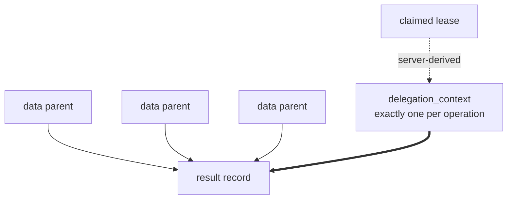

# Data model (design)

Spec and rationale for Radia's core data model. Origin: outline §2.

**M0 status (implemented):** the record + `record_runtime` split, ULID ids, `body_sha256`,
the client-vs-runtime metadata split, and `parent_ids` lineage live in
`src/core/record.ts` (`buildRecord`), `src/storage/adapter.ts` (types), `src/storage/row.ts`
(mapping), and the two adapters. Kinds/indexing: `src/core/kinds.ts`. `delegation_context`
(authority lineage) and `taint` (data lineage) are both built (M1); see "Provenance vs.
authority" below. **Artifacts / blob storage (§2.4) are built (M1), with optional encryption at
rest**. See the section below for what landed and what did not.

## Contents
- Invariants
- Record vs. runtime envelope
- Timing fields
- Client vs. runtime-authoritative metadata
- Provenance vs. authority
- Kind conventions
- Resource limits
- Artifact references

## Invariants

Subsystem-local rules. Cross-cutting rules (immutability, the client/runtime split,
provenance ≠ authority) are stated once in [CLAUDE.md](../CLAUDE.md). Read those too.

- One `record_runtime` row per record. The envelope is the only mutable state.
- Denormalized routing fields (`kind`, `deadline_at`, hot paths) are copied into
  `record_runtime` transactionally at commit and are never client-editable.
- Content "updates" are consume + emit successor. Dead-lettering sets
  `state = dead_letter` and preserves `kind`.
- Every record carries `body_sha256` over plaintext (needed for artifacts, dedup, and
  no-progress detection; see [design-observability.md](design-observability.md)).

## Record vs. runtime envelope

Two structures per unit of work: immutable content, and a mutable claim-state envelope.

```
record                       # immutable after commit
  id             ULID
  kind           discriminator; never rewritten
  body           JSON (large payloads via artifacts, below)
  client_meta    confidence?, requested_priority?, app fields (client-submitted claims)
  runtime_meta   created_by, delegation_context, parent_ids[], taint[],
                 schema_version, created_at        (server-assigned, authoritative)
  deadline_at?   application-level deadline (business semantics / scheduler signal)
  retention_until?  content GC eligibility

record_runtime               # mutable envelope, one row per record
  record_id
  kind, deadline_at, hot routing fields   # DENORMALIZED from record, server-assigned
                                          # transactionally at commit, never client-editable
  state          available | leased | consumed | dead_letter | expired
  attempt        int
  available_at   delayed visibility / retry backoff
  claim_until    no NEW claims after this time            # RESERVED: never set, never consulted
  effective_priority   server-computed (design-scheduler) # RESERVED: always 0, nothing ages it
  lease_id, lease_epoch, lease_owner (run id), leased_until
```

**Two of those columns are reserved, not live**, and the distinction matters because a reader
planning against them will find no behaviour there. Verified against `src/`:

- `claim_until` is written as `undefined` at every call site (`Space.putRaw`, the settle path) and
  no query filters on it. "No new claims after this time" describes nothing that happens.
  (`retention_until` used to sit beside it as stored-never-consulted; the retention sweep now
  consults it — `Space.gc`, [plan-gc.md](plan-gc.md).)
- `effective_priority` is set to `0` with the comment "scheduler sets this for real in M3". It is
  indexed and ordered by, so the ranking machinery is real and its input is constant; `Space.take`
  ranks by it and therefore always falls through to the next tiebreak. "Aged by sweeper" is doubly
  wrong: nothing ages it, and there is no sweeper (the only `setInterval` in the runtime is the MCP
  heartbeat).

Both are honest scaffolding for [design-scheduler.md](design-scheduler.md) (M3). Neither is a
behaviour to rely on, and neither should be described in the present tense until it does something.

The split is what makes immutable content coexist with churning claim state, and it is
what lets the hot claim path be a single-table index (see
[design-storage.md](design-storage.md)).

## Timing fields

Five distinct concepts, never overloaded onto one field:

| Field             | Meaning                                    |
|-------------------|--------------------------------------------|
| `available_at`    | eligibility (delayed visibility, backoff)  |
| `claim_until`     | no new claims after this time              |
| `deadline_at`     | business deadline / scheduler signal       |
| `retention_until` | content GC eligibility                     |
| `leased_until`    | current lease expiry                       |

Retention expiry does **not** invalidate an in-flight valid lease. Administrative GC
never discards valid completed work. What sweeping past `retention_until` deletes and what it
keeps (the event residue, and that residue's own opt-in horizon) is [plan-gc.md](plan-gc.md),
"The ledger".

## Client vs. runtime-authoritative metadata

A hard API split. Server-controlled always: `created_by`, `delegation_context`,
`created_at`, `schema_version`, `taint`, `effective_priority`, all
lease fields. (`schema_version` is server-assigned and currently a CONSTANT, `SpaceContext.schemaVersion`
= 1: the split it belongs to is real, the versioning it implies is not, and kind schema versioning
remains unbuilt in [plan-milestones.md](plan-milestones.md).) Clients submit only *claims* (`confidence`, `requested_priority`); the
runtime decides what they are worth. This is what stops an agent from, e.g., declaring
its own priority or authorship. **`created_by` is the server-RESOLVED caller** (the handler's
resolved principal: a run token → `run:*`, no header → `human:local`), threaded into
`put`/`ack`; it also scopes idempotency (per principal) and the event `run_id`. In-process
callers default to the space's own identity.

## Provenance vs. authority

Two separate structures, deliberately not merged:

- **`parent_ids`**: data/causality lineage only. All parents must exist at commit (verified: a put
  naming an unknown parent fails `parent … does not exist`), and self-parenting is rejected.
  Because parents pre-exist and records are immutable, the lineage DAG is **acyclic by
  construction** — which is also why the self-parent check is unreachable, since the id is assigned
  after the caller has named its parents. It is kept as an executable statement of the invariant,
  not as a guard against a reachable input; do not cite it as evidence that client-supplied ids
  would be safe.
- **`delegation_context`**: the authorization chain for this operation,
  server-derived from the claimed task/lease, never freely client-supplied. A result
  may have many data parents but exactly one authorization context. **M1 status (built):**
  set on records emitted via `ack` under a **managed run's** lease (`src/core/space.ts`
  `deriveDelegation`): `{chain, origin}`, where `chain` accumulates the acting agents along
  the delegation path (from the record's authoritative `lease_owner` → its agent) and `origin`
  is the leased record it was delegated from. Derived from the lease, **never** from
  `parent_ids`. Operator/root-owned work carries none (full authority). Emitting a result is
  authorized as a `put` for the acting agent, so an ack-emitted record never bypasses
  put-authorization. The stricter *chain-intersection* policy composes with taint
  (M3). See [design-auth.md](design-auth.md).

A result may have many data parents but exactly one authorization context:



Deriving data from a privileged record grants nothing. Intersecting authority across
arbitrary data parents is neither meaningful nor attempted. See
[design-auth.md](design-auth.md) for how `delegation_context` drives permission.

**`taint` is the mirror image. It follows the DATA lineage that authority ignores.** M1
status (built): a record is tainted if a client raised it (`taint:true`, source attestation)
or **any `parent_ids` parent is tainted** (`Space.computeTaint`, on put and ack, so a tainted
task yields a tainted result). A client can only ever *raise* taint; clearing requires a
privileged **declassify** (`Space.declassify` → a clean successor with the tainted original as
its data parent). A sensitive consumer states the labels it will accept with `take {allowTaint}`. So
the two lineages are complementary: authority flows down the **lease** (delegation), untrust
flows down **data parents** (taint), and neither leaks into the other.

## Kind conventions

One of these is enforcement and the rest are vocabulary, which the list used to obscure.

**Reserved by the runtime** (`RESERVED_KINDS`, `src/core/kinds.ts`): `kind_def`, `grant`, `signal`,
`agent_definition`, `agent_run`, `artifact`, `interest`, `shred`, `ops_grant`. Of those, `grant`,
`signal`, `agent_*`, `shred` and `ops_grant` are additionally WRITE-PROTECTED, meaning an operator
only, whatever grants say — with one carve-out: the supervisor may put `grant`/`signal`, its entire
remaining privilege ([architecture-ops-tiers.md](architecture-ops-tiers.md)).

**Suggested names, which the runtime has never heard of:** `task` · `fact` / `hypothesis` ·
`request` / `bid` / `award` (see [design-marketplace.md](design-marketplace.md)) · `result`. These
are naming conventions from the origin outline. Declaring one is an ordinary `kind_def` and carries
no special behaviour; an application is free to ignore them entirely, and `examples/chat` does,
owning `message`/`llm_call`/`tool_call`/`check` and so on.

## Resource limits

**M1 status: mostly unbuilt.** The intent stands: an indexed query can still be expensive, so
limits are not optional, and they belong at commit/registration. Three are enforced so far:

- **pattern `$and`/`$or` nesting depth ≤ 3**: `MAX_DEPTH` in `src/core/matching.ts`, raised as
  `too_deep` at compile.
- **artifact bytes**, default 32 MiB: `SpaceContext.maxArtifactBytes` (`src/core/space.ts`),
  returned as `413 artifact_too_large` by `src/server/handlers/artifacts.ts`.
- **record bytes**, default 1 MiB: `SpaceContext.maxRecordBytes`, checked in `buildRecord` where the
  serialized form first exists (so every write path passes through it, not just the client one),
  returned as `413 record_too_large`. Measured on the SERIALIZED bytes, not on character count, or a
  body of astral-plane characters would pass at twice its encoded size. The budget covers the body
  AND `clientMeta` TOGETHER: `clientMeta` is client-supplied, persisted verbatim and equally
  unerasable, and it escaped the check entirely until 2026-08-04, so the limit was walked past by
  moving the payload one field sideways. Two independent limits would be a limit on neither, for
  the same reason. Both fields also refuse a U+0000. The artifact path has its own tighter, earlier
  guard: metadata fields cap at 256 characters each.

The gap between the record limit and the artifact limit is deliberate and is the signal: a body
approaching artifact size is a payload in the wrong place.

**Built** (see the enforced list in `openapi/radia.yaml`'s preamble): record and pattern size, body
field depth, predicate count, `$or` branch count, array cardinality, registered patterns per agent,
watches per run. Each bounds a cost that bytes do not, which is the whole reason there is a list
rather than one number: a pattern is STORED and then evaluated against every candidate record, so
its cost is paid per record rather than once; a body's depth and fan-out are walked by the matcher,
the event chain and every reader.

**The row-scan budget** was the first that needed a MECHANISM rather than a validator, and it is
built (`CompiledMatch.scanBudget`, `SpaceContext.maxScanRows`, default 200k, both adapters). A
pattern the pre-filter cannot decide is answered by walking the kind through `matchesRecord`, so its
cost is the size of the kind and not of the request: 13.6s at a million records (`bench/deployment.ts`),
in a process that serves nobody else meanwhile. Two halves, because the budget alone would not have
fixed the second one:

- The walk is CHUNKED and yields between chunks, so memory is bounded and another principal's read
  interleaves. Measured on 60k records: a neighbour's indexed read waited 138ms, the whole scan;
  now 5.9ms, and the scan pays about a third for it.
- The budget then bounds the total, raising `429 scan_budget_exceeded`. It never truncates: a
  bounded read whose result is treated as a population is this codebase's most repeated bug.
  Tunable per space (`radia dev --max-scan-rows <n>`, `0` disables), because a limit an operator
  can neither raise for a legitimate scan nor lower on a small machine is one they will route
  around. `0` has to be TRANSLATED to "no budget" rather than passed through, since the adapters
  refuse at `examined >= budget` and a literal zero would refuse everything.

Anything the database can decide returns matches rather than candidates and never approaches it,
which is what keeps the limit invisible to ordinary use. Still to come: a slow-lane TIME budget
(a scheduler concept, M3) and SSE buffer/backpressure limits.

The gap with a live consumer WAS **record body size**: nothing rejected a large body, so the
cross-cutting invariant that artifact bytes never travel inside a record (see
[CLAUDE.md](../CLAUDE.md)) was a convention the runtime did not enforce. Verified at the time: a
4 MiB string in a body was accepted, while the same bytes as an artifact are capped at 32 MiB. A
base64 payload in a body defeats matching, windowing and every size assumption downstream.

**It was also an ERASURE hole, which is the consequence nobody drew and the reason it was closed
first.** The erasure boundary below is exactly this invariant: a payload is out of line, so it can
be destroyed; a body is not, so it cannot. An unenforced size limit therefore did not merely degrade
matching, it was the mechanism by which unerasable data entered a space: base64 a secret into a body
and no operator verb reaches it, since `shredArtifact` destroys blobs and there is no body path.
That is why the record limit shipped ahead of the rest of the unbuilt list, which only bounds cost.

The convention is still not fully an enforcement. A 900 KiB base64 payload is under the limit and
remains unerasable; the limit bounds the damage rather than closing the path. Closing it needs body
redaction (below), which is a separate carve-out with its own hard problem.

**There is now one route from a body back to erasability, and it runs through this boundary rather
than around it.** An app may encrypt the body fields nothing routes on and keep the wraps in an
ARTIFACT; destroying that artifact crypto-shreds the bodies while the records, their lineage and the
chain survive. The runtime is unchanged and unaware — matching still reads plaintext indexed paths —
and the erasable material is out of line exactly as the invariant requires. Built for the chat:
[plan-encryption.md](plan-encryption.md).

## Artifact references

**M1 status: built.** `src/storage/blobs.ts` (the `BlobStore` port + memory/filesystem impls),
`src/core/kinds.ts` (`ARTIFACT`, `validateArtifactDef`), `Space.putArtifact`/`readArtifact`/
`mintDownloadCapability`, `src/server/handlers/artifacts.ts`, `conformance/suites/blobs.ts`.

Large payloads live in blob storage. Records carry **stable internal artifact IDs**,
never temporary signed URLs (they would expire inside immutable records). Retrieval is
authorized through the runtime, which issues short-lived download capabilities.


**An artifact is a record.** The reserved `artifact` kind's body is `{digest, mediaType, size,
filename?}`, the metadata and never the bytes, so grants, taint, lineage, the event log, retention
and pattern-scoped scoping all apply with no new machinery, and only the payload sits outside.
Indexed on `digest` (every record referencing the same bytes) and `mediaType` (a worker claims
`{mediaType: "image/png"}`: content routing, not a routing table). `digest` and `size` are
server-computed; a client cannot assert them.

An application may merge its OWN fields into that body (`putArtifact`'s `appFields`, `X-Radia-Meta`
on the wire; scalars, ASCII, since a header is a ByteString). Without them an artifact is the one
kind an application cannot scope: a grant pattern matches the body, and a wholly runtime-built
body offers nothing to bind, so any principal holding an artifact id can read the bytes. Lineage
does not help: `parent_ids` is not body, and matching is body-only by design. The runtime's fields
are applied last and supplying one is refused, so app metadata can never forge a digest, size or
media type. A kind whose indexing an app extends this way is redeclared with a `kind_def` record
like any other, and a redeclaration REPLACES, so the reserved paths must be repeated. That is
enforced, not advisory: a reserved kind may be extended and never shrunk
(`assertReservedCompatible`, `src/core/kinds.ts`), because dropping `grant.principal` would fail
every authorization in the space.

Blobs are **content-addressed** by sha256 of the plaintext: an object is verifi*able*, identical
bytes are stored once, and re-upload is free. Client-facing identity stays the record id, so
dedup never merges two artifacts into one reference.

Verifi*able*, not verified on every read: a plaintext `get` streams without re-hashing, since
hashing per read costs a full pass and forces the object into memory. A sealed read verifies for
free (GCM authenticates the ciphertext against the digest). What holds for plaintext instead is
that damage cannot be written: `FileBlobStore` writes through a temp file and a rename, and dedups
on LENGTH rather than existence, so any holder of the bytes repairs the address. See
`src/storage/blobs.ts` and package G in
[plan-audit-remediation.md](plan-audit-remediation.md).

**Download capabilities** (`POST /v0/artifacts/{id}/capability`) exist for one concrete reason: a
browser cannot attach an `Authorization` header to ``. A capability is scoped to a single
artifact, expires in minutes, lives in memory, and is minted only for a caller already authorized
to read that artifact, making it a delegation of a read rather than a credential. It is checked
before token resolution (there is deliberately no token) and opens nothing else: `/v0/records` and
`/v0/ops/*` still 401 with a capability attached under `--auth required`.

**The URL is addressed by the capability alone: `GET /v0/a/{capability}`.** A capability names
exactly one record, so the id in the path was redundant, and the long form
(`/v0/artifacts/{id}?capability=…`) spent about 70 characters on nothing. That matters because this
is the one URL in the system a PERSON handles: it is shown in a chat reply, pasted, and occasionally
read aloud. The token is 16 random bytes as base64url (22 characters) rather than 32 as hex. The
shorter token is not a security compromise: it opens one object for a few minutes and is not an
identity, so 128 bits is well past what that exposure justifies, and there is no id left in the URL
to tamper with. `/v0/a/…` stays under the versioned prefix; a root-level `/a/…` would save three
characters and buy an unversioned public surface with no evolution story. The long form still works
and remains the documented `stable` one.

### Erasure: the one carve-out from immutability

Records are immutable after commit and nothing is deleted. That is load-bearing, and it collides
with requirements that are not optional: a subject exercising a right to erasure, a credential
committed by mistake, a retention deadline. The collision is resolved at ONE boundary, and the
boundary is the one that already existed.

**A payload is out of line, so it can be destroyed. A body is not, so it cannot.**
`Space.shredArtifact` (gated by the `purge` ops power, `POST /v0/ops/records/{id}/shred`) deletes the blob and writes
a `shred` record. What survives: the artifact record, its id, its `digest`, its lineage, and every
event. What is gone: the bytes. Because the digest is over PLAINTEXT, the content address stays
valid after the payload is destroyed, so the chain still verifies and the space can still say "an
artifact with this digest was here, and was erased". A plain row delete would take that away, which
is why erasure is a successor record and not a deletion.

Six properties that are decisions, not details:

- **Under a KEK this is crypto-shredding**, and `BlobStore.delete` destroys the key BEFORE the
  ciphertext, so an interrupted erase leaves unreadable bytes rather than readable ones. Without a
  KEK it is a plain delete; the response says which was obtained, because only the first excludes
  recovery from a copy of the storage.
- **The marker is written AFTER the bytes are gone.** A crash between the two leaves data erased and
  reported as merely missing (cosmetic); the other order leaves data alive and reported as erased,
  which is a lie about a security property.
- **Erasure is by CONTENT.** The store is content-addressed, so identical payloads are one blob that
  several artifact records reference, and erasing it erases it for all of them. Correct (there is
  one payload) and sharp (two people who uploaded the same file), so a shared blob refuses unless
  the caller passes `acknowledgeShared`.
- **A shredded read is `410`, never `404`.** "Erased" and "never existed" must not be the same
  answer, or an auditor cannot tell a destroyed record from a mistyped id.
- **The retained digest is a CONFIRMATION ORACLE, and this is the limit of what erasure buys.**
  `ArtifactDef.digest` is the sha256 of the plaintext and lives in the artifact record's BODY, which
  has no erasure path — so after a shred, anyone who can read that record and who holds a candidate
  payload can hash it and confirm that this exact content was here. The blob layer takes the
  opposite posture on the same value and says so: `BlobCipher.storageName` HMACs the digest because
  a storage name "reveals nothing about the content it addresses". The record layer keeps it in
  plaintext, permanently, on purpose — the chain verifies over it and `shredOf` answers `410` from
  it — so the two layers disagree by design and only one of them used to admit it.
  **A workspace manifest compounds this**: it carries the path beside the digest, so
  `credentials/prod-db.txt` survives its own payload.

  Not fixable without giving up what the carve-out is for: HMAC the digest in the record and content
  addressing stops working for legitimate readers, and the event chain loses the value it hashes. So
  the honest statement is a scoping one rather than a defect, and it is the sentence an operator
  needs before deciding whether a shred was sufficient: **erasure protects HIGH-ENTROPY payloads.**
  A destroyed document, image or key file is gone in every practical sense, because nobody can
  produce a candidate to test. A destroyed password, an API key of known format, a short piece of
  PII — a name, an address, a phone number — remains confirmable to anyone with a guess and read
  access to the record. Where that is not acceptable, the payload must never have been an artifact
  in this space; erasure after the fact cannot get it back.
- **An erasure can stop holding, and the honest answer is to REPORT it, not to prevent it.** The
  content address stays valid, so anyone holding the payload can store it again; the blob returns
  and every record referencing it reads once more. It happened by accident before anyone tried it:
  a model still carrying the erased text in its context re-saved it through an ordinary tool.
  Neither obvious guard survives scrutiny. Refusing a WRITE whose digest was once shredded poisons a
  content address for the whole space (shred an empty file and nothing may ever store one) and
  breaks any program that legitimately recomputes the same output. Refusing to SERVE the shredded
  record while identical bytes are readable through a newer one protects the paper trail rather than
  the person, and makes a broken guarantee look intact. So the state is DERIVED — a marker plus a
  present blob is a reversed erasure — and surfaced by `Space.erasures`, `GET /v0/ops/erasures`, and
  a finding in `radia doctor` that names `radia shred <id> --shared` as the remedy along with what
  re-erasing costs. See [design-observability.md](design-observability.md).

The word "irreversible" used to appear here and in CLAUDE.md's invariant, and it was wrong. What
shredding destroys is the runtime's COPY; it cannot make those bytes unstorable, and pretending
otherwise is how a guarantee erodes without anyone noticing.

**What this does NOT cover, and the gap is real.** Record bodies are plaintext JSON, because the
routing language matches on them, so there is no erasure path for a body. In `examples/chat` the
message text a person typed lives in a `message` body, which means the chat can erase the files it
produced and not the conversation that produced them. Closing that needs body redaction, a separate
carve-out with its own hard problem: keeping `body_sha256` after redacting a low-entropy body (a
name, an email, a phone number) leaves it brute-forceable.

That argument used to end "so the digest that makes artifact erasure safe is the thing that makes
body erasure unsafe", which was its own counter-example and stood here uncorrected for a while. The
retained digest does not make artifact erasure safe; it makes artifact erasure CONFIRMABLE, by
exactly the reasoning above (see the sixth property). Bodies are worse only in degree — a body's
digest is unavoidable where an artifact's is at least out of line — and the entropy caveat is the
same one. Reason from the property, not from the old sentence. Not built, and not to be bolted onto
this one.

**Finding every derived copy is the part most systems cannot do.** Erasure's hard half is not the
original, it is the copies: which results quoted it, which artifacts came from it. `parent_ids`
lineage and `children` answer exactly that, and `taint` marks which descendants carry untrusted
provenance. That closure is a query here.

**Only raster images, audio and video are served `inline`; everything else downloads.** Artifact
bytes are attacker-supplied and served from the space's OWN origin (the origin whose console page
carries an operator token), so `text/html` (or `image/svg+xml`, which is why the allowlist names
raster formats rather than `image/`) rendered inline would be a same-origin XSS reachable by anyone
holding an `artifact: put` grant. Responses also carry `X-Content-Type-Options: nosniff` and
`Content-Security-Policy: default-src 'none'; sandbox`.

Artifact policy, as built: sha256 verification, media-type and filename validation *before* the
body is read, a size ceiling (`maxArtifactBytes`, 32 MB) enforced against the stream rather than
the declared `Content-Length`, taint propagation (a client may raise it via `X-Radia-Taint`), and
access checks independent of possession of the record JSON.

**Encryption at rest is built and opt-in** (`src/storage/crypto.ts`): a per-blob random DEK under
**AES-GCM-256**, the DEK wrapped under a space **KEK** (AES-KW) that comes from `RADIA_BLOB_KEK`
(base64, 32 bytes) or `--blob-kek <file>`. No key configured → blobs stay plaintext, and the
startup line says which you got. This is confidentiality layer 2 of
[design-observability.md](design-observability.md): it covers backups, snapshots and a copied data
directory (what disk encryption does not), and it is what makes deletion-by-key-destruction real.
It does **not** defend against a compromised runtime or anyone holding the KEK, since the runtime
decrypts for every principal with a read grant.

Four properties, each with a reason:

- **The DEK is per BLOB, not per record.** The store is content-addressed by the plaintext digest,
  so identical bytes are one blob that several artifact records share, along with its key. Dedup
  survives encryption; shredding a blob shreds it for every record referencing it, which is correct
  because there is one payload.
- **The plaintext digest is the AAD**, so ciphertext moved to another address fails to open: the
  content address is authenticated, not merely conventional.
- **Storage paths are HMAC(KEK, digest).** A content-addressed encrypted store whose filenames are
  plaintext hashes still answers "do you hold this exact file?" to whoever steals the disk.
- **The wrapped DEK lives in a sidecar beside the blob**, never in the artifact record: records are
  immutable and crypto-shredding means *deleting* the key. Delete the sidecar and the payload is
  gone while the record, its digest and the event chain remain verifiable.

Enabling encryption on an existing store does not orphan what is already there: a blob with no
sidecar is read as plaintext, while new writes are sealed. Two consequences worth knowing: an
encrypted read cannot stream (AES-GCM verifies its tag over the whole ciphertext, so the payload is
decrypted in memory, bounded by `maxArtifactBytes`), and a space started **without** the KEK cannot
even address its sealed blobs, so reads are `404` while the records remain intact.

**Reference-aware GC is BUILT** (2026-08-11, [plan-gc.md](plan-gc.md) phase 4): an artifact
record whose writer declared `retention_until` sweeps like any reference record, and a live
`gc` ends with a blob pass deleting bytes no surviving artifact record references (grace-windowed
against in-flight puts; `BlobStore.retainOnly`). A record with no retention keeps the old
posture: permanent, blob and all. **Still not in v1:** KEK rotation (rewrapping every DEK, and
renaming every path, since the name is derived from the key). Recipient-keyed / token-derived
keys stay out; see [gotchas.md](gotchas.md).
