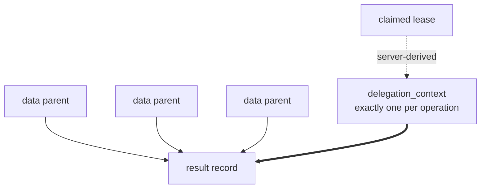

# Data model (design)

Spec and rationale for Radia's core data model. Origin: outline §2.

**M0 status (implemented):** the record + `record_runtime` split, ULID ids, `body_sha256`,
the client-vs-runtime metadata split, and `parent_ids` lineage live in
`src/core/record.ts` (`buildRecord`), `src/storage/adapter.ts` (types), `src/storage/row.ts`
(mapping), and the two adapters. Kinds/indexing: `src/core/kinds.ts`. `delegation_context`
(authority lineage) and `taint` (data lineage) are both built (M1) — see "Provenance vs.
authority" below. **Not implemented:** artifacts / blob storage (§2.4, M1).

## Contents
- Invariants
- Record vs. runtime envelope
- Timing fields
- Client vs. runtime-authoritative metadata
- Provenance vs. authority
- Kind conventions
- Resource limits
- Artifact references

## Invariants

Subsystem-local rules. Cross-cutting rules (immutability, the client/runtime split,
provenance ≠ authority) are stated once in [CLAUDE.md](../CLAUDE.md) — read those too.

- One `record_runtime` row per record. The envelope is the only mutable state.
- Denormalized routing fields (`kind`, `deadline_at`, hot paths) are copied into
  `record_runtime` transactionally at commit and are never client-editable.
- Content "updates" are consume + emit successor. Dead-lettering sets
  `state = dead_letter` and preserves `kind`.
- Every record carries `body_sha256` over plaintext (needed for artifacts, dedup, and
  no-progress detection; see [design-observability.md](design-observability.md)).

## Record vs. runtime envelope

Two structures per unit of work: immutable content, and a mutable claim-state envelope.

```
record                       # immutable after commit
  id             ULID
  kind           discriminator; never rewritten
  body           JSON (large payloads via artifacts, below)
  client_meta    confidence?, requested_priority?, app fields (client-submitted claims)
  runtime_meta   created_by, delegation_context, parent_ids[], taint,
                 schema_version, created_at        (server-assigned, authoritative)
  deadline_at?   application-level deadline (business semantics / scheduler signal)
  retention_until?  content GC eligibility

record_runtime               # mutable envelope, one row per record
  record_id
  kind, deadline_at, hot routing fields   # DENORMALIZED from record, server-assigned
                                          # transactionally at commit, never client-editable
  state          available | leased | consumed | dead_letter | expired
  attempt        int
  available_at   delayed visibility / retry backoff
  claim_until    no NEW claims after this time
  effective_priority   server-computed (see design-scheduler.md); aged by sweeper
  lease_id, lease_epoch, lease_owner (run id), leased_until
```

The split is what makes immutable content coexist with churning claim state, and it is
what lets the hot claim path be a single-table index (see
[design-storage.md](design-storage.md)).

## Timing fields

Five distinct concepts, never overloaded onto one field:

| Field             | Meaning                                    |
|-------------------|--------------------------------------------|
| `available_at`    | eligibility (delayed visibility, backoff)  |
| `claim_until`     | no new claims after this time              |
| `deadline_at`     | business deadline / scheduler signal       |
| `retention_until` | content GC eligibility                     |
| `leased_until`    | current lease expiry                       |

Retention expiry does **not** invalidate an in-flight valid lease. Administrative GC
never discards valid completed work.

## Client vs. runtime-authoritative metadata

A hard API split. Server-controlled always: `created_by`, `delegation_context`,
`created_at`, `schema_version` (post-validation), `taint`, `effective_priority`, all
lease fields. Clients submit only *claims* (`confidence`, `requested_priority`); the
runtime decides what they are worth. This is what stops an agent from, e.g., declaring
its own priority or authorship. **`created_by` is the server-RESOLVED caller** (the handler's
resolved principal — a run token → `run:*`, no header → `human:local`), threaded into
`put`/`ack`; it also scopes idempotency (per principal) and the event `run_id`. In-process
callers default to the space's own identity.

## Provenance vs. authority

Two separate structures, deliberately not merged:

- **`parent_ids`** — data/causality lineage only. All parents must exist at commit;
  self-parenting is rejected. Because parents pre-exist and records are immutable, the
  lineage DAG is **acyclic by construction**.
- **`delegation_context`** — the authorization chain for this operation,
  server-derived from the claimed task/lease, never freely client-supplied. A result
  may have many data parents but exactly one authorization context. **M1 status (built):**
  set on records emitted via `ack` under a **managed run's** lease (`src/core/space.ts`
  `deriveDelegation`): `{chain, origin}`, where `chain` accumulates the acting agents along
  the delegation path (from the record's authoritative `lease_owner` → its agent) and `origin`
  is the leased record it was delegated from. Derived from the lease, **never** from
  `parent_ids`. Operator/root-owned work carries none (full authority). Emitting a result is
  authorized as a `put` for the acting agent (closing the gap where ack-emitted records
  bypassed put-authorization); the stricter *chain-intersection* policy composes with taint
  (M3). See [design-auth.md](design-auth.md).

A result may have many data parents but exactly one authorization context:



Deriving data from a privileged record grants nothing. Intersecting authority across
arbitrary data parents is neither meaningful nor attempted. See
[design-auth.md](design-auth.md) for how `delegation_context` drives permission.

**`taint` is the mirror image — it follows the DATA lineage that authority ignores.** M1
status (built): a record is tainted if a client raised it (`taint:true`, source attestation)
or **any `parent_ids` parent is tainted** (`Space.computeTaint`, on put and ack — so a tainted
task yields a tainted result). A client can only ever *raise* taint; clearing requires a
privileged **declassify** (`Space.declassify` → a clean successor with the tainted original as
its data parent). A sensitive consumer skips tainted work with `take {requireUntainted}`. So
the two lineages are complementary: authority flows down the **lease** (delegation), untrust
flows down **data parents** (taint), and neither leaks into the other.

## Kind conventions

`task` · `fact` / `hypothesis` · `request` / `bid` / `award` (see
[design-marketplace.md](design-marketplace.md)) · `result` · `signal` (privileged
writers only).

## Resource limits

Hard, enforced at commit/registration — an indexed query can still be expensive, so
limits are not optional. Bounded: max record and template size · field depth · predicate
count · `$or` branches · array cardinality · registered templates per agent · watches
per run · slow-lane time and row-scan budgets · SSE buffer/backpressure limits.

## Artifact references

Large payloads live in blob storage. Records carry **stable internal artifact IDs**,
never temporary signed URLs (they would expire inside immutable records). Retrieval is
authorized through the runtime, which issues short-lived download capabilities.

Artifact policy: sha256 verification, MIME/size validation, encryption, reference-aware
GC, taint propagation, and access checks independent of possession of the record JSON.
