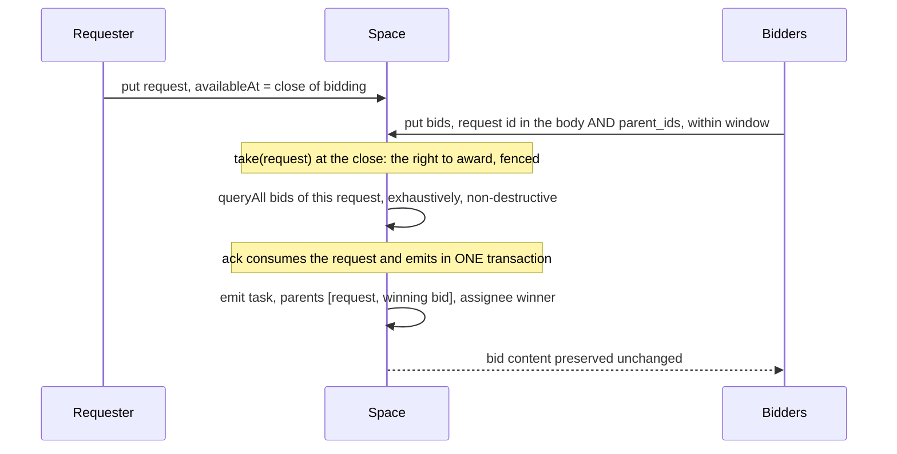

# Capability marketplace (design)

Spec and rationale for request/bid/award coordination and the timing it needs. Origin:
outline §7. The marketplace is not implemented (M2; see
[plan-milestones.md](plan-milestones.md)); the timing half is, under a different name and a
different mechanism (see "Delayed visibility" below).

## Contents
- Invariants
- What it is
- Protocol
- Delayed visibility (what "durable timers" became)
- The mechanism, in built primitives
- Open questions (all eight settled 2026-09-05; unbuilt)

## Invariants

- The award is immutable once emitted, which is a statement about every record and not a
  special rule: bodies never change, envelopes do. Bids are preserved unchanged; only a
  bid's *envelope* may become consumed, never its content. There is no `award` KIND (open
  question 1): the award is the assigned task, parented to the request and the winning bid.
- Time-based predicates alone trigger nothing. A window is an indexed row (`available_at`) that
  a claim path reads lazily, and NOT a sweeper: see "Delayed visibility", which says why one
  should not be built. This invariant named a sweeper until 2026-09-05 and contradicted the
  section below it.

## What it is

There is an agent registry, and the assigned task is directed to the winner. The
advantage over conventional routing is that there is **no preconfigured routing table**,
though routing itself does not disappear. Interest is expressed by bidding, not wired
ahead of time.

**M0 instance (built, without request/bid/award):** the CLI chatbot example already
demonstrates the "no preconfigured routing table" property for *capabilities*. Tool-workers
publish their tools as `capability` records; the agent *discovers* its tool set by querying
them and dispatches by content (`tool_call{tool}` → whichever worker registered
`{tool_call, match:{tool}}`). Adding a worker adds a capability record and the agent gains
the tool with no code change. That is the registry plus content-routed dispatch, minus the
competitive selection that request/bid/award (below) adds. See `examples/chat/`.

## Protocol

1. `put` a `request` record → interested agents `put` `bid` records within the window, each
   naming its request in the BODY (an indexed path, so the awarder can query them) and in
   `parent_ids` (so lineage holds).
2. Selection transaction: read every eligible bid EXHAUSTIVELY (`queryAll`, never a page and
   never `children`; see "Reading the bids") → consume/close the
   request → **emit the assigned task**, `parent_ids: [request, winning_bid]` and
   `assignee: winner`, which IS the award → **all bids preserved unchanged**. Originally
   written as two records, an `award` and then a task; settled as one, open question 1.
3. Zero bids at the close → `nack({backoffSeconds})`, which reopens the auction for another
   window; `maxAttempts` rounds later the request dead-letters, which is the escalation. Open
   question 3.

See [design-data-model.md](design-data-model.md) for the `request` / `bid`
kinds and the parent-lineage rules. There is no `award` kind: the award is the assigned
task's shape, per open question 1. `bid` and the awarded `task` both declare `request` as an
indexed path, and `bid` is `claimable: false`; `request` is claimable, since the award is a claim
on it.

## Delayed visibility (what "durable timers" became)

**BUILT 2026-08-21, and NOT as a sweeper.** The name was the problem: "durable timers" makes
people expect a scheduler, and what a bid window actually needs is for a record to become
claimable later.

`PutRequest.availableAt` seeds the envelope column retry backoff already drove. Nothing fires at
that instant: the record is simply not a take candidate until the database clock passes it
(`rankClaimable`, plus the compare-and-set in each dialect), so a worker sees it on its next poll
and an idle space runs nothing. Bounded by `SpaceContext.maxPutDelaySeconds`, because retention GC
never sweeps unclaimed claimable work.

The sweeper this section used to describe should not be built. The claim path went lazy, so
nothing needs sweeping; and the only idle-safe way to schedule background work here is to ride a
write counter (the amortized GC batch), which an idle space does not turn, and an idle space is
exactly when a timer would matter.

What this does NOT give a marketplace: firing at a deadline with nobody listening. Zero bids at a
deadline still needs somebody to look. `deadline_at` remains stored, indexed on the envelope, and
read by nothing.

## The mechanism, in built primitives

Designed 2026-09-05, nothing built. What it establishes is that the protocol above needs no new
kernel verb, which is the question [design-algebra.md](design-algebra.md) says to settle first.

**The bidding window is `availableAt` ON THE REQUEST, and nothing else.** A request put with
`availableAt` set to its own closing time is READABLE for the whole window (`query`, `read_one`,
`children`) and is not a take candidate until the instant passes. So bidders find it and attach
bids while nobody can award it, and at the close it becomes claimable. Verified against both
adapters by an existing case, whose own note is the point: "available, and not yet claimable: not
the same thing" (`test/conformance/suites/leases.ts`). No sweeper, no timer, no second record, and
no idle space doing work.

**The selection transaction is `take` then `ack`.** Taking the request IS the exclusive right to
award it: at most one valid lease means exactly one awarder, and fencing means a slow awarder
cannot double-award behind a reassignment. The bids are read with
`queryAll({kind: "bid", match: {request: <id>}})`, never through `children`: see "Reading the bids"
below, which is the one place this design can go silently wrong. The `ack` consumes the
request and emits the award in ONE transaction, parented to the request automatically. Every
property the protocol section asks for is already there, so the marketplace is a CONVENTION over
the kernel, in the same tier as workspaces and teams, not an addition to it.

**Reading the bids: `queryAll` on a body field, never `children`, and the awarder MUST hold
`bid: query`.** Two failures sit here, and the first is silent.

`children` is filtered by what the CALLER may read, and says so in its own comment: reaching a
visible record does not make everything hanging off it visible (`handleChildren`,
`src/server/handlers/ops.ts`). An awarder without `bid: query` reading `children(request)` gets an
EMPTY list, so every auction looks like zero bids and nacks its way to `dead_letter` while working
exactly as designed. So `bid: query` is not a privacy preference, it is what makes the mechanism
function at all, and the bid body carries `request: <id>` as an indexed path so the read is a
data-plane query rather than an ops-plane walk.

And it must be `queryAll`, the exhaustive read, whose `Population` brand is the type-level proof.
`getChildren` is a PAGE (100 by default, capped at 500), so selecting a winner from it silently
ignores every bid past the page and the survivors depend on id order. That is this codebase's most
repeated defect, with twenty recorded instances
([plan-bounded-reads.md](plan-bounded-reads.md)), and an earlier draft of this section wrote a
fresh one.

**Sealed or open is then a grant on the BIDDERS.** A bidder holding `request: query,read_one` and
`bid: put` cannot read a rival's bid while still reading its own through self-scope: sealed, with
no mechanism of its own. Granting bidders `bid: query` makes it open-cry. What sealing does NOT
survive is a second awarder, since `bid: query` cannot be self-scoped: open question 7.

**The work binds to the winner through `assignee`**, which `task` already indexes and nothing
currently writes. The winner's take grant is pattern-scoped to its own name, so an awarded task is
claimable by the winner and by nobody else.

## Open questions

Roughly in the order they blocked work, and all eight settled on 2026-09-05. Each keeps its number
and its rejected alternatives, so a discarded shape does not get rediscovered as a new idea.

**What is NOT settled is the code.** The design asks the runtime for nothing, so building it is a
convention on the extensions tier plus an example. Two things carry forward. `claim_until` would
turn a winner's no-show into a crisp fact rather than an inference from silence, and it is the one
runtime change this design would ever ask for (question 2). And an awarder reads bids it did not
write, so several requesters in one space can read each other's, which weakens sealed bidding until
bids are sealed to the requester's key (question 7).

1. **SETTLED (2026-09-05): the award is not a record, it is a SHAPE.** An `ack` emits one result,
   and the protocol above wanted two. It needs one: the ack emits
   `{kind: "task", body: {…work, assignee: winner, request: R}, parentIds: [request, winning_bid]}`.
   The settle path force-prepends the claimed request and keeps the parents the caller adds, so the
   assigned task hangs off the request AND the bid that won it. "Who won R" is then a data-plane
   query, `{kind: "task", match: {request: R}}`, for the same reason the bids are ("Reading the
   bids"): a `children` walk answers only what the CALLER may already read, so it tells a bidder
   without `task: query` that nobody won. One transaction, no gap to reconcile, no new kind, and
   `assignee` is already an indexed path on `task`, so the awarded work is work: ordinary claimants,
   `radia doctor` and the starvation check all understand it with no special case.

   The reason to prefer it is that it DISSOLVES the question rather than answering it. There is no
   second record to emit because the award was never a noun. Same move as "the table is the query"
   ([research-applications.md](research-applications.md) §2.2).

   The invariant above ("an `award` record is immutable once emitted") survives as a statement about
   every record, which is what it always was: bodies never change, envelopes do.

   Alternatives, and why not:
   - **The award IS the task, under the name `award`.** Identical atomicity, keeps the noun, but
     invents a claimable kind nothing else understands where this reuses `task`.
   - **Award first, then a put keyed on the award's id.** Two explicit records, and award-first is
     the only safe order since the task is derivable from the award and not the reverse. Costs a
     crash window and a reconciler nobody has written: an award with no child task. The outbox
     pattern, familiar and honest, and worth revisiting only if a reader of awards appears that
     cannot read tasks.
   - **The bid is the work ticket.** A take grant accepts `scope: {createdBy: "self"}`, so a bidder
     can hold `bid: put,take` over its own records alone, and the winner claims its own bid rather
     than a new record. No second record at all. REJECTED for one reason: nothing stops a LOSER
     claiming its own bid and working unbidden. The result is parented to a bid with no award, so
     it is auditable and not prevented, and an authorization design should not trade enforcement
     for elegance.

   A claim this section made and got wrong, kept because it is the tempting mistake: that merging
   the award into the task "loses the decision when the work is dead-lettered". It does not.
   Records are immutable and only the envelope moves, so a consumed or dead-lettered task still
   carries its body and both parents.
2. **SETTLED (2026-09-05): failure is a RECORD, and recovery is RE-AWARD, not re-auction.** The
   question assumed a new auction. That is the last resort, and it is why the invariant "all bids
   preserved unchanged" earns its place rather than restating record immutability: the bid list IS
   the recovery plan. Bids stay queryable by their `request` field after the request is consumed,
   so the auctioneer picks the next bid and puts a successor task parented to
   `[failed task, next bid]` with `assignee` set to the runner-up. Only an EXHAUSTED bid list
   produces a fresh request, parented to the last failure.

   Four ways a winner fails, and each is already detectable:
   - **It cannot do the work and says so.** An ack, never a nack, by the rule
     `extensions/ts/tool-worker.ts` already states: a refusal is an answer, since redelivery will
     not change it. The failure result is a record the auctioneer holds an interest in, so recovery
     is content-routed with nothing polling.
   - **It crashes mid-work.** The lease lapses, `attempt` climbs, and the task dead-letters at
     `maxAttempts`.
   - **It never claims at all.** The task sits `available` forever, which retention GC never sweeps.
     The starvation check already classifies this: a task assigned to an agent whose run is gone has
     no live interest matching it, so it is reported ORPHANED
     (`test/conformance/suites/starvation.ts`).
   - **It claims and stalls.** Bounded by the cumulative renewal cap, so the lease terminates rather
     than being held indefinitely.

   The auctioneer sees the last three without the `observe` power, because the awarded task's
   `created_by` is ITS run (the task was its ack result) and a self-scoped `task: query` grant makes
   a principal ops-eligible for its own records (`opsEligible` in `src/core/authorization.ts`).
   Awarding and repairing are the same role, which is one more reason question 7 needs an answer.

   Three limits, stated rather than hidden. The successor task is an ordinary put and is NOT fenced
   against a second auctioneer; an idempotency key on the failed task's id makes a concurrent
   duplicate a replay instead of a second award, for the idempotency window and no longer.
   `claim_until` would be the natural way to bound the winner's chance to START, which would turn a
   no-show into a crisp fact rather than an inference from silence; it cannot be used, because the
   column is written as `undefined` and compared nowhere (see
   [design-data-model.md](design-data-model.md)). Building it is the smallest runtime change this
   design would ask for, and it is not needed for a first cut.

   And **a winner that was never granted `task: take {assignee: self}` presents as a no-show.** The
   award binds by `assignee`, so a bidder holding no such grant wins and can never claim its prize;
   the third failure mode above then re-awards, diagnosing a missing grant as an absent worker and
   spending a round on it. The awarder cannot pre-check, since reading another principal's
   permissions needs the `observe` ops power, which question 7 spends the whole design avoiding. The
   cheap mitigation is at setup rather than at runtime: the grant that lets an agent BID and the
   grant that lets it RECEIVE work are issued together, so a bidder that can bid can always be paid.
3. **SETTLED (2026-09-05): zero bids is a NACK whose backoff is the next window.** Reopening an
   auction is the same mechanism as opening one. The first window is `availableAt` at put time;
   every later window is `nack({backoffSeconds})`, and both write the same envelope column, since
   nack rewrites `available_at`. The request stays readable throughout, so bidders see it during
   each round exactly as they saw it during the first.

   The tool-worker rule ("a refusal is an ANSWER, never a nack") does not apply here, and the
   reason it does not is the test for every other case: a nack is right when redelivery could
   change the outcome. An empty program is empty again on redelivery; a request with no bids may
   attract one, because a bidder can arrive between rounds. This is the case nack was built for.

   **"No ACCEPTABLE bid" is the same case**, settled the same way, which removes a branch the
   protocol would otherwise need.

   **Escalation needs no kind, and the protocol's "escalate" now has an answer.** Rounds are
   bounded by `maxAttempts`, so an auction nobody bids on ends in `dead_letter`, which `radia
   doctor` reports. The escalation path is the one every other kind of abandoned work already uses.

   `radia requeue` REVIVES the record and does not reopen the auction: it makes the request
   claimable NOW, so the next award attempt runs with a zero-length window and sees only the bids
   that were already there. A revived auction that wants a fresh window needs a nack after the
   requeue, or a new request. Say this where an operator reads it, since "requeue" invites the
   other reading.

   **A requester may instead END the auction** by acking with a result that names no winner, which
   is right when the deadline is real and late work is worthless. That is an ordinary record, not
   an `escalation` kind: whoever cares routes on it.

   **Never `release`.** Attempt +0 means unbounded rounds, and unclaimed claimable work is never
   swept by retention GC, so a request nobody wants would become permanent litter that no sweep can
   reach.

   The limit, stated: `maxAttempts` is space-wide (`SpaceContext`, default 5) with no per-kind
   override, so an auction gets exactly as many rounds as that space gives any record. Auctions
   wanting their own budget would need a `KindDef` field, which is a runtime change rather than a
   convention, and no first cut needs it.
4. **SETTLED (2026-09-05): a bid's body is OPAQUE to the runtime.** The kernel supplies lineage,
   immutability and one-winner; ranking is the requester's policy and stays outside.

   Three reasons, in order. A ranking rule is an ordering FUNCTION, which is code, and the only way
   to carry it in a record is the expression language "patterns are data, not code" forbids
   (`$where`, `$expr`, never). A fixed rule instead ("lowest number wins") bakes a business
   decision into a coordination runtime. And ranking by price needs a price, which needs an
   accounting unit, which needs budgets, deferred in [design-auth.md](design-auth.md).

   **The boundary with M3, which is the reason this question exists.** `effective_priority` is
   ADMISSION, what runs when under cost pressure ([design-scheduler.md](design-scheduler.md)).
   Selection is WHO does one piece of work. Different questions, and naming them apart is what
   keeps M2 from quietly becoming M3.

   **Opaque does not mean unindexable**, which is the misreading to head off. A `bid` kind may
   declare `sortablePaths` and a requester may order by them with `queryOrdered`. The index is an
   index; the policy is still the requester's.

   The audit story is stronger this way, not weaker: every bid names its request and parents it, so
   anyone with read access can re-run any ranking they like over the same inputs. A private policy
   over public inputs beats a uniform runtime policy, because a dispute is about the inputs.
5. **SETTLED (2026-09-05): late bids are ACCEPTED and filtered at award time, and the filter is
   exact.** Eligible bids are `queryAll({kind: "bid", match: {request: <id>}})` (never `children`,
   see "Reading the bids") whose `created_at` is at or before the request's
   `available_at` when the claim is made. Both sides of that comparison are SERVER-ASSIGNED:
   `created_at` is runtime-authoritative and never client-editable, and `available_at` is the
   runtime's from the moment it is seeded (clamped forward, bounded, rewritten on every nack). A
   bidder cannot backdate a bid and the awarder has to trust nothing.

   **Refusing at write time was rejected on cost and on layering.** A `put` does not read its
   parents' envelopes, and making it do so would charge every parented write for a rule that
   belongs to one convention.

   **Accepting is also RIGHT, not merely cheap**, and question 3 is why. With rounds, "late" is
   relative to a round: `available_at` after a nack IS the current round's close, so the one rule
   above covers every round without bookkeeping. Earlier rounds' bids stay eligible, and a bid that
   missed round N competes in round N+1. Refusing at write would throw away a bid that becomes
   valid moments later. A bid arriving between the close and the claim behaves the same way:
   excluded this round, eligible next.
6. **SETTLED (2026-09-05): `bid` declares `defaultRetentionSeconds`, and that value IS the audit
   window for awards.** Nothing else can retire them: compaction serves keyed registries and every
   bid is distinct, so there is no content key to compact on, and retention GC sweeps only what
   carries `retention_until`, which comes from the record or its kind's default and is materialized
   at commit so a later redeclaration never rewrites history.

   **Choosing the number is an audit decision, not a storage one.** Question 7 rests on losing bids
   making a requester's discretion legible. Sweeping them ends that, so the retention is precisely
   how long an award can be second-guessed. Say that where the number is set.

   **The consequence to design around: GC does not protect a record because something still names
   it as a parent.** The sweep selects on `retention_until` alone (`src/core/gc.ts`), so a swept
   winning bid leaves a dangling parent on the awarded task. Therefore **the awarded task copies
   the terms it was awarded on** and stands alone: the bid is the evidence, the task is the
   contract. What survives a sweep either way is the event residue, which keeps the id, kind,
   digest and transitions until the event horizon, so "a bid existed, and here is its digest"
   outlives its body ([plan-gc.md](plan-gc.md)).

   **`request` gets no such story, and the reason is structural.** The sweep takes records in
   `consumed` or `dead_letter`, plus ANY state for kinds declared `claimable: false`
   (`sweepSelector`, `src/core/gc.ts`). `request` is claimable, so retention reaches it only once
   an auction ends, which the nack rounds of question 3 guarantee for any auction somebody awards.
   An ABANDONED auction, whose requester died before its own close, sits `available` forever and no
   retention value can reach it, by the same rule that protects unclaimed work from being swept out
   from under a worker that is merely slow. There is no mechanism for this and inventing one here
   would be worse than the leak: the detector is the orphan report (`radia doctor`), and the answer
   is that a requester should be a durable role, which is what question 7 makes it.
7. **SETTLED (2026-09-05): the REQUESTER awards, under `request: take` scoped to
   `createdBy: "self"`.** No new principal and no new trust: an agent runs its own auctions and
   structurally cannot touch anyone else's, since a take grant accepts self-scope
   (`selfScoped`/`readAccess` in `src/core/authorization.ts`, where `GrantOp` includes `take`).

   The reason is not convenience. **A global auctioneer is a routing monopoly**, one principal
   deciding who gets every piece of work in the space, which is the preconfigured routing table
   this design exists to remove, wearing a principal's name instead of a config file's. The
   framing section claims the advantage is that routing is not wired ahead of time; a referee with
   `request: take` over everything wires it again.

   The obvious objection, that a requester can favour a bidder, is not a defect. The requester is
   the party with an interest in the outcome, so choosing is its job. What the space adds is that
   the choice is LEGIBLE: the winning bid and every rejected one are children of the request, so
   the discretion can be audited after the fact. A routing table's choice cannot be.

   Repair falls out of question 2 rather than needing its own answer: the awarded task's
   `created_by` is the requester's run, so the same self-scope covers the envelopes it must watch.

   **The exception, with its cost stated.** A referee principal is right when the bidders need one
   rather than the requester, an internal market where teams bid for shared capacity being the
   case. Grant it `request: take` unscoped and accept what that means: it can award every request
   in the space, and it is a router with discretion. Name it in the deployment, never in the
   protocol.

   **What this costs, and it is a REQUIREMENT rather than a wrinkle.** An awarder reads bids it did
   not write, so it must hold `bid: query`, which cannot be self-scoped, and scoping it per auction
   would mean a grant per request. Without it the awarder reads nothing at all and every auction
   looks empty ("Reading the bids"). The unavoidable consequence: where several requesters share a
   space, each can read the others' bids, so sealing holds against bidders and not against fellow
   awarders. Sealing a bid to the requester's key is the path
   ([plan-encryption.md](plan-encryption.md) already does this for chat prose, per conversation),
   and it is only needed once requesters are each other's rivals.
8. **SETTLED (2026-09-05): different layers, not alternatives. Interest is how a bidder FINDS an
   auction; the bid is how it competes in one.** An interest selects by CAPABILITY, do you match
   this shape, which is the space's job. A bid selects by TERMS, what will you do it for, which is
   the requester's. A bidder therefore holds a standing interest in the requests it might want, and
   bids on the ones it does.

   **Which to reach for.** Fungible work, where any qualified worker will do, is a plain task
   routed by interest: first taker wins, no window, no round trip. An auction is for when the
   CHOICE matters, and it costs one window's latency to get it. If nothing about the answer would
   change with a different worker, the auction is pure overhead.

   **The anti-pattern, named because it is exactly the drift this question feared:** do not
   implement bidding as one dynamic interest per request. Interests are a per-run registry with a
   per-principal ceiling (`maxInterestsPerPrincipal`, `429 too_many_interests`), so an interest per
   auction exhausts the ceiling and pollutes the routing views the starvation check and the console
   read, which is somebody else's read cost paying for your protocol.
