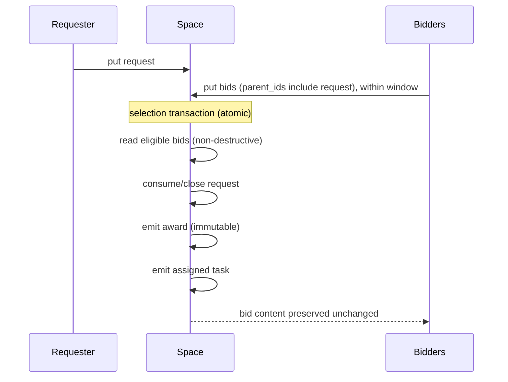

# Capability marketplace (design)

Spec and rationale for request/bid/award coordination and the timing it needs. Origin:
outline §7. The marketplace is not implemented (M2; see
[plan-milestones.md](plan-milestones.md)); the timing half is, under a different name and a
different mechanism (see "Delayed visibility" below).

## Contents
- Invariants
- What it is (honest framing)
- Protocol
- Delayed visibility (what "durable timers" became)

## Invariants

- An `award` record is immutable once emitted. Bids are preserved unchanged; only a
  bid's *envelope* may become consumed, never its content.
- Time-based predicates alone trigger nothing. Windows and deadlines are driven by
  indexed rows and a sweeper, not by predicate evaluation.

## What it is (honest framing)

There is an agent registry, and the assigned task is directed to the winner. The
advantage over conventional routing is that there is **no preconfigured routing table**,
though routing itself does not disappear. Interest is expressed by bidding, not wired
ahead of time.

**M0 instance (built, without request/bid/award):** the CLI chatbot example already
demonstrates the "no preconfigured routing table" property for *capabilities*. Tool-workers
publish their tools as `capability` records; the agent *discovers* its tool set by querying
them and dispatches by content (`tool_call{tool}` → whichever worker registered
`{tool_call, match:{tool}}`). Adding a worker adds a capability record and the agent gains
the tool with no code change. That is the registry plus content-routed dispatch, minus the
competitive selection that request/bid/award (below) adds. See `examples/chat/`.

## Protocol

1. `put` a `request` record → interested agents `put` `bid` records (linked via
   `parent_ids`) within the window.
2. Selection transaction: non-destructively read eligible bids → consume/close the
   request → **emit an immutable `award` record** (`parent_ids: [request, winning_bid]`,
   body: winner + assigned task id) → emit the assigned task → **all bids preserved
   unchanged**.
3. Zero bids at deadline → escalate.

See [design-data-model.md](design-data-model.md) for the `request` / `bid` / `award`
kinds and the parent-lineage rules.

## Delayed visibility (what "durable timers" became)

**BUILT 2026-08-21, and NOT as a sweeper.** The name was the problem: "durable timers" makes
people expect a scheduler, and what a bid window actually needs is for a record to become
claimable later.

`PutRequest.availableAt` seeds the envelope column retry backoff already drove. Nothing fires at
that instant: the record is simply not a take candidate until the database clock passes it
(`rankClaimable`, plus the compare-and-set in each dialect), so a worker sees it on its next poll
and an idle space runs nothing. Bounded by `SpaceContext.maxPutDelaySeconds`, because retention GC
never sweeps unclaimed claimable work.

The sweeper this section used to describe should not be built. The claim path went lazy, so
nothing needs sweeping; and the only idle-safe way to schedule background work here is to ride a
write counter (the amortized GC batch), which an idle space does not turn, and an idle space is
exactly when a timer would matter.

What this does NOT give a marketplace: firing at a deadline with nobody listening. Zero bids at a
deadline still needs somebody to look. `deadline_at` remains stored, indexed on the envelope, and
read by nothing.
