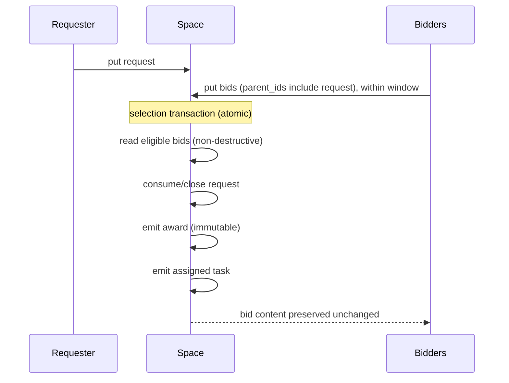

# Capability marketplace (design)

Spec and rationale for request/bid/award coordination and durable timers. Origin:
outline §7. Not yet implemented (M2; see [plan-milestones.md](plan-milestones.md)).

## Contents
- Invariants
- What it is (honest framing)
- Protocol
- Durable timers

## Invariants

- An `award` record is immutable once emitted. Bids are preserved unchanged; only a
  bid's *envelope* may become consumed, never its content.
- Time-based predicates alone trigger nothing. Windows and deadlines are driven by
  indexed rows and a sweeper, not by predicate evaluation.

## What it is (honest framing)

There is an agent registry, and the assigned task is directed to the winner. The
advantage over conventional routing is that there is **no preconfigured routing table**,
though routing itself does not disappear. Interest is expressed by bidding, not wired
ahead of time.

**M0 instance (built, without request/bid/award):** the CLI chatbot example already
demonstrates the "no preconfigured routing table" property for *capabilities*. Tool-workers
publish their tools as `capability` records; the agent *discovers* its tool set by querying
them and dispatches by content (`tool_call{tool}` → whichever worker registered
`{tool_call, match:{tool}}`). Adding a worker adds a capability record and the agent gains
the tool with no code change. That is the registry plus content-routed dispatch, minus the
competitive selection that request/bid/award (below) adds. See `examples/chat/`.

## Protocol

1. `put` a `request` record → interested agents `put` `bid` records (linked via
   `parent_ids`) within the window.
2. Selection transaction: non-destructively read eligible bids → consume/close the
   request → **emit an immutable `award` record** (`parent_ids: [request, winning_bid]`,
   body: winner + assigned task id) → emit the assigned task → **all bids preserved
   unchanged**.
3. Zero bids at deadline → escalate.

See [design-data-model.md](design-data-model.md) for the `request` / `bid` / `award`
kinds and the parent-lineage rules.

## Durable timers

Windows and deadlines are `available_at` / `deadline_at`-indexed rows driven by a
sweeper. This is the same timer machinery as lease backoff, resurrection, and priority
aging (see [design-storage.md](design-storage.md)).
