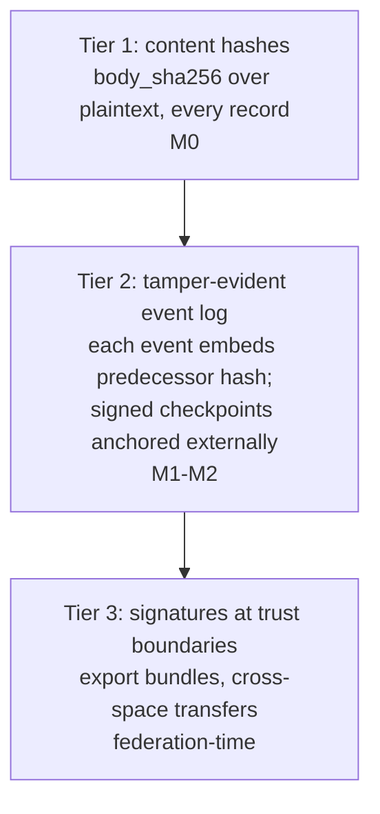

# Observability, audit, re-execution (design)

Spec and rationale for the event log, diagnostics, livelock detection, re-execution, and
the integrity and confidentiality architectures. Origin: outline §9.

**M0/M1 status:** the **transactional event log** (append-only, same-transaction, run
identity), **lineage** query, and `body_sha256` are built. Event append lives in each
adapter (`appendEvent`), lineage in `src/core/space.ts` (`getLineage`), read via
`GET /v0/ops/events` and `GET /v0/ops/records/{id}/lineage` (ancestors, UP) with its reverse
`GET /v0/ops/records/{id}/children` (records that reference this one, DOWN, `childrenOf`); watches
consume the log (`src/core/notifier.ts`). The web console surfaces these: a live event **Feed**, and a
**relationship graph** (`Space.getGraph` over `childrenOf`, `GET /v0/ops/records/{id}/graph`)
that renders the `parent_ids` DAG around a record. The runtime **envelope** (state/attempt/
lease, the dimension the content-routing query language deliberately omits) is queryable at
`GET /v0/ops/records?state=…[&expired=1&stale=<s>]` (`Space.queryEnvelopes`); a first
**derived-diagnostics** report (`Space.diagnostics`, `GET /v0/ops/diagnostics`) is a
*composition* of those envelope queries (counts, dead-letters, expired-but-stuck leases, and
stale-available records), and **remediation** (`adminTransition`,
`POST /v0/ops/records/{id}/{reclaim|dead-letter|requeue}`) can act on them. The taint-clearing
**declassify** (`POST /v0/ops/records/{id}/declassify`, operator-gated; see
[design-auth.md](design-auth.md)) is the other operator action on this plane. All `/v0/ops/*` is
grant-gated to operator principals (enforced). **Not
implemented:** the hash-chained/anchored tamper-evident log (§9.1, M1–M2), envelope
repeated-shape livelock detection (M3),
re-execution tooling (M3), and the full orphan/starving-pattern analysis (M1; the current
diagnostics use age/state heuristics, not pattern-match analysis).

## Contents
- Invariants
- Event log
- Diagnostics
- Livelock detection
- Re-execution
- Schema/pattern lifecycle
- Integrity architecture (why records are NOT signed)
- Confidentiality architecture (three layers)

## Invariants

- The event log is append-only and written in the **same transaction** as each mutation,
  with run identity on every event.
- The lineage DAG is acyclic by construction (see
  [design-data-model.md](design-data-model.md)); livelock is a *repeating signature along
  a chain*, not a cycle.
- `body_sha256` hashes **plaintext**, and the event chain hashes content hashes, not
  content, so crypto-shredding a payload leaves the chain verifiable. **Built for artifacts**
  (`Space.shredArtifact`, `POST /v0/ops/records/{id}/shred`), and only for artifacts: record bodies
  are plaintext JSON because the routing language matches on them, so they have no erasure path. See
  [design-data-model.md](design-data-model.md), "Erasure".

## Event log

Append-only, same transaction as each mutation, run identity on every event. Incident
scope = one lineage query. Retention vs. deletion duties are handled by crypto-shredding
or payload tombstoning (envelope + hashes retained, body destroyed), planned from day
one.

## Diagnostics

Orphan records · starving patterns · wakeup amplification · duplicate-execution rate.

Diagnostics are **compositions of substrate queries, not hand-rolled reports.** The building
block is the envelope query (`Space.queryEnvelopes` / `GET /v0/ops/records?state=…`): filter
records by runtime state, plus `expired` (lapsed lease) and `stale` (seconds sat available).
Query-where-possible has a real boundary here: the content-routing pattern language matches
record *bodies* (for routing) and deliberately can't see the envelope, so envelope filtering,
aggregation (stats), and DAG-traversal (lineage/graph) are first-class ops capabilities rather
than pattern queries. Pushing them into the body-match DSL would corrupt it. What *can* be a
query is one (the envelope filter); what genuinely can't stays a derived capability.

**Remediation shares the diagnostic's selector.** `POST /v0/ops/remediate` takes the same envelope
selector as `GET /v0/ops/records` (`{state, expired, stale, limit}`), so "what is wrong" and "fix
it" are one query language. `radia reclaim --all --drain` is the CLI spelling. Per-id remediation
remains for surgical cases; a backlog is one call per page, not one call per record.

One guard is not optional: a selector on `state: available` **excludes `claimable:false` kinds**.
Reference records (the kind registry itself, grants, agent runs, facts) sit available forever by
design, so the broadest selector would otherwise sweep them into `dead_letter` and break the space.
`dead_letter` is deliberately not filtered, since that is the recovery path.

**There is no `expired` record state.** A lapsed lease leaves the record `leased` (a later take
reclaims it, bumping the attempt), so nothing ever writes `expired`, and diagnostics deliberately
does not report a count for it. The real number is `stuckLeases`, which carries `atLeast` when its
scan hit the sample cap: a bounded scan must not present itself as a census.

The **stale-available** (starvation) check counts only **claimable** kinds. A record of a
`claimable:false` reference kind (facts, config, grants, history) sitting `available` forever is
normal, not stale, so it is excluded at the query level (`excludeKinds`, before the sample cap, so
real starved work is never crowded out by reference records). See
[design-matching.md](design-matching.md) `claimable`.

## Livelock detection: repeated shapes, not cycles

The lineage DAG is acyclic by construction; ping-pong livelock is a repeating signature
along a chain. Detect via:

- repeated (agent, pattern/kind) signatures along ancestry,
- max hop count,
- max repeated-activation count,
- no-progress detection via content hashes or an application-defined progress score
  (e.g. a signature pair repeated ≥3× with no progress delta → quarantine + surface).

## Re-execution, not replay

Capture: agent/prompt versions, model + provider + params, tool I/O, retrieval results,
schema and policy versions, artifact hashes, scheduler decisions, and logical time.
External effects are suppressed / mocked / routed through replay-aware adapters.

## Schema/pattern lifecycle

Patterns pin validated schema versions; migration re-validates or quarantines
(fault-injection case: migration with live patterns; see
[plan-validation.md](plan-validation.md)).

## Integrity architecture (why records are NOT signed)

Per-agent record signatures are **rejected** for the single-space case. The reasoning
(the "why"; do not undo this without revisiting it, see [gotchas.md](gotchas.md)):

- The runtime authenticates every `put` via run tokens and is the sole DB writer, so
  origin is already established authoritatively.
- An agent's signing key would live exactly where its bearer token lives, so run
  compromise compromises the signing oracle.
- Signatures authenticate origin, not trustworthiness (a prompt-injected agent signs its
  poisoned output).
- Server-assigned `runtime_meta` cannot be agent-signed, so only fragments would be
  covered.
- Costs (per-agent PKI, rotation/revocation, and JSON canonicalization, which is a classic
  vuln class) buy nothing against the actual threats.

Three-tier posture instead:

1. **Content hashes everywhere (M0):** `body_sha256` on every record, over plaintext,
   already needed for artifacts, dedup, and no-progress detection; nearly free.
2. **Tamper-evident event log (M1–M2):** each event embeds its predecessor's hash; the
   runtime signs periodic checkpoints; checkpoints are anchored externally (secondary
   store, transparency log, or a git repo). "History cannot be silently rewritten" for
   the whole space at O(1) per event. The chain covers content *hashes*, not content, so
   crypto-shredding deletes a body while the chain stays verifiable.
3. **Signatures at trust boundaries only (federation-time):** export bundles and
   cross-space transfers are runtime-signed together with the checkpoint proving chain
   position. Agent-held keys (via workload identity, no static key at rest) only when
   agents run outside the operator's trust domain or non-repudiation is a regulatory
   requirement.

## Confidentiality architecture (three layers, three owners)

1. **Infrastructure encryption** (disk/TDE, TLS, object-store SSE): a deployment
   prerequisite, stated as such; not a runtime feature.
2. **Runtime-managed envelope encryption: required, not optional.** *(M1: built for artifact
   BLOBS in `src/storage/crypto.ts`, per-blob AES-GCM DEK wrapped under a space KEK, opt-in via
   `RADIA_BLOB_KEK` / `--blob-kek`. Record bodies are still plaintext; KMS wrapping and rotation
   are open.)* The crypto-shredding commitment *is* application-layer encryption:
   deletion-by-key-destruction requires bodies and artifact blobs encrypted under destroyable data
   keys (per kind / tenant / data-subject grouping, KMS-wrapped). This also covers the realistic leak vectors that
   disk encryption does not: backups, snapshots, misconfigured replicas. The
   runtime decrypts on read, so matching is unaffected. `body_sha256` and the event chain
   hash plaintext, so verifiability survives shredding (a retained hash is irreversible).
3. **Client-held-key E2E encryption: client responsibility, supported but never
   managed.** Content-routing is the product: matching, taint, schema validation,
   no-progress hashing, and the inspector all require the runtime to read content, and any
   consuming agent must decrypt into a prompt anyway. Convention for clients who need it
   regardless: **hybrid records**, meaning a plaintext routing envelope (`kind`, verb, priority,
   deadline, declared indexed paths) + an opaque payload (`body.ciphertext` +
   `body.enc_meta`); artifacts may carry client-side-encrypted blobs. Stated plainly:
   **encrypted content is coordination-invisible by construction**: unmatchable,
   untaint-trackable, invisible to diagnostics. Recipient-keyed encryption as a runtime
   feature has the same trigger as boundary signing: federation.
