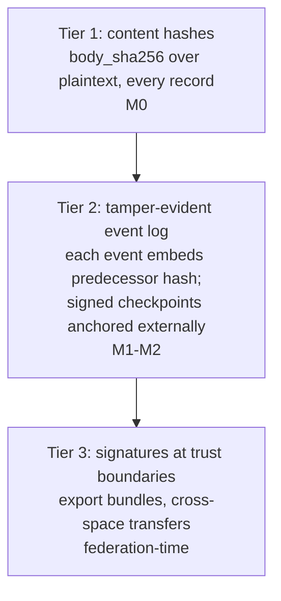

# Observability, audit, re-execution (design)

Spec and rationale for the event log, diagnostics, livelock detection, re-execution, and
the integrity and confidentiality architectures. Origin: outline §9.

**M0/M1 status:** the **transactional event log** (append-only, same-transaction, run
identity), **lineage** query, and `body_sha256` are built. Event append lives in each
adapter (`appendEvent`), lineage in `src/core/space.ts` (`getLineage`), read via
`GET /v0/ops/events` and `GET /v0/ops/records/{id}/lineage` (ancestors, UP) with its reverse
`GET /v0/ops/records/{id}/children` (records that reference this one, DOWN, `childrenOf`); watches
consume the log (`src/core/notifier.ts`). The web console surfaces these: a live event **Feed**, and a
**relationship graph** (`Space.getGraph` over `childrenOf`, `GET /v0/ops/records/{id}/graph`)
that renders the `parent_ids` DAG around a record. The runtime **envelope** (state/attempt/
lease, the dimension the content-routing query language deliberately omits) is queryable at
`GET /v0/ops/records?state=…[&expired=1&stale=<s>]` (`Space.queryEnvelopes`); a first
**derived-diagnostics** report (`Space.diagnostics`, `GET /v0/ops/diagnostics`) is a
*composition* of those envelope queries (counts, dead-letters, expired-but-stuck leases, and
stale-available records), and **remediation** (`adminTransition`,
`POST /v0/ops/records/{id}/{reclaim|dead-letter|requeue}`) can act on them. The taint-clearing
**declassify** (`POST /v0/ops/records/{id}/declassify`, gated by the `declassify` ops power; see
[design-auth.md](design-auth.md)) is the other interrupt on this plane. All `/v0/ops/*` is
power-gated (enforced): operators hold every power, anyone else holds what its `ops_grant`
records assign ([architecture-ops-tiers.md](architecture-ops-tiers.md)). The **hash-chained log is built** (M1: `src/core/seal.ts`, `GET /v0/ops/integrity`); external
anchoring of checkpoints stays M2. **Event-log retention is built** (an M2 slice, 2026-08-06):
opt-in `eventRetentionSeconds` truncates the log to an attested anchor via the `gc` verb, so audit
and re-execution reach the HORIZON, not genesis, on a space that enables it; won/lost is stated in
[plan-gc.md](plan-gc.md) ("The ledger"). **Not
implemented:** envelope
repeated-shape livelock detection (M3),
re-execution tooling (M3). The orphan/starving split IS built (M1): `diagnostics` runs the pattern
match against the live interest registry, so unclaimed work is reported as ORPHANED (no live
interest matches) or STARVING (one does and nothing claims), which are the two causes an age
heuristic conflates and whose remedies point in opposite directions.

## Contents
- Invariants
- Event log
- Diagnostics
- Livelock detection
- Re-execution
- Schema/pattern lifecycle
- Integrity architecture (why records are NOT signed)
- Confidentiality architecture (three layers)

## Invariants

- The event log is append-only and written in the **same transaction** as each mutation,
  with run identity on every event. Append-only means never rewritten, not permanent: with
  `eventRetentionSeconds` set, the `gc` verb deletes a PREFIX, anchored and attested so
  `verifyIntegrity` tells honest truncation from tampering; unset (the default), the log is
  complete from genesis. See [plan-gc.md](plan-gc.md) phase 3.
- The lineage DAG is acyclic by construction (see
  [design-data-model.md](design-data-model.md)); livelock is a *repeating signature along
  a chain*, not a cycle.
- `body_sha256` hashes **plaintext**, and the event chain hashes content hashes, not
  content, so crypto-shredding a payload leaves the chain verifiable. **Built for artifacts**
  (`Space.shredArtifact`, `POST /v0/ops/records/{id}/shred`), and only for artifacts: record bodies
  are plaintext JSON because the routing language matches on them, so they have no erasure path. The
  same property that keeps the chain verifiable is what bounds erasure: the digest it hashes stays in
  an unerasable body, so a shredded payload remains CONFIRMABLE to anyone holding a candidate.
  Erasure protects high-entropy payloads; see [design-data-model.md](design-data-model.md),
  "Erasure".
- **An erasure can stop holding, and that is an observability problem rather than an enforcement
  one.** Shredding destroys the runtime's copy; the content address stays valid, so anyone holding
  the payload can store it again and every record referencing it reads once more. It happened by
  accident before anyone tried it deliberately: a model still carrying the erased text in its
  context re-saved it through an ordinary tool. Neither obvious guard is acceptable — refusing the
  WRITE poisons a content address for the whole space (shred an empty file and nothing can store
  one again), and refusing to SERVE the shredded record while identical bytes are readable through a
  newer one protects the paper trail rather than the person, which is the "structured data looks
  authoritative" failure named in [design-execution.md](design-execution.md). So the fact is
  DERIVED and reported: a shred marker plus a present blob is a reversed erasure
  (`Space.erasures`, `GET /v0/ops/erasures`, and a finding in `diagnostics`/`radia doctor`).
  One `stat` per shred, asked when an operator asks, rather than a query on every artifact read.
  Remediation is NAMED but never automatic: the finding prints the `radia shred <id> --shared` that
  re-erases, together with what it costs, because re-shredding also destroys the bytes for the later
  record that legitimately stored them. The existing shared-payload refusal already forces that
  choice, so stating it in the finding only moves the surprise earlier. The loop then closes on its
  own — `holds` is derived from present state, so re-erasing flips every marker for that digest back
  at once, including the one written before the payload returned.

## Event log

Append-only, same transaction as each mutation, run identity on every event. Incident
scope = one lineage query. Deletion duties are BUILT and split by what is destroyed
([plan-gc.md](plan-gc.md)): crypto-shredding for artifact payloads (chain hashes survive), the
record sweep for bodies (event residue survives), and opt-in event retention for the residue
itself (the anchor seal and its idx-count survive). Each tier trades audit depth for bounded
growth; the ledger in plan-gc.md states what each buys and loses.

## Diagnostics

Orphan records · starving patterns · wakeup amplification · duplicate-execution rate.

Diagnostics are **compositions of ordinary space queries, not hand-rolled reports.** The building
block is the envelope query (`Space.queryEnvelopes` / `GET /v0/ops/records?state=…`): filter
records by runtime state, plus `expired` (lapsed lease), `stale` (seconds sat available) and
`kind`. EVERY ONE OF THOSE IS APPLIED IN SQL, BEFORE THE CAP, so `limit` bounds rows MATCHED and
not rows examined. `expired` and `stale` were once evaluated one layer up, after the `LIMIT`, and
the rows are ordered by `available_at`, which has nothing to do with `leased_until`: a page filled
with live leases hid every lapsed one, so `reclaim --all` reported nothing to do and `doctor`
reported zero stuck leases on a space that had them (fixed 2026-08-21, planted in
`test/conformance/suites/admin.ts`).
Query-where-possible has a real boundary here: the content-routing pattern language matches
record *bodies* (for routing) and deliberately can't see the envelope, so envelope filtering,
aggregation (stats), and DAG-traversal (lineage/graph) are first-class ops capabilities rather
than pattern queries. Pushing them into the body-match DSL would corrupt it. What *can* be a
query is one (the envelope filter); what genuinely can't stays a derived capability.

**Remediation shares the diagnostic's selector.** `POST /v0/ops/remediate` takes the same envelope
selector as `GET /v0/ops/records` (`{state, expired, stale, kind, limit}`), so "what is wrong" and
"fix it" are one query language. `radia reclaim --all --drain` is the CLI spelling. Per-id
remediation remains for surgical cases; a backlog is one call per page, not one call per record.

`kind` is what makes a SHARED space's backlog drainable. Without it, `requeue --all` revives every
dead-lettered record there is, including another app's: `dead_letter` is deliberately not filtered
by the guard below, since that is the recovery path.

One guard is not optional: a selector on `state: available` **excludes `claimable:false` kinds**.
Reference records (the kind registry itself, grants, agent runs, facts) sit available forever by
design, so the broadest selector would otherwise sweep them into `dead_letter` and break the space.
NAMING one explicitly is REFUSED (`kind_not_remediable`, 422) rather than quietly subtracted: the
guard would answer `matched: 0`, and a zero that means "not a thing to fix" reads as "nothing to
fix".

**There is no `expired` record state.** A lapsed lease leaves the record `leased` (a later take
reclaims it, bumping the attempt), so nothing ever writes `expired`, and diagnostics deliberately
does not report a count for it. The real number is `stuckLeases`, which carries `atLeast` when its
scan hit the sample cap: a bounded scan must not present itself as a census.

The **stale-available** (starvation) check counts only **claimable** kinds. A record of a
`claimable:false` reference kind (facts, config, grants, history) sitting `available` forever is
normal, not stale, so it is excluded at the query level (`excludeKinds`, before the sample cap, so
real starved work is never crowded out by reference records). See
[design-matching.md](design-matching.md) `claimable`.

## Livelock detection: repeated shapes, not cycles

The lineage DAG is acyclic by construction; ping-pong livelock is a repeating signature
along a chain. Detect via:

- repeated (agent, pattern/kind) signatures along ancestry,
- max hop count,
- max repeated-activation count,
- no-progress detection via content hashes or an application-defined progress score
  (e.g. a signature pair repeated ≥3× with no progress delta → quarantine + surface).

## Re-execution, not replay

Capture: agent/prompt versions, model + provider + params, tool I/O, retrieval results,
schema and policy versions, artifact hashes, scheduler decisions, and logical time.
External effects are suppressed / mocked / routed through replay-aware adapters.

## Schema/pattern lifecycle

Patterns pin validated schema versions; migration re-validates or quarantines
(fault-injection case: migration with live patterns; see
[plan-validation.md](plan-validation.md)).

## Integrity architecture (why records are NOT signed)

Per-agent record signatures are **rejected** for the single-space case. The reasoning
(the "why"; do not undo this without revisiting it, see [gotchas.md](gotchas.md)):

- The runtime authenticates every `put` via run tokens and is the sole DB writer, so
  origin is already established authoritatively.
- An agent's signing key would live exactly where its bearer token lives, so run
  compromise compromises the signing oracle.
- Signatures authenticate origin, not trustworthiness (a prompt-injected agent signs its
  poisoned output).
- Server-assigned `runtime_meta` cannot be agent-signed, so only fragments would be
  covered.
- Costs (per-agent PKI, rotation/revocation, and JSON canonicalization, which is a classic
  vuln class) buy nothing against the actual threats.

Three-tier posture instead:

1. **Content hashes everywhere (M0):** `body_sha256` on every record, over plaintext,
   already needed for artifacts, dedup, and no-progress detection; nearly free.
2. **Tamper-evident event log (M1 BUILT; anchoring M2):** each event embeds its predecessor's
   hash. The chain covers content *hashes*, not content, so crypto-shredding deletes a body while
   the chain stays verifiable. Five things the build settled:

   - **Sealing cannot happen at append time.** `seq` is assigned on insert but transactions commit
     out of order, so two concurrent appends read the same head and FORK the chain. Serializing
     appends would put every put/take/ack behind one lock, and the contention bench already caps the
     claim path at a few hundred to a few thousand per second on ONE queue. So a sealer walks events
     that are already final, reusing the finality watermark `getEvents` has for gap-free watch
     delivery, and the chain is eventually consistent: `unsealed` says how far behind it is.
   - **It resumes on `(cursor, seq)`, not the cursor.** One transaction appends several events under
     one cursor, and `xid > cursor` steps over the siblings. A watcher losing one drops a wakeup; a
     sealer losing one breaks the chain.
   - **The chain must cover record CONTENT.** Events carried no content hash, so a chain over them
     proved the order and left record bodies unprotected: editing one directly left a perfect chain.
     The put event now carries `body_sha256`, in its own column rather than in `detail`, which is
     caller-influenced.
   - **A chain in the database it protects is not detection.** Anyone who can edit a row can
     recompute every hash after it. What closes that is the SIGNATURE: each link is HMAC'd under a
     key beside the database, so a rewriter can rebuild the chain and cannot sign it. An unsigned
     chain still catches corruption and careless edits, and the report says which guarantee is in
     force rather than letting "verified" mean two things.
   - **A missing index is a deleted link.** Delete an event and its seal together and what remains
     recomputes perfectly; the dense-index check is what catches the cover-up.
   - **Honest truncation must not look like that cover-up.** Event GC deletes a prefix by design,
     so the sweep seals a horizon statement BEFORE deleting and keeps the newest pre-horizon seal
     as the anchor; verify accepts a chain beginning past genesis only when the retained suffix
     attests it (`truncated` in the report), and everything else stays a tamper verdict
     (`unattested_truncation`). See [plan-gc.md](plan-gc.md) phase 3.

   Sealing runs ON DEMAND (verification seals first, the gc verb seals before it sweeps), never on
   a timer: an idle space holds no background work, the same rule `Notifier` and `sweepWatches`
   follow.
3. **Signatures at trust boundaries only (federation-time):** export bundles and
   cross-space transfers are runtime-signed together with the checkpoint proving chain
   position. Agent-held keys (via workload identity, no static key at rest) only when
   agents run outside the operator's trust domain or non-repudiation is a regulatory
   requirement.

## Confidentiality architecture (three layers, three owners)

1. **Infrastructure encryption** (disk/TDE, TLS, object-store SSE): a deployment
   prerequisite, stated as such; not a runtime feature.
2. **Runtime-managed envelope encryption: required, not optional.** *(M1: built for artifact
   BLOBS in `src/storage/crypto.ts`, per-blob AES-GCM DEK wrapped under a space KEK, opt-in via
   `RADIA_BLOB_KEK` / `--blob-kek`, with `RADIA_BLOB_KEK_RETIRED` holding keys kept for reads after a rotation. Record bodies are still plaintext; rotation is built (`kid` on every sealed key, retired keys for reads, `radia rewrap` to finish it), and KMS wrapping
   are open.)* The crypto-shredding commitment *is* application-layer encryption:
   deletion-by-key-destruction requires bodies and artifact blobs encrypted under destroyable data
   keys (per kind / tenant / data-subject grouping, KMS-wrapped). This also covers the realistic leak vectors that
   disk encryption does not: backups, snapshots, misconfigured replicas. The
   runtime decrypts on read, so matching is unaffected. `body_sha256` and the event chain
   hash plaintext, so verifiability survives shredding (a retained hash is irreversible).
3. **Client-held-key E2E encryption: client responsibility, supported but never
   managed.** Content-routing is the product: matching, taint, schema validation,
   no-progress hashing, and the inspector all require the runtime to read content, and any
   consuming agent must decrypt into a prompt anyway. Convention for clients who need it
   regardless: **hybrid records**, meaning a plaintext routing envelope (`kind`, verb, priority,
   deadline, declared indexed paths) + an opaque payload (`body.ciphertext` +
   `body.enc_meta`); artifacts may carry client-side-encrypted blobs. Stated plainly:
   **encrypted content is coordination-invisible by construction**: unmatchable,
   untaint-trackable, invisible to diagnostics. Recipient-keyed encryption as a runtime
   feature has the same trigger as boundary signing: federation.
