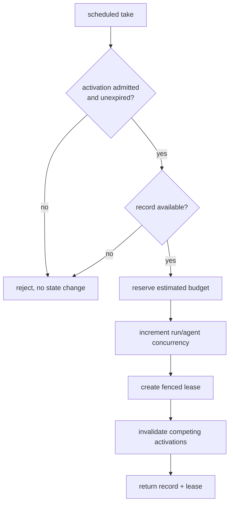

# Scheduler (design)

Spec and rationale for the optional cost-aware admission scheduler. Origin: outline §6.
Not yet implemented (M3 — see [plan-milestones.md](plan-milestones.md)).

## Contents
- Invariants
- Enforcement model
- Atomic admission-to-claim
- Server-computed priority
- Candidate generation

## Invariants

- Admission and claim are one atomic transition. Without atomicity, stale admissions act
  and two agents spend the same budget.
- Agent-supplied values (`confidence`, `est_value`, `est_token_cost`,
  `requested_priority`) are gameable claims, never scheduler inputs. The scheduler
  computes `effective_priority` server-side.
- Scheduler-off degenerates to reactive semantics with no behavior change to the API.

## Enforcement model

In scheduler mode, `take` consults the **agenda**: a record is returned only for an
admitted (record, agent) activation; watches filter to admitted agents. With the
scheduler off, semantics degenerate to reactive (plain content-routed claim).

## Atomic admission-to-claim

A successful scheduled `take` transactionally:

1. validates the activation exists, is admitted, and is unexpired;
2. confirms the record is `available`;
3. **reserves estimated budget**;
4. increments run/agent concurrency;
5. creates the fenced lease;
6. consumes/invalidates competing activations.

All six commit together or none do:

Settlement: `ack` reconciles estimated vs. actual cost; `nack` / `release` / expiry
adjust or release reservations; activation expiry re-opens admission to other candidates.
Budget reservation ties into [design-auth.md](design-auth.md) §Budgets — two readers of
one budget must not both spend it.

## Server-computed priority

`effective_priority` is computed server-side from:

- per-principal priority caps,
- historical calibration of each agent's claims,
- runtime-derived cost estimates,
- fairness / quota terms.

Otherwise one agent monopolizes the agenda by declaring maximum value. Priority is aged
by the sweeper (see [design-storage.md](design-storage.md) timers) so low-priority work
does not starve.

## Candidate generation

No eager (records × agents) materialization. Candidates are computed incrementally on
record / budget / manifest change; capped per record; activations invalidated on change.
Scoring is pluggable; learned scoring only after static scoring is measurable.
