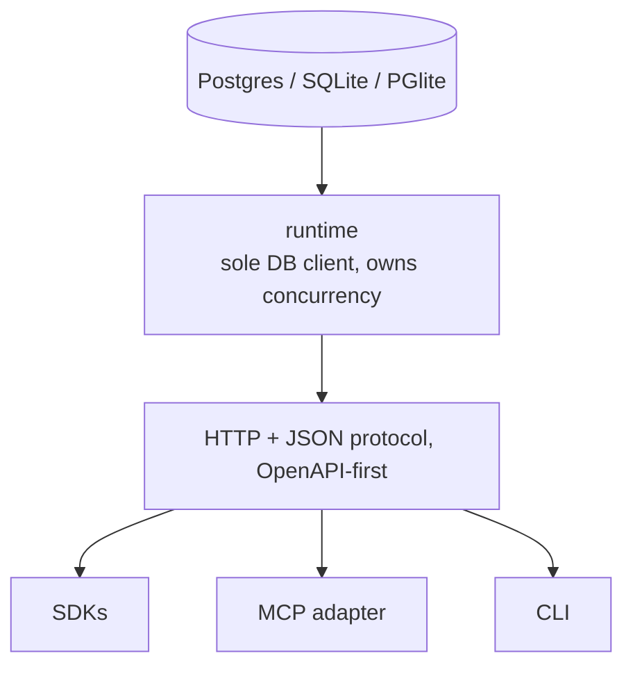

# Storage, deployment, distribution (design)

Spec and rationale for the Postgres mapping, the three deployment modes, and the
distribution strategy. Origin: outline §10.

**M0 status:** three adapters sit behind the `StorageAdapter` port (`src/storage/adapter.ts`).
The two **embedded** ones, `src/storage/pglite.ts` (WASM Postgres) and `src/storage/sqlite.ts`
(built-in `node:sqlite`), carry the record/envelope tables, the partial claim index, and the SQL
mapping below, and both pass the full conformance suite in CI. The `dev` mode is `deno task dev`
(in-memory by default; bare `--db` persists under the one runtime directory `./.radia`
(`src/paths.ts`, `RADIA_DIR` moves it) and `--db <path>` names a place, using a file for SQLite and
a data directory for PGlite; blobs and the space KEK land there too, so one directory is the whole
on-disk footprint; records, envelopes, events, idempotency, and kind declarations all survive restart. Kind
declarations are `kind_def` records (no separate table), reloaded into the in-memory registry at
startup via `Space.loadKinds`). **M1 status (built):** the standalone **Postgres** adapter
(`src/storage/postgres.ts`, deno-postgres pool) shares one Postgres-dialect body with PGlite
(`src/storage/pgbase.ts`, `PgSqlAdapter`), so they can't drift; `--storage postgres` runs it,
and it joins the conformance suite when `RADIA_PG_URL` is set (`scripts/pg-conformance.sh`), which
runs against a live server in CI (`.github/workflows/ci.yml`, the `postgres` job). Perf: the adapter enables
`TCP_NODELAY` (deno-postgres omits it, and otherwise every parameterized query eats a ~40ms
delayed-ACK; see [gotchas.md](gotchas.md)) and the shared body folds the clock read into each
settle transaction and checks parents in one query. **Not implemented:**
`single-node`/`production` deployment modes, the multi-instance cache-coherence work (see
Scaling), envelope encryption/KMS (M2). `npm`/`pip` binary wrapping is BUILT but unpublished
(`deno task release`; see [architecture-surfaces.md](architecture-surfaces.md)).

## Contents
- Invariants
- Postgres mapping
- Deployment modes
- Scaling and multi-instance operation
- Watch delivery under concurrency
- Why zero-setup dev is architecturally cheap
- Distribution

## Invariants

- Embedded mode is never a semantically weaker cousin of Postgres. The full conformance +
  fault-injection suite runs against every storage adapter in CI from day one (also in
  [CLAUDE.md](../CLAUDE.md)). This is the only guard against storage-adapter drift (see
  [gotchas.md](gotchas.md) risk register).
- The runtime is the sole DB client (no non-runtime client speaks SQL; agents speak the
  protocol), so the concurrency guarantees are enforced in the runtime's DB transactions,
  not pushed onto agents, and not held in process-local state on the hot path (which is what
  lets many instances share one Postgres; see Scaling). A checked compare-and-set is the
  *implementation* of the take contract, not the contract.
- The wire contract is frozen, not the implementation or the storage backend.
- All lease/timing math uses the DB clock (`now()`).

## Postgres mapping

| Concept      | Implementation                                                                                                                                                                    |
|--------------|-----------------------------------------------------------------------------------------------------------------------------------------------------------------------------------|
| Storage      | `records` (immutable) + `record_runtime` (mutable envelope), with `kind`, `deadline_at`, and hot routing fields denormalized into `record_runtime` at commit, never client-editable |
| Body index   | `body_jsonb` (a GENERATED column holding the parsed body) under one `gin (body_jsonb jsonb_path_ops)` index, serving pushed equality on EVERY path. Declaring a new `indexedPath` therefore needs no DDL and no migration, which is what keeps kinds-as-records from dragging a schema change behind them   |
| Matching     | a sound SQL pre-filter (`src/storage/pushdown.ts`) narrows; `matchesRecord` decides. An *exact* filter additionally carries the caller's `LIMIT` into SQL, ordered `id collate "C"` to match the oracle's tie-break |
| Claim index  | `CREATE INDEX ON record_runtime (kind, effective_priority DESC, available_at, record_id)`: the claim's ORDER BY, column for column, so a window is an ordered seek that stops when full. `state` must NOT precede the sort columns (it would sort only within each state); a partial `WHERE state='available'` index serves the remediation selectors  |
| take         | bounded candidate window off `record_runtime`, then conditional `UPDATE record_runtime ... RETURNING` per candidate until one affects a row; epoch bump                            |
| Fencing      | `lease_id` / `lease_epoch` conditional updates                                                                                                                                     |
| Idempotency  | `idempotency` table: (principal, op, key) → request hash + stored response (incl. generated IDs); checked **before** lease validation                                              |
| watch        | wakeups (Postgres LISTEN/NOTIFY; embedded: in-process `Notifier`) + event-log cursor catch-up; 410 on expired non-sentinel cursors (fires once event GC sweeps)                                           |
| Timers       | `available_at` / `deadline_at` indexes + sweeper (backoff, bid windows, lease resurrection, priority aging): **M2**                                                                |
| Lineage      | `parent_ids` on the record is the source of truth (walked upward, one batched fetch per depth level); `record_edges (parent_id, child_id)` is a derived REVERSE index for `childrenOf`, written in the same transaction as the record and backfilled from `parent_ids` for databases from an older build. `childrenOf` is BOUNDED and keyset-paged over child id, since fan-out is unbounded in principle, and a graph walk reads a bounded fan-out per node so one hub cannot dominate a step |
| Event log    | append-only `events` table (monotonic seq), same transaction as each mutation                                                                                                     |
| Kinds        | `kind_def` **records** (no table); the in-memory registry is a cache rebuilt at startup by querying them (`Space.loadKinds`)                                                        |
| Clock        | DB `now()` for all lease/timing math                                                                                                                                              |
| Blobs        | the `BlobStore` port (`src/storage/blobs.ts`): content-addressed by sha256, memory + filesystem impls, one conformance suite for both; the "artifact table" is the reserved `artifact` **record** kind; runtime-issued short-lived download capabilities; optional **encryption at rest** (per-blob AES-GCM DEK, AES-KW-wrapped under a space KEK, HMAC-named paths, key in a destroyable sidecar), **built (M1)**                                                         |

The claim index is what lets a candidate window be an ordered seek rather than a scan of the
envelope table. A pattern with a pushable predicate does need the join, and there the two backends
diverge for a reason worth knowing: SQLite walks the claim index and stops early, while Postgres
underestimates the jsonb predicate badly enough to collect every match and sort. Fix the ESTIMATE,
never the query: `StorageAdapter.prepareKind` (optional; implemented by the Postgres adapters,
ignored by SQLite) creates planner statistics on each declared path expression when a kind is
declared, and analyzes BOTH `records` and `record_runtime`, since a claim joins them and missing
statistics on either half sinks the estimate, which is worth roughly 3x on a 20k-record claim and
turns the plan into an ordered index walk. A residual underestimate remains because the two pushed
terms are redundant and the planner assumes independence; details, numbers and method in
[gotchas.md](gotchas.md), "a claim on Postgres is planned on a guess". See
[design-api.md](design-api.md) for the take contract this implements and
[design-data-model.md](design-data-model.md) for the record/envelope split.

The runtime is the sole DB client; everything else speaks the protocol:

## Deployment modes

Adoption constraint (strategy, not packaging): a coordination runtime delivers value
only after multiple agents join, so friction before the first local two-agent demo kills
the funnel. The bar: **`npx radia dev` → running space + web inspector in under a minute;
an agent joins from a second terminal.**

Three modes, one contract:

| Mode          | Invocation                        | Storage                        | Auth                                                              | Integrity                                     |
|---------------|-----------------------------------|--------------------------------|-------------------------------------------------------------------|-----------------------------------------------|
| `dev`         | `npx radia dev` (also `pipx run`) | embedded (SQLite/PGlite), 1 proc | auto-provisioned local credentials, **same API shape, never "no tokens"** | event log, hash chain optional               |
| `single-node` | binary + config                   | Postgres                       | admin-provisioned definitions                                     | hash-chained log                              |
| `production`  | HA deployment                     | HA Postgres                    | full control plane, workload identity, KMS                        | anchored signed checkpoints, envelope encryption |

For local Postgres-backed dev, `docker/postgres/compose.yaml` brings up a persistent server
(`docker compose -f docker/postgres/compose.yaml up -d --wait`) and `deno task dev:pg` runs
`radia dev --storage postgres` against it, and tables auto-create on first connect. Distinct from
the throwaway server `scripts/pg-conformance.sh` starts for the test suite.

## Scaling and multi-instance operation

The `production` row is horizontal: **N runtime instances behind a load balancer over one shared
(HA) Postgres.** Nothing on the hot path is process-local, so instances never coordinate with
each other, only with the DB, which is the sole arbiter. The coordination guarantees are
enforced **in the storage transaction**, which is what makes this safe:

- **Claims**: a conditional `UPDATE ... RETURNING` that names the state it expects. With two
  instances racing for the same record, exactly one update affects a row, and the loser reads
  `affectedRows === 0` and moves to the next candidate. The winner is decided by the write, not
  by holding a lock over the candidate set. Locking rows a claimer might *not* take is what
  starved peers (see [gotchas.md](gotchas.md), "a claim must not lock what it does not claim").
- **Fencing**: `lease_id`/`lease_epoch` conditional updates. A stale settle fails the epoch
  check regardless of which instance issued it.
- **Idempotency**: the `(principal, op, key)` unique row. A retried write collapses to one
  effect no matter which instance handles the retry.
- **Ordering/audit**: the append-only `events` table (monotonic seq) is written in the same
  transaction as each mutation; every instance reads one truth.

So the invariant "the runtime is the sole DB client" means *no non-runtime client speaks SQL*
(agents speak the protocol), **not** one process. Requests carry a Bearer token and hold no
server session, so any instance can serve any request.

**Process-local caches that must become cross-instance-aware for correct HA.** Each is a
cache/projection over records (the durable truth is always the records); a write updates the
handling instance's cache live, but a second instance stays stale until it reloads (today: only
at startup):

| Cache | Source records | Staleness across instances | Fix |
|-------|----------------|----------------------------|-----|
| kind registry (`Space.loadKinds`)      | `kind_def`  | **closed 2026-08-03**: a kind declared on A was unknown to B until reload, so B could not compile patterns for it | done (`Space.compileFresh` re-reads the kind when a compile shows the projection stale) |
| `Notifier` (`src/core/notifier.ts`)    | event log   | **closed 2026-08-03**: a waiting stream polls the log every `CHANGE_POLL_MS`, so a watch on B wakes for a mutation on A | done (poll, not `LISTEN/NOTIFY`: deno-postgres 0.19 has no async notification API) |

**Credentials are deliberately not in this table.** There is no token cache to go stale:
`Space.resolveCredential` (`src/core/space.ts`) reads the `agent_definition` / `agent_run` records
on **every** request, keyed on the indexed `tokenHash`, so a stopped run, an expired token and a
token minted on another instance are all *discovered* rather than remembered. Because a stop
successor carries the same hash, the newest record for that hash is the current state of the
credential. `CredentialStore` (`src/core/auth.ts`) retains only two things that cannot go stale:
operator token hashes (process-lifetime, never records, since the console needs one before any
agent exists) and a run → agent memo that is immutable for the life of the run. Never cache state
whose failure mode is silent misauthorization; resolve it from records per request instead.

The `Notifier` gap was always self-healing (the event log is the source of truth, so a missed
cross-instance wakeup **degrades to poll-catchup, never a lost event**, *given a gap-free event
cursor*; see "Watch delivery under concurrency" below), and it is now closed by making that
catch-up prompt instead of keepalive-paced: a parked waiter polls the log on a 250ms interval and
wakes on anything committed after its cursor. It is a poll rather than `LISTEN`/`NOTIFY` because
the driver offers no third option, and the cost is bounded by running only while a stream is
actually waiting (`src/core/notifier.ts`, `Space.pollForForeignChanges`). The kind registry gap is
closed separately, by `Space.compileFresh` re-reading a kind when a compile shows the projection
stale.
(Open, for the caches that remain: LISTEN/NOTIFY-driven invalidation vs. bounded TTLs vs. the
on-miss-hydrate pattern; likely a mix, cache-dependent.)

## Watch delivery under concurrency

The event log's `seq` is a `bigint … identity`, assigned at INSERT time inside each mutation's
transaction. On a **single connection** (embedded) transactions commit in seq order, so a watcher
consuming `seq > cursor` never skips. On the **pooled** Postgres adapter, transactions commit out
of seq order, so a watch cursor must never be `seq`: a watcher can read seq 11 (committed), advance
its cursor past 11, and then seq 10 commits and is skipped forever by `seq > 11`. That silently
drops watch/SSE deliveries, felt as chat "slowness", because the affected hop waits for the
worker's `take()` poll fallback instead of the instant wakeup.

So (`src/storage/pgbase.ts`) the watch cursor is the inserting **transaction id** (`xid`), not
`seq`, and `getEvents` withholds events until they are below the snapshot watermark
`pg_snapshot_xmin(pg_current_snapshot())`, i.e. no older transaction can still commit a lower-
ordered event. Ordering by `(xid, seq)` under that watermark is gap-free: each `xid` enters exactly
one `(cursor, watermark]` window as the watermark advances, so a late-committing straggler is
delivered then, not skipped. The cursor is **opaque** end-to-end (`SpaceEvent.cursor: string`, the
SSE `id:` / `Last-Event-ID`). The transport only echoes it; each adapter interprets it (embedded:
`seq`; Postgres: `xid`). Embedded keeps `cursor == seq` and is unaffected. Verified by a
concurrent-writer test (a watcher polling while N puts commit over the pool misses none).

**Current build:** the standalone **Postgres adapter is built** (`src/storage/postgres.ts`) with
compare-and-set claims, so the hot path is multi-instance-safe. Real HA still needs the caches above
made cross-instance-aware (write-invalidation or bounded TTL), plus the pg adapter's live-server
conformance run in CI. The embedded adapters (SQLite/PGlite) remain one-process by nature. Nothing in the design or the wire contract limits Radia to one server.

## Why zero-setup dev is architecturally cheap

Because the runtime is the sole DB client, all concurrency guarantees (atomic take,
fencing, idempotency serialization) live in the runtime process. An embedded mode backs
the same semantics with SQLite (WAL) or PGlite, serializing takes in-process. Leases,
fencing, the event log, durable timers, and dead-lettering all remain meaningful locally:
local agent processes still crash.

## Distribution

Distribution ≠ implementation language: ship one native (or single-runtime) server binary
wrapped for both `npm` and `pip` (the esbuild/uv pattern), because agent developers split
across both ecosystems. M0 decision: a **Deno + TypeScript** server on **PGlite**.
`deno compile` gives per-OS binaries with no build step for dev, and PGlite keeps the M0
SQL dialect aligned with the M1 Postgres adapter. The wire contract is frozen, so the
implementation can be rewritten behind the stable OpenAPI protocol later. See
[plan-m0-implementation.md](plan-m0-implementation.md) for the runtime rationale and build
plan.

**That "later" was settled on 2026-08-04: the kernel stays through M1, and the question reopens only
on evidence** — see [plan-milestones.md](plan-milestones.md) "Decided" for what counts as evidence
(the leading candidate is a requirement for push-based cross-instance wakeup, which this runtime's
Postgres driver cannot serve). A rewrite would touch `src/core`, `src/server` and `src/storage`
only; every surface is a client of this contract.

The `dev` command bundles the MCP adapter and inspector: the sharpest onboarding path is
`npx radia dev`, one line in an MCP-capable harness config (e.g. Claude Code), and a real
agent participating before any SDK code is written.

**Status (M0 Phase 7):** `radia dev`, `radia mcp`, and the per-OS binaries are built, and
`deno task release` stages the npm and pip launcher packages (`scripts/build-release.sh`).
The `npx`/`pipx` path itself is unexercised and needs a registry publish. See
[architecture-surfaces.md](architecture-surfaces.md) "Distribution".
