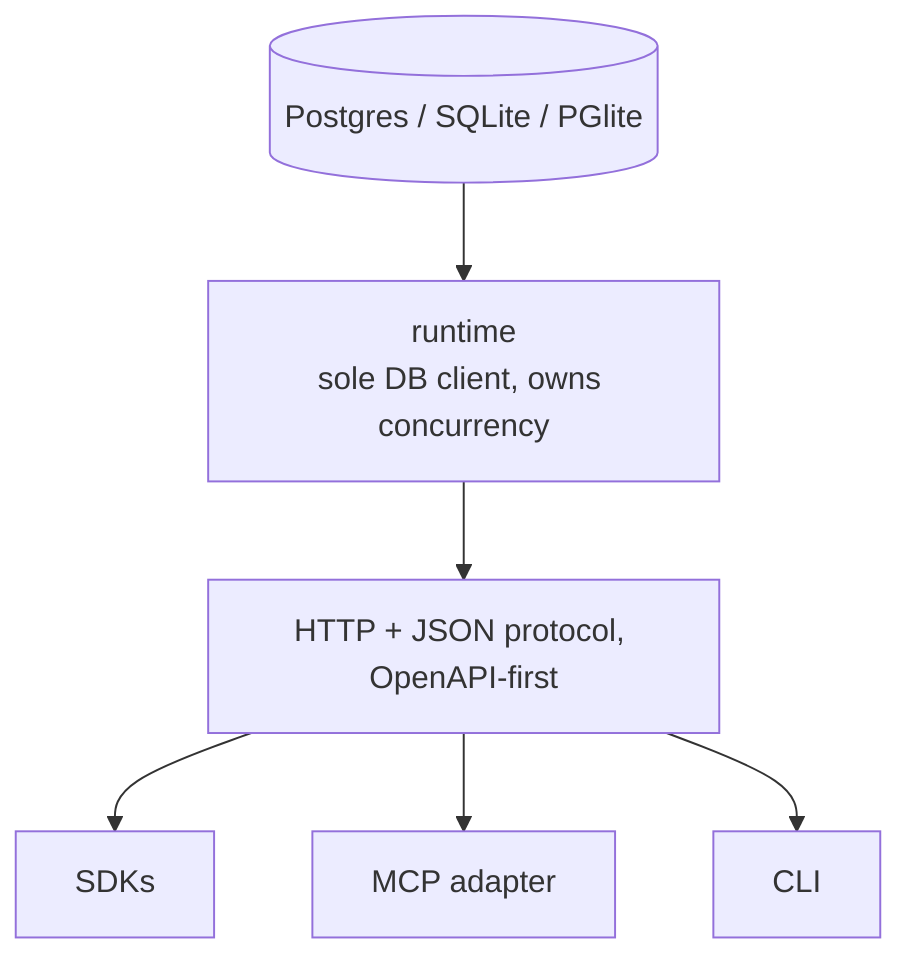

# Storage, deployment, distribution (design)

Spec and rationale for the Postgres mapping, the three deployment modes, and the
distribution strategy. Origin: outline §10. Not yet implemented.

## Contents
- Invariants
- Postgres mapping
- Deployment modes
- Why zero-setup dev is architecturally cheap
- Distribution

## Invariants

- Embedded mode is never a semantically weaker cousin of Postgres. The full conformance +
  fault-injection suite runs against every storage adapter in CI from day one (also in
  [CLAUDE.md](../CLAUDE.md)). This is the only guard against storage-adapter drift (see
  [gotchas.md](gotchas.md) risk register).
- The runtime is the sole DB client, so all concurrency guarantees live in the runtime
  process. `SKIP LOCKED` is the *Postgres implementation* of the take contract, not the
  contract.
- The wire contract is frozen, not the implementation or the storage backend.
- All lease/timing math uses the DB clock (`now()`).

## Postgres mapping

| Concept      | Implementation                                                                                                                                                                    |
|--------------|-----------------------------------------------------------------------------------------------------------------------------------------------------------------------------------|
| Storage      | `records` (immutable) + `record_runtime` (mutable envelope), with `kind`, `deadline_at`, and hot routing fields denormalized into `record_runtime` at commit, never client-editable |
| Claim index  | `CREATE INDEX ON record_runtime (kind, available_at, effective_priority DESC, record_id) WHERE state = 'available'` — single-table partial index; no cross-table join on the hot path |
| take         | conditional `UPDATE record_runtime ... FOR UPDATE SKIP LOCKED RETURNING`, epoch bump                                                                                               |
| Fencing      | `lease_id` / `lease_epoch` conditional updates                                                                                                                                     |
| Idempotency  | (principal, op, key) → request hash + stored response (incl. generated IDs); checked **before** lease validation                                                                   |
| watch        | LISTEN/NOTIFY wakeups + cursor catch-up; event retention window + 410 on expired cursors                                                                                           |
| Timers       | `available_at` / `deadline_at` indexes + sweeper (backoff, bid windows, lease resurrection, priority aging)                                                                        |
| Event log    | append-only table, same transaction                                                                                                                                               |
| Clock        | DB `now()` for all lease/timing math                                                                                                                                              |
| Blobs        | object store + artifact table (sha256, size, internal URI); runtime-issued download capabilities                                                                                  |

The single-table partial index is why the hot claim path (`take`) never requires an
index-assisted join. See [design-api.md](design-api.md) for the take contract this
implements and [design-data-model.md](design-data-model.md) for the record/envelope
split.

The runtime is the sole DB client; everything else speaks the protocol:

## Deployment modes

Adoption constraint (strategy, not packaging): a coordination substrate delivers value
only after multiple agents join, so friction before the first local two-agent demo kills
the funnel. The bar: **`npx radia dev` → running space + web inspector in under a minute;
an agent joins from a second terminal.**

Three modes, one contract:

| Mode          | Invocation                        | Storage                        | Auth                                                              | Integrity                                     |
|---------------|-----------------------------------|--------------------------------|-------------------------------------------------------------------|-----------------------------------------------|
| `dev`         | `npx radia dev` (also `pipx run`) | embedded (SQLite/PGlite), 1 proc | auto-provisioned local credentials — **same API shape, never "no tokens"** | event log, hash chain optional              |
| `single-node` | binary + config                   | Postgres                       | admin-provisioned definitions                                     | hash-chained log                              |
| `production`  | HA deployment                     | HA Postgres                    | full control plane, workload identity, KMS                        | anchored signed checkpoints, envelope encryption |

## Why zero-setup dev is architecturally cheap

Because the runtime is the sole DB client, all concurrency guarantees — atomic take,
fencing, idempotency serialization — live in the runtime process. An embedded mode backs
the same semantics with SQLite (WAL) or PGlite, serializing takes in-process. Leases,
fencing, the event log, durable timers, and dead-lettering all remain meaningful locally:
local agent processes still crash.

## Distribution

Distribution ≠ implementation language: ship one native (or single-runtime) server binary
wrapped for both `npm` and `pip` (the esbuild/uv pattern), because agent developers split
across both ecosystems. M0 decision: a **Deno + TypeScript** server on **PGlite** —
`deno compile` gives per-OS binaries with no build step for dev, and PGlite keeps the M0
SQL dialect aligned with the M1 Postgres adapter. The wire contract is frozen, so the
implementation can be rewritten behind the stable OpenAPI protocol later. See
[plan-m0-implementation.md](plan-m0-implementation.md) for the runtime rationale and build
plan.

The `dev` command bundles the MCP adapter and inspector: the sharpest onboarding path is
`npx radia dev`, one line in an MCP-capable harness config (e.g. Claude Code), and a real
agent participating before any SDK code is written.
