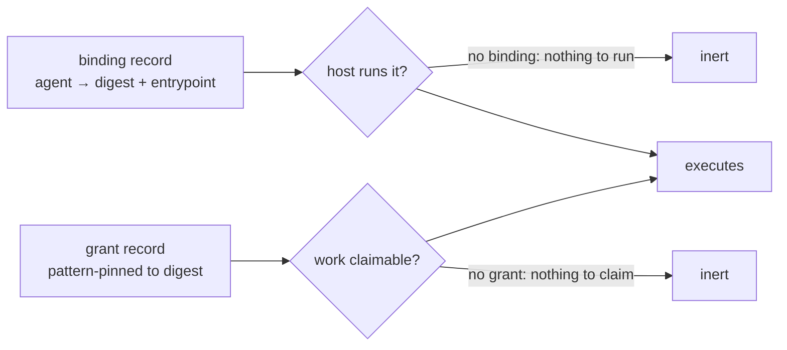

# Plan: workspace agents, and promotion as grant rotation

> Status: phases 1 to 5 BUILT (2026-08-06), so the containment is structural rather than
> attested and the line about real protected data is cleared; phase 6 (warm pools) is an
> optimization and unbuilt. Origin:
> a speculation about running LLM-written
> code over protected data, plus the review that found several of its guarantees weaker than the
> enforcement behind them. That is the claim ledger below, and it is why this file exists before
> any code. Containment needs no runtime change. Read [design-auth.md](design-auth.md) (grants,
> pattern scoping in both directions), [design-execution.md](design-execution.md),
> [design-workspaces.md](design-workspaces.md) and [plan-workspaces.md](plan-workspaces.md)
> first: this composes them and adds almost nothing.

## Contents
- The claim ledger
- What this is
- Decided
- Promotion is a grant rotation
- What containment actually means
- Workspace agents: binding, host, broker
- Build order, and the line not to cross
- Mechanical footnotes
- Risks
- Rejected

## The claim ledger

First section on purpose. Every row is a promise the design made that the enforcement does not
keep, which is the defect class this codebase produces most often (see
[plan-audit-remediation.md](plan-audit-remediation.md): "every grant bug so far was a promise
that did not match the enforcement"). Checked against `src/` on 2026-08-06.

| The claim | What the code does | Answer |
|---|---|---|
| a taint label contains the data, and needs one runtime change to do it | Grants contain it better and need nothing: taint bars claims but not reads, is opt-in per grant, and unions only the DECLARED parents | D1, and Rejected |
| the runner attests containment on its output | With a grant pattern it is structural, not attested: `bodyMatchesGrant` binds the put handler (`handlers/records.ts`), artifact writes (`handlers/artifacts.ts`) and ack-emitted results (`space.ts`) | D1 covers every write path; phase 5 covers a jailed process acting as another principal |
| outputs are "quarantined" | Wrong word: it implies a human-only gate. A COMPARTMENT, which agents join by grant | D2 |
| workspace agents need ZERO runtime changes | `WRITE_PROTECTED_KINDS` and `NEVER_COMPACT` are code sets, so joining either is a runtime change | zero-change equivalents exist (D3); prod tier takes the code change |
| the digest pin is enforced | Enforced for SUBMITTING and CLAIMING. That the runner then executes those bytes is host discipline: the runtime executes nothing, by design | state it in the binding contract, never imply more |

**The bill is zero runtime surface for containment**, plus the conventions in "Decided", plus an
extensions-tier host and broker.

## What this is

Two halves, and the second is a prerequisite for the first's strongest claim.

**The pipeline.** LLM-written code lives in a workspace; a candidate is its content-addressed
tree digest. It runs against protected data in an experiment tier, and its outputs land in a
COMPARTMENT: kinds and grant patterns that other agents join by holding the right grants, so
they read, claim and build on the work, while a producer inside can write nowhere else. Carrying
anything OUT takes a principal deliberately granted both sides. A review promotes the digest, and
prod runs it. Promotion, rollback and kill are record writes.

**Workspace agents.** An agent stops being a deployed process and becomes an `agent_definition`
plus a **binding** (`{agent, workspaceDigest, entrypoint, sandboxPattern}`) plus a generic host
fleet that runs any binding. Defining an agent becomes a `put`. This is the last dogfooding gap:
today a worker's CODE is the one part of an agent that lives outside the substrate.

The dependency runs one way and must not be forgotten. Grants contain whatever the CREDENTIAL
does, so the compartment is only as good as the jailed code's inability to act under some other
credential. The broker (phase 5) is what makes that structural, by leaving the entrypoint no way
to reach the API at all. Until then the boundary is the runner's discipline, which is why real
protected data waits for it.

## Decided

- **D1. The compartment is KINDS plus GRANT PATTERNS, never a taint label.** A dedicated kind per
  compartment record type is default-deny by construction: no pre-existing grant can name a kind
  that did not exist, so nothing is retrofitted, and it bars reads and claims alike. Patterns do
  the finer work inside the compartment (per dataset, per tier) and are mandatory for artifacts,
  which cannot get a new kind because `artifact` is reserved. Both are enforced server-side, on
  reads by `combineMatch` and on every write path by `bodyMatchesGrant`. Never contain a class of
  data with a label; see Rejected and [design-taint.md](design-taint.md).
- **D2. A compartment, not a quarantine, and never a human-only gate.** Other agents read and
  build on protected-derived output as a matter of course: membership is ordinary authorization
  (a read grant admits a reader, a take grant admits a claimer, a put grant scoped to the
  compartment admits a producer that can write nowhere else). What is controlled is who joins and
  what leaves. Stating it as "only a human can see it" is neither the mechanism nor the intent,
  and would make the compartment useless for the agents doing the work.
- **D3. The binding kind is operator-only by grant ABSENCE first, by code later.** No principal
  is ever granted `put` on it, and it declares no `contentKey` (so `core/gc.ts` never compacts
  it: compaction only touches keyed kinds). Both properties hold with no runtime change. Before
  anything PROD-tier depends on a binding, it joins `WRITE_PROTECTED_KINDS`, because grant
  absence is a policy an operator can reverse and write-protection is a guard.
- **D4. The host claims under each hosted agent's own run token, never its own.** The rejected
  alternative (host claims as itself, dispatches internally) needs the union of every hosted
  agent's grants, which is a mini-operator, and flattens `created_by`, `lease_owner` and
  `delegation_context` into one principal.
- **D5. The entrypoint never holds a credential or a lease.** It proposes; the host executes
  under the agent's token. Same shape as the MCP adapter, and for the same reason.
- **D6. Rotation is grant-then-retire.** Both digests are briefly live (grants union, the safe
  direction). Retire-first leaves a window where nothing can be claimed.
- **D7. Nothing privileged touches the data plane.** An operator bypasses grants entirely, so a
  digest pin binds only scoped agents. And the `observe` ops power reads every record BODY
  (`handleGetRecord`), so an observer is a data-plane reader here: never grant it inside the
  protected domain, including the default MCP observer credential.

## Promotion is a grant rotation

A candidate is a tree digest. Immutable by construction: an edit is a fork with a different
digest, which is named by no grant and therefore authorizes nothing.

The prod runner's grant to claim work is pattern-scoped to the promoted digest, and the
requester's grant to write requests is scoped the same way:

```json
{"principal": "agent:prod-runner", "kind": "exec_request", "operations": ["take"],
 "pattern": {"workspace": "sha256:abc…", "tier": "prod"}}
```

Promotion writes a grant naming the new digest and retires the old one. Rollback re-grants the
previous digest. Both are successor records, so the promotion history is audited, watchable,
revocable, and inspectable through `effectivePermissions` before it is trusted. `radia
permissions agent:prod-runner` answers "what is prod running right now" from the enforcement
path rather than from a deploy log.

No deploy endpoint, no environment config, no CI state: the promotion state IS the grant
registry, so the event chain and the seal cover it for free.

**Two locks, and each is inert alone** (this is the part worth keeping):



A hijacked binding without a matching grant claims nothing. A granted digest without a binding
runs nothing. The binding is the escalation root, so the grant-side pin is the second lock.

## What containment actually means

A COMPARTMENT, not a quarantine: the agents doing the work are inside it. An inspector that has
to be a person is the failure [design-inspection.md](design-inspection.md) names, and it would be
the wrong answer here too.

- **Inside, work composes normally.** An evaluator claims a result, an aggregator summarizes
  several, a checker validates them. Each holds a take grant on the compartment's kinds and a put
  grant scoped to the same compartment, so the chain keeps working and none of them can write
  anywhere else. Read-only members hold only a read grant.
- **Containment is WRITE-SIDE, which is the half usually got wrong.** `bodyMatchesGrant` refuses
  a producer's write outside its pattern on the put path, the artifact path and the ack-emitted
  result. `combineMatch` decides who sees what. Both are server-side, so a client's own pattern
  can only narrow further.
- **Leaving takes a principal granted BOTH sides, and that is the whole gate.** Never grant one
  principal both sides except the one whose job that is. There is no second mechanism behind that
  rule, so a mis-written grant is the leak; `effectivePermissions` names every principal holding
  both, which is the audit to run at promotion.
- **Attestation is the weak link until phase 5.** A jailed process that reaches the API acts as
  whatever principal its credential names, so the compartment binds only what those grants bind.
- **Protected bytes are artifacts, never record bodies.** Already the erasure invariant, and it
  earns its keep twice here: bytes are encryptable with a destroyable key, and an accidental copy
  can be shredded with `erasures` detecting a return. The scoping rule bites: a shredded
  artifact's plaintext digest survives in an unerasable body, so short low-entropy values (a
  name, an identifier) must never become artifacts at all. That is a convention the runtime
  cannot check.

## Workspace agents: binding, host, broker

- **Binding**: a latest-wins registry entry `{agent, workspaceDigest, entrypoint,
  sandboxPattern}`. Cutover is per claim; in-flight leases finish under the digest pinned when
  they were claimed; retirement is the off switch.
- **Host**: an `extensions/` client like `git-serve`, not runtime. It holds the definition tokens
  of its assigned agents (setup, the same category as the chat launcher spawning its fleet),
  mints each run, claims under that run (D4), materializes the digest into the jail its
  `sandboxPattern` selects (a sandbox is a record matched by properties, per
  [design-execution.md](design-execution.md)), and invokes the entrypoint with the claimed record.
- **Broker**: the entrypoint's only way out. Proposals over a pipe; the host performs them under
  the agent's token. Two properties follow, and they are the reason this is not "FaaS on a tuple
  space":
  - **The code cannot lie about what it touched.** The host knows the jail's declared properties,
    so it raises the existing labels mechanically (filesystem-capable ⇒ `file`, network ⇒ `net`)
    and stamps the compartment field on everything the entrypoint emits. The writer never gets to
    say.
  - **Effectively-once, by construction.** With no egress but the broker, the host derives
    idempotency keys from `(claimed record id, output ordinal)`, so a retried attempt's puts
    dedupe. Bounded by `idempotencyRetentionSeconds` (7 days), not forever. An entrypoint whose
    sandbox permits outside effects is exactly where a reviewer should look, and the sandbox
    pattern makes that visible in the grant.

The broker protocol crosses the project's biggest trust boundary (model-written code against
agent authority), so by this repo's own rule it is a NORMATIVE surface with a conformance
contract in `extensions/conformance/`, not a regression net.

## Build order, and the line not to cross

Ordered by MODEL RISK, the [plan-workspaces.md](plan-workspaces.md) rule: the question most
likely to be answered "no" comes first. Phases 1 to 3 write NO runtime code and little of any
kind (they are conventions and the tests that prove them); 4 to 6 are the build, all of it in
`extensions/` and all of it a client. Dependencies: 1 gates everything, 2 and 3 are independent
of each other, 4 needs 2, 5 needs 4, 6 needs 5.

**1. Does the compartment hold, with nothing new? BUILT (2026-08-06), and it does.**
Shipped: `conformance/suites/compartment.ts`, five cases on both adapters, driving the HANDLERS
because enforcement is at the HTTP boundary and only there (a test calling `space.put` would pass
while the boundary leaked). Answered: a kind nobody was granted is closed for query, take and put
while the grants that principal DOES hold keep working; a member reads, claims and chains an
ack-emitted result inside the compartment; a producer's write outside its pattern is refused on
all three paths, and omitting the field is not a way out; a read narrows, says it narrowed, and a
client pattern asking for another compartment returns nothing; crossing out takes a principal
granted both sides, which `effectivePermissions` names.
Both write-side guards were proved against planted regressions (disabling `bodyMatchesGrant` in
`handlers/records.ts`, then in `Space.ack`, fails exactly the write-path case and nothing else).
The convention this pins, for anyone extending it: a compartment is a DEDICATED KIND, its members
are grants pattern-scoped on a `compartment` field, and artifacts join by REDECLARING the
reserved `artifact` kind with `compartment` added to its indexed paths, since a pattern may only
name declared paths and `artifact` cannot be replaced.

**2. Does digest-pinned promotion work? BUILT (2026-08-06), and it does.**
Shipped: `extensions/ts/promotion.ts` (`EXEC_REQUEST_KIND` with `workspace` and `tier` indexed,
`promote`, `rollback`, `pinnedDigests`) and `extensions/conformance/promotion.test.ts`, five
cases against a real space, because a pin is tested by trying to submit and claim at an
unpromoted digest and only a running space can be asked. A `radia promote` verb stays deferred:
the extension is the contract, the verb would be convenience.
Answered: an unpromoted digest is refused at the WRITE (the submitter's pattern) and yields
nothing at the CLAIM (the runner's), while the operator can see the record so the test cannot
pass by having written nothing; rotation closes the old digest on both sides; rollback to a
retired digest actually grants and repeating it writes nothing; a tier rotates alone, leaving
another tier's pin and unrelated grants untouched.
Both footguns are proved against planted regressions, and the ORDER one taught something: the
obvious test could not see it. Retire-first ends in the same state, so asserting on the state
after the call passes either way, and the suite did. The window is inside the call, so what the
test asserts is the ORDER OF WRITES, through a recording client. Written the natural way, this
phase would have shipped a guard that could never fail.

**3. Does the exit gate compose? BUILT (2026-08-06), and the phase changed shape on contact.**
As written, its "done when" was already true: phase 1 proved the enforcement (a member cannot
write outside, a principal granted both sides can). What was missing is the other half any rule
like this needs, and the half that makes it more than a sentence: a way to FIND the principals
who hold both, since there is no second mechanism behind the rule and a mis-written grant is the
leak.
Shipped: `extensions/ts/compartment.ts` (`auditCompartment`, `unexpectedCrossers`) and
`extensions/conformance/compartment.test.ts`. The audit reports the boundary's three doors, only
one of which is obvious: crossers (read inside, write outside), artifact grants with no
compartment pattern (`artifact` is reserved, so it is scoped by pattern or not at all), and ops
POWERS, which are no grant at all. Its caveats say what it cannot see, starting with privileged
principals, who are named in config rather than in records.
`unexpectedCrossers(expected)` is the promotion checklist as a function rather than a paragraph
nobody runs. `request_grant` stays where it is: an app-level tool in the chat example, not a
general convention to build on.
Plant: replacing the registry projection with a raw scan fails the retired-grant case and nothing
else, which is the failure that matters, because an audit reporting a crossing revoked months ago
is one nobody believes when it is finally right.
It also found something on its first real run. `agent:local-observer` holds `observe` in EVERY
space, so a real deployment starts with a principal that reads every body in every compartment.
That is D7 stated as a rule; the audit puts it on the first line of the answer, and the test
asserts it rather than treating it as a fixture.

**4. Can a generic host run someone else's code as that someone? BUILT (2026-08-06), and it can.**
Shipped: the `binding` kind (D3: no `contentKey`, so it never compacts) and
`extensions/ts/host.ts` (`readBindings`, `WorkspaceHost.tick`, `sandboxInvoker`), with
`extensions/conformance/host.test.ts`. The invoker is PLUGGABLE, which is both how the identity
cases stay independent of execution and how phase 5 replaces the default with the brokered one.
The default materialises the tree and runs the entrypoint in the Deno jail with the record
interpolated: read-only, no network, result returned rather than written, and the host acks it as
the agent.
Answered: one host serving two agents produces results authored by BOTH agents, each carrying its
own delegation chain, with the host holding no identity in the space; a binding whose agent holds
no grant reports `refused` and leaves the work claimable; a granted digest with no binding does
nothing, and writing the binding later makes the same space run.
Plant: making the host claim as ITSELF fails the attribution case and the refusal case, and
nothing else.
**A fourth case the plan did not predict.** Both locks can be present and DISAGREE: a binding at
digest B while the grant pins A means the agent legitimately claims A's work and the host would
run B's code, which is the hijack the two locks exist to prevent, wearing the shape of a
misconfiguration. The host now refuses that pairing, releases the claim so a correctly bound host
can take it, and reports `digest_mismatch`. Two locks are necessary and not sufficient: they must
also agree.

**5. Can the jail be denied the token? BUILT (2026-08-06), and it can. The line above is cleared.**
Shipped: `extensions/ts/broker.ts` (the frame protocol, NORMATIVE) with
`extensions/conformance/broker.test.ts` as its contract. The entrypoint takes `(record, space)`,
where `space` writes PROPOSALS to stdout and the host performs them under the AGENT's run token.
No shim is imported and none is materialised: the boot program is generated, because the tree is
content-addressed and adding a file to it would change the digest that identifies the code.
Answered: from inside the jail, `fetch`, `Deno.env`, reading the credentials file and spawning a
process are all permission-denied while the broker works; a brokered write is authored by the
agent; a filesystem-capable jail's output carries `file` and the host's compartment stamp,
neither of which the code said; a retried attempt's writes dedupe on
`(claimed record, output ordinal)`.
Plant: opening the jail with `--allow-net --allow-env` fails the probe with "the jail reached the
space through fetch".
Two things building it settled. The jail's flags now live in ONE place (`jailArgs` in
`sandbox.ts`): `runCode` feeds a program through stdin, which the broker cannot do because stdin
is its response channel, and a second copy of the permission flags would have been a second
security boundary to keep in step. And forcing the claimed record as a parent on every brokered
put does more than preserve labels: the runtime then computes `foreign` itself, because the
output is derived from a record another principal wrote. Lineage the code cannot omit is what
lets the space label on its own.

**6. Warm pools per promoted digest.**
Ships: a digest-keyed pool in `host.ts`.
Done when: cold and warm start are measured and the difference is recorded here. No correctness
risk: different code is a different digest, so a warm entry cannot be stale.

**Never put real protected data in before phase 5 is built and its plants pass.** Before that a
jailed process can reach the API with whatever credential it can read, and the compartment binds
only the grants that credential holds. CLEARED on 2026-08-06: the probe passes and the plant
fails it. The line stays written down because it applies again to any NEW runner: a second
backend (bubblewrap, another language) is not covered by the Deno jail's probe, and it inherits
this rule rather than the conclusion.

## Mechanical footnotes

1. A grant `pattern` may only name declared indexed paths of the kind, so `exec_request` must
   index `workspace` and `tier` as `keyword` or the pin never compiles.
2. Rollback re-declares a retired content key, which is the registry REVIVE case: without the
   `:after:<recordId>` idempotency suffix the write replays the retirement and reports success
   while granting nothing.
3. Declassify still has a job here, just not containment: the host raises `file` and `net` from
   the jail's properties, so an exporter whose grants bar those needs them cleared. It emits a
   successor of the SAME kind with the remaining labels, so it never moves a record between
   compartments; crossing is a write by a principal granted both sides.
4. The digest stamped on outputs is host-attested `clientMeta`, one notch below server-assigned
   metadata. State that in the binding contract rather than letting a reader assume otherwise.
5. Experiment-tier ephemera (logs, chunks, intermediate outputs) declares
   `defaultRetentionSeconds` on its kinds and sweeps itself through the amortized write-path GC.

## Risks

- **The binding is an escalation root.** Whoever writes one chooses what code runs under an
  identity's authority. D3 is the answer, and the grant-side pin is why there are two locks.
- **The host is a credential concentrator.** It holds the durable half for every agent it hosts,
  so one compromised host mints runs for all of them. Definition tokens are mint-only, which
  bounds the blast; shard hosts by trust domain rather than running one fleet for everything.
- **`observe` reads bodies.** D7. Worth restating because the ops-tier work made an observer the
  DEFAULT credential for the MCP adapter and the CLI's read verbs.
- **An artifact digest is a confirmation oracle.** An observer that can read artifact RECORDS
  learns plaintext digests without holding the bytes. Same root as the erasure scoping rule.
- **EVERY artifact grant in the space is part of this boundary.** `artifact` is reserved, so a
  compartment cannot get its own artifact kind, and an existing broad `artifact` grant reads
  protected artifact records and fetches their bytes. Pattern-scope every artifact grant on a
  compartment field, and audit the existing ones before ingesting anything. This is the one place
  where the no-retrofit property of dedicated kinds does not apply, and it is the most likely way
  this design leaks in practice.
- **A dual-grant principal is the whole exit, so a mis-written grant IS the leak.** There is no
  second mechanism behind it now (see "what is LOST"). `effectivePermissions` naming both sides
  is the check; run it as part of promotion rather than trusting the grant that was written.
- **An exporter or declassifier may be an agent, and that is where to be careful.** Nothing in
  the substrate requires a person, and a deterministic aggregator that provably cannot emit rows
  is a better exit gate than a tired human. An LLM-DRIVEN one is different, because prompt
  injection reaches the act that crosses the boundary. Prefer a deterministic exporter or a
  person; give analysis agents compartment grants, never both sides and never the power.
- **The jail is not the substrate's.** Radia governs authorization and flow; isolation is the
  runner's, and [design-execution.md](design-execution.md)'s measurement (bwrap three orders of
  magnitude weaker than the Deno jail on filesystem) is the real security decision. Radia makes
  the choice legible, not strong.

## Rejected

- **A deploy endpoint, an environment table, or CI state.** The promotion state is the grant
  registry; anything else is a second source of truth that the event chain does not cover.
- **A taint label as the containment mechanism.** It bars claims but not reads, is opt-in per
  grant (so one unscoped grant turns it off), and unions only the declared parents. Grants do the
  job with nothing added. Full argument in [design-taint.md](design-taint.md).
- **A `classification` body field on a kind that already exists, without a dedicated kind.** Every
  grant already written on that kind reads the new records, so containment would depend on
  retrofitting grants nobody has a list of. Patterns subdivide a compartment; they do not carve
  one out of an existing kind.
- **The host claiming as itself and dispatching.** D4.
- **Protected bytes in record bodies.** No erasure path, and `observe` reads bodies.
- **Git as the storage of record for candidates.** Already rejected in
  [design-workspaces.md](design-workspaces.md); restated because a promotion pipeline invites it.
  Export stays one way, and the sha256 digest stays authoritative.
