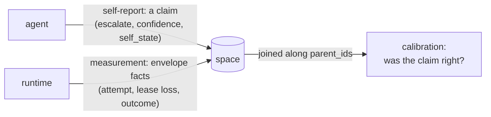

# Self-modeling (research)

Whether — and how narrowly — a Radia space can hold an agent's model of *its own process*
in the same medium as its model of the world. Research, not a milestone: nothing here is
scheduled, and the first deliverable is a measurement over records that already exist, not
code. Gated the same way [design-marketplace.md](design-marketplace.md) is gated —
speculative ahead of a first user, so do not build on spec.

## Contents
- The claim, stated narrowly
- What already holds
- What blocks the rest (verified)
- The baseline experiment (already run, by accident)
- Build order, and what each step is waiting for
- What this does not claim

## The claim, stated narrowly

> A substrate where an agent's **report about its own process** and the runtime's
> **authoritative measurement of that same process** live in one medium — same
> immutability, same provenance, same authorization — so the **discrepancy between them is
> a query**.

That is the whole defensible thesis. It is narrower than "self-aware agents" and it is
falsifiable: either the two halves are in the same medium and joinable along lineage, or
they are not.

The interesting object is the **pair**, not the self-model. A self-model alone is a client
claim, and the design's standing invariant is that *clients submit claims; the runtime
decides what they are worth*
([design-data-model.md](design-data-model.md)). An agent asserting "I am reliable at this"
arrives through the same door as any other unverified claim. What makes it worth anything is
the runtime-authoritative counterpart the agent cannot forge: attempt counts, lease losses,
escalations, stall signals — envelope facts. Calibration is the gap between them.

Nothing else in this space can hold both halves in one representational medium and diff
them. That is the claim to defend, and the only one.

## What already holds

Four properties exist today and were not built for this:

- **One type universe.** The system's own machinery is expressed in its own medium: kinds
  are `kind_def` records, permissions are `grant` records, capabilities are `capability`
  records, runs are `agent_run` records (CLAUDE.md, "express features through the substrate").
  A `self_state` kind needs no new machinery — it routes, taints, has lineage, is
  grant-gated, is watchable.
- **Immutability makes revision legible.** A revised belief is a successor record, so "what
  did it hold at t1 versus t2" is a lineage query rather than a lost overwrite. See the
  caveat under *Build order* — the link between successor and predecessor is convention,
  not enforcement.
- **Two lineages, deliberately not merged.** `parent_ids` is causal/data lineage;
  `delegation_context` is authority, server-derived from the claimed lease and never from
  data parents (`Space.deriveDelegation`). "Why do I believe this" and "on whose authority
  am I acting" are separate questions with separate answers. The invariant *provenance is
  not authority* does work here beyond the security work it was written for.
- **The envelope/content split is a metacognitive boundary enforced at the API.** The
  content-routing query language matches record *bodies* and deliberately cannot see the
  envelope; envelope access is a separate plane (`GET /v0/ops/records?state=…`). So the
  system routes on *what it is working on* and introspects on *how the work is going*
  through two interfaces with two authorization stories. This was designed for routing
  hygiene, not for cognition, but the shape is right.

**Taint is narrower than it looks.** It is one bit, and it does not carry the source. The
source is in `parent_ids`. So a space can say *this is untrusted* and *this came from
that*, but the join — untrusted **because of which** parent — is not materialized anywhere.
For any honest self-report that join is the thing you want, and it is a query nobody has
written rather than a capability that exists.

## What blocks the rest (verified)

Each of these was checked against the source; none is a guess.

| Capability | Blocker | Where |
|---|---|---|
| An agent reading its own state | `/v0/ops/*` is **binary operator privilege** — no scoped form | `src/server/http.ts` ops gate |
| An agent raising an alarm about itself | `signal` is **write-protected** (`human:*` or the supervisor only) | `WRITE_PROTECTED_KINDS` in `src/core/kinds.ts` |
| Scoping ops access by "my own records" | Grant templates compile against **declared body paths** (`requireIndexed`); `created_by` is runtime metadata the matcher never sees | `src/core/matching.ts` |
| Attention as scarcity (a contended focus lease) | Watches wake only on records becoming **available**, so a *claim* broadcasts nothing; and `effective_priority` is hardcoded `0` until the scheduler (M3) | `handlers/watches.ts`, `Space.putRaw` |
| Forgetting / consolidation | `retention_until` is **stored and never swept**; crypto-shredding covers artifact blobs only, not record bodies | no delete path references it |
| Livelock / rumination detection | Specified, unbuilt (M3) | [design-observability.md](design-observability.md) |

Two of these deserve emphasis because they are easy to underestimate.

**Self-scoped introspection is not "template-scoped grants, extended."** Template-scoped
grants narrow a *body* match. Envelope state, attempt counts and `created_by` are precisely
what the routing language is forbidden to see — the property praised two sections above. A
self-scope therefore needs a **second selector vocabulary over the envelope**, which is new
design work that touches a deliberate boundary. That is worth doing; it is not a small reuse.

**Every reflexive capability is currently reserved to the outside.** Reading your own
process state needs operator privilege; raising an alarm about your own state needs
privileged write. A participant can be observed and interrupted, but cannot observe or
interrupt itself. That is one shape, applied twice.

## The baseline experiment (already run, by accident)

`escalate` is already a self-report: the model declaring *I am out of depth*
(`examples/chat/workers/inference.ts`). The outcome is already recorded — which tier
answered, whether escalation happened (`escalatedFrom`), whether the turn produced an answer.
Both halves of the pair exist in the record stream, joinable by `replyTo`/`parent_ids`.

The measurement has been taken once, informally. When tier selection was switched from a
classifier to escalation-only, a tool-heavy analytical session produced **zero escalations**
while the cheap tier answered an aggregation question from invented numbers. The classifier
was restored on that evidence ([gotchas.md](gotchas.md), rejected approaches).

Read that as the finding it is: **the self-report was uncalibrated, and the substrate
measured it.** No new kind, no new endpoint, no new worker — a query over records that were
already there.

So the first deliverable is that query, run deliberately rather than incidentally: escalation
rate against turns that demonstrably needed a stronger model, over a real session. That is
the baseline [plan-validation.md](plan-validation.md) asks for before anything is built.

Open question, worth resolving before the query is trusted: "demonstrably needed a stronger
model" needs a ground truth that is not itself a model's opinion. Candidates: a tool error
the stronger tier avoids, a numeric answer checkable by `run_code`, or a turn the user
repeats. Pick one that is mechanically checkable, or the calibration measure inherits the
problem it is measuring.

## Build order, and what each step is waiting for

1. **The calibration query** (above). Costs nothing, needs nothing, produces the baseline.
2. **A metacognition worker — first-person, no runtime change.** A worker already
   *experiences* its own nacks, lease losses, retries and timings; it does not need the ops
   plane to report on them. It emits `self_state` records. This is deliberately before the
   enabling work, not after: "I notice I keep failing" is available today and is the more
   interesting report than "the monitor says this agent keeps failing." Size: roughly the
   image worker.
   **Enforce the successor link here.** Latest-wins across reference kinds is decided by
   ULID order in the *reader* (`prev.id < rec.id`), and nothing requires a successor to name
   its predecessor in `parent_ids`. For a self-model the revision history is the entire
   point, so the kind's validator should require a parent when a prior exists rather than
   trusting worker discipline.
3. **Self-scoped ops grants** — the enabling change, and the one to specify *after* step 2,
   because the worker's failures tell you which envelope fields a self-scope actually needs.
   Designing the selector vocabulary first is guessing.
4. **Livelock / no-progress detection** (M3, specified). Needs step 3, or a non-privileged
   alarm kind, or it stays a third-person report.
5. **Attention as a scarce lease.** The research-interesting one, and the most blocked:
   needs `effective_priority` to have a coalition signal (M3), and ignition must be an
   **emitted record** rather than a lease transition, since claiming a record broadcasts
   nothing. Emitting is the better design anyway — the broadcast then has a body, provenance
   and a history.
6. **Consolidation and forgetting.** Blocked on retention GC. Consolidation without deletion
   produces strictly more records, which is the opposite of a self-model. The substrate-native
   shape is a worker that claims spans of lineage and emits summary records whose
   `parent_ids` point at the span — the chat example's context windowing is a crude version
   of this at the message level.

## What this does not claim

Everything above is **functional**: access, introspective report, source monitoring, agency
attribution, attentional focus. It says nothing about phenomenal consciousness, and the
architectural-correlate arguments (global workspace, higher-order thought) are contested
even as accounts of the functional case.

Two framing rules, in the spirit of [research-positioning.md](research-positioning.md):

- Never describe this work as building a conscious or self-aware system. Describe what is
  measured: a self-report, a measurement, and the distance between them.
- The blackboard/global-workspace reading is a **reinterpretation of this design, not its
  origin**. The lineage homage is Linda (tuple spaces); the blackboard architectures are a
  related but separate tradition. Say so when the comparison comes up.
