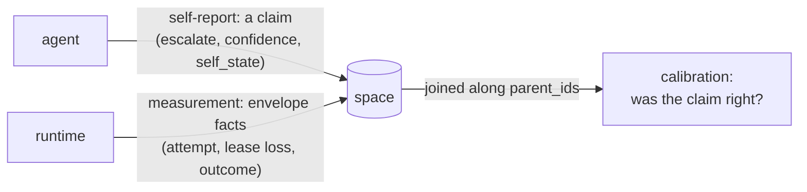

# Self-modeling (research)

Whether (and how narrowly) a Radia space can hold an agent's model of *its own process*
in the same medium as its model of the world. Research, not a milestone: nothing here is
scheduled, and the first deliverable is a measurement over records that already exist, not
code. Gated the same way [design-marketplace.md](design-marketplace.md) is gated:
speculative ahead of a first user, so do not build on spec.

## Contents
- The claim, stated narrowly
- The primary illustration: capability claimed vs. flow measured
- What already holds
- What blocks the rest (verified)
- The baseline experiment (already run, by accident)
- Recognizing success: flow mining is the livelock detector, read the other way
- First queries: what the self-model is made of
- Build order, and what each step is waiting for
- What this does not claim

## The claim, stated narrowly

> A space where an agent's **report about its own process** and the runtime's
> **authoritative measurement of that same process** live in one medium (same
> immutability, same provenance, same authorization), so the **discrepancy between them is
> a query**.

That is the whole defensible thesis. It is narrower than "self-aware agents" and it is
falsifiable: either the two halves are in the same medium and joinable along lineage, or
they are not.

The interesting object is the **pair**, not the self-model. A self-model alone is a client
claim, and the design's standing invariant is that *clients submit claims; the runtime
decides what they are worth*
([design-data-model.md](design-data-model.md)). An agent asserting "I am reliable at this"
arrives through the same door as any other unverified claim. What makes it worth anything is
the runtime-authoritative counterpart the agent cannot forge: attempt counts, lease losses,
escalations, stall signals, all envelope facts. Calibration is the gap between them.



Nothing else in this space can hold both halves in one representational medium and diff
them. That is the claim to defend, and the only one.

## The primary illustration: capability claimed vs. flow measured

The sharpest instance of the pair is not a single decision. It is **competence**, and half
of it is already built.

- **`capability` records are unmeasured competence claims.** A worker advertises "I serve
  this tool, here is how to use it" (`examples/chat/space/capability.ts`), published in
  advance, and nothing ever checks whether it is any good.
- **A `flow` record would be the measured counterpart**: this recurring shape of work,
  involving this agent, terminates successfully *n* times out of *m*, with these exemplars.

Both are ordinary records in one medium, joinable along lineage, and the claim was made
before anyone knew it would be scored. That is a better demonstration than any single
decision, because it is about what an agent *is* rather than what it chose once. When the
marketplace lands ([design-marketplace.md](design-marketplace.md)), a bid is the same
competence claim with something staked on it, and flows are what make bids scoreable.

Escalation (below) stays in the plan as the **cheap first measurement**, not the
illustration: it needs no new machinery and its data already exists.

## What already holds

Four properties exist today and were not built for this:

- **One type universe.** The system's own machinery is expressed in its own medium: kinds
  are `kind_def` records, permissions are `grant` records, capabilities are `capability`
  records, runs are `agent_run` records (CLAUDE.md, "express features through the space").
  A `self_state` kind needs no new machinery: it routes, taints, has lineage, is
  grant-gated, is watchable.
- **Immutability makes revision legible.** A revised belief is a successor record, so "what
  did it hold at t1 versus t2" is a lineage query rather than a lost overwrite. See the
  caveat under *Build order*: the link between successor and predecessor is convention,
  not enforcement.
- **Two lineages, deliberately not merged.** `parent_ids` is causal/data lineage;
  `delegation_context` is authority, server-derived from the claimed lease and never from
  data parents (`Space.deriveDelegation`). "Why do I believe this" and "on whose authority
  am I acting" are separate questions with separate answers. The invariant *provenance is
  not authority* does work here beyond the security work it was written for.
- **The envelope/content split is a metacognitive boundary enforced at the API.** The
  content-routing query language matches record *bodies* and deliberately cannot see the
  envelope; envelope access is a separate plane (`GET /v0/ops/records?state=…`). So the
  system routes on *what it is working on* and introspects on *how the work is going*
  through two interfaces with two authorization stories. This was designed for routing
  hygiene, not for cognition, but the shape is right.

**Taint is narrower than it looks.** It is a closed set of BARRIER labels (`file`/`net`/`foreign`),
not a general provenance record, and it deliberately does not say which ancestor contributed one. The
source is in `parent_ids`. So a space can say *this is untrusted* and *this came from
that*, but the join (untrusted **because of which** parent) is not materialized anywhere.
For any honest self-report that join is the thing you want, and it is a query nobody has
written rather than a capability that exists.

## What blocks the rest (verified)

Each of these was checked against the source; none is a guess. Two have since been UNBLOCKED and are
struck through rather than deleted, because the reason a blocker fell is worth as much as the
blocker was: both were about an agent reading its own state, and both were cleared by the same
change (self-scoped ops access), which is the shape to look for when the rest of this table is
re-checked.

| Capability | Blocker | Where |
|---|---|---|
| ~~An agent reading its own state~~ | **UNBLOCKED.** The ops plane has a scoped form: a principal holding a `query` grant with `scope.createdBy: "self"` reaches the READ half (`READ_ONLY_OPS`) for those kinds, over its own records, and any principal may read its own permissions | `Space.opsScope`, `READ_ONLY_OPS` in `src/server/http.ts` |
| An agent raising an alarm about itself | `signal` is **write-protected** (an operator or the supervisor; not every `human:*`) | `WRITE_PROTECTED_KINDS` in `src/core/kinds.ts` |
| ~~Scoping ops access by "my own records"~~ | **UNBLOCKED, and not through the matcher.** Grant PATTERNS still compile against declared body paths only, so `created_by` remains invisible to them; the author restriction is a separate grant field, `scope: {createdBy: "self"}`, enforced beside the pattern rather than inside it | `Space.readAccess`, `selfScoped` |
| Attention as scarcity (a contended focus lease) | Watches wake only on records becoming **available**, so a *claim* broadcasts nothing; and `effective_priority` is hardcoded `0` until the scheduler (M3) | `handlers/watches.ts`, `Space.putRaw` |
| Forgetting / consolidation | `retention_until` is **stored and never swept**; crypto-shredding covers artifact blobs only, not record bodies | `Space.shredArtifact` erases a payload on demand; nothing sweeps on a schedule |
| Livelock / rumination detection | Specified, unbuilt (M3) | [design-observability.md](design-observability.md) |

Two of these deserve emphasis because they are easy to underestimate.

**Self-scoped introspection is not "pattern-scoped grants, extended."** Pattern-scoped
grants narrow a *body* match. Envelope state, attempt counts and `created_by` are precisely
what the routing language is forbidden to see. That is the property praised two sections
above. A self-scope therefore needs a **second selector vocabulary over the envelope**, which
is new design work that touches a deliberate boundary. That is worth doing; it is not a
small reuse.

**Every reflexive capability is currently reserved to the outside.** Reading your own
process state needs operator privilege; raising an alarm about your own state needs
privileged write. A participant can be observed and interrupted, but cannot observe or
interrupt itself. That is one shape, applied twice.

## The baseline experiment (already run, by accident)

`escalate` is already a self-report: the model declaring *I am out of depth*
(`examples/chat/workers/inference.ts`). The outcome is already recorded: which tier
answered, whether escalation happened (`escalatedFrom`), whether the turn produced an answer.
Both halves of the pair exist in the record stream, joinable by `replyTo`/`parent_ids`.

The measurement has been taken once, informally. When tier selection was switched from a
classifier to escalation-only, a tool-heavy analytical session produced **zero escalations**
while the cheap tier answered an aggregation question from invented numbers. The classifier
was restored on that evidence ([gotchas.md](gotchas.md), rejected approaches).

Read that as the finding it is: **the self-report was uncalibrated, and the runtime
measured it.** It took no new kind, no new endpoint and no new worker, only a query over
records that were already there.

So the first deliverable is that query, run deliberately rather than incidentally: escalation
rate against turns that demonstrably needed a stronger model, over a real session. That is
the baseline [plan-validation.md](plan-validation.md) asks for before anything is built.

Open question, worth resolving before the query is trusted: "demonstrably needed a stronger
model" needs a ground truth that is not itself a model's opinion. Candidates: a tool error
the stronger tier avoids, a numeric answer checkable by `run_javascript`, or a turn the user
repeats. Pick one that is mechanically checkable, or the calibration measure inherits the
problem it is measuring.

## Recognizing success: flow mining is the livelock detector, read the other way

> **The READ half is built** (2026-08-04): `Space.flows`, `GET /v0/ops/flows`, `radia flows`, the
> console's Flows tab. The acceptance test below is met by `test/flows.test.ts`. What is NOT
> built is the `flow` RECORD, so there is no provenance for the measurement and no successor giving
> drift over time; that is the abstraction step, and it is what the rest of this section is about.

A worker that reports error rates, retry depth and stall signals is **`space_doctor` in the
first person**. That plane is built; re-emitting it from inside adds a pronoun, not
knowledge. The interesting act is the opposite one, and it is harder: recognizing **which
shapes of work succeed**.

The two are the same computation. [design-observability.md](design-observability.md)
specifies livelock as *a repeating (agent, pattern) signature along ancestry with no
progress delta*. Invert the predicate:

- repetition **without** progress → rumination → interrupt
- repetition **with** progress → skill → abstract and keep

That is one primitive (a signature over ancestry) read two ways. The M3 livelock work and
success mining are one implementation, and the doc should not treat them as separate items.

**A flow is a signature, not a subgraph.** Abstract a completed subgraph to the sequence of
`(kind, agent)` along its ancestry, dropping ids and payloads:

```
job → task×N → result×N → summary                                  (the pipeline example)
message(user) → llm_call{fast} → message(assistant) → tool_call{search_files}
              → message(tool) → llm_call{fast} → message(assistant)  (a chat turn)
```

Group by signature; report occurrences, outcome distribution, median duration, and exemplar
ids. Emit a `flow` record whose `parent_ids` point at the exemplars, so successor semantics
give "what I do well, revised over time" **with the evidence attached**, and so the
measurement itself has provenance instead of living in a notebook the system cannot read.

**Why this matters beyond a nicer report:**

- It is the missing **abstraction** step. An unabstracted trace of everything is a log, not a
  self-model. A `flow` record is consolidation output for a span of lineage.
- It **earns the right to forget.** Once a span is abstracted into a flow with exemplars
  retained, the remainder becomes a defensible candidate for retention expiry. Forgetting is
  blocked on retention GC, but the *policy* of what may be dropped wants exactly this.
- It closes loops failure-reporting cannot: a recognized flow is a prior for routing, a
  candidate plan to reuse, and the measured half of a `capability` claim.

**Four hazards.**

- **Fan-out is the cost, not the index.** Mining flows means repeated whole-space ancestry walks.
  `childrenOf` is an indexed lookup through `record_edges` with keyset paging, so the walk itself
  is cheap; `getGraph` caps fan-out at `GRAPH_FANOUT = 200` per node (`src/core/space.ts`), so a
  miner pages `childrenOf` directly rather than reusing the graph endpoint.
- **Signature granularity is the whole design.** Too specific and every flow is unique, so
  nothing aggregates; too coarse and everything is one flow. Start at `(kind, agent)` with
  bucketed counts and payloads dropped, and treat granularity as a parameter to measure, not
  a constant to guess.
- **Survivorship.** Only completed DAGs have shapes. Much of the signal is in the comparison
  with partial ones (which shapes tend *not* to terminate), so partial subgraphs are
  first-class input, not noise to filter.
- **Circularity, again.** Success means: terminates in a record of the expected kind, no
  `dead_letter` in the subgraph, no round cap reached. Never a model's verdict that a flow
  went well.

**Where to develop it.** The pipeline example is a known-good shape, which makes it an
acceptance test rather than a demo: does the miner independently recover
`job → task×N → result×N → summary`, with n and success rate, *without being told to look for
it*? The stress generator ([../examples/stress/](../examples/stress/)) then supplies volume
with deliberate chaos mixed in: a corpus where which shapes were poisoned is known in
advance.

## First queries: what the self-model is made of

Ranked by how mechanical the ground truth is, because that is what makes a number worth
trusting. The rule throughout: **never let a model's judgment be the ground truth for a
model's self-report.** Envelope facts, tool errors, round counts and wall-clock only.

Structurally, every query below straddles the two planes: the self-report is in record
**bodies**, the measurement is in the **envelope** and the **event log**. That is the same
boundary that makes self-scoped ops (build order step 4) the enabling change.

### Mechanical, available today, no new machinery

| # | Self-report | Ground truth | Miscalibration looks like |
|---|---|---|---|
| 1 | `leaseSeconds` on every `take`, an explicit prediction of how long this work takes | take→ack elapsed from the event log; a lease loss *is* the prediction failing | overrun rate ≫ 0 (churn, duplicate execution); ratio ≈ 0.01 (over-conservative, blocks others via `claim_until`) |
| 2 | A `nack` asserts "retry will help" | did a later attempt ack, or did it exhaust `maxAttempts` into `dead_letter`? | P(eventual ack \| ≥1 nack) near zero for a kind: that worker cannot tell transient from permanent |
| 3 | Implicit: "retrying helps" | distribution of `attempt` at successful ack | successes cluster at attempt 0 with a tail that never converts → `maxAttempts` is wrong |

Query 1 is the cleanest self-report/outcome pair in the system and nobody would call it
self-modeling: a prediction, made once per claim, with an automatic verdict. Queries 2 and 3
have a corpus on demand: the stress example manufactures poisoned work by design, so the
sample size is thousands rather than tens.

### Turn-level, mechanical ground truth, needs a join

| # | Self-report | Ground truth | Miscalibration looks like |
|---|---|---|---|
| 4 | `escalate`, meaning "I am out of depth" (an `llm_call` carrying `escalatedFrom`) | turns that hit the round cap, ended `finishReason:"error"`, or contained `tool_result.ok:false`, split by whether they escalated | non-escalating turns hit the cap far more often → under-escalation, quantified |
| 5 | The tier the router chose (predicted difficulty) | rounds the turn actually needed, and whether it escalated | plot rank against rounds: monotone is calibrated, inversions are the interesting cases |
| 6 | A tool call asserting "this tool, these arguments, answers it" | `tool_result.ok`, plus the same tool re-called in the same turn with different arguments | low first-call success for one tool usually means a bad **description**, which is where usage lives by design, so the measurement points at its own fix |

### Flow-level, once step 2 exists

| # | Self-report | Ground truth | Miscalibration looks like |
|---|---|---|---|
| 7 | A `capability` record: competence, advertised in advance | the measured success rate of flows that agent participates in | a tool advertised confidently that appears mostly in flows that do not terminate |
| 8 | A `flow` record's own success rate, the system's belief about what it does well | the same signature measured over a later window | **drift**: a shape that used to terminate and no longer does, which is the earliest honest signal that something broke |
| 9 | Implicit: "this shape is how the work gets done" | complete versus partial subgraphs sharing a prefix | shapes that reliably start and rarely finish: the failure signal recovered from success mining, without being failure-first |

Query 8 is the one that makes the self-model *live*: it is the flow record checking itself,
and a revision is a successor with the prior as parent, so the developmental trace comes out
of the ordinary write path.

### Designed-in, waiting on data

`requested_priority` versus server-assigned `effective_priority` is already named in
[design-data-model.md](design-data-model.md) as a claim the runtime re-decides: the purest
pair in the design, empty until the scheduler (M3) computes the second half. A marketplace
`bid` is the same claim with something staked on it.

### What these need first

- **Index additions**, each a `kind_def` successor: `llm_call` gains `escalatedFrom` (escalations
  become a query, not a scan). Two of the three asked for here have since landed for other reasons
  ([plan-chat-turn.md](plan-chat-turn.md)): `llm_call` indexes `conversationId`, and the assistant
  `message` carries `tier` (it IS the inference worker's ack now, so there is no separate
  `llm_result` to index for a conversation).
- ~~**Record the turn outcome.**~~ DONE, and not for this: a turn ends with a `turn_complete` fact
  carrying `why` (`answered` / `round_cap`) and the `turnAt` it ends, so query 4's ground truth is a
  query. The round cap used to be printed to the terminal and never written.
- **Dual-dispatch for the counterfactual.** This is the one place worth spending real effort:
  the router *chooses* the tier, so tiers never see comparable work and their success rates
  measure the router's sorting, not the models. Put a sampled turn as two `llm_call`s at
  different tiers and compare. The space makes the experiment cheap; the bias is fatal to
  queries 4 and 5 without it.

### Emit the measurement as a record

A calibration result is itself a claim about the system, so it belongs in the same medium
with the same provenance: a record whose `parent_ids` point at the span it measured. That is
the `flow` record's shape reused, and it avoids the failure mode where the numbers live
somewhere the system cannot read them.

## Build order, and what each step is waiting for

1. **The calibration query** (above). Costs nothing, needs nothing, produces the baseline.
2. **Flow mining: success recognition, which subsumes livelock detection.** One signature
   computation over ancestry, read both ways (section above). Emits `flow` records with
   exemplars as parents. Prerequisite: a reverse edge index, because `childrenOf` is a `LIKE`
   scan. Acceptance test: recover the pipeline example's shape unprompted.
   **Enforce the successor link here.** Latest-wins across reference kinds is decided by
   ULID order in the *reader* (`prev.id < rec.id`), and nothing requires a successor to name
   its predecessor in `parent_ids`. For a self-model the revision history is the entire
   point, so the kind's validator should require a parent when a prior exists rather than
   trusting worker discipline.
3. **A first-person condition report, if it still looks useful after 2.** A worker
   *experiences* its own nacks, lease losses, retries and timings and needs no ops access to
   say so. Deliberately after flow mining, and deliberately conditional: much of what a
   `self_state` snapshot would carry is `space_doctor` with a pronoun attached, and the parts
   that are not are usually better expressed as a flow that stopped terminating.
4. **Self-scoped ops grants.** This is the enabling change, and the one to specify *after*
   step 2, because the worker's failures tell you which envelope fields a self-scope actually
   needs.
   Designing the selector vocabulary first is guessing.
5. **The interrupt half of step 2**: quarantine on no-progress. Needs step 4, or a non-privileged
   alarm kind, or it stays a third-person report.
6. **Attention as a scarce lease.** The research-interesting one, and the most blocked:
   needs `effective_priority` to have a coalition signal (M3), and ignition must be an
   **emitted record** rather than a lease transition, since claiming a record broadcasts
   nothing. Emitting is the better design anyway: the broadcast then has a body, provenance
   and a history.
7. **Forgetting.** Blocked on retention GC. Note the ordering: step 2 produces the
   abstraction that makes forgetting defensible, so this is downstream of flow mining rather
   than a separate consolidation effort. The chat example's context windowing is a crude
   version of the same move at the message level.

## What this does not claim

Everything above is **functional**: access, introspective report, source monitoring, agency
attribution, attentional focus. It says nothing about phenomenal consciousness, and the
architectural-correlate arguments (global workspace, higher-order thought) are contested
even as accounts of the functional case.

Two framing rules, in the spirit of [research-positioning.md](research-positioning.md):

- Never describe this work as building a conscious or self-aware system. Describe what is
  measured: a self-report, a measurement, and the distance between them.
- The blackboard/global-workspace reading is a **reinterpretation of this design, not its
  origin**. The lineage homage is Linda (tuple spaces); the blackboard architectures are a
  related but separate tradition. Say so when the comparison comes up.
