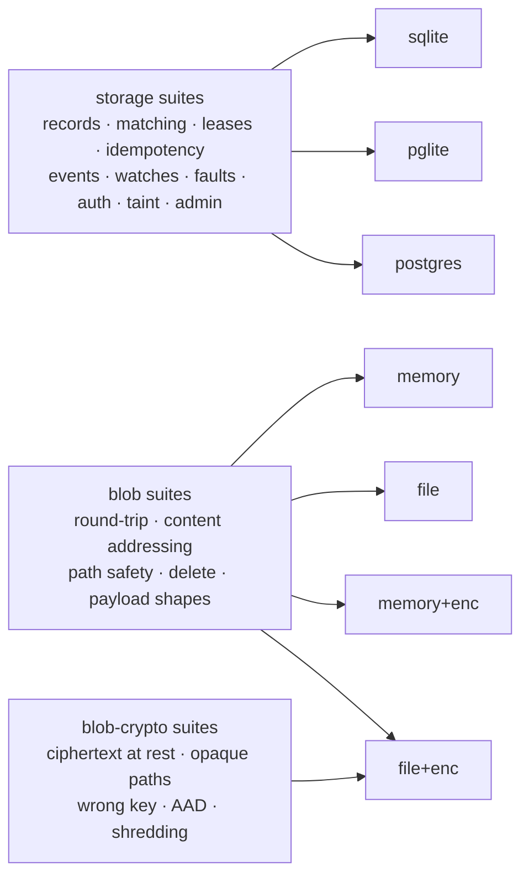

# Conformance suite

Port contracts, executed against every implementation. This is the only guard against drift — the
CLAUDE.md invariant that *embedded is never a semantically weaker cousin of Postgres*, applied to
each port the runtime depends on.

Two ports are under contract, and encryption is treated as an implementation of one of them rather
than a variant with a weaker contract:



```bash
deno task conformance                     # sqlite + pglite + the blob port   (256 tests)
scripts/pg-conformance.sh                 # + a live Postgres                 (366 total)
RADIA_PG_URL=postgres://… scripts/pg-conformance.sh   # against your own server
```

Without `RADIA_PG_URL`, `pg-conformance.sh` starts a throwaway Docker Postgres and removes it
afterwards, on a host port docker picks (it used to hardcode 55432, which is inside Linux's
ephemeral range — an unrelated outbound connection holding it, even in TIME_WAIT, made the script
fail with a docker "address already in use" that reads like a stale container and is not one).

Each Postgres test runs in its own ephemeral schema, dropped on close, so it is safe to point at a
database you care about. The live-server run adds 110 storage tests to the embedded 256 — and it
is the only run that actually *contends* for claims, which is why a claim-path change needs it (see
"Writing a suite" below).

## Layout

| File | Role |
|------|------|
| `run.test.ts` | entry point: enumerates implementations, registers every suite against each |
| `harness.ts`  | the `Suite` / `BlobSuite` / `BlobCryptoSuite` types and setup/teardown. The only `Deno.test` binding in the repo |
| `suites/`     | one file per behavior area (records, matching, **pushdown soundness**, **graph: children + lineage**, leases + claim fairness, idempotency, events, watches, faults, auth, taint, admin + selector-driven remediation, blobs + encryption) |

## Writing a suite

A suite is a name plus a `run(...)` function; the harness runs it once per implementation. Assert on
observable behavior, never on a specific backend's SQL or on-disk layout — a test that only passes
on one implementation is testing the implementation, not the contract.

Five conventions worth copying rather than reinventing:

- **Simulate faults by composition, not test hooks.** A crashed worker is one that took a lease
  and never acked, with the lease forced expired via a negative `leaseSeconds`. Deterministic, no
  sleeps, and no test-only code paths in production. See `suites/faults.ts`.
- **Never assert on wall-clock timing.** All time comparisons use the database clock; a test that
  sleeps is a test that flakes in CI.
- **Keep crypto deterministic.** The blob-crypto suites use a fixed KEK, so a failure means a
  behavior change rather than a coin flip. Randomness stays inside the implementation (DEKs,
  nonces), never in the assertions.
- **Assume the embedded adapters cannot see your bug.** Two real faults were invisible to
  `deno task conformance` and only appeared against a live Postgres: claim starvation, because
  SQLite and PGlite are single-connection and never actually contend; and a collation-dependent
  record ordering, because the throwaway Docker image runs in C locale while a real server usually
  does not. Anything touching concurrent claims or text ordering needs `scripts/pg-conformance.sh`
  — and, for ordering, a server with a linguistic collation.
- **Never assume ULID insertion order is id order.** Ids minted inside the same millisecond differ
  only in their random half, so a test asserting "the records I put, in that order" passes on a
  slow adapter and fails on a fast one. Sort the expectation.

Adding a behavior to `StorageAdapter` or `BlobStore` means adding it here in the same change. A
behavior is not done until it is green on every implementation of that port.
