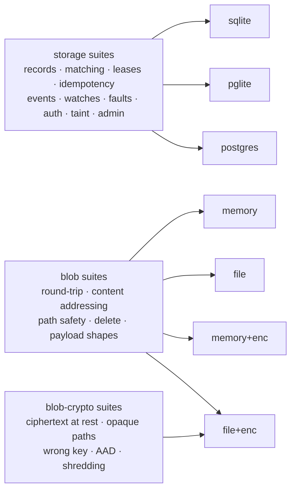

# Conformance suite

Port contracts, executed against every implementation. This is the only guard against drift. It is
the CLAUDE.md invariant that *embedded is never a semantically weaker cousin of Postgres*, applied
to each port the runtime depends on.

Two ports are under contract, and encryption is treated as an implementation of one of them rather
than a variant with a weaker contract:



```bash
deno task conformance                     # sqlite + pglite + the blob port   (539 tests, ~25s)
scripts/pg-conformance.sh                 # + a live Postgres
RADIA_PG_URL=postgres://… scripts/pg-conformance.sh   # against your own server
```

Without `RADIA_PG_URL`, `pg-conformance.sh` starts a throwaway Docker Postgres and removes it
afterwards, on a host port docker picks (it used to hardcode 55432, which is inside Linux's
ephemeral range; an unrelated outbound connection holding it, even in TIME_WAIT, made the script
fail with a docker "address already in use" that reads like a stale container and is not one).

Each Postgres test runs in its own ephemeral schema, dropped on close, so it is safe to point at a
database you care about. The live-server run adds its own storage tests to the embedded 539 (**741
total**), and it is the only run that actually *contends* for claims, which is why a claim-path
change needs it (see "Writing a suite" below). The two cases in `concurrency.test.ts` are ignored
entirely without it.

**Both run in CI** (`.github/workflows/ci.yml`), in two jobs: `embedded` (check + conformance +
extensions) and `postgres` (the same suite against a service container). Until 2026-08-04 the
Postgres run was manual, while CLAUDE.md's invariant said the suite runs on every implementation
"in CI from day one" — an invariant naming a guard that was not running.

## What "done" means

- **Write the suite before or alongside the behavior**, never after. A contract test written
  afterwards documents what the implementation happens to do.
- **A behavior is not done until it is green on every adapter**, not just the one it was written
  against. Running two embedded adapters from the first commit is what keeps that real rather than
  aspirational, and it is why the port stayed honest before Postgres arrived.
- **Never let a test's output be interactive**, and never make the suite depend on a live model.
  Per repo conventions the agent writes tests and states how to run them.

## Layout

| File | Role |
|------|------|
| `run.test.ts` | entry point: enumerates implementations, registers every suite against each |
| `adapters.ts` | the implementations under test, and how each is isolated per test: SQLite gets a fresh `:memory:` database, PGlite and Postgres get an ephemeral schema on ONE shared server (see below) |
| `harness.ts`  | the `Suite` / `BlobSuite` / `BlobCryptoSuite` types and setup/teardown |
| `suites/`     | one file per behavior area (records, matching, **pushdown soundness**, **graph: children + lineage**, leases + claim fairness, idempotency, events, **the integrity chain incl. direct-SQL tamper cases**, **resource limits**, **the orphaned/starving split**, watches, faults, auth, taint, admin + selector-driven remediation, blobs + encryption) |
| `http.test.ts` | the HTTP boundary, driving `makeHandler` directly: authentication and run renewal, the artifact inline/download allowlist and capability URLs, erasure (410 vs 404, shared payloads, forged shred markers), and a table of wrong-typed fields per endpoint |
| `backfill.test.ts` | the schema's one migration: rebuilding `record_edges` for a database written before that table existed |
| `planner.test.ts`  | Postgres planner statistics for declared body paths (`prepareKind`) |
| `registry.test.ts` | latest-wins projections over hand-made ids and timestamps |
| `openapi.test.ts`  | the frozen contract against the router, both directions: every documented operation is routed, and every `/v0` path the router names is documented |
| `notifier.test.ts` | the watch wakeup state machine: who wakes, when the cross-instance poll runs |
| `concurrency.test.ts` | the fault matrix's CONTENDED half: the two claim-path races that need real parallel connections, so they skip without `RADIA_PG_URL` |
| `flows.test.ts`    | flow mining, including the acceptance test written before the feature: the pipeline example's shape, recovered without the miner being told to look for it |
| `tree.test.ts`     | serving a multi-file tree over one path capability: relative resolution, traversal missing the index, the mint-time read check, the isolated origin. Its three security cases were each validated against a planted regression |
| `loop.test.ts`     | the SDK worker loop losing a lease: the handler's cancellation channel (the one test here that binds a real port, since the SDK client and its SSE watchers are what is under test) |
| `console.test.ts`  | the dev console, lifted out of the page source: HTML escaping, no credential in the page, in an event handler or in the URL, the sign-in gate, and the hash router (run against a stub DOM, since source text cannot show whether a route wires the tab, the selection and the knobs in the right order) |
| `defaults.test.ts` | the posture an unconfigured space lands in: `--auth`, the runtime directory, optional-value flags |

**One PGlite for the process, one schema per test.** Booting a WASM Postgres per test cost ~350ms
around single-digit ms of work, so `adapters.ts` boots one instance at module load and gives each
test an ephemeral schema, exactly as the standalone Postgres rows already worked (measured per
create-init-work-close cycle: 362ms → 17ms). A test still gets fresh tables; what it no longer gets
is a virgin *database*, so a test that reads a server-wide catalog must construct its own
`PgliteAdapter()` rather than take the harness's (`planner.test.ts` does, and pins the one place
that catalog scoping actually mattered). PGlite is a single connection and `search_path` is state
on it, so a shared instance is sequential-use only; the harness runs a test at a time.

The files outside `suites/` are NOT adapter-parameterized, and that is the rule for where a test
belongs: the shared run is for PORT contracts, so anything that has one implementation (the HTTP
surface, the console, the defaults) or knows a specific dialect (the backfill, the planner) is a
standalone `*.test.ts`. They still run under `deno task conformance`, which globs the directory.

**What does NOT belong here: extension contracts.** `extensions/` holds conventions built on the
substrate rather than parts of it, and `extensions/conformance/` (`deno task extensions`) is their
tier. The split follows the dependency rule: everything in this directory may import `src/`, and
nothing in an extension may. A test that spawns `radia dev` and drives it over `/v0` is an extension
test even when it feels like a port test.

Two of these test SOURCE TEXT rather than behavior, which is unusual enough to justify. The console
is one file with no build step, so there is no module to import; `console.test.ts` lifts functions
out of the page and evaluates them, and the extraction fails loudly if one is renamed, so the test
cannot quietly stop testing anything. `defaults.test.ts` asserts on literals because a default is a
literal: the failure mode is someone changing `"required"` back to `"open"`, and only reading that
token catches it.

## Writing a suite

A suite is a name plus a `run(...)` function; the harness runs it once per implementation. Assert on
observable behavior, never on a specific backend's SQL or on-disk layout. A test that only passes
on one implementation is testing the implementation, not the contract.

Seven conventions worth copying rather than reinventing:

- **A race guard is not a guard until the pre-fix code fails it.** Both cases in
  `concurrency.test.ts` passed against the very defect they were written for on the first draft:
  one because a pushable pattern is filtered in SQL, so the take saw a window of pure matches and
  never paged at all, and one because matches parked at the tail of a queue shift *toward* a paging
  claimer instead of past it. Plant the old code back in, watch it fail, and record which detector
  fired and how often.

- **Simulate faults by composition, not test hooks.** A crashed worker is one that took a lease
  and never acked, with the lease forced expired via a negative `leaseSeconds`. Deterministic, no
  sleeps, and no test-only code paths in production. See `suites/faults.ts`.
- **Never assert on wall-clock timing.** All time comparisons use the database clock; a test that
  sleeps is a test that flakes in CI. The one exception is where LATENCY IS THE CONTRACT: the
  cross-instance wakeup (`suites/watches.ts`, `notifier.test.ts`) and the fenced handler
  (`loop.test.ts`) have nothing else to assert, since the pre-fix build produced the same records,
  just later or not at all. Those bounds are set an order of
  magnitude above the mechanism (a 250ms poll asserted under 10s) so the margin, not the scheduler,
  decides the outcome.
- **Keep crypto deterministic.** The blob-crypto suites use a fixed KEK, so a failure means a
  behavior change rather than a coin flip. Randomness stays inside the implementation (DEKs,
  nonces), never in the assertions.
- **Assume the embedded adapters cannot see your bug.** Claim starvation was invisible to
  `deno task conformance` and appeared only against a live Postgres, because SQLite and PGlite are
  single-connection and never actually contend. Anything touching concurrent claims needs
  `scripts/pg-conformance.sh`, and its test belongs in `concurrency.test.ts` rather than a suite,
  since a suite that cannot run on two of three adapters is not a port contract.
- **A persistent database is not `:memory:`, and a "restart" needs one.** `init()` opens a fresh
  connection, so re-initializing an in-memory adapter gives you an EMPTY database rather than the
  one you just wrote, so a restart test that skips this passes by finding nothing. `backfill.test.ts`
  uses a temp file/dir per dialect for exactly this reason.
- **Never assume ULID insertion order is id order.** Ids minted inside the same millisecond differ
  only in their random half, so a test asserting "the records I put, in that order" passes on a
  slow adapter and fails on a fast one. Sort the expectation.

Adding a behavior to `StorageAdapter` or `BlobStore` means adding it here in the same change. A
behavior is not done until it is green on every implementation of that port.
