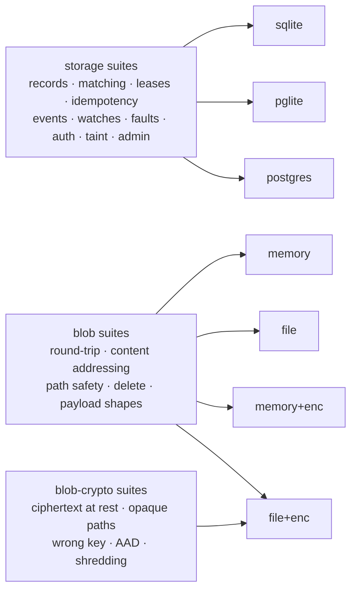

# Conformance suite

Port contracts, executed against every implementation. This is the only guard against drift. It is
the CLAUDE.md invariant that *embedded is never a semantically weaker cousin of Postgres*, applied
to each port the runtime depends on.

Two ports are under contract, and encryption is treated as an implementation of one of them rather
than a variant with a weaker contract:



```bash
deno task conformance                     # sqlite + pglite + the blob port   (322 tests)
scripts/pg-conformance.sh                 # + a live Postgres
RADIA_PG_URL=postgres://… scripts/pg-conformance.sh   # against your own server
```

Without `RADIA_PG_URL`, `pg-conformance.sh` starts a throwaway Docker Postgres and removes it
afterwards, on a host port docker picks (it used to hardcode 55432, which is inside Linux's
ephemeral range; an unrelated outbound connection holding it, even in TIME_WAIT, made the script
fail with a docker "address already in use" that reads like a stale container and is not one).

Each Postgres test runs in its own ephemeral schema, dropped on close, so it is safe to point at a
database you care about. The live-server run adds its own storage tests to the embedded 322, and it
is the only run that actually *contends* for claims, which is why a claim-path change needs it (see
"Writing a suite" below).

## What "done" means

- **Write the suite before or alongside the behavior**, never after. A contract test written
  afterwards documents what the implementation happens to do.
- **A behavior is not done until it is green on every adapter**, not just the one it was written
  against. Running two embedded adapters from the first commit is what keeps that real rather than
  aspirational, and it is why the port stayed honest before Postgres arrived.
- **Never let a test's output be interactive**, and never make the suite depend on a live model.
  Per repo conventions the agent writes tests and states how to run them.

## Layout

| File | Role |
|------|------|
| `run.test.ts` | entry point: enumerates implementations, registers every suite against each |
| `harness.ts`  | the `Suite` / `BlobSuite` / `BlobCryptoSuite` types and setup/teardown |
| `suites/`     | one file per behavior area (records, matching, **pushdown soundness**, **graph: children + lineage**, leases + claim fairness, idempotency, events, watches, faults, auth, taint, admin + selector-driven remediation, blobs + encryption) |
| `http.test.ts` | the HTTP boundary, driving `makeHandler` directly: authentication, the artifact inline/download allowlist, and a table of wrong-typed fields per endpoint |
| `backfill.test.ts` | the schema's one migration: rebuilding `record_edges` for a database written before that table existed |
| `planner.test.ts`  | Postgres planner statistics for declared body paths (`prepareKind`) |
| `registry.test.ts` | latest-wins projections over hand-made ids |
| `console.test.ts`  | the dev console's HTML escaping, lifted out of the page source |

The four files outside `suites/` are NOT adapter-parameterized, and that is the rule for where a
test belongs: the shared run is for PORT contracts, so anything that has one implementation (the
HTTP surface, the console) or knows a specific dialect (the backfill, the planner) is a standalone
`*.test.ts`. They still run under `deno task conformance`, which globs the directory.

## Writing a suite

A suite is a name plus a `run(...)` function; the harness runs it once per implementation. Assert on
observable behavior, never on a specific backend's SQL or on-disk layout. A test that only passes
on one implementation is testing the implementation, not the contract.

Six conventions worth copying rather than reinventing:

- **Simulate faults by composition, not test hooks.** A crashed worker is one that took a lease
  and never acked, with the lease forced expired via a negative `leaseSeconds`. Deterministic, no
  sleeps, and no test-only code paths in production. See `suites/faults.ts`.
- **Never assert on wall-clock timing.** All time comparisons use the database clock; a test that
  sleeps is a test that flakes in CI.
- **Keep crypto deterministic.** The blob-crypto suites use a fixed KEK, so a failure means a
  behavior change rather than a coin flip. Randomness stays inside the implementation (DEKs,
  nonces), never in the assertions.
- **Assume the embedded adapters cannot see your bug.** Claim starvation was invisible to
  `deno task conformance` and appeared only against a live Postgres, because SQLite and PGlite are
  single-connection and never actually contend. Anything touching concurrent claims needs
  `scripts/pg-conformance.sh`.
- **A persistent database is not `:memory:`, and a "restart" needs one.** `init()` opens a fresh
  connection, so re-initializing an in-memory adapter gives you an EMPTY database rather than the
  one you just wrote, so a restart test that skips this passes by finding nothing. `backfill.test.ts`
  uses a temp file/dir per dialect for exactly this reason.
- **Never assume ULID insertion order is id order.** Ids minted inside the same millisecond differ
  only in their random half, so a test asserting "the records I put, in that order" passes on a
  slow adapter and fails on a fast one. Sort the expectation.

Adding a behavior to `StorageAdapter` or `BlobStore` means adding it here in the same change. A
behavior is not done until it is green on every implementation of that port.
