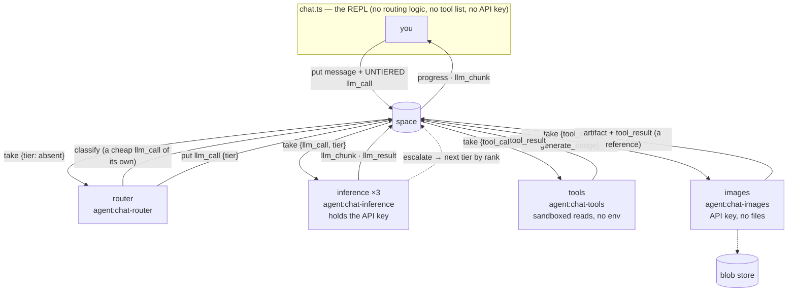

# Radia examples

Deterministic demo agents that exercise the runtime the way a real agent would — over the
public HTTP API, via the TS SDK stub in [`../sdk/ts`](../sdk/ts). No LLM keys, no
flakiness; the seam where a tool runs (`examples/tools.ts`) is where a real agent would
call a model.

## Watch it in the web console

```bash
deno task dev            # terminal 1: the space + web console at http://localhost:7788
deno task demo           # terminal 2: runs the agents against that space
```

Open http://localhost:7788, go to the **Feed** tab, then run `deno task demo`. It detects
the running space, runs a planner + two workers + an aggregator against it, and you watch
the events stream in live; open the `summary` record to see its lineage. (If no space is
running, `demo` starts one and leaves it up so you can open it — Ctrl-C to stop.)

## One command, self-contained (CI)

```bash
deno task demo:ci
```

Spawns an ephemeral `radia dev`, runs the whole pipeline, prints the summary + event log +
lineage, and exits. An integration smoke test of the wire contract — nothing to watch, it
tears down.

## What it demonstrates

- **Content-routed coordination, no routing table.** `worker upper` and `worker reverse`
  each claim only `{kind:task, match:{op:...}}` that matches their tool.
- **Fan-out / fan-in.** The planner splits a `job` into per-word `task`s (fan-out); workers
  emit `result` facts; the aggregator reads them and emits one `summary` (fan-in).
- **Leases + at-least-once**, idempotent aggregation (`summary:<jobId>` key), the
  transactional **event log**, and a 4-level **lineage** tree (summary → results → tasks → job).
- **Claim vs. read.** Workers *take* tasks (claimed once, fenced); the aggregator *reads*
  results (facts, never consumed).

## Running the pieces separately (the two-terminal experience)

Point agents at a running space with `RADIA_URL` (default `http://localhost:7788`):

```bash
deno task dev                                             # terminal 1: the space + web console
deno run --allow-net --allow-env examples/planner.ts     # terminal 2
deno run --allow-net --allow-env examples/worker.ts upper # terminal 3
deno run --allow-net --allow-env examples/aggregator.ts  # terminal 4
deno run --allow-net --allow-env examples/coordinator.ts "hello there world"  # seed + read
```

Watch it unfold live in the web console's **Feed** tab, and open a `summary` record to see
its lineage.

## Stress generator (`stress.ts`) — watch the Space tab develop

```bash
deno task dev                                            # terminal 1 — open http://localhost:7788
deno task stress                                         # terminal 2 — one wave
deno task stress -- --waves 3 --tasks 600 --rate 150 --workers 6
```

Fills a space with a **wave** of coordinated activity so the console's **Space** tab (the
property-similarity map) has something to develop. Each run is a new wave: a fresh wave tag,
**freshly minted agents** (so every run adds its own `run` clusters), a randomized op/topic mix,
and jittered volumes. Nothing is overwritten — re-run it and the map keeps growing.

Position in that view is a pure function of a record's **properties** — kind, envelope state,
owning run (`spaceNodeFor` in `src/ui/index.html`), never its links — so the generator varies all
three deliberately rather than only pushing volume:

- **kind** — `stress_job` (fanned out), `stress_task` (claimed by content), `stress_result`,
  `stress_fact` (never claimed: a pure `available` cluster), `stress_summary` (rolling fan-in).
- **run** — one agent per role plus **one per op**, each with its own run token, so the event log
  attributes every record to a distinct run. Workers hold a **template-scoped grant**
  (`take stress_task` narrowed to `{op, wave}`), so content routing is enforced by authorization,
  not just by the template a worker happens to send.
- **state** — acked work lands `consumed`; **poison** records are nacked repeatedly (attempt +1,
  back to `available`, reclaimed) until the runtime **dead-letters** them past `maxAttempts`; a
  chaos agent claims a few tasks under a 900s lease and walks away, leaving them **`leased`**
  after the run — a stuck-lease cluster for `space_doctor` and the remediation tools to find.

The retry churn is the most animated part: records flicker `leased → available` before settling.

| flag | default | effect |
|-------------|--------|------------------------------------------------|
| `--waves N` | 1 | waves per run, each with its own tag and agents |
| `--tasks N` | 240 | work items per wave (jittered ±25%) |
| `--facts N` | 120 | never-claimed records per wave |
| `--workers N` | 4 | worker agents, one op each (max 8) |
| `--rate N` | 60 | producer records/sec — pacing is what makes it animate |
| `--chaos PCT` | 12 | share of tasks that go poison or get abandoned |
| `--once` | off | tear down a spawned space at the end (CI) |

It prints per-wave counters and then the space's own totals by kind and state. The Space tab holds
3000 records (`SPACE_CAP`); past that it evicts finished ones (consumed, dead-lettered) in
least-recently-active order first, then live ones — so a heavy wave rolls off settled history
while work that is still moving stays on the map.

## CLI chatbot (`chat/`) — a real LLM agent, full symmetry

A CLI chatbot where **the whole conversation lives on the blackboard**. The chatbot makes
no external calls — it only reads and writes records. LLM inference (`llm_call →
llm_result`, streamed as `llm_chunk`) and tools (`tool_call → tool_result`) are both served
by content-routed workers.



Every arrow is a record. The REPL never calls a model, never picks a tier, and never holds a
key — it writes messages and reads results, and four independently-privileged workers do the rest.

The conversation is an **append-only thread of `message` records** anchored to a
`conversation` record — not a client-held array. The chatbot appends messages (system /
user / assistant / tool); an `llm_call` references the thread by `{conversationId,
upToIndex}` and the **inference-worker reconstructs the context by querying the thread**
(`{kind:message, match:{conversationId}, orderBy:index}`, newest-first and bounded — see
windowing below). Consequences: history is stored once (linear, not quadratic — no re-embedding)
and *read* incrementally, the whole conversation stays reconstructible from the space (`query` the
thread), and every message is a record you can watch in the Feed. This is the blackboard shared-memory pattern, not just content-routed dispatch.

**Tools are discovered, not hard-coded, and their usage lives with them.** Each tool-worker
publishes its tools as `capability` records (`{tool, def}` — `def` carries the description the LLM
reads); the chatbot keeps a live tool set by *watching* them (`watch {kind:capability}`) and
dispatches by content (`tool_call{tool}` → whichever worker registered it). Add a tool-worker → its
capability record streams in and the chatbot gains the tool on the next turn, no code or prompt
change; how to *use* a tool is in its description, not the chat's system prompt. Like `kind_def`
records, a capability is content-keyed and immutable — a redefined tool is a **successor** record,
latest-per-tool wins on discovery (so re-running never conflicts). This is "no preconfigured
routing table" (§7) applied to tools — the substrate coordinating its own capabilities.

**Model selection is content-routing, and the routing is delegated to the substrate.** There are
three capability/cost **tiers** — `fast`, `balanced`, `deep` — each served by its own
inference-worker that claims only its tier's calls (`take {kind:llm_call, match:{tier}}`) and
advertises a `model` record carrying its `rank` (cheap → capable). **The chat holds no routing
logic:** it puts an *untiered* `llm_call`. A **router-worker** (`chat/router.ts`) claims untiered
calls (`match:{tier:{$exists:false}}`), classifies the turn with a **cheap classifier model** —
itself a model-overridden `llm_call` served by the inference fleet (`--classify-model`, default
`google/gemini-2.5-flash-lite`), so the API key stays isolated in the workers and classification
routes through the substrate like any other call — and re-dispatches a *tiered* `llm_call`. The
result stays keyed to the original call (`replyTo`), so the chat is oblivious to the indirection —
it just sees `[routed → deep]`. Add a tier-worker → a new model is live, no orchestrator change.
Defaults: `fast` → `openai/gpt-4o-mini`, `balanced` → `anthropic/claude-sonnet-5`, `deep` →
`anthropic/claude-opus-5`; override per tier with `RADIA_CHAT_MODEL_{FAST,BALANCED,DEEP}`.

**No tier name appears in the router.** Live tiers come from the `model` records ordered by `rank`;
the classifier is asked to answer with one of *those* words; and when it errors or times out the
fallback heuristic picks by **position** in that list (cheapest / middle / most capable), never by
name. So "add a tier-worker and it is routable" holds on both the classifier path and the fallback.

Routing happens **per round**, not per turn — every `llm_call` is classified, including the rounds
that come back after tool results. So the classifier is told how many tool calls the turn has
already made ("weigh that, not just the wording"), runs at `temperature: 0` so one question does
not land on different tiers across rounds, and the router expands its read of the thread until the
user's message is in view. Without that last part the later rounds classify an empty string, which
routes the synthesis round — the hardest one — to the cheapest model.

Why a classifier when escalation exists — the two mechanisms judge the same thing, and that is a
deliberate trade. The classifier was **removed once** on the argument that escalation pays for
routing only on the turns that were misrouted, while a classifier taxes every turn in front of the
first token. That argument assumes the cheap model can recognize it is out of depth. It does not:
across a tool-heavy analytical session the cheap tier escalated on *nothing* and answered from
invented numbers instead. Self-assessment is the weakest available judge, so the judgment is made
by a different model, at roughly 0.5-1.2s before the first token. Escalation stays as the catch for
what the classifier under-routes. See `agent_docs/gotchas.md`.

**Cheap-first, escalate on demand.** On top of routing there's a cost **cascade**: the model is
offered an `escalate` capability (a discovered tool — guidance in its description), and when it's
out of depth it calls `escalate`. The inference-worker *intercepts* that call and re-dispatches the
turn to the next-stronger tier (ordered by the `rank` on each `model` record), keyed to the same
original call. The top tier has no escalation target (the tool is stripped, so it just answers),
which terminates the cascade. This is the *only* mechanism that judges difficulty, and it judges it
where the information actually is — in the worker that has read the turn and found itself out of
depth — rather than in a classifier guessing up front.

A model may stream text *before* it calls `escalate`, and that text is already on the user's screen
when the attempt is discarded. So the boundary is marked **in the stream**: the escalating worker
puts a final `llm_chunk` with an empty delta and `reset: true`, and hands its index watermark to the
next worker via `indexOffset`. Chunk indices therefore form one monotonic sequence per awaited call
across every attempt — the chat prints `↩ escalated — restarting on a stronger model`, drops what it
had, and keeps reading forward. Nothing is replayed and no two attempts interleave.

```bash
export OPENROUTER_API_KEY=sk-or-...          # https://openrouter.ai/keys
deno task dev                                # optional: open http://localhost:7788, Feed tab
deno task chat                               # connects to 7788 (or spawns its own space)
```

`deno task chat` connects to (or spawns) a space and launches two **scoped subprocess**
workers, then gives you a REPL. Watch every thought and action stream into the Feed tab.

Why subprocesses: permission isolation only holds across processes.

- **inference-worker** — `--allow-net --allow-env`; holds `OPENROUTER_API_KEY`; no file access.
- **tool-worker** — `--allow-read=<sandbox dirs>` and `--allow-net=127.0.0.1:<port>` only,
  **no `--allow-env`**. The process that can read files cannot reach the network beyond the
  local space and cannot read secrets, so reading a file can't lead to exfiltrating it.
  Path canonicalization (realpath + allowlist, in `tools.ts`) is defense-in-depth on top.

Tools: `read_file`, `list_files`, `search_files`, `stat` (sandboxed to `RADIA_CHAT_DIRS`,
default `examples/chat/sandbox`; `list_files`/`read_file`/`stat` return `size` + `modified`
so size/date questions get ground truth, not guesses), plus `time` and `calc`.

**Inspection tools** (`inspect.ts`) make the chatbot a conversational inspector of its own
space: `space_stats`, `space_kinds`, `space_query`, `space_count`, `space_record`, `space_lineage` (ancestors,
UP), `space_children` (records that reference this one, DOWN — e.g. a conversation's messages),
`space_events`, and `space_doctor` (a derived health report — stuck leases, dead-letters,
stale-available). Tool guidance lives in each tool's description (published as a `capability`
record), not in the chatbot's prompt. Because everything is a record, it can inspect *itself* — ask it "how many
records are in the space?", "show the lineage of the last summary", "is the space healthy?",
or "query my conversation thread" (the conversation is `kind:message` with your
`conversationId`). Output is size-capped so results are LLM-friendly, and each inspection is
itself a `tool_call` (a small observer effect).

Two of those exist because of a specific failure: asked for a percentage breakdown, the assistant
counted the 10 records a query happened to return and reported it as the population. `space_query`
now returns `more: true` with a warning that the result is a page, and **`space_count`** answers
"how many" directly (exact up to the server's 500-row query cap, and says so when it isn't). A page
answers *show me some*; an aggregation question needs *how many*, and the tool set now has both.

**Remediation tools** (`remediate.ts`) turn it into an operator: `space_reclaim` (un-stick
an expired lease), `space_dead_letter`, `space_requeue` — control-plane operations that
bypass lease fencing (fixing another worker's stuck record), so they're privileged (grant-
gated with real auth). Pair with `space_doctor`: "find what's stuck and fix it," in chat.

**The chat is woken by the runtime, not by a timer.** A background `watch` per streaming kind
(`llm_chunk`, `llm_result`, `tool_result`) turns "a matching record became available" into a
wakeup, and the wait loops block on that with a 250 ms fallback tick — so a dropped or forbidden
watch degrades to polling instead of stalling a turn. Reads are incremental: the chat asks for
`{callId, index: {$gt: lastSeen}}` rather than re-scanning the whole stream every tick, which is
what makes wakeup-per-chunk affordable (a burst still batches into one range read). No grant
changes were needed for this — `authorizeWatch` requires *a* grant on the kind, not a `watch`
operation, so the session's existing `query`/`read_one` grants already permit it. Worth knowing
when writing grant sets: a `read_one` grant also confers a stream of wakeups for every matching
record, though reading each one still needs the grant.

**The assistant has a second path to its own past.** Every chatbot has exactly one — the context
window — and confabulating about earlier turns is the standard failure. Here the conversation is
records, so the model can *look* instead of reconstructing. The prompt carries only the disposition
("if you are unsure what happened earlier, retrieve it rather than recall it") and the assistant's
own `conversationId`; the mechanism stays in `space_query`'s description, which already spells out
`kind 'message'`, `match {conversationId}`, `order_by index`. Identity in the prompt is not
substrate knowledge — it's the agent's handle on itself, like a run token — and it is what makes
the disposition usable: the reconstructed thread strips `conversationId`, the `conversation` record
has an empty body and no indexed path, and `role=user` cannot enumerate conversations, so without
being told the id the model could not name the thread it is in.

**Which is what makes windowing safe.** The inference-worker sends the newest `RADIA_CHAT_WINDOW`
messages (default 40), not the whole thread: a descending keyset read over the sortable `index`,
so per-turn cost is bounded by the window rather than by conversation length — "stored once, read
incrementally" now holds for the *context*, not only for storage. Dropping old turns is normally
lossy and one-way; here the omitted messages are still records, and the assistant knows its own
conversation id, so the notice it gets can be a pointer rather than a summary:

```
[3 earlier messages in this conversation are not included here. They are not lost —
 retrieve them if you need them.]
```

The system message is never windowed out (it is the standing instruction set), and a `tool` reply
whose assistant call fell outside the window is trimmed rather than left orphaned — an unanswered
`tool` message is a protocol error for the API. The window also **never evicts the current turn**:
one tool-heavy turn is easily a dozen messages (an assistant `tool_calls` message plus a reply per
call), so the read expands until the most recent `user` message is inside it. Without that, a fixed
count cuts away the question being answered and the model summarizes tool output it can no longer
attribute — which is exactly how it fails, not gracefully. Set `RADIA_CHAT_WINDOW=0` for the old
whole-thread behaviour. Each `llm_result` carries `context: {sent, hidden}`, so the cost of the
window and the assistant's response to it are both queryable: `space_query {kind: llm_result}`
answers "how often does it go back for history?" with no instrumentation.

Beyond recall, the second channel earns its keep on *structure* — lineage/children, another
agent's records, what a worker actually did — none of which is in the context window at any
length.

**Image generation is a discovered tool whose result is a reference** (`imageworker.ts`,
`images.ts`). A fourth worker serves `generate_image`: it calls an image model, stores the bytes as
an **artifact**, and acks a `tool_result` carrying `{artifactId, mediaType, size, prompt}` — never
the image data. A base64 image inside a record would land in the message thread, be re-sent every
turn and swamp the Feed; the record carries the reference, the blob store holds the payload. The
chat mints a short-lived download capability and prints a URL the console renders inline (set
`RADIA_CHAT_IMAGE_DIR` to also save the file). Lineage comes out as `artifact → tool_call →
conversation`.

Four things worth knowing, all of which the provider forces:

- **There is no images API.** Generation goes to the same `/chat/completions` endpoint with
  `modalities: ["image"]` on the request, non-streamed. So the wait is silent for 5-20s, which is
  what the `drawing` progress stage covers.
- **The response has seven shapes** (`extractImage` in `images.ts`): `content[].image_url`,
  `content[].inline_data` (Gemini), `images[]` in three sub-forms, a bare data-URL string, a
  markdown link needing a second fetch, and DALL-E's `data[].b64_json` / `data[].url`. Five are
  provider quirks; a client handling only the documented one breaks on a model swap. Two hand back
  a URL the *model* chose — those are fetched https-only, and the stored artifact is **tainted**,
  because provider bytes are untrusted and an image is a prompt-injection vector the moment
  anything reads it back.
- **The image model is not a tier.** It advertises `modalities: ["image"]` in its `model` record,
  and the router and the escalation ladder both filter to text-capable tiers — otherwise the
  classifier would happily dispatch a conversation turn to a model that only draws. A record with
  no `modalities` counts as text, so older workers still route.
- **It is its own process** with the API key and egress but **no file access** — the same split as
  the inference-worker. Putting a key and outbound network into the sandboxed tool-worker would
  collapse the containment the example exists to demonstrate.

**Turn progress is a record, not a spinner** (`progress.ts`). Between putting an `llm_call` and
the first streamed token, several workers act — the router claims and dispatches it, an
inference-worker claims the re-dispatched tiered call — and none of it is visible to the client:
watches only wake on *available* records, and claim/ack transitions live in the grant-gated event
log. So each worker publishes what it is doing as a **`progress` record** (`{conversationId,
callId, stage, by, note}`, keyed to the call the chat awaits — `replyTo`, not the re-dispatched
id), and the chat renders the latest as a live status line:

```
you> what's 17+156223
  · calc({"expr":"17+156223"}) running (agent:chat-tools) · 1s
assistant> routed → deep (agent:chat-router) · 2s
```

Stages: `routed` (router), `generating` with the tier and model it resolved, `escalating`
when a worker hands the turn up a tier, `running` (tool-worker). The status line is wiped as soon
as real output takes the line, and is TTY-only — piped output is unchanged. Progress records carry
a `retentionUntil` (they're chatter, not history) and any client sees the same stream, including
the console Feed.

**Absence of progress is the stall signal.** A call nobody claimed produces no `progress` record,
which is how a configuration failure is told apart from a slow model: past ~2.5s with nothing, the
chat says `no worker serves 'search_files'` or `no worker claimed this call — is the
router/inference fleet running?` instead of sitting silent until its timeout, and the timeout error
names the last stage reached. This works for a scoped session too (a `progress` query grant), with
no `/ops/*` access.

**Run it with auth (`roles.ts`).** The launcher is the OPERATOR of its local space, so it
bootstraps the chain (design-auth): it registers kinds and, as operator, mints **least-privilege
run tokens** for the two workers (`agent:chat-inference` = take `llm_call`, put
`llm_result`/`llm_chunk`; `agent:chat-tools` = take `tool_call`, put `tool_result`/`capability`).
The **session role** picks who the REPL (and its `space_*` tools) run as:

```bash
deno task chat                       # role=admin (default): session is the OPERATOR
RADIA_CHAT_ROLE=user deno task chat  # role=user: session is a scoped agent:chat-user run token
```

As **admin** the `space_*` inspect/remediate tools have full `/ops/*` access. As a **user** the
session is `agent:chat-user` — granted only the conversational kinds — so it can chat, query its
own thread, and discover tools, but `space_stats`/`space_doctor`/`space_reclaim`/`declassify`
return **403** (try "is the space healthy?"), and `space_query {kind: grant}` is denied too. This
is the same enforcement the conformance suite covers, exercised by a real agent: workers are
least-privileged, the user is scoped, and the operator is the only principal on the control plane.

Config: `OPENROUTER_API_KEY`, `RADIA_CHAT_ROLE` (`admin`|`user`, or `--role`),
`RADIA_CHAT_MODEL_{FAST,BALANCED,DEEP}` (per-tier model overrides), `RADIA_CHAT_DIRS`, `RADIA_URL`,
`RADIA_CHAT_API_BASE` (any OpenAI-compatible endpoint — a local stub for offline testing, or a
self-hosted gateway), `RADIA_CHAT_WINDOW` (newest messages sent per turn; 0 = whole thread),
`RADIA_CHAT_IMAGE_MODEL`, `RADIA_CHAT_IMAGE_SAFETY` (provider moderation passthrough,
`CATEGORY:THRESHOLD,…`), `RADIA_CHAT_IMAGE_DIR` (save generated images locally).
(No tier setting — the router dispatches, escalation promotes.)

Honest edges (documented, not hidden): a crashed inference retries and can double-spend
(at-least-once — the gateway is the real fix); file contents become records and flow to the
model — taint now exists (a tool-worker could `put {taint:true}` on file reads so the untrust
propagates, and a sensitive consumer could `take {requireUntainted}`), though this example
doesn't wire it yet. The thread model makes Radia storage linear, but re-sending history to
the provider each call is inherent to stateless chat APIs (prompt caching mitigates it,
provider-side), and a large single message (e.g. a 64 KB file read) is still one big record
until **artifacts** (§2.4, M1) let it be stored once and referenced. Not a CI test
(non-deterministic); `calc` and the sandbox path checks are unit-testable.

## Files

| File | Role |
|------|------|
| `../sdk/ts/client.ts` | `RadiaClient` — fetch wrappers over `/v0` (the TS SDK stub) |
| `../sdk/ts/loop.ts` | `agentLoop` — take → handle → ack/nack with heartbeat (design §5) |
| `tools.ts` | deterministic tools keyed by `op` |
| `kinds.ts` | registers the demo kinds |
| `worker.ts` | claims `{kind:task, match:{op}}`, runs the tool, emits a `result` |
| `planner.ts` | claims a `job`, fans out into `task`s |
| `aggregator.ts` | reads `result`s, emits a `summary` when a job is complete |
| `coordinator.ts` | seeds a job + a standalone task, reads outcomes |
| `demo.ts` | orchestrates all of the above in one process (`deno task demo`) |
| `stress.ts` | wave load generator (`deno task stress`): per-op worker agents, poison → `dead_letter`, abandoned leases → `leased`, for the Space tab |
| `chat/chat.ts` | CLI chatbot (pure record I/O); appends the `message` thread, spawns scoped workers, runs the REPL |
| `chat/kinds.ts` | registers `conversation`/`message`/`llm_*` (llm_call indexed on `tier`)/`tool_*`/`capability`/`model`/`progress` kinds |
| `chat/progress.ts` | `progress` records: a worker publishes what it is doing, keyed to the call the chat awaits (best-effort, `retentionUntil`) |
| `chat/roles.ts` | least-privilege grant sets + bootstrap (mint worker/session run tokens; admin vs user) |
| `chat/router.ts` | router-worker: claims UNTIERED `llm_call`s and re-dispatches to the cheapest advertised tier by `rank` (`replyTo` keeps the result correlated) — routing delegated to the substrate, no classifier; emits `progress` (`routed`) |
| `chat/inference.ts` | per-tier inference-worker (`--tier`/`--model`/`--rank`): claims `{llm_call, tier}`, advertises a `model` record + the `escalate` capability, reconstructs a WINDOW of the thread (newest N, system kept, orphan tool replies trimmed) → OpenRouter (stream) → `llm_chunk` + `llm_result` with `context: {sent, hidden}`; intercepts an `escalate` call and re-dispatches the turn to the next-stronger tier; emits `progress` (`generating` with tier+model, `escalating`) |
| `chat/toolworker.ts` | tool-worker: `tool_call` → sandboxed tool → `tool_result` (scoped perms), emits `progress` on claim |
| `chat/imageworker.ts` | image-worker: `tool_call{generate_image}` → image model → **artifact** → `tool_result` with the reference (tainted; holds the API key, no file access) |
| `chat/images.ts` | image API client: `modalities:["image"]` on chat-completions + a normalizer for the seven known response shapes |
| `chat/tools.ts` | file/compute tool impls + JSON schemas + sandbox (realpath allowlist, `calc`) |
| `chat/inspect.ts` | space-inspection tools (`space_stats`/`query`/`lineage`/`events`/`doctor`, …) |
| `chat/remediate.ts` | remediation tools (`space_reclaim`/`dead_letter`/`requeue`) over the admin endpoints |
| `chat/openrouter.ts` | streaming OpenAI-compatible client (sole API-key holder's dep) |
