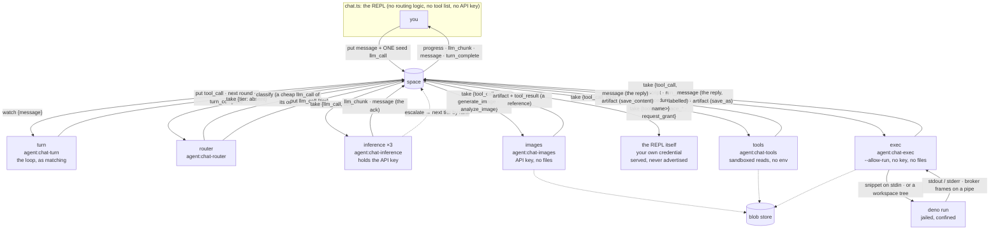

# Chat example: a real LLM agent, full symmetry

The end-to-end exercise of the runtime: thinking, acting, drawing, executing code and saving files
all flow through the space as records, served by six independently-privileged worker processes.
Nothing here talks to a model except the workers that hold the key.

```bash
export OPENROUTER_API_KEY=sk-or-...
deno task dev      # optional: open http://127.0.0.1:7788 and watch the Feed tab
deno task chat
deno task chat -- --conversation last    # …or pick up where you left off
```

**Setup and session are separate jobs, and only the first is privileged.** Run alone, `deno task
chat` does both: it registers kinds, mints the workers' credentials, starts the fleet, and then
talks to you. For more than one person, split them:

```bash
# ONCE, by whoever holds the operator credential. Parks holding the fleet.
# --auto-grant: everyone the IdP vouches for may use this chat.
OPENROUTER_API_KEY=sk-or-... deno task chat -- --serve --auto-grant

# EVERY PERSON, holding nothing but their own login. No operator, no API key.
radia login --sso        # …or: radia login human:you
deno task chat
```

Without `--auto-grant` an SSO identity arrives with **zero** grants and somebody has to let each
person in — `deno run -A examples/chat/grant-user.ts <their principal>`, and a session that has not
been let in prints that exact line, principal included, so it can be forwarded rather than
reconstructed. With the flag the `--serve` process assigns the standard set as each person enrols,
and **the ban becomes the mapping**: keeping somebody out means retiring their `oidc_identity`
(`retire is a ban`, agent_docs/plan-oidc.md). Revoking their grants is not a ban and fails in the
awkward way — a sweep decides each principal once per process, so it holds until the fleet
restarts and then they are admitted again. A deliberate NARROWING does survive, because the sweep
only ever touches a principal holding nothing.

Join mode is selected by the ABSENCE of an operator credential, so there is no flag to forget: a
session that cannot bootstrap simply does not, and says what it cannot do (assign its own grants,
approve a grant request, list conversations) instead of failing at the first read. Two consequences
worth knowing. **The provider key belongs to the `--serve` process**, because the inference and
image workers are the only things that call a provider — asking every person for a shared secret
they never use would undo the point. And **granting is manual**, deliberately: `grant-user.ts`
writes grant records and never an `agent_definition`, so an SSO identity gains no durable
credential and deprovisioning at the IdP still bites within one run ceiling. Self-service granting
wants a broker on the supervisor identity, which is not built (agent_docs/plan-scaling.md item 3).

While the two halves were one, opening the chat meant holding the control plane, which is how "N
users" came to mean "N operators".

**Conversations survive a restart, because they were never in the process.** The thread is
`message` records on the space, so resuming is just recovering the one piece of client-held state
(`nextIndex`). That is one query, since `index` is a declared sortable path. Two things it depends on: a
chat-spawned space runs with `--db` (`RADIA_CHAT_DB`, default `.radia/chat.db`, beside everything
else a space writes), because a
space without one is in-memory and takes the conversation, its saved procedures and its artifacts
down with it; and `--conversation <id>|last` reattaches instead of opening a new thread. Resuming
restores more than the transcript: saved procedures are conversation-scoped, so the tools come
back too.

`last` is resolved with the OPERATOR credential the REPL already holds, not by the session:
enumerating conversations would otherwise need a `conversation: query` grant on a scoped user, and
that would let it list every conversation on the space to save a keystroke.

A resumed thread appends a CURRENT system message rather than inheriting the old one, and the
inference-worker treats the NEWEST system message in the thread as the standing instructions.
Otherwise a conversation resumed later keeps running under whatever disposition was written when it
started. That has a protocol consequence worth knowing: providers reject a `system` role anywhere
but the front ("system must follow a user or assistant message"), and a resumed thread has one
mid-conversation by construction. `provider/context.ts` assembles exactly one leading system
message, drops older ones from the body, and folds the windowing notice into it. Never emit that
notice as its own system message after the head: it is the same violation, waiting for a
conversation long enough to drop messages. `context.ts` is a pure function because this is where
the context bugs are (`deno run -A examples/chat/smoke-context.ts`).

`chat.ts` opens with a map of the tree; the areas are `client/` (the REPL), `workers/` (the five
agent processes), `tools/` (what they do), `space/` (how the app uses Radia) and `provider/` (the
outside world).

## Testing it without a model

```bash
deno task chat-test              # every suite, ~70s
deno task chat-test longthread   # one by name
```

**The prompt is a real line editor** (`client/edit.ts`), which is why raw mode is now owned for the
whole session rather than only during a turn. Arrow keys, Home and End, word motion (`Ctrl-←`,
`Alt-B`, `Ctrl-W`), `Ctrl-K` and `Ctrl-U`, and history on Up and Down, persisted per user beside the
credential file. Before this the prompt ran in cooked mode, where the driver gives you backspace,
`^W` and `^U` and nothing else: pressing left inserted the literal bytes `^[[D` into what you were
typing, and there was no history at all.

Owning raw mode is what buys that, and it comes with obligations the terminal driver used to meet.
`Ctrl-C` no longer raises a signal, so it is a key: during a turn it cancels the turn (what Escape
does — without this the byte sat in the type-ahead buffer doing nothing, which read as "Ctrl-C does
not work while calls run"), at a prompt it clears a line with something in it and quits an empty
one. Pressed twice during a turn it therefore quits, with no double-press logic anywhere: the
second lands on the empty prompt. `Ctrl-D` deletes forward mid-line and ends input on an empty one. The terminal is
restored on every exit path including a signal and an unhandled throw, because leaving raw mode
behind means a shell with no echo. Bracketed paste is enabled, so a pasted block stays ONE input
instead of submitting once per line. And the line is drawn on a single physical row, scrolled
horizontally, for the same reason the status line is: wrapping means tracking how many rows the last
draw used, and getting that wrong leaves fragments the erase cannot reach.

**`Ctrl-V` attaches whatever is on the clipboard**, because the terminal cannot. A TTY carries text,
so when the clipboard holds a picture the emulator's own paste shortcut has nothing to send and
sends NOTHING: no character, no error, a key that looks broken. This one asks the desktop instead.
Text is inserted as an ordinary paste would be, so the key is never the wrong one to press. A file
COPIED in a file manager arrives as a path rather than as bytes (`text/uri-list`) and is read from
disk.

**The keystroke STAGES; Enter writes.** An image or a PDF puts `[attach 1: name · type · size]` in
the line and nothing in the space; sending the line turns it into an artifact and the marker becomes
`[attached … artifactId …]`, which is what `analyze_image` takes. Delete the marker before pressing
Enter, or abandon the line, and nothing is stored. Uploading on the keystroke was the first shape
and it was wrong in one direction that matters: an `artifact` record is never swept, so a mis-paste
was permanent. See `client/attachments.ts`.

| host | tool | text | image / PDF | file copied in a file manager |
|---|---|---|---|---|
| Wayland | `wl-paste` (wl-clipboard) | yes | yes | yes |
| X11 | `xclip` | yes | yes | yes, when the manager offers `text/uri-list` |
| macOS | `pbpaste`, plus `pngpaste` for images | yes | only with `pngpaste` (`brew install pngpaste`) | no: Finder offers `public.file-url`, which neither tool reads |

Installed is not the same as usable, and the difference is the whole reason the reader is chosen by
DISPLAY SERVER rather than by what happens to be on PATH. A distro that ships `wl-clipboard` on a
machine logged into X11 has a `wl-paste` that spawns happily and fails on every read; picking it
because it exists gave a banner naming a reader and a key that did nothing, forever. So Wayland
requires `WAYLAND_DISPLAY`, X11 requires `DISPLAY` (Wayland first, which is the right order under
XWayland where both are set), and macOS requires being macOS. With no reader the banner says so.
A missing `pngpaste` is reported by name too: "empty" would be a lie to someone holding a screenshot.

Three things about that are deliberate. The REPL does the reading, not the tools worker: this is
your own process with your own filesystem, while that worker is confined to the sandbox directories
precisely so the process that can read files cannot reach the network. The session's grant gained
`artifact: put` to make it possible, which is a real widening, bounded by the same scope pattern as
everything else and by the fact that artifact bytes are the one thing in a space that can be
destroyed afterwards. And every clipboard read has a two-second deadline: the prompt is in raw mode
with a half-drawn line while it runs, and a clipboard owner that stops answering (which happens, and
did during development) would otherwise hang the session with no way out.

**Escape cancels a turn, and it is a RECORD.** The loop lives in the space now
([plan-chat-turn.md](../../agent_docs/plan-chat-turn.md)), so killing this process stops nothing:
the intent has to be a fact the turn worker can read. Escape writes `cancel{conversationId, turnAt}`
and the worker checks it before it emits the next link, so the turn stops advancing. Keyed to the
TURN, or it would silence every later one. What it still does not do: an `llm_call` or `tool_call`
already claimed runs to completion and its result lands anyway, which is what at-least-once means
and is why the message says so rather than implying the work was undone.
At the prompt the same key clears the line. It is a no-op when stdin is not a terminal, where the
editor is bypassed entirely and input is read a line at a time, byte for byte as before.

The part that is not cosmetic: a cancel lands in exactly the window that BRICKS a conversation —
after the assistant's `tool_calls` is on the thread and before its reply. So cancelling answers the
call it interrupted, the way a timeout does, and says the tool is still running. `smoke-context.ts`
pins both halves, including the counterexample where the missing reply drops the turn entirely.

This app is where bugs surface first, and most of them live in the app's own handling of
ACCUMULATED STATE rather than in the runtime: a resumed thread with a system message
mid-conversation (rejected by every provider), a capability page that does not reach the newest
tool, a grant narrowed in a way that removes a write permission, a NUL in a message body that the
storage layer's JSON type will not take. None needed a model to reproduce, and none were caught by
reading the code.

That is possible because a tool call is a record, a conversation is records, and the context path
is a function over rows, so the suites drive the real queries, the real window expansion and the
real assembly, with no API key:

| Suite | What it holds down |
|---|---|
| `context` | provider payload rules: exactly one leading system message, no orphaned tool reply, the windowing notice folded in |
| `longthread` | a deliberately awkward 58-message thread (two resumes, a tool-heavy turn wider than the window, empty/null/20k/unicode bodies) with the invariants checked at EVERY position in it |
| `procedures` | save → call by name → read back → retire → revive, conversation scoping, name shadowing, result provenance |
| `resume` | reattaching across a genuine process restart (the space is killed and restarted on the same `--db`) |
| `selfgrant` | forbidden → request → human approval → self-scoped reads, on both the ops and coordination planes. The ask BLOCKS on the human's answer and the answer names the scope actually granted, so the whole escalation fits in one turn instead of two. Also pins what `[own]` COSTS: narrowing retires the wider grant, so the prompt has to say which access it removes BEFORE the choice, never recommend the option that removes it, and the removal has to actually happen (as 404, not 403) or the warning is decorative |
| `inspect` | session isolation (a session reads only its own conversation), the `space_*` TOOLS on a busy space: paging past a wall of another author's events, answering "what may I do" from the enforcement rather than by inference, and the full escalation loop: a grant approved at the wrong scope authorizes nothing, and the prompt has to say so |
| `scope` | what a scoped session may read under both postures: identity (all its own conversations, including worker-produced results) vs conversation (this thread only) |
| `encrypt` | conversation keys end to end: the fleet publishes a public half and keeps the private one, a session seals its own thread and reads it back, and another person is stopped TWICE (by the grant, whose read returns empty rather than forbidden — scoping, not an absence of grants — and by the wrap if handed the record anyway). Then a real turn through the actual workers, a tool round proving the TURN WORKER routes an encrypted conversation with no key, a second machine reaching a conversation sealed before it existed, operator recovery when every machine is gone, and erasure destroying every key artifact the conversation accumulated |
| `iterate` | the code-gen loop as records: attempts that link into a chain, and a verdict the session has no grant to author |
| `save` | the routes to a stored file, read back out of the `capability` records the running fleet publishes rather than imported, since a fix nobody republished changes nothing for the model. Ends with one pass through a LIVE tools worker over real `tool_call` records: the rest drives the tools in process with an OPERATOR client, which cannot catch a worker missing a grant — exactly how `read_workspace` shipped unable to read |
| `login` | a person's own credential: who the session is, and that two people on one space cannot read each other |
| `join` | a session holding NO operator credential: it starts its own thread, reads its own permissions and takes turns, and cannot register a kind, mint a worker, grant itself anything, reach the ops plane or enumerate another conversation. The second half is why the first is safe to allow. Plus `--auto-grant`'s two safety properties: a retired mapping is never granted (retire is the ban), and a principal already holding something is left alone, so a deliberate narrowing is not silently restored |
| `runners` | a second language as a capability: a jail the host cannot start is UNDISCOVERABLE rather than a runtime error, and each tool name reaches its own runtime. The Python half skips itself where `bwrap` is absent |
| `fleet` | model advertisements: publish, restart without growing the space, withdraw on shutdown, revive |
| `input` | the REPL's stdin, which has no space and no model in it: the keystroke that went missing between a turn ending and the next prompt (two readers on one exclusive stream), type-ahead during a turn, and Escape versus an arrow key |
| `capability` | tool advertisements, keyed by `(provider, tool)`: replicas of one worker collapse to one tool silently, two DIFFERENT tools under one name are reported as conflicted rather than silently taking each other over, and a provider's withdrawal leaves its peers' tools standing |
| `edit` | the line editor the prompt runs in raw mode: key decoding that must not guess at a half-arrived escape sequence, word motion over punctuation, a cursor in characters rather than UTF-16 units, history, the scrolled redraw, and a paste that stays one input |
| `markdown` | rendering the answer WHILE IT ARRIVES: the same text has to render identically whether it comes whole, a line at a time or one character at a time, and 400 pseudo-random chunkings of a full answer are compared against it. Both bugs it found needed a specific split (a `_` landing at the start of an empty buffer; a closing fence arriving before its newline) and neither was reachable by rendering a complete string |
| `render` | what the chat DRAWS, with no space and no terminal in it: a background watcher's line held back rather than spliced into a streaming answer, a status line that fits the window it is drawn in, colour that never reaches a pipe, and the two renderers for a tool call's arguments and result |
| `vision` | reading a file: the accepted media types announced and enforced from ONE value, a PDF sent as a document part rather than an image, the artifact's own bytes reaching the provider (which is what proves the worker's read grant is really there), an answer that ran out of budget reported as truncated instead of passing for complete, and four refusals answered without spending a request |
| `docs` | reading a documentation-sized corpus, run against this repository's own `agent_docs`: whether a file larger than the read cap is searched at all (it was silently skipped), whether a match inside one can then be READ (a whole-file read stops at 64 KB, so the citation pointed somewhere unreachable), and whether the heading index names files the way `read_file` takes them back |

The long thread is the one that pays for itself: bugs here come from the SHAPE of accumulated
state, which is cheap to construct as records and nearly impossible to hit reliably by chatting.

A CLI chatbot where **the whole conversation lives on the blackboard**, including its CONTROL FLOW.
The chatbot makes no external calls; it only reads and writes records. LLM inference (`llm_call` →
the assistant `message`, streamed as `llm_chunk`) and tools (`tool_call` → the tool `message`; a
bare call outside a turn gets a `tool_result`) are both served by content-routed workers.

The REPL writes ONE record per turn. It used to run the turn in a `for` loop, dispatching each tool
and counting rounds; that loop is gone, and a turn is now a chain of records that workers advance by
matching ([plan-chat-turn.md](../../agent_docs/plan-chat-turn.md)). The client seeds an `llm_call`
carrying its tool list, then only renders what appears. So killing the terminal mid-turn no longer
kills the turn, two REPLs can watch one conversation, and `radia flows` can mine the shape of a turn,
none of which was true while the loop lived in a process the substrate could not see.

Two rules the chain rests on, both learned by breaking them: every hop CARRIES what the next one
needs (`i`, `of`, `round`, `turnAt`), because a field that quietly stops being set turns a round of
eight calls into eight rounds; and records are addressed by IDENTITY, never by a predicted position,
because a mismatched prediction returns the wrong record rather than nothing.



Every arrow is a record. The REPL never calls a model, never picks a tier, and never holds a
key. It writes messages and reads results, and five independently-privileged workers do the rest.

The conversation is an **append-only thread of `message` records** anchored to a
`conversation` record, not a client-held array. The chatbot appends messages (system /
user / assistant / tool); an `llm_call` references the thread by `{conversationId,
upToIndex}` and the **inference-worker reconstructs the context by querying the thread**
(`{kind:message, match:{conversationId}, orderBy:index}`, newest-first and bounded; see
windowing below). Consequences: history is stored once (linear, not quadratic, with no re-embedding)
and *read* incrementally, the whole conversation stays reconstructible from the space (`query` the
thread), and every message is a record you can watch in the Feed. This is the blackboard shared-memory pattern, not content-routed dispatch alone.

**Tools are discovered, not hard-coded, and their usage lives with them.** Each tool-worker
publishes its tools as `capability` records (`{tool, def}`, where `def` carries the description the
LLM reads); the chatbot keeps a live tool set by *watching* them (`watch {kind:capability}`) and
dispatches by content (`tool_call{tool}` → whichever worker registered it). Add a tool-worker → its
capability record streams in and the chatbot gains the tool on the next turn, no code or prompt
change; how to *use* a tool is in its description, not the chat's system prompt. Like `kind_def`
records, a capability is content-keyed and immutable: a redefined tool is a **successor** record,
latest-per-tool wins on discovery (so re-running never conflicts). This is "no preconfigured
routing table" (§7) applied to tools. It is the substrate coordinating its own capabilities.

**Model selection is content-routing, and the routing is delegated to the substrate.** There are
four capability/cost **tiers** (`fast`, `balanced`, `deep`, `ultra`), each served by its own
inference-worker that claims only its tier's calls (`take {kind:llm_call, match:{tier}}`) and
advertises a `model` record carrying its `rank` (cheap → capable). **The chat holds no routing
logic:** it puts an *untiered* `llm_call`. A **router-worker** (`workers/router.ts`) claims untiered
calls (`match:{tier:{$exists:false}}`), classifies the turn with a **cheap classifier model**, and
re-dispatches a *tiered* `llm_call`. That classifier is itself a model-overridden `llm_call` served
by the inference fleet (`--classify-model`, default `google/gemini-2.5-flash-lite`), so the API key
stays isolated in the workers and classification routes through the substrate like any other call.
The result stays keyed to the original call (`replyTo`), so the chat is oblivious to the
indirection; it just sees `[routed → deep]`. Add a tier-worker → a new model is live, no
orchestrator change.
Defaults: `fast` → `openai/gpt-4o-mini`, `balanced` → `openai/gpt-5.6-luna`, `deep` →
`anthropic/claude-sonnet-5`, `ultra` → `anthropic/claude-opus-5`; override per tier with
`RADIA_CHAT_MODEL_{FAST,BALANCED,DEEP,ULTRA}`.

**A tier you NAME wins, and a continuation KEEPS one.** Routing tries four things in order: the
tier you asked for, the tier the turn inherits, the classifier, then position in the list.

"retry deep" is an instruction, not a routing question, and the classifier answered `fast` to it on
all four rounds of a live turn. A bare "continue" or "retry" is the same problem from the other
side: eight characters of small talk however hard the work is, so classifying it on its own text
drops a turn to the cheapest model mid-flight, and it inherits the previous turn's tier instead.
Both are decided in the router, from the live tier list, because a `/tier` command in the client is
exactly the anti-pattern the design principle names. A cue verb is required beside a tier word
("explain deep learning" routes normally), and a continuation must be the whole message
("continue the analysis of X" carries its own content and is classified).

**What a turn cost is on the record, and is a QUERY.** The provider's own `usage` is passed through
untouched onto the assistant `message`: `prompt_tokens`, `completion_tokens`, `total_tokens`, `cost`
in dollars, and the cache breakdown where the provider reports one. Nothing is recomputed, so there
is no second number to doubt. `usage.total_tokens` and `usage.cost` are declared indexed and
sortable, which is what makes them reachable at all: an undeclared body field is invisible to
matching AND to `space_digest`, so an agent asked "which call used most tokens" could not discover
the numbers existed. Rank them SEPARATELY — measured on one live turn, 13.1k tokens on the middle
tier cost $0.00283 while 16.9k on the cheapest cost $0.00128, so ordering by tokens puts the
expensive call second. A descending sort leads with records that have no value at all, so pair it
with `role: "assistant"`. The chat prints each round's figure after the answer and a turn total
once a turn takes more than one call.

**While a model is still writing, the wait reports how much it has produced.** A tool-calling round
renders nothing — the arguments are not text to show — so the elapsed second used to be the only
thing moving, and a minute of real work looked exactly like a hung provider. The inference-worker
counts what the stream yields (prose and tool arguments alike) and carries it on its heartbeat:
`generating balanced · … · ~840 tok · 43s`. Characters are what a stream gives you, so that figure
is derived and marked `~`; the authoritative count is the provider's, on the record, afterwards.
The same status returns BENEATH a streamed answer once the stream has been quiet for a couple of
seconds: a model that narrates and then composes a large tool call spends minutes past its last
visible token, and that stretch used to be a dead screen that read as a hang — with the deadline's
liveness signal frozen under a worker that was heartbeating normally.

**No tier name appears in the router.** Live tiers come from the `model` records ordered by `rank`;
the classifier is asked to answer with one of *those* words; and when it errors or times out the
fallback heuristic picks by **position** in that list (cheapest / middle / second-most capable),
never by name. So "add a tier-worker and it is routable" holds on all three paths. The fallback
stops one below the top on purpose: a keyword regex is the weakest judge here, and the priciest
tier should be asked for or chosen, not guessed into.

Routing happens **per round**, not per turn: every `llm_call` is classified, including the rounds
that come back after tool results. So the classifier is told how many tool calls the turn has
already made ("weigh that, not just the wording"), runs at `temperature: 0` so one question does
not land on different tiers across rounds, and the router expands its read of the thread until the
user's message is in view. Without that last part the later rounds classify an empty string, which
routes the synthesis round (the hardest one) to the cheapest model.

Why a classifier when escalation exists? The two mechanisms judge the same thing, and that is a
deliberate trade. The classifier was **removed once** on the argument that escalation pays for
routing only on the turns that were misrouted, while a classifier taxes every turn in front of the
first token. That argument assumes the cheap model can recognize it is out of depth. It does not:
across a tool-heavy analytical session the cheap tier escalated on *nothing* and answered from
invented numbers instead. Self-assessment is the weakest available judge, so the judgment is made
by a different model, at roughly 0.5-1.2s before the first token. Escalation stays as the catch for
what the classifier under-routes. See `agent_docs/gotchas.md`.

**Cheap-first, escalate on demand.** On top of routing there's a cost **cascade**: the model is
offered an `escalate` capability (a discovered tool, with guidance in its description), and when it's
out of depth it calls `escalate`. The inference-worker *intercepts* that call and re-dispatches the
turn to the next-stronger tier (ordered by the `rank` on each `model` record), keyed to the same
original call. The top tier has no escalation target (the tool is stripped, so it just answers),
which terminates the cascade. This is the *only* mechanism that judges difficulty, and it judges it
where the information actually is: in the worker that has read the turn and found itself out of
depth, rather than in a classifier guessing up front.

A model may stream text *before* it calls `escalate`, and that text is already on the user's screen
when the attempt is discarded. So the boundary is marked **in the stream**: the escalating worker
puts a final `llm_chunk` with an empty delta and `reset: true`, and hands its index watermark to the
next worker via `indexOffset`. Chunk indices therefore form one monotonic sequence per awaited call
across every attempt. The chat prints `↩ escalated` to mark the restart on a stronger model, drops
what it had, and keeps reading forward. Nothing is replayed and no two attempts interleave.

`deno task chat` connects to (or spawns) a space and launches seven **scoped subprocess**
workers, then gives you a REPL. Watch every thought and action stream into the Feed tab.

Why subprocesses: permission isolation only holds across processes. Each worker gets the
narrowest set that lets it do its job, and no two dangerous capabilities meet in one process.

| process | permissions | holds | notes |
|---|---|---|---|
| **inference** ×3 | `--allow-net --allow-env` | `OPENROUTER_API_KEY` | no file access |
| **router** | `--allow-net --allow-env` | none | dispatches; never calls a model directly |
| **images** | `--allow-net --allow-env` | `OPENROUTER_API_KEY` | no file access |
| **tools** | `--allow-read=<sandbox dirs>`, `--allow-net=127.0.0.1:<port>` | none | **no `--allow-env`** |
| **exec** | `--allow-run=deno,bwrap,mkfifo`, `--allow-net=127.0.0.1:<port>`, `--allow-env=HOME`, `--allow-{read,write}=<workspace root>` | definition token | never executes anything itself. Three names, and only two are jails: `mkfifo` is the broker's channel (a pipe pair on the filesystem), needed to rehearse an entrypoint |
| **turn** | `--allow-net=127.0.0.1:<port>` | definition token | the conversation's loop. No key, no files, and it can `take` nothing: it only watches facts and writes the next link |
| ↳ **the sandbox** | *nothing* (optionally `--allow-read=<exec dirs>`) | none | spawned per call, killed on timeout |

Every worker holds the DURABLE half of its credential, not a run token. A run expires (fifteen
minutes, renewing to a twelve-hour ceiling) and a worker holding only that half cannot
re-authenticate: a space restart under a running fleet left every one of them spinning on
`token_expired`. A definition token has no expiry and is mint-only, so it cannot read, write or
claim, which is exactly what makes handing it over safe. The one deliberate exception is the tools
worker's SESSION client, which holds a run token because a worker able to mint a person's session
can be that person at will.

The two that matter most: the process that can read files (**tools**) cannot reach the network
beyond the local space and cannot read secrets, so reading a file can't lead to exfiltrating it;
and the process that runs model-written code (**the sandbox**) holds no credential at all, so a
full compromise of it yields a process that can print bytes to its parent. Path canonicalization
(realpath + allowlist, in `tools/files.ts`) is defense-in-depth on top.

**Point `RADIA_CHAT_DIRS` at a documentation tree and the file tools become a reading path**, which
took two fixes to be true. `search_files` skipped every file over 64 KB in SILENCE, so on this
repo's own `agent_docs` the two largest documents (`gotchas.md` at 149 KB, which is where most "why
is it like this" answers live, and `plan-workspaces.md` at 76 KB) were invisible to search while
every smaller file was covered: the answer came back short and looked complete. Anything genuinely
too large to scan is now reported in `skipped` instead. And a match was a citation to somewhere
unreachable, because a whole-file read stops at 64 KB; matches now carry the heading they sit under,
`read_file {path, section}` returns that section complete, and a truncated whole-file read lists the
sections as the way through.

`outline` is the other half, and it is the one that suits a corpus this size. Measured on
`agent_docs`: 23 files, 324 headings, an index of 21 KB against a corpus of 137,000 words — while a
single keyword narrows almost nothing, because "record" appears in 65% of sections and "grant" in
35%. Searching a corpus whose vocabulary is this uniform returns a third of it, unranked; reading
the map and picking a section does not. Guarded by `deno task chat-test docs`.

Tools: `read_file`, `list_files`, `search_files`, `outline`, `stat` (sandboxed to `RADIA_CHAT_DIRS`,
default `examples/chat/sandbox`; `list_files`/`read_file`/`stat` return `size` + `modified`
so size/date questions get ground truth, not guesses), `time`, `calc`, `save_content` (store
text as an artifact), `share_artifact` (an openable link for one), `save_workspace` (a multi-file
tree), `list_workspaces` (what trees exist, with their paths), `read_workspace` (one file out of a
tree, numbered, byte for byte), `edit_workspace` (change a tree in place: edits by exact text or by
line range, plus adds and removes, as one version), `run_javascript` and
`run_python` (sandboxed execution, optionally against a workspace),
`save_procedure`/`read_procedure`
(name a program and keep it; see below), `generate_image`, and `analyze_image` (read an image or a
PDF that is already in the space).

**Inspection tools** (`tools/space.ts`) make the chatbot a conversational inspector of its own
space: `space_stats`, `space_kinds`, `space_query`, `space_count`, `space_record`, `space_lineage` (ancestors,
UP), `space_children` (records that reference this one, DOWN, e.g. a conversation's messages),
`space_events` (which PAGES to the end of the log, so a scoped session still reaches its own
activity past events it may not see), `space_permissions` (what this session may actually do: the
fold over its grants, straight from the enforcement), `space_flows` (the recurring SHAPES of work,
mined from lineage rather than declared anywhere, which is the only way to answer "what does this
space do"), and `space_doctor` (a derived health report of stuck leases, dead-letters,
stale-available). Tool guidance lives in each tool's description (published as a `capability`
record), not in the chatbot's prompt. Because everything is a record, it can inspect *itself*. Ask it "how many
records are in the space?", "show the lineage of the last summary", "is the space healthy?",
or "query my conversation thread" (the conversation is `kind:message` with your
`conversationId`). Output is size-capped so results are LLM-friendly, and each inspection is
itself a `tool_call` (a small observer effect).

Two of those exist because of a specific failure: asked for a percentage breakdown, the assistant
counted the 10 records a query happened to return and reported it as the population. `space_query`
returns `more: true` with a warning that the result is a page, and **`space_count`** answers
"how many" directly (exact up to the server's 500-row query cap, and says so when it isn't). A page
answers *show me some*; an aggregation question needs *how many*, and the tool set has both.

**Remediation tools** (`tools/space.ts`) turn it into an operator, in bulk: `space_reclaim` (un-stick
an expired lease), `space_dead_letter`, `space_requeue`. These are control-plane operations that
bypass lease fencing (fixing another worker's stuck record), so they're privileged (grant-gated
with real auth). Pair with `space_doctor`: "find what's stuck and fix it," in chat.

Each takes **either one record id or a selector**. Called with no id, `space_reclaim` un-sticks
every expired lease in one call and reports `{matched, applied, more}`; repeat while `more` is
true. That matters at real scale: draining 500 stuck leases per-id is 500 calls preceded by ~50
`space_doctor` calls just to learn the ids, because the report samples ten. The selector is the
same one the envelope query takes, so the model diagnoses and fixes in one vocabulary.

Two honesty rules in `space_doctor`: it reports no `expired` count (a lapsed lease leaves the
record `leased`, so that number is a confident zero next to hundreds of demonstrably lapsed
leases), and `stuckLeases` carries `atLeast` when its scan hit the sample cap, because a bounded
scan must not read as a census.

**The chat is woken by the runtime, not by a timer.** A background `watch` per streaming kind
(`llm_chunk`, `message`, `tool_result`) turns "a matching record became available" into a
wakeup, and the wait loops block on that with a 250 ms fallback tick, so a dropped or forbidden
watch degrades to polling instead of stalling a turn. Reads are incremental: the chat asks for
`{callId, index: {$gt: lastSeen}}` rather than re-scanning the whole stream every tick, which is
what makes wakeup-per-chunk affordable (a burst still batches into one range read). No grant
changes were needed for this: `authorizeWatch` requires *a* grant on the kind, not a `watch`
operation, so the session's existing `query`/`read_one` grants already permit it. Worth knowing
when writing grant sets: a `read_one` grant also confers a stream of wakeups for every matching
record, though reading each one still needs the grant.

**The assistant can run code, in a process that holds nothing** (`workers/exec.ts` dispatches;
the jail itself is [`extensions/ts/sandbox.ts`](../../extensions/ts/sandbox.ts), shared rather than
owned by this app).
`run_javascript` is a discovered tool like any other. What makes it safe is the shape around it: three
processes with three blast radii.

```
workers/exec.ts        run token · space access · --allow-run   claims work, acks results
  └── deno run -       NO permissions, program on stdin      extensions/ts/sandbox.ts
  └── bwrap python3 -  namespaces, no network, no host writes  extensions/ts/sandbox.ts
```

**A language is a CAPABILITY NAME, not an argument.** `run_python` is published only where its jail
exists and passes its probe, so a space without `bwrap` never advertises it and the model never
picks a tool it cannot reach. That is the same discovery path as every other tool: the capability
list IS the answer to "what can this space run", with no separate `language` argument that can name
something nobody serves, and no fallback that would silently run Python somewhere weaker than the
record claims. `space_query {kind: sandbox}` reads back what each jail actually guarantees.

Their jails differ, and the difference is not cosmetic. The Deno child is safe by the ABSENCE of
permission flags; the bubblewrap child is safe by the PRESENCE of namespace flags, and it can see
the host's `/usr` (it has to, to find `python3`) where the Deno child sees nothing. Both are probed
at boot and neither is served if a claim fails. See
[design-execution.md](../../agent_docs/design-execution.md).

The worker never executes and the executor never holds anything. This is why it is not a tool in
`workers/tools.ts`: spawning needs `--allow-run` (which that process deliberately lacks), and it holds
a run token model-written code must never reach. **The local space is a more attractive target
than the internet**, since code inside a process with a credential could `put` and `take` records
as that agent.

The sandbox is a `deno` subprocess with no `--allow-*` flags at all, the program arriving on stdin
(`deno run -`, so no file need be readable), plus `--no-remote` (no `import("https://…")`),
`--no-prompt` (deny, never wait for a human), a heap cap and a kill timer. Measured against
adversarial programs (network, local-space fetch, credential read, KEK read, file write, env read,
process spawn, remote import, infinite loop, allocation storm, output flood, uncaught throw), all
13 fail in the intended way and the benign case returns its stdout.

**The assistant can give a program a name and keep it** (`save_procedure` / `read_procedure`).
Without that, reuse means re-typing the whole program into every call, which is what made a
"hash both files" turn re-transcribe the files into its own source. A saved procedure stores the
code as a **workspace** (`proc-<name>`, with an entrypoint) and its name/description/schema as a
`procedure` record pointing at it, and then behaves
exactly like any other tool: it shows up in the tool list on the next turn, is dispatched by
content (`tool_call{tool: <its name>}`, one claim pattern per name), and its arguments arrive
inside the sandbox as `args`. Adding a procedure adds a tool with no code change anywhere. That is
the same property adding a worker has, applied to code the assistant wrote itself.

Six details carry the weight:

- **A procedure belongs to the conversation that wrote it**, and that is enforced where the code
  would *run*, not merely where tools are listed. The chat only offers a procedure back to its own
  conversation, but "not offered" is not "not callable": a model can name any tool, and a
  `tool_call` is a record anyone may write, so the exec worker re-checks `conversationId` before
  fetching a single byte of source.
- **Improving one means saving it again under the same name.** Records are immutable, so that is a
  successor and latest wins (the `kind_def`/`capability` rule again), never a 409 and never a delete.
  Every earlier version is still on the space, which is why `read_procedure` can report how many
  there have been. It exists because code leaves the model's context when its turn scrolls away,
  and "fix the bug in X" must not mean reconstructing X from its description.
- **Retiring one is the same move, not a delete.** `retire_procedure` writes a successor carrying
  `retired: true`; the projection that builds the tool list stops offering it, and saving the name
  again revives it because that record is newer still, so no un-retire path is needed. The code stays
  readable the whole time. The worker keeps CLAIMING a retired name on purpose: it answers "this
  has been retired" at once, where dropping the claim would leave a caller waiting out the tool
  deadline for a stall diagnosis. Retirement matters because every tool in the list costs tokens on
  every request, so a procedure that turned out wrong is worth removing from the model's context.
- **Only the exec worker may write one.** The user session has `procedure: query` and nothing more,
  so a saved procedure is always code that went through the sandbox's own path, not a record the
  model wrote directly.
- **A procedure cannot take a name a worker already serves**, checked against DISCOVERED capability
  records rather than a hardcoded list. The names that matter belong to other workers
  (`read_file`, `generate_image`, `space_query`). Allowing one would be a hijack, not a naming
  annoyance: the exec worker would add a claim pattern for `tool_call{tool:"read_file"}` alongside
  the tools-worker's, both would race for every call, and the model would still be shown the real
  tool's description. It is re-checked at execution as well as at save, because a worker may start
  serving the name later.
- **A result names the procedure version that produced it.** For `run_javascript` the program is in the
  `tool_call` body, so "what exactly ran" is a query; a procedure call carries only `{tool, args}`
  and the code can be re-saved, so the `tool_result` records
  `{procedure: {name, recordId, treeDigest}}` and takes the procedure record as a PARENT. The DIGEST
  is the part that pins the code: a procedure is a workspace, its record names that tree by name,
  and the tree keeps changing, so the record id alone answers "which procedure" and not "which
  code". It is stamped after materialisation, which has already verified the digest against the
  bytes on disk. "Which code produced this?" is then a
  lineage walk. It is on the record and not in `output`, because only `output` is serialized back into the
  thread, so provenance costs no context tokens. This exists because a model, asked whether it had
  used a saved procedure, said yes, had not, and invented a reason for the mismatch.

**Two routes to a stored file, split by where the bytes come from.** `save_content`
(`tools/save.ts`) stores text the assistant *wrote*, in one call. `run_javascript`'s `save_as` stores what
a program *printed*. The line between them is whether the content had to be COMPUTED: if the model
already knows what the file says, running a program that prints it back sends the same text twice
and stores exactly what the direct call would have. The rule that still holds is the one about
records: payloads go out of line as artifacts, while the conversation stays queryable JSON.
Messages-as-blobs would break matching, pattern scoping, windowing and the Feed at once.

Getting that line wrong is a description bug, not a substrate one, and it shipped. Asked to "create
a web page with a js clock", the assistant wrote the HTML as a JS string literal, `console.log`'d
it, and stored stdout. `run_javascript` claimed "that is how you save a file" with no condition and never
mentioned `save_content`, while `save_content` waited for the user to say "save" (which that request
does not) and did not list HTML among what it takes. Both now name the boundary and each other.
`smoke-save.ts` reads the descriptions back out of the `capability` records the running fleet
publishes, which is the path the guidance actually travels; a description fixed in source but never
republished would pass an import-based check while the fleet still advertised the old text. What it
cannot check is which tool a model picks, and it says so.

**An artifact id refers; a capability URL opens.** `save_content` and `run_javascript --save_as` hand back
an `artifactId`, and the URL built from it (`/v0/artifacts/{id}`) needs an `Authorization` header,
which a browser cannot attach to a typed address or an ``. So the assistant could produce a
file and had no honest way to hand it over: it quoted a URL that 401s, or invented a capability URL
it could not mint. `share_artifact` closes that, returning `{url, expiresAt}` for a short-lived,
single-artifact link that carries its own authorization and points at the isolated artifact origin,
where an HTML artifact renders rather than downloads.

The URL is `<origin>/v0/a/<capability>`, about 46 characters. It was 122: the capability already
names exactly one record, so repeating the 26-character id and spelling out `?capability=` was
noise in a link a person is shown, pastes and sometimes reads aloud. The token is 16 random bytes
as base64url rather than 32 as hex, which is not a compromise: it opens one object for a few
minutes and is not an identity, so 128 bits is far past what the exposure justifies. The long form
still works.

It runs as the SESSION, not the worker, unlike `save_content`. A capability is authorized at MINT
time against the caller's `artifact: read_one` grant, so a scoped user cannot turn an artifact it
may not read into a link that needs no token; running it as the worker would do exactly that. That
is also why it needs no grant of its own: one permission, checked once, instead of two that must
agree.

**Three ways to produce something, one boundary each.** The split is stated in all three tool
descriptions because that is the only place a model reads it, and a third tool arriving is what
reopens a boundary two tools had settled:

| You want | Tool |
|-------------------------------------------|------------------------------------------|
| a document for the user (page, SVG, report, config) | `save_content` |
| CODE, one file or twenty | `save_workspace`, then `run_javascript`/`run_python` `{workspace}` |
| a throwaway calculation whose answer is the output | `run_javascript {code}`, keep nothing |

Code never goes to `save_content`, even a single file: the same bytes as a workspace, minus the
ability to run it, version it or attach a verdict to it. The only thing that is not a workspace is a
program not worth keeping.

**And a fourth tool, because writing without reading is worse than incomplete.** For a milestone the
assistant could save a tree, materialise it, run it and export it, and could not LIST what it had
saved or READ a file out of one. Asked to show a file, it tried `read_file` (sandbox paths only,
denied), rebuilt the contents from earlier in the conversation, stored the reconstruction with
`save_content`, and answered with it — noting it was a reconstruction, which no user reads as "this
is not the file". Fabrication is what fills a missing read path. `list_workspaces` reports the paths
(not just a count, which was being answered from memory one question earlier) and `read_workspace`
returns a file's stored bytes with the tree digest they came from, and refuses to be a substitute
for guessing: its description forbids reproducing a workspace file from memory, with or without a
caveat.

**Erasure is legible on both routes.** A shredded payload makes a tree unrunnable, and it used to do
so by hanging: `materialize` threw, `agentLoop` nacked, the call was re-claimed until the client's
tool deadline, and the user saw `timed out waiting for 'run_python'` with no reason. A permanent
failure is a RESULT, never a throw. The runner and `read_workspace` now say the same thing — the
payload was ERASED, permanently, and the fix is a successor tree without that path — because the
alternative a model reaches for when it gets nothing usable is reconstructing the file.

**A project is a workspace, not a string.** `save_workspace(name, files)` stores a multi-file tree
(the convention lives in [`extensions/ts/workspace.ts`](../../extensions/ts/workspace.ts)), and
both runners take a `workspace` argument that materialises it into a fresh directory and run the
program INSIDE it, so relative paths resolve the way they would in a checkout. Nothing has to tell
the program a temp path it could not otherwise know.

Three properties, and the third is the one that matters:

- **Read-only by default, and enforced rather than promised.** The sandbox gets `--allow-read` on
  the tree and nothing else, so a write fails with `NotCapable`. Pass `write: true` to let the
  program change the project: whatever it wrote is captured as the next version and the result
  reports `{changed, removed, newVersion}`. A run that changed nothing commits nothing. Symlinks are
  never captured, and a file-count or byte budget refuses rather than truncating.
- **Iterating means saving the tree again.** A new version is a successor (a data parent, so
  `space_lineage` walks the project's history); every earlier one stays addressable, and an
  identical tree writes nothing.
- **A fork is reported, never resolved.** Two writers on one base both succeed and both versions
  survive, because there is no compare-and-swap. `save_workspace` and write-back return
  `forked: true` when the workspace has more than one head, and the tool description tells the model
  to say so rather than continue silently. There is no merge.
- **A verdict binds to the TREE.** `materialize` hashes every artifact against the entry naming it
  and recomputes `treeDigest` from the entries, refusing a manifest that lies about either, so the
  `{workspace, treeDigest}` on a `check` attests to a reproducible input rather than to an event.
- **The manifest is a data PARENT of the result.** That is what stops a classified tree from
  laundering its labels through the filesystem: the substrate cannot see a disk, so the edge is the
  only thing carrying the classification, and one edge speaks for the whole tree because the
  manifest holds the union.

The worker's write access is scoped to one directory created by the launcher, and it sits in the OS
temp area rather than under `.radia` on purpose: the sandbox child is denied that directory (it holds
the KEK and the database), and in Deno a deny beats an allow, so a tree materialised there would be
unreadable by the very process meant to read it.

**Code generation is a loop, and the loop is records.** Write, run, read the error, fix, rerun. Two
parts of that had no representation in the space and now do.

*Attempts link.* A second call to the same tool in a turn carries `attempt` and `retryOf`, and takes
the previous attempt as a lineage parent. Before, every `tool_call` parented to the conversation, so
eight tries were eight siblings: lineage from the last said nothing about the seven before it, and
"how did this end up working" could only be reconstructed from the transcript. Taint rides
`parent_ids`, which is the right answer here rather than an accident: a fix written from classified
output carries the same labels.

*A pass is evidence, not an opinion.* `run_javascript` takes an optional `expect`
(`exit_zero` / `stdout_equals` / `stdout_contains`), stated BEFORE the run. The exec-worker judges
the result and writes a `check` record; the verdict also comes back in the tool result, so the model
does not spend a round asking whether its own run passed. The session has `check: query` and **no**
`put`, which is the whole value of the kind: otherwise a verdict is the model grading its own work,
which is what prose already does. `space_query {kind: check, match: {verdict: "fail"}}` is the
question an auditor asks and the model never volunteers.

Two rules the design turns on. **No expectation means no verdict**, never a passing one, so an
unverified run looks unverified rather than successful. And a **timeout fails `exit_zero`**: a
killed process has a null exit code, and reading that as zero would turn the worst outcome into a
pass. Covered by `deno run -A examples/chat/smoke-iterate.ts`.

Deliberately NOT done: a parse check before the sandbox spawn (a syntax error costs ~24ms, and the
expensive part of a bad attempt is the model round, not the process), and no-progress detection over
the attempt chain. The chain now exists, so the second is buildable when it earns its place.

**Code output can become an artifact.** `run_javascript` takes
`save_as` (plus optional `media_type` and `encoding: "base64"` for binary): stdout is stored as an
artifact and the result carries `{artifactId, mediaType, size}` instead of the payload. Output over
4 KB is stored automatically, with a preview inline, since a large payload in a `tool_result` would
otherwise land in the message thread and be re-sent on every later turn.

For computed bytes the direction matters. They come **from the sandbox**, never from the model's
tokens: a program that derives its output from data writes it once, instead of the model emitting
the whole result into the context first. That argument holds only when the content is derived; for
content the model authored, the tokens are already spent and `run_javascript` merely spends them again.
That is also why the exec worker's artifact grant is `put` only: it may store what it produced, never read what anyone else stored.
(An SVG saved this way downloads rather than rendering inline, by the same rule that keeps
scriptable media out of the console's origin.)

Three properties fall out of the substrate rather than being bolted on:

- **The result is classified by what the sandbox could REACH**, not by the fact that code ran.
  With read roots the output may carry file contents, so it carries `file`; with none there is
  nothing a barrier would test and it carries no label. "A model wrote this" is a graph fact the log
  already answers, so it is deliberately not a label (see
  [design-taint.md](../../agent_docs/design-taint.md)). Labels union through `ack`, a consumer
  states what it accepts with `allowTaint`, and clearing one needs a privileged declassify.
- **Every program is auditable by query.** The source lives in the `tool_call` body, so
  `space_query {kind: tool_call, match: {tool: "run_javascript"}}` is the complete execution log, with
  each result as its child.
- **Retry is sound *because* the sandbox is empty.** `tool_call` is claimable work, so an expired
  lease is retried. That is safe only because a permissionless child has no side effect to double. Grant
  the sandbox any capability and you break the delivery guarantee as well as the security story.

**Read access is the one grantable capability, and it is off by default.** `RADIA_CHAT_EXEC_DIRS`
lists directories the sandboxed program may read; unset (the default) means no filesystem at all,
and the startup banner's `exec` line says which you have. Net, write, env and run stay denied whatever you set:
"look at this data" is a different risk from "change it" or "send it somewhere", and with no
network a program that reads can only return what it read through output you are already shown.

It is deliberately a **separate** setting from `RADIA_CHAT_DIRS`, which bounds the file *tools*.
Widening what `read_file` can see must not silently widen what executed code can see: the tools
return one file per call, in the open, while a program can walk a whole tree and fold it into a
single line of output. Roots are realpath'd (a symlink cannot smuggle the grant elsewhere), and the
blob KEK and the operator credential are passed as `--deny-read`, which beats `--allow-read` in
Deno, so pointing a root at a directory containing them still does not expose them.

Verified with the grant on: reads inside the root work (files, nested files, directory listings);
reads outside it, `..` escapes, the denied KEK, writes inside the root, network and env all fail.

Stated rather than papered over: a V8 isolate with Deno permissions stops accidents and ordinary
malice, not a V8 or Deno 0-day. There is no CPU bound (a `while(true)` spins one core until the
timeout), and the heap cap only covers V8's old space: a `TypedArray` backing store is external,
so an allocation storm is bounded by the *timeout*, not the flag. Keep `RADIA_CHAT_EXEC_TIMEOUT_MS`
short; for anything multi-tenant, wrap this same worker in a container, gVisor or Firecracker.

**The assistant has a second path to its own past.** Every chatbot has exactly one: the context
window. Confabulating about earlier turns is the standard failure. Here the conversation is
records, so the model can *look* instead of reconstructing. The prompt carries only the disposition
("if you are unsure what happened earlier, retrieve it rather than recall it") and the assistant's
own `conversationId`; the mechanism stays in `space_query`'s description, which already spells out
`kind 'message'`, `match {conversationId}`, `order_by index`. Identity in the prompt is not
substrate knowledge. It's the agent's handle on itself, like a run token, and it is what makes
the disposition usable: the reconstructed thread strips `conversationId`, the `conversation` record
has an empty body and no indexed path, and a scoped session cannot enumerate conversations, so without
being told the id the model could not name the thread it is in.

**Which is what makes windowing safe.** The inference-worker sends the newest `RADIA_CHAT_WINDOW`
messages (default 40), not the whole thread: a descending keyset read over the sortable `index`,
so per-turn cost is bounded by the window rather than by conversation length; "stored once, read
incrementally" holds for the *context*, not only for storage. Dropping old turns is normally
lossy and one-way; here the omitted messages are still records, and the assistant knows its own
conversation id, so the notice it gets can be a pointer rather than a summary:

```
[3 earlier messages in this conversation are not included here. They are not lost;
 retrieve them if you need them.]
```

The system message is never windowed out (it is the standing instruction set), and a `tool` reply
whose assistant call fell outside the window is trimmed rather than left orphaned, since an unanswered
`tool` message is a protocol error for the API. The window also **never evicts the current turn**:
one tool-heavy turn is easily a dozen messages (an assistant `tool_calls` message plus a reply per
call), so the read expands until the most recent `user` message is inside it. Without that, a fixed
count cuts away the question being answered and the model summarizes tool output it can no longer
attribute. That is exactly how it fails, not gracefully. Set `RADIA_CHAT_WINDOW=0` for the old
whole-thread behaviour. Each assistant `message` carries `context: {sent, hidden}`, so the cost of
the window and the assistant's response to it are both queryable on the transcript itself
answers "how often does it go back for history?" with no instrumentation.

Beyond recall, the second channel earns its keep on *structure*: lineage/children, another
agent's records, what a worker actually did, none of which is in the context window at any
length.

**Image generation is a discovered tool whose result is a reference** (`workers/images.ts`,
`provider/imagegen.ts`). A fourth worker serves `generate_image`: it calls an image model, stores the bytes as
an **artifact**, and acks a `tool_result` that carries `{artifactId, mediaType, size, prompt}` and
never the image data. A base64 image inside a record would land in the message thread, be re-sent every
turn and swamp the Feed; the record carries the reference, the blob store holds the payload. The
chat mints a short-lived download capability and prints a URL the console renders inline (set
`RADIA_CHAT_IMAGE_DIR` to also save the file). Lineage comes out as `artifact → tool_call →
conversation`.

Four things worth knowing, all of which the provider forces:

- **There is no images API.** Generation goes to the same `/chat/completions` endpoint with
  `modalities: ["image"]` on the request, non-streamed. So the wait is silent for 5-20s, which is
  what the `drawing` progress stage covers.
- **The response has seven shapes** (`extractImage` in `provider/imagegen.ts`): `content[].image_url`,
  `content[].inline_data` (Gemini), `images[]` in three sub-forms, a bare data-URL string, a
  markdown link needing a second fetch, and DALL-E's `data[].b64_json` / `data[].url`. Five are
  provider quirks; a client handling only the documented one breaks on a model swap. Two hand back
  a URL the *model* chose. Those are fetched https-only, and the stored artifact is **tainted**,
  because provider bytes are untrusted and an image is a prompt-injection vector the moment
  anything reads it back.
- **The image model is not a tier.** It advertises `modalities: ["image"]` in its `model` record,
  and the router and the escalation ladder both filter to text-capable tiers. Otherwise the
  classifier would happily dispatch a conversation turn to a model that only draws. A record with
  no `modalities` counts as text, so older workers still route.
- **It is its own process** with the API key and egress but **no file access** (the same split as
  the inference-worker). Putting a key and outbound network into the sandboxed tool-worker would
  collapse the containment the example exists to demonstrate.

**Reading one goes the other way, through the same worker** (`analyze_image`, `provider/vision.ts`).
It takes an artifact id and a question, never a path or a URL: an id is the only handle, so the
runtime's read grant decides whether the call is allowed instead of a string the model composed.
Four things fall out of that:

- **The accepted formats are announced and enforced from one value.** `RADIA_CHAT_VISION_TYPES`
  builds the tool's description, drives the refusal, and lands on the `model` record as
  `inputMediaTypes`, so "what can this space read?" is a query. A description that lists a format
  the worker rejects teaches the model something false, and it only finds out by being refused.
- **A PDF is a document, not a picture.** Gemini Flash takes it as native input, so pages arrive
  with their layout rather than as extracted text. It travels as a `file` part with a filename (the
  provider parses by filename); sending it as `image_url` type-checks and 400s.
- **The answer inherits the file's labels.** The artifact is a data PARENT of the `tool_result`, so
  `net` rides lineage into it. That is the honest claim about a paragraph derived from pixels a
  stranger drew, and it needs no assertion from the worker.
- **The grant shipped with the capability**: `artifact: read_one`, added to `IMAGE_GRANTS` in the
  same change. Two earlier workers gained a capability whose grant did not follow, and both times
  the suites stayed green while every real call answered `forbidden`.
- **Truncation is reported, not silently returned.** An unset answer budget lets the provider pick,
  and providers pick small: a description came back cut off mid-sentence and the assistant read half
  an account as the whole picture. The worker sends `max_tokens` and passes `finish_reason` through,
  so `finish_reason: "length"` becomes `{truncated: true}` plus what to do about it.

**Turn progress is a record, not a spinner** (`space/progress.ts`). Between putting an `llm_call` and
the first streamed token, several workers act: the router claims and dispatches it, and an
inference-worker claims the re-dispatched tiered call. None of it is visible to the client, because
watches only wake on *available* records, and claim/ack transitions live in the grant-gated event
log. So each worker publishes what it is doing as a **`progress` record** (`{conversationId,
callId, stage, by, note}`, keyed to the call the chat awaits, which is `replyTo` and not the
re-dispatched id), and the chat renders the latest as a live status line:

```
you> what's 17+156223
  · calc(17+156223) running (tools) · 1s
assistant> generating deep · anthropic/claude-opus-5 · 2s
```

Stages: `routed` (router), `generating` with the tier and model it resolved, `escalating`
when a worker hands the turn up a tier, `running` (tool-worker). The status line is wiped as soon
as real output takes the line, and is TTY-only, so piped output is unchanged.

**The routing label has to precede the text it describes**, and the poll interval is what nearly
stopped it. Progress is polled only while nothing has been printed, and the chunk read runs before
the poll, so a `routed` record written inside the last interval was never read: the label then
printed after the whole answer, appended to its final sentence. There is now a forced poll at the
one moment that cannot wait, the instant before the first token, and the after-the-fact fallback
(for a session with no grant to read progress) starts its own line.

**It is trimmed to what is not inferable from the rest of the line**, because it is redrawn several
times a second and anything constant in it is read once and then costs width forever.
`agent:chat-` prefixes every worker in the fleet, and a worker's `note` (the model, the tool, the
workspace) already says which one is acting, so the principal only appears when there is no note.
The same reasoning shortened the per-turn context label from "38 msgs, 178 older not sent" to
`38/216 msgs`, and turned a tool call's arguments and result from raw JSON into `k=v` and the field
that carries the answer. Progress records carry
a `retentionUntil` (they're chatter, not history) and any client sees the same stream, including
the console Feed.

**The answer itself is markdown, rendered while it arrives** (`client/markdown.ts`). Headings,
bullets, quotes, rules, inline spans, links and tables, with code fences left byte for byte alone
because code is full of asterisks and mangling it is worse than not rendering it.

Streaming is the whole difficulty: `**bold**` shows up split across arrivals, and a table is
unreadable until its last row. So the renderer holds back as little as it can. Ten characters at a
line start (enough to tell `# `, `- `, `1. `, `> `, a fence, `---` and `|` from a paragraph, and a
provider's chunk is much longer than that), one character mid-line (all it takes to separate `*`
from `**`), and as much as a link or a table needs, bounded, since neither is readable half drawn.

The property that matters is CHUNK INDEPENDENCE, and it is what the suite tests: the same text has
to render identically however it is split. Two bugs shipped in the first draft and neither was
reachable by rendering a complete string. A `_` landing at the start of an otherwise empty buffer
lost its look-back and italicised the rest of a `snake_case` identifier; a closing fence arriving
before its newline consumed a line terminator that had not been sent yet and printed a blank line.

Off a TTY the answer is passed through untouched, which is the same rule the status line follows: a
redirected transcript is markdown, and rewriting it into box characters to look better in a window
nobody is watching would make the example unscriptable.

**Absence of progress is a WAITING signal, and only sometimes a stall.** A call nobody claimed
produces no `progress` record, so past ~9s with nothing the chat offers a hint instead of sitting
silent until its timeout, and the timeout error names the last stage reached. This works for a
scoped session too (a `progress` query grant), with no `/ops/*` access.

The hint says only what a client can support, which is narrower than it first claimed. It used to
read `no worker serves 'x'` after 2.5 seconds — but most tools emit no progress records at all, so
it accused a worker that was about to answer, then vanished under the reply, which is why it read as
a flicker rather than as a bug. What a client CAN prove is what is advertised, because that set is
what it handed the model; **liveness it cannot**, since a `capability` record is an advertisement and
a stopped worker's record lingers, and a scoped session cannot read the envelope to see whether the
call was claimed. So an advertised tool gets `no result yet from 'x'`, an unadvertised one gets
`nothing advertises 'x'`, and the timeout names both possibilities rather than picking the alarming
one.

**A credential is required; there is no default identity.** Two of them, and they are not the same
principal:

```bash
radia login human:alice                  # mints your session token
RADIA_CHAT_TOKEN=<token> deno task chat  # the REPL runs as human:alice

radia login --sso                        # OR: sign in through the space's OIDC issuer
deno task chat                           # the stored session is picked up; no env var needed
```

`RADIA_CHAT_TOKEN` (or `--token`, or the login `radia login` stored) is **you**, and the chat
will not start without it. An SSO session has no durable half by design (a lapsed one is one
browser click, and offboarding at the IdP ends access); if the identity enrolled through OIDC,
the banner greets you by the IdP's display name with the principal beside it. The
**operator** credential is separate: the launcher bootstraps the chain (design-auth) by registering
kinds and minting **least-privilege run tokens** for the workers (`agent:chat-inference` = take
`llm_call`, put `message`/`llm_result`/`llm_chunk`; `agent:chat-turn` = watch `message`, put
`tool_call`/`llm_call`/`turn_complete`, and it can `take` nothing at all), all of which is privileged. It reads that from the credential file
`radia dev` provisions, or `RADIA_TOKEN`, and refuses to bootstrap unauthenticated.

Neither falls back to the space's open-mode no-header shortcut, which answers as `human:local`, the
operator. That shortcut is why the chat used to work with no credential at all, and it made a
session's identity a property of how the process was launched rather than of who was using it. It
also silently handed the REPL the whole control plane.

Your grants are ASSIGNED by the operator (`assignUserGrants`), never chosen by the session, so
bringing your own credential does not let you widen yourself. You get the conversational kinds and
nothing else: `space_stats`/`space_doctor`/`space_reclaim`/`declassify` return **403** (try "is the
space healthy?"), and `space_query {kind: grant}` is denied too.

**The `space_*` verbs run in the REPL, on your own credential**, so a scoped session cannot launder
/ops access through a worker that holds more. They used to run in the tools worker, which was handed
your token at launch and held it for its lifetime — the thing that kept a fleet to one person, and a
clock nobody could see: a stored login whose short half had lapsed was repaired in the REPL's memory
but shipped dead to the worker, which then answered `token_expired` to every `space_*` call for the
rest of the session. Serving them here deletes the handoff rather than fixing it.

They stayed put for a reason that only became provable once delegation existed: these tools read the
ops plane, and a delegated run holds no ops powers and drops self-scoped grants, so no worker can
ever serve them on someone else's behalf. Everything the tools worker still serves reads as YOU
through a delegated run instead (`agent_docs/plan-delegation.md`).

The chat resolves who the token belongs to from the SPACE, never from a body field, so it cannot be
told to be someone else. What that buys, covered by `deno run -A examples/chat/smoke-login.ts`: two
people in the same conversation each read only their own records, neither can write a record stamped
with the other's `owner` (the grant pattern is matched against the write body), and neither can
grant itself anything. Re-logging in assigns no duplicate grants, because grants are content-keyed.

Config: `OPENROUTER_API_KEY`, `RADIA_CHAT_TOKEN` (required; a `radia login` session token, or
`--token`), `RADIA_TOKEN` (the operator credential, defaulting to the file `radia dev` writes),
`RADIA_CHAT_MODEL_{FAST,BALANCED,DEEP,ULTRA}` (per-tier model overrides), `RADIA_CHAT_CLASSIFY_MODEL`
(the router's classifier), `RADIA_CHAT_DIRS`, `RADIA_URL`,
`RADIA_CHAT_API_BASE` (any OpenAI-compatible endpoint: a local stub for offline testing, or a
self-hosted gateway), `RADIA_CHAT_WINDOW` (newest messages sent per turn; 0 = whole thread),
`RADIA_CHAT_IMAGE_MODEL`, `RADIA_CHAT_IMAGE_SAFETY` (provider moderation passthrough,
`CATEGORY:THRESHOLD,…`), `RADIA_CHAT_IMAGE_DIR` (save generated images locally),
`RADIA_CHAT_VISION_MODEL`, `RADIA_CHAT_VISION_TYPES` (what that model accepts, announced and
enforced from this one value), `RADIA_CHAT_VISION_MAX_BYTES` and `RADIA_CHAT_VISION_MAX_TOKENS`
(answer budget, default 4096), `RADIA_CHAT_EXEC_TIMEOUT_MS` (code
execution budget, default 5000), `RADIA_CHAT_EXEC_DIRS` (read-only roots for executed code;
unset = no filesystem, and separate from `RADIA_CHAT_DIRS` on purpose), `RADIA_CHAT_DB` and
`RADIA_CHAT_SCOPE` (below), `RADIA_CHAT_HISTORY` (the prompt's history file; defaults beside the
credential file, since history follows the person rather than the space), `RADIA_CHAT_ENCRYPT`
(equivalently `--encrypt`, below), `RADIA_CHAT_FLEET_KEY` (the fleet's key pair, defaulting to
`<RADIA_DIR>/chat-fleet-key.json`; the launcher passes it to the inference worker through this
variable, because that worker holds the API key and is spawned with no filesystem access at all), `RADIA_DIR` (the runtime
directory everything else defaults into).
(No tier setting: the router dispatches, escalation promotes. No role setting either: the session is
whoever `RADIA_CHAT_TOKEN` belongs to.)

**Your conversations follow you between machines.** Each machine holds its own key PAIR and
publishes the public half as a `person_key` record; a conversation is sealed to every machine you
have published, and one opened on a machine that can already read it is extended to the others. No
file is ever copied. Losing every machine at once is the one case a session cannot fix: an operator runs
`deno run -A examples/chat/recover-keys.ts human:you --apply`, which opens your conversations with
the fleet's key and extends them to the machines you have published. It is a verb rather than a
request on purpose — a stolen credential gets someone your records, which are ciphertext, and your
machine key is what stops it becoming your content.

**Erasing an encrypted conversation** destroys its key: `radia shred <the conversation_key
artifact>` — every one of them, since enrolling a machine writes a successor and each holds the same
key (`eraseConversation` in `space/keys.ts` enumerates them). Its bodies become permanently unreadable — by the owner and by the fleet alike — while
every record, its lineage and the event chain survive, which is the difference between an erasure
and a permission change.

**`--encrypt` seals a conversation's content** (agent_docs/plan-encryption.md): the messages, the
streamed chunks, tool arguments, tool output, and a code runner's captured stdout. What stays clear
is what the substrate routes on — who, when, which tool, which verdict — and that is not a small
exception: metadata says a great deal. The flag is per session and the unit is the CONVERSATION, so the
choice is fixed at creation and `--encrypt` is only needed to START an encrypted thread: resuming
one adopts its key with or without the flag, and the banner reports it. The reverse still refuses —
`--encrypt` on a plaintext thread would write in clear what you asked to have encrypted, and the
earlier turns cannot be re-sealed. One DEK, wrapped twice: to the fleet's published public key (inference must decrypt to
call a provider) and under a key of your own kept beside your credential at 0600. The fleet half is
asymmetric because in join mode YOUR session creates the conversation, and it must wrap for a fleet
whose secret it must not hold. What that protects: the store, a dump, the console, ops-plane
readers, and anyone without a key. What it does not: whoever runs the fleet, and metadata — who
talks to whom, when, how long, which tools ran, and the whole lineage graph stay clear, because that
is exactly what the substrate routes on.

Honest edges (documented, not hidden): a crashed inference retries and can double-spend
(at-least-once; the gateway is the real fix); file contents become records and flow to the
model, and taint exists (a tool-worker could `put {taint:true}` on file reads so the untrust
propagates, and a sensitive consumer could `take {allowTaint: []}`), though this example
does not wire it. The thread model makes Radia storage linear, but re-sending history to
the provider each call is inherent to stateless chat APIs (prompt caching mitigates it,
provider-side), and a large single message (e.g. a 64 KB file read) is one big record: this
path does not route it through **artifacts** (§2.4). Not a CI test
(non-deterministic); `calc` and the sandbox path checks are unit-testable.

## Files

Five areas. `chat.ts` opens with the same map.

**Entry**

| File | Role |
|------|------|
| `chat.ts` | bootstrap, launch the fleet, print the banner, run the REPL |
| `util.ts` | worker argument parsing (`arg`/`argAll`) and artifact media helpers |

**`client/`: what the REPL itself does**

| File | Role |
|------|------|
| `config.ts` | everything read from the environment. Setup only: it never decides per-turn behaviour |
| `fleet.ts` | launching the workers and the permission set each one gets. The security story, in one file. It also OWNS each worker's stderr rather than letting it inherit the terminal, so a crash is labelled and lands between lines instead of inside an answer |
| `thread.ts` | the conversation as `message` records on the space, plus the system prompt |
| `turn.ts` | one user turn: seed ONE `llm_call` carrying the session's tool list, then RENDER what the workers produce (`workers/turn.ts` runs the turn). It decides nothing: no model, no tier, no tool choice, no rounds. Escape writes a `cancel` record, since killing this process no longer stops anything |
| `waiting.ts` | watch-driven wakeups, progress rendering, and stall diagnosis |
| `terminal.ts` | everything drawn to the screen. One `write` funnel that tracks the cursor's column, so `notice` (a background watcher, a worker's stderr) holds its line until the turn releases it; TTY-only status **and colour**; width from `Deno.consoleSize`; artifact links; the single stdin pump |
| `markdown.ts` | the answer rendered as it streams. Knows nothing about a terminal beyond ANSI codes and a width, so it is driven by a callback and tested with a string |
| `edit.ts` | what a keystroke MEANS and what the line looks like afterwards. No I/O at all, so the awkward cases are driven from a test rather than from a keyboard |

**`workers/`: the six agent processes, each with its own identity and grants**

The serving shape (advertise, claim per tool name, answer) is `extensions/ts/tool-worker.ts`, not repeated
here: the reply envelope was hand-built at sixteen sites, and a reply missing `callId` leaves the
caller waiting out its deadline for an answer that already exists.


| File | Role |
|------|------|
| `turn.ts` | the conversation's loop as matching, not a loop: watches `message` facts and emits the next link (first tool call, next tool call, next round, `turn_complete`), each keyed on the trigger so a restart replays instead of doubling. The REPL writes only the seed call and renders what follows, so killing it mid-turn no longer kills the turn. See agent_docs/plan-chat-turn.md |
| `inference.ts` | this app's BINDING of a model to Radia: the OpenRouter call and the tier advertisement. The worker shape (claim `{llm_call, tier}`, window the thread, stream `llm_chunk`, ack the assistant `message`, intercept `escalate`) is `extensions/ts/inference.ts`, which takes `complete` as a function and knows no vendor |
| `router.ts` | claims UNTIERED `llm_call`s, classifies the turn, re-dispatches to a tier (`replyTo` keeps the result correlated) |
| `tools.ts` | composes its tool map and hands it to `serveTools` (extensions/ts/tool-worker.ts), which advertises, claims one pattern per NAME, and builds the one answer envelope. Sandboxed permissions, no env |
| `images.ts` | claims `tool_call{generate_image}` → image model → artifact → a reference; and `{analyze_image}` → artifact → vision model → an answer. The artifact rules either side (`storeToolArtifact`, `readToolArtifact`) are `extensions/ts/media.ts` |
| `exec.ts` | claims `tool_call{run_javascript}` and, where the jail probes clean, `tool_call{run_python}` → sandboxed subprocess → tainted result, optionally an artifact |


**`tools/`: what those workers actually do**

| File | Role |
|------|------|
| `files.ts` | sandboxed file + compute tools (`read_file` incl. one section of a large file, `list_files`, `search_files`, `outline`, `stat`, `time`, `calc`) |
| `space.ts` | space inspection (`space_stats`/`query`/`count`/`lineage`/`children`/`events`/`flows`/`doctor`) and remediation (`reclaim`/`dead_letter`/`requeue`) |
| `save.ts` | `save_content`: store text the assistant wrote as an artifact |
| (the sandbox itself moved to [`extensions/ts/sandbox.ts`](../../extensions/ts/sandbox.ts): `deno run -` with zero permissions, output cap, kill timer) |

**`space/`: how this app uses Radia**

| File | Role |
|------|------|
| `kinds.ts` | the record kinds: `conversation`/`message`/`llm_*`/`tool_*`/`check`/`workspace`/`capability`/`model`/`progress` |
| `roles.ts` | least-privilege grant sets + the bootstrap chain (agent definitions → run tokens) |
| `capability.ts` | advertising a tool as a content-keyed `capability` record |
| `model.ts` | advertising a tier→model so the router can discover the fleet |
| `progress.ts` | turn progress as records, so a waiting client can see who is doing what |

Several of these are conventions rather than app policy, and the line is worth watching: anything
here that a SECOND application would want belongs in [`../../extensions`](../../extensions/README.md)
instead. `workspace.ts` started in this directory and moved for exactly that reason. What stays is
what is genuinely this app's: its own kinds, and `roles.ts`, which is a policy decision about who
may do what in a chat.

**`provider/`: the outside world**

| File | Role |
|------|------|
| `openrouter.ts` | streaming OpenAI-compatible chat completions (the sole API-key dependency) |
| `imagegen.ts` | image generation on the same endpoint (`modalities:["image"]`) + the seven-shape response normalizer |
| `vision.ts` | the reverse: one image or PDF as a content part, non-streamed. A picture is an `image_url` part; a PDF is a `file` part whose filename picks the provider's parser |
