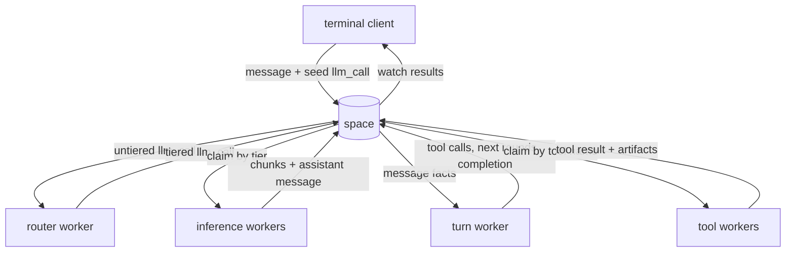

# Multi-process chat example

This example implements an LLM chat application as a set of independently authorized workers.
Messages, model requests, streamed chunks, tool calls, progress, artifacts and turn state are
records in the space. The terminal client writes one request per turn and renders the records that
workers produce.

Live model and image calls use OpenRouter. The automated suites use deterministic providers and
require no API key.

## Run locally

```bash
export OPENROUTER_API_KEY=sk-or-...
deno task dev                              # optional external space and console
deno task chat
deno task chat -- --conversation last      # resume the most recent conversation
```

When no external space is running, the launcher creates a durable SQLite space at
`.radia/chat.db`. Set `RADIA_CHAT_DB` to change that location.

## Separate deployment from user sessions

The fleet needs an operator credential during setup. User sessions do not.

```bash
# Run once as the operator. This process owns the provider key and worker fleet.
OPENROUTER_API_KEY=sk-or-... deno task chat -- --serve --auto-grant

# Run for each user with their own session.
radia login --sso
deno task chat
```

`--auto-grant` enrolls identities accepted by the configured OIDC issuer into the chat's standard
grant set. Without it, grant a known principal explicitly:

```bash
deno run -A examples/chat/grant-user.ts human:oidc-...
```

An OIDC identity starts with no grants. Retiring its `oidc_identity` record is the ban mechanism;
revoking application grants alone is not a durable ban when automatic enrollment is enabled.

Join mode is selected by the absence of an operator credential. A joined session cannot register
kinds, mint workers, grant itself access, enumerate other users' conversations or reach the
operations plane.

## Architecture



The client contains no model or tool routing logic. Workers publish model tiers and tool
capabilities as records. Starting or stopping a worker changes the live capability set without a
client deployment.

The main worker roles are:

| Worker | Responsibility | Important boundary |
|---|---|---|
| turn | advances record chains for a conversation turn | no provider key |
| router | assigns untiered model requests to a live tier | reads model registry |
| inference | calls the model provider and streams chunks | provider key, no file access |
| tools | file, compute and space tools | sandboxed file roots, no provider key |
| images | image generation and vision | provider key, artifact access |
| exec | JavaScript/Python and saved procedures | jailed child holds no Radia credential |

Definitions and grants for these roles live in `space/roles.ts` and process startup lives in
`client/fleet.ts`.

## Conversations and turns

A conversation is an append-only thread of `message` records anchored to a `conversation` record.
An `llm_call` identifies the conversation and highest message index to include. The inference
worker reconstructs a bounded provider context from those records.

The turn loop is also durable. The client seeds one `llm_call`; the turn worker watches resulting
messages and emits tool calls, subsequent model rounds and `turn_complete`. Closing the terminal
does not terminate an active turn. `--conversation <id>` and `--conversation last` attach a new
client to existing records.

Escape or Ctrl-C during a turn writes a turn-scoped `cancel` record. The turn worker stops emitting
new links after observing it. Already claimed model or tool work may still finish because delivery
is at least once.

Context assembly keeps one leading system message, removes older system messages and drops orphaned
tool exchanges. These rules are implemented in `extensions/ts/context.ts` and covered by the
`context` and `longthread` suites.

## Model routing

Inference workers advertise ordered model tiers. The terminal emits untiered calls; the router
classifies each round and emits a tiered successor. Explicit tier requests and short continuation
messages are handled by the router, not by client commands.

Provider-reported usage is stored on assistant messages. Token count and cost are declared sortable
so they can be queried and aggregated through the inspection APIs.

Configure tier models with:

```text
RADIA_CHAT_MODEL_FAST
RADIA_CHAT_MODEL_BALANCED
RADIA_CHAT_MODEL_DEEP
RADIA_CHAT_MODEL_ULTRA
```

`--classify-model` changes the classifier model. The inference extension also supports escalation
to the next live tier when a model requests it.

## Tools and artifacts

Tool workers publish `capability` records containing their names, schemas and descriptions. The
session watches the capability registry and supplies the current set to each model call. Tool calls
route by the `tool` field.

Large outputs and attachments use artifact records plus blob storage. Press Ctrl-V to stage clipboard
content in an interactive terminal; pressing Enter uploads the staged attachment. Removing the
marker before submission writes nothing. Clipboard integration supports `wl-paste` on Wayland,
`xclip` on X11 and `pbpaste` plus optional `pngpaste` on macOS.

The main tool groups are:

- file and documentation inspection;
- space queries, lineage, flows and diagnostics;
- image generation and vision;
- content and workspace saving;
- jailed JavaScript, Python and saved workspace procedures.

## Encrypted conversations

Start a conversation with `--encrypt` to encrypt message prose, tool arguments and tool output.
Routing fields remain clear because the runtime must match them. Conversation keys are wrapped for
the worker fleet and for each authorized user machine, then stored in shreddable artifacts.

Erasing all key artifacts makes the encrypted prose unreadable while preserving records, lineage
and the event chain. The application fails closed when a reader encounters an encryption marker it
cannot open.

## Sandboxed execution

Generated code runs through workspace bindings and the broker extension. The jailed process receives
the claimed record and a private proposal channel, but no credential. The host performs accepted
operations under the agent's run and supplies authoritative parent, label and compartment fields.

JavaScript uses the Deno jail. Python is advertised only where a configured sandbox backend probes
successfully. Files created by a run are captured as a new output-workspace version; runs never
modify the code tree they execute.

See [the workspace documentation](../../docs/workspaces.html),
[the execution design](../../agent_docs/design-execution.md) and
[the confinement plan](../../agent_docs/plan-jail-confinement.md) for the trust boundaries.

## Terminal controls

The interactive client owns a raw-mode line editor:

- arrows, Home/End and word movement edit the current line;
- Up/Down navigate per-user history;
- bracketed paste remains one input;
- Ctrl-V stages clipboard content;
- Escape or Ctrl-C cancels an active turn;
- Ctrl-C clears a non-empty prompt and exits from an empty prompt;
- Ctrl-D deletes forward or exits from an empty prompt.

Non-TTY input bypasses the editor and reads one line at a time.

## Test without a model

```bash
deno task chat-test
deno task chat-test context
deno task chat-test encrypt
```

The suite covers context assembly, long threads, resume, capabilities, tool workers, session
isolation, scopes, OIDC join behavior, encryption and key recovery, workspaces, runners, terminal
input, markdown streaming, rendering, vision and documentation search. Individual suite names are
the `smoke-*.ts` suffixes in this directory.

## Source map

| Path | Role |
|---|---|
| `chat.ts` | launcher, bootstrap and REPL entry point |
| `client/config.ts` | environment and command-line configuration |
| `client/fleet.ts` | worker processes and their credentials |
| `client/thread.ts` | conversation records and system instructions |
| `client/turn.ts` | seed a turn and render worker output |
| `client/waiting.ts` | watches, progress and stall reporting |
| `client/terminal.ts` | terminal output and stdin ownership |
| `client/edit.ts` | pure line-editor state machine |
| `client/attachments.ts` | staged clipboard attachments |
| `workers/turn.ts` | durable turn advancement |
| `workers/router.ts` | untiered-to-tiered model routing |
| `workers/inference.ts` | provider binding for the inference extension |
| `workers/tools.ts` | file, compute and space tools |
| `workers/images.ts` | image generation and vision |
| `workers/exec.ts` | jailed execution and saved procedures |
| `space/kinds.ts` | application record kinds |
| `space/roles.ts` | principals and grant sets |
| `space/keys.ts` | conversation-key lifecycle |
| `provider/openrouter.ts` | streaming model API adapter |
| `provider/imagegen.ts` | image-generation adapter |
| `provider/vision.ts` | image and PDF analysis adapter |

Reusable conventions such as workspaces, model registries, inference loops, tool workers, media,
turn context, encryption and the jailed broker live in [`../../extensions`](../../extensions/README.md).
Application-specific kinds and grant policy remain in this example.
