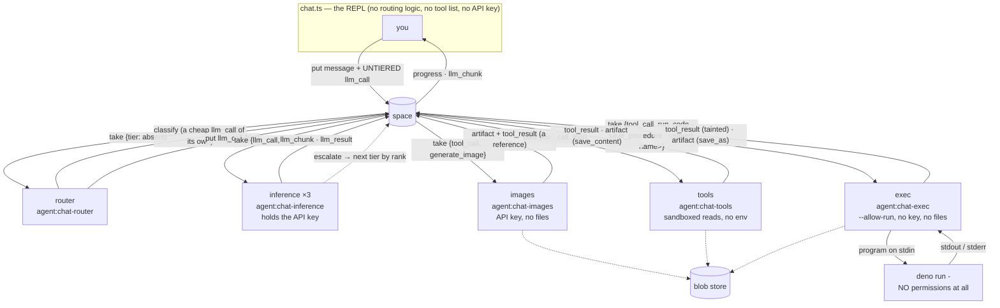

# Chat example — a real LLM agent, full symmetry

The end-to-end exercise of the runtime: thinking, acting, drawing, executing code and saving files
all flow through the space as records, served by six independently-privileged worker processes.
Nothing here talks to a model except the workers that hold the key.

```bash
export OPENROUTER_API_KEY=sk-or-...
deno task dev      # optional: open http://localhost:7788 and watch the Feed tab
deno task chat
deno task chat -- --conversation last    # …or pick up where you left off
```

**Conversations survive a restart, because they were never in the process.** The thread is
`message` records on the space, so resuming is just recovering the one piece of client-held state
(`nextIndex`) — one query, since `index` is a declared sortable path. Two things it depends on: a
chat-spawned space runs with `--db` (`RADIA_CHAT_DB`, default `.radia-chat-space.db`), because a
space without one is in-memory and takes the conversation, its saved procedures and its artifacts
down with it; and `--conversation <id>|last` reattaches instead of opening a new thread. Resuming
restores more than the transcript — saved procedures are conversation-scoped, so the tools come
back too.

`last` is resolved with the OPERATOR credential the REPL already holds, not by the session:
enumerating conversations would otherwise need a `conversation: query` grant on a scoped user, and
that would let it list every conversation on the space to save a keystroke.

A resumed thread appends a CURRENT system message rather than inheriting the old one, and the
inference-worker treats the NEWEST system message in the thread as the standing instructions —
otherwise a conversation resumed later keeps running under whatever disposition was written when it
started. That has a protocol consequence worth knowing: providers reject a `system` role anywhere
but the front ("system must follow a user or assistant message"), and a resumed thread has one
mid-conversation by construction. `provider/context.ts` assembles exactly one leading system
message, drops older ones from the body, and folds the windowing notice into it. Never emit that
notice as its own system message after the head: it is the same violation, waiting for a
conversation long enough to drop messages. `context.ts` is a pure function because this is where
the context bugs are (`deno run -A examples/chat/smoke-context.ts`).

`chat.ts` opens with a map of the tree; the areas are `client/` (the REPL), `workers/` (the five
agent processes), `tools/` (what they do), `space/` (how the app uses Radia) and `provider/` (the
outside world).

## Testing it without a model

```bash
deno task chat-test              # all eight suites, ~17s
deno task chat-test longthread   # one by name
```

This app is where bugs surface first, and most of them live in the app's own handling of
ACCUMULATED STATE rather than in the runtime: a resumed thread with a system message
mid-conversation (rejected by every provider), a capability page that does not reach the newest
tool, a grant narrowed in a way that removes a write permission, a NUL in a message body that the
storage layer's JSON type will not take. None needed a model to reproduce, and none were caught by
reading the code.

That is possible because a tool call is a record, a conversation is records, and the context path
is a function over rows — so the suites drive the real queries, the real window expansion and the
real assembly, with no API key:

| Suite | What it holds down |
|---|---|
| `context` | provider payload rules: exactly one leading system message, no orphaned tool reply, the windowing notice folded in |
| `longthread` | a deliberately awkward 58-message thread — two resumes, a tool-heavy turn wider than the window, empty/null/20k/unicode bodies — with the invariants checked at EVERY position in it |
| `procedures` | save → call by name → read back → retire → revive, conversation scoping, name shadowing, result provenance |
| `resume` | reattaching across a genuine process restart (the space is killed and restarted on the same `--db`) |
| `selfgrant` | forbidden → request → human approval → self-scoped reads, on both the ops and coordination planes. The ask BLOCKS on the human's answer and the answer names the scope actually granted, so the whole escalation fits in one turn instead of two |
| `inspect` | session isolation (a session reads only its own conversation), the `space_*` TOOLS on a busy space — paging past a wall of another author's events, answering "what may I do" from the enforcement rather than by inference, and the full escalation loop: a grant approved at the wrong scope authorizes nothing, and the prompt has to say so |
| `scope` | what a scoped session may read under both postures — identity (all its own conversations, including worker-produced results) vs conversation (this thread only) |
| `fleet` | model advertisements: publish, restart without growing the space, withdraw on shutdown, revive |

The long thread is the one that pays for itself: bugs here come from the SHAPE of accumulated
state, which is cheap to construct as records and nearly impossible to hit reliably by chatting.

A CLI chatbot where **the whole conversation lives on the blackboard**. The chatbot makes
no external calls — it only reads and writes records. LLM inference (`llm_call →
llm_result`, streamed as `llm_chunk`) and tools (`tool_call → tool_result`) are both served
by content-routed workers.



Every arrow is a record. The REPL never calls a model, never picks a tier, and never holds a
key — it writes messages and reads results, and five independently-privileged workers do the rest.

The conversation is an **append-only thread of `message` records** anchored to a
`conversation` record — not a client-held array. The chatbot appends messages (system /
user / assistant / tool); an `llm_call` references the thread by `{conversationId,
upToIndex}` and the **inference-worker reconstructs the context by querying the thread**
(`{kind:message, match:{conversationId}, orderBy:index}`, newest-first and bounded — see
windowing below). Consequences: history is stored once (linear, not quadratic — no re-embedding)
and *read* incrementally, the whole conversation stays reconstructible from the space (`query` the
thread), and every message is a record you can watch in the Feed. This is the blackboard shared-memory pattern, not just content-routed dispatch.

**Tools are discovered, not hard-coded, and their usage lives with them.** Each tool-worker
publishes its tools as `capability` records (`{tool, def}` — `def` carries the description the LLM
reads); the chatbot keeps a live tool set by *watching* them (`watch {kind:capability}`) and
dispatches by content (`tool_call{tool}` → whichever worker registered it). Add a tool-worker → its
capability record streams in and the chatbot gains the tool on the next turn, no code or prompt
change; how to *use* a tool is in its description, not the chat's system prompt. Like `kind_def`
records, a capability is content-keyed and immutable — a redefined tool is a **successor** record,
latest-per-tool wins on discovery (so re-running never conflicts). This is "no preconfigured
routing table" (§7) applied to tools — the substrate coordinating its own capabilities.

**Model selection is content-routing, and the routing is delegated to the substrate.** There are
three capability/cost **tiers** — `fast`, `balanced`, `deep` — each served by its own
inference-worker that claims only its tier's calls (`take {kind:llm_call, match:{tier}}`) and
advertises a `model` record carrying its `rank` (cheap → capable). **The chat holds no routing
logic:** it puts an *untiered* `llm_call`. A **router-worker** (`workers/router.ts`) claims untiered
calls (`match:{tier:{$exists:false}}`), classifies the turn with a **cheap classifier model** —
itself a model-overridden `llm_call` served by the inference fleet (`--classify-model`, default
`google/gemini-2.5-flash-lite`), so the API key stays isolated in the workers and classification
routes through the substrate like any other call — and re-dispatches a *tiered* `llm_call`. The
result stays keyed to the original call (`replyTo`), so the chat is oblivious to the indirection —
it just sees `[routed → deep]`. Add a tier-worker → a new model is live, no orchestrator change.
Defaults: `fast` → `openai/gpt-4o-mini`, `balanced` → `anthropic/claude-sonnet-5`, `deep` →
`anthropic/claude-opus-5`; override per tier with `RADIA_CHAT_MODEL_{FAST,BALANCED,DEEP}`.

**No tier name appears in the router.** Live tiers come from the `model` records ordered by `rank`;
the classifier is asked to answer with one of *those* words; and when it errors or times out the
fallback heuristic picks by **position** in that list (cheapest / middle / most capable), never by
name. So "add a tier-worker and it is routable" holds on both the classifier path and the fallback.

Routing happens **per round**, not per turn — every `llm_call` is classified, including the rounds
that come back after tool results. So the classifier is told how many tool calls the turn has
already made ("weigh that, not just the wording"), runs at `temperature: 0` so one question does
not land on different tiers across rounds, and the router expands its read of the thread until the
user's message is in view. Without that last part the later rounds classify an empty string, which
routes the synthesis round — the hardest one — to the cheapest model.

Why a classifier when escalation exists — the two mechanisms judge the same thing, and that is a
deliberate trade. The classifier was **removed once** on the argument that escalation pays for
routing only on the turns that were misrouted, while a classifier taxes every turn in front of the
first token. That argument assumes the cheap model can recognize it is out of depth. It does not:
across a tool-heavy analytical session the cheap tier escalated on *nothing* and answered from
invented numbers instead. Self-assessment is the weakest available judge, so the judgment is made
by a different model, at roughly 0.5-1.2s before the first token. Escalation stays as the catch for
what the classifier under-routes. See `agent_docs/gotchas.md`.

**Cheap-first, escalate on demand.** On top of routing there's a cost **cascade**: the model is
offered an `escalate` capability (a discovered tool — guidance in its description), and when it's
out of depth it calls `escalate`. The inference-worker *intercepts* that call and re-dispatches the
turn to the next-stronger tier (ordered by the `rank` on each `model` record), keyed to the same
original call. The top tier has no escalation target (the tool is stripped, so it just answers),
which terminates the cascade. This is the *only* mechanism that judges difficulty, and it judges it
where the information actually is — in the worker that has read the turn and found itself out of
depth — rather than in a classifier guessing up front.

A model may stream text *before* it calls `escalate`, and that text is already on the user's screen
when the attempt is discarded. So the boundary is marked **in the stream**: the escalating worker
puts a final `llm_chunk` with an empty delta and `reset: true`, and hands its index watermark to the
next worker via `indexOffset`. Chunk indices therefore form one monotonic sequence per awaited call
across every attempt — the chat prints `↩ escalated — restarting on a stronger model`, drops what it
had, and keeps reading forward. Nothing is replayed and no two attempts interleave.

`deno task chat` connects to (or spawns) a space and launches seven **scoped subprocess**
workers, then gives you a REPL. Watch every thought and action stream into the Feed tab.

Why subprocesses: permission isolation only holds across processes. Each worker gets the
narrowest set that lets it do its job, and no two dangerous capabilities meet in one process.

| process | permissions | holds | notes |
|---|---|---|---|
| **inference** ×3 | `--allow-net --allow-env` | `OPENROUTER_API_KEY` | no file access |
| **router** | `--allow-net --allow-env` | — | dispatches; never calls a model directly |
| **images** | `--allow-net --allow-env` | `OPENROUTER_API_KEY` | no file access |
| **tools** | `--allow-read=<sandbox dirs>`, `--allow-net=127.0.0.1:<port>` | — | **no `--allow-env`** |
| **exec** | `--allow-run=deno`, `--allow-net=127.0.0.1:<port>`, `--allow-env=HOME` | run token | never executes anything itself |
| ↳ **the sandbox** | *nothing* (optionally `--allow-read=<exec dirs>`) | — | spawned per call, killed on timeout |

The two that matter most: the process that can read files (**tools**) cannot reach the network
beyond the local space and cannot read secrets, so reading a file can't lead to exfiltrating it;
and the process that runs model-written code (**the sandbox**) holds no credential at all, so a
full compromise of it yields a process that can print bytes to its parent. Path canonicalization
(realpath + allowlist, in `tools/files.ts`) is defense-in-depth on top.

Tools: `read_file`, `list_files`, `search_files`, `stat` (sandboxed to `RADIA_CHAT_DIRS`,
default `examples/chat/sandbox`; `list_files`/`read_file`/`stat` return `size` + `modified`
so size/date questions get ground truth, not guesses), `time`, `calc`, `save_content` (store
text as an artifact), `run_code` (sandboxed execution), `save_procedure`/`read_procedure`
(name a program and keep it — see below), and `generate_image`.

**Inspection tools** (`tools/space.ts`) make the chatbot a conversational inspector of its own
space: `space_stats`, `space_kinds`, `space_query`, `space_count`, `space_record`, `space_lineage` (ancestors,
UP), `space_children` (records that reference this one, DOWN — e.g. a conversation's messages),
`space_events` (which PAGES to the end of the log, so a scoped session still reaches its own
activity past events it may not see), `space_permissions` (what this session may actually do — the
fold over its grants, straight from the enforcement), and `space_doctor` (a derived health report —
stuck leases, dead-letters, stale-available). Tool guidance lives in each tool's description (published as a `capability`
record), not in the chatbot's prompt. Because everything is a record, it can inspect *itself* — ask it "how many
records are in the space?", "show the lineage of the last summary", "is the space healthy?",
or "query my conversation thread" (the conversation is `kind:message` with your
`conversationId`). Output is size-capped so results are LLM-friendly, and each inspection is
itself a `tool_call` (a small observer effect).

Two of those exist because of a specific failure: asked for a percentage breakdown, the assistant
counted the 10 records a query happened to return and reported it as the population. `space_query`
returns `more: true` with a warning that the result is a page, and **`space_count`** answers
"how many" directly (exact up to the server's 500-row query cap, and says so when it isn't). A page
answers *show me some*; an aggregation question needs *how many*, and the tool set has both.

**Remediation tools** (`tools/space.ts`) turn it into an operator, in bulk: `space_reclaim` (un-stick
an expired lease), `space_dead_letter`, `space_requeue` — control-plane operations that
bypass lease fencing (fixing another worker's stuck record), so they're privileged (grant-
gated with real auth). Pair with `space_doctor`: "find what's stuck and fix it," in chat.

Each takes **either one record id or a selector**. Called with no id, `space_reclaim` un-sticks
every expired lease in one call and reports `{matched, applied, more}`; repeat while `more` is
true. That matters at real scale: draining 500 stuck leases per-id is 500 calls preceded by ~50
`space_doctor` calls just to learn the ids, because the report samples ten. The selector is the
same one the envelope query takes, so the model diagnoses and fixes in one vocabulary.

Two honesty rules in `space_doctor`: it reports no `expired` count (a lapsed lease leaves the
record `leased`, so that number is a confident zero next to hundreds of demonstrably lapsed
leases), and `stuckLeases` carries `atLeast` when its scan hit the sample cap — a bounded scan must
not read as a census.

**The chat is woken by the runtime, not by a timer.** A background `watch` per streaming kind
(`llm_chunk`, `llm_result`, `tool_result`) turns "a matching record became available" into a
wakeup, and the wait loops block on that with a 250 ms fallback tick — so a dropped or forbidden
watch degrades to polling instead of stalling a turn. Reads are incremental: the chat asks for
`{callId, index: {$gt: lastSeen}}` rather than re-scanning the whole stream every tick, which is
what makes wakeup-per-chunk affordable (a burst still batches into one range read). No grant
changes were needed for this — `authorizeWatch` requires *a* grant on the kind, not a `watch`
operation, so the session's existing `query`/`read_one` grants already permit it. Worth knowing
when writing grant sets: a `read_one` grant also confers a stream of wakeups for every matching
record, though reading each one still needs the grant.

**The assistant can run code, in a process that holds nothing** (`workers/exec.ts`, `tools/exec-sandbox.ts`).
`run_code` is a discovered tool like any other; what makes it safe is the shape around it — three
processes, three blast radii:

```
workers/exec.ts        run token · space access · --allow-run   claims work, acks results
  └── deno run -       NO permissions, program on stdin      tools/exec-sandbox.ts
```

The worker never executes and the executor never holds anything. This is why it is not a tool in
`workers/tools.ts`: spawning needs `--allow-run` (which that process deliberately lacks), and it holds
a run token model-written code must never reach — **the local space is a more attractive target
than the internet**, since code inside a process with a credential could `put` and `take` records
as that agent.

The sandbox is a `deno` subprocess with no `--allow-*` flags at all, the program arriving on stdin
(`deno run -`, so no file need be readable), plus `--no-remote` (no `import("https://…")`),
`--no-prompt` (deny, never wait for a human), a heap cap and a kill timer. Measured against
adversarial programs — network, local-space fetch, credential read, KEK read, file write, env read,
process spawn, remote import, infinite loop, allocation storm, output flood, uncaught throw — all
13 fail in the intended way and the benign case returns its stdout.

**The assistant can give a program a name and keep it** (`save_procedure` / `read_procedure`).
Without that, reuse means re-typing the whole program into every call — which is what made a
"hash both files" turn re-transcribe the files into its own source. A saved procedure stores the
code as an **artifact** and its name/description/schema as a `procedure` record, and then behaves
exactly like any other tool: it shows up in the tool list on the next turn, is dispatched by
content (`tool_call{tool: <its name>}`, one claim template per name), and its arguments arrive
inside the sandbox as `args`. Adding a procedure adds a tool with no code change anywhere — the
same property that adding a worker has, applied to code the assistant wrote itself.

Three details carry the weight:

- **A procedure belongs to the conversation that wrote it**, and that is enforced where the code
  would *run*, not merely where tools are listed. The chat only offers a procedure back to its own
  conversation, but "not offered" is not "not callable" — a model can name any tool, and a
  `tool_call` is a record anyone may write — so the exec worker re-checks `conversationId` before
  fetching a single byte of source.
- **Improving one means saving it again under the same name.** Records are immutable, so that is a
  successor and latest wins (the `kind_def`/`capability` rule again) — never a 409, never a delete.
  Every earlier version is still on the space, which is why `read_procedure` can report how many
  there have been. It exists because code leaves the model's context when its turn scrolls away,
  and "fix the bug in X" must not mean reconstructing X from its description.
- **Retiring one is the same move, not a delete.** `retire_procedure` writes a successor carrying
  `retired: true`; the projection that builds the tool list stops offering it, and saving the name
  again revives it because that record is newer still — no un-retire path needed. The code stays
  readable the whole time. The worker keeps CLAIMING a retired name on purpose: it answers "this
  has been retired" at once, where dropping the claim would leave a caller waiting out the tool
  deadline for a stall diagnosis. Retirement matters because every tool in the list costs tokens on
  every request, so a procedure that turned out wrong is worth removing from the model's context.
- **Only the exec worker may write one.** The user session has `procedure: query` and nothing more,
  so a saved procedure is always code that went through the sandbox's own path, not a record the
  model wrote directly.
- **A procedure cannot take a name a worker already serves**, checked against DISCOVERED capability
  records rather than a hardcoded list — the names that matter belong to other workers
  (`read_file`, `generate_image`, `space_query`). Allowing one would not be a naming annoyance but
  a hijack: the exec worker would add a claim template for `tool_call{tool:"read_file"}` alongside
  the tools-worker's, both would race for every call, and the model would still be shown the real
  tool's description. It is re-checked at execution as well as at save, because a worker may start
  serving the name later.
- **A result names the procedure version that produced it.** For `run_code` the program is in the
  `tool_call` body, so "what exactly ran" is a query; a procedure call carries only `{tool, args}`
  and the code can be re-saved, so the `tool_result` records `{procedure: {name, recordId,
  artifactId}}` and takes the procedure record as a PARENT. "Which code produced this?" is then a
  lineage walk. It is on the record and not in `output` — only `output` is serialized back into the
  thread, so provenance costs no context tokens. This exists because a model, asked whether it had
  used a saved procedure, said yes, had not, and invented a reason for the mismatch.

**Saving works from both directions.** `save_content` (`tools/save.ts`) stores text the assistant
*wrote* — an SVG it drew in prose, a drafted config, a summary — and `run_code`'s `save_as` stores
what a program *printed*. Both were needed: content whose only source is the model's own output has
no other route out of the conversation, and making it re-emit that text inside a `run_code` literal
costs the identical tokens and lands in the thread identically. The rule that still holds is the
one about records: payloads go out of line as artifacts, while the conversation stays queryable
JSON — messages-as-blobs would break matching, template scoping, windowing and the Feed at once.

**Code output can become an artifact, which is how the assistant saves a file.** `run_code` takes
`save_as` (plus optional `media_type` and `encoding: "base64"` for binary): stdout is stored as an
artifact and the result carries `{artifactId, mediaType, size}` instead of the payload. Output over
4 KB is stored automatically, with a preview inline — a large payload in a `tool_result` would
otherwise land in the message thread and be re-sent on every later turn.

The direction matters. The bytes come **from the sandbox**, never from the model's tokens: content
generated by code is written once by the program and persisted by the worker, instead of being
emitted into the context and then handed back to a save tool. That is also why the exec worker's
artifact grant is `put` only — it may store what it produced, never read what anyone else stored.
(An SVG saved this way downloads rather than rendering inline, by the same rule that keeps
scriptable media out of the console's origin.)

Three properties fall out of the substrate rather than being bolted on:

- **The result is tainted, always.** Output of model-written code over possibly-injected input is
  untrusted by construction; taint propagates through `ack`, and a sensitive consumer can refuse it
  with `requireUntainted`. Clearing it needs a privileged declassify.
- **Every program is auditable by query.** The source lives in the `tool_call` body, so
  `space_query {kind: tool_call, match: {tool: "run_code"}}` is the complete execution log, with
  each result as its child.
- **Retry is sound *because* the sandbox is empty.** `tool_call` is claimable work, so an expired
  lease is retried — safe only because a permissionless child has no side effect to double. Grant
  the sandbox any capability and you break the delivery guarantee as well as the security story.

**Read access is the one grantable capability, and it is off by default.** `RADIA_CHAT_EXEC_DIRS`
lists directories the sandboxed program may read; unset (the default) means no filesystem at all,
and the startup banner says which you have. Net, write, env and run stay denied whatever you set —
"look at this data" is a different risk from "change it" or "send it somewhere", and with no
network a program that reads can only return what it read through output you are already shown.

It is deliberately a **separate** setting from `RADIA_CHAT_DIRS`, which bounds the file *tools*.
Widening what `read_file` can see must not silently widen what executed code can see: the tools
return one file per call, in the open, while a program can walk a whole tree and fold it into a
single line of output. Roots are realpath'd (a symlink cannot smuggle the grant elsewhere), and the
blob KEK and the operator credential are passed as `--deny-read`, which beats `--allow-read` in
Deno — so pointing a root at a directory containing them still does not expose them.

Verified with the grant on: reads inside the root work (files, nested files, directory listings);
reads outside it, `..` escapes, the denied KEK, writes inside the root, network and env all fail.

Stated rather than papered over: a V8 isolate with Deno permissions stops accidents and ordinary
malice, not a V8 or Deno 0-day. There is no CPU bound (a `while(true)` spins one core until the
timeout), and the heap cap only covers V8's old space — a `TypedArray` backing store is external,
so an allocation storm is bounded by the *timeout*, not the flag. Keep `RADIA_CHAT_EXEC_TIMEOUT_MS`
short; for anything multi-tenant, wrap this same worker in a container, gVisor or Firecracker.

**The assistant has a second path to its own past.** Every chatbot has exactly one — the context
window — and confabulating about earlier turns is the standard failure. Here the conversation is
records, so the model can *look* instead of reconstructing. The prompt carries only the disposition
("if you are unsure what happened earlier, retrieve it rather than recall it") and the assistant's
own `conversationId`; the mechanism stays in `space_query`'s description, which already spells out
`kind 'message'`, `match {conversationId}`, `order_by index`. Identity in the prompt is not
substrate knowledge — it's the agent's handle on itself, like a run token — and it is what makes
the disposition usable: the reconstructed thread strips `conversationId`, the `conversation` record
has an empty body and no indexed path, and `role=user` cannot enumerate conversations, so without
being told the id the model could not name the thread it is in.

**Which is what makes windowing safe.** The inference-worker sends the newest `RADIA_CHAT_WINDOW`
messages (default 40), not the whole thread: a descending keyset read over the sortable `index`,
so per-turn cost is bounded by the window rather than by conversation length — "stored once, read
incrementally" holds for the *context*, not only for storage. Dropping old turns is normally
lossy and one-way; here the omitted messages are still records, and the assistant knows its own
conversation id, so the notice it gets can be a pointer rather than a summary:

```
[3 earlier messages in this conversation are not included here. They are not lost —
 retrieve them if you need them.]
```

The system message is never windowed out (it is the standing instruction set), and a `tool` reply
whose assistant call fell outside the window is trimmed rather than left orphaned — an unanswered
`tool` message is a protocol error for the API. The window also **never evicts the current turn**:
one tool-heavy turn is easily a dozen messages (an assistant `tool_calls` message plus a reply per
call), so the read expands until the most recent `user` message is inside it. Without that, a fixed
count cuts away the question being answered and the model summarizes tool output it can no longer
attribute — which is exactly how it fails, not gracefully. Set `RADIA_CHAT_WINDOW=0` for the old
whole-thread behaviour. Each `llm_result` carries `context: {sent, hidden}`, so the cost of the
window and the assistant's response to it are both queryable: `space_query {kind: llm_result}`
answers "how often does it go back for history?" with no instrumentation.

Beyond recall, the second channel earns its keep on *structure* — lineage/children, another
agent's records, what a worker actually did — none of which is in the context window at any
length.

**Image generation is a discovered tool whose result is a reference** (`workers/images.ts`,
`provider/imagegen.ts`). A fourth worker serves `generate_image`: it calls an image model, stores the bytes as
an **artifact**, and acks a `tool_result` carrying `{artifactId, mediaType, size, prompt}` — never
the image data. A base64 image inside a record would land in the message thread, be re-sent every
turn and swamp the Feed; the record carries the reference, the blob store holds the payload. The
chat mints a short-lived download capability and prints a URL the console renders inline (set
`RADIA_CHAT_IMAGE_DIR` to also save the file). Lineage comes out as `artifact → tool_call →
conversation`.

Four things worth knowing, all of which the provider forces:

- **There is no images API.** Generation goes to the same `/chat/completions` endpoint with
  `modalities: ["image"]` on the request, non-streamed. So the wait is silent for 5-20s, which is
  what the `drawing` progress stage covers.
- **The response has seven shapes** (`extractImage` in `provider/imagegen.ts`): `content[].image_url`,
  `content[].inline_data` (Gemini), `images[]` in three sub-forms, a bare data-URL string, a
  markdown link needing a second fetch, and DALL-E's `data[].b64_json` / `data[].url`. Five are
  provider quirks; a client handling only the documented one breaks on a model swap. Two hand back
  a URL the *model* chose — those are fetched https-only, and the stored artifact is **tainted**,
  because provider bytes are untrusted and an image is a prompt-injection vector the moment
  anything reads it back.
- **The image model is not a tier.** It advertises `modalities: ["image"]` in its `model` record,
  and the router and the escalation ladder both filter to text-capable tiers — otherwise the
  classifier would happily dispatch a conversation turn to a model that only draws. A record with
  no `modalities` counts as text, so older workers still route.
- **It is its own process** with the API key and egress but **no file access** — the same split as
  the inference-worker. Putting a key and outbound network into the sandboxed tool-worker would
  collapse the containment the example exists to demonstrate.

**Turn progress is a record, not a spinner** (`space/progress.ts`). Between putting an `llm_call` and
the first streamed token, several workers act — the router claims and dispatches it, an
inference-worker claims the re-dispatched tiered call — and none of it is visible to the client:
watches only wake on *available* records, and claim/ack transitions live in the grant-gated event
log. So each worker publishes what it is doing as a **`progress` record** (`{conversationId,
callId, stage, by, note}`, keyed to the call the chat awaits — `replyTo`, not the re-dispatched
id), and the chat renders the latest as a live status line:

```
you> what's 17+156223
  · calc({"expr":"17+156223"}) running (agent:chat-tools) · 1s
assistant> routed → deep (agent:chat-router) · 2s
```

Stages: `routed` (router), `generating` with the tier and model it resolved, `escalating`
when a worker hands the turn up a tier, `running` (tool-worker). The status line is wiped as soon
as real output takes the line, and is TTY-only — piped output is unchanged. Progress records carry
a `retentionUntil` (they're chatter, not history) and any client sees the same stream, including
the console Feed.

**Absence of progress is the stall signal.** A call nobody claimed produces no `progress` record,
which is how a configuration failure is told apart from a slow model: past ~2.5s with nothing, the
chat says `no worker serves 'search_files'` or `no worker claimed this call — is the
router/inference fleet running?` instead of sitting silent until its timeout, and the timeout error
names the last stage reached. This works for a scoped session too (a `progress` query grant), with
no `/ops/*` access.

**Run it with auth (`space/roles.ts`).** The launcher is the OPERATOR of its local space, so it
bootstraps the chain (design-auth): it registers kinds and, as operator, mints **least-privilege
run tokens** for the two workers (`agent:chat-inference` = take `llm_call`, put
`llm_result`/`llm_chunk`; `agent:chat-tools` = take `tool_call`, put `tool_result`/`capability`).
The **session role** picks who the REPL (and its `space_*` tools) run as:

```bash
deno task chat                       # role=admin (default): session is the OPERATOR
RADIA_CHAT_ROLE=user deno task chat  # role=user: session is a scoped agent:chat-user run token
```

As **admin** the `space_*` inspect/remediate tools have full `/ops/*` access. As a **user** the
session is `agent:chat-user` — granted only the conversational kinds — so it can chat, query its
own thread, and discover tools, but `space_stats`/`space_doctor`/`space_reclaim`/`declassify`
return **403** (try "is the space healthy?"), and `space_query {kind: grant}` is denied too. This
is the same enforcement the conformance suite covers, exercised by a real agent: workers are
least-privileged, the user is scoped, and the operator is the only principal on the control plane.

Config: `OPENROUTER_API_KEY`, `RADIA_CHAT_ROLE` (`admin`|`user`, or `--role`),
`RADIA_CHAT_MODEL_{FAST,BALANCED,DEEP}` (per-tier model overrides), `RADIA_CHAT_CLASSIFY_MODEL`
(the router's classifier), `RADIA_CHAT_DIRS`, `RADIA_URL`,
`RADIA_CHAT_API_BASE` (any OpenAI-compatible endpoint — a local stub for offline testing, or a
self-hosted gateway), `RADIA_CHAT_WINDOW` (newest messages sent per turn; 0 = whole thread),
`RADIA_CHAT_IMAGE_MODEL`, `RADIA_CHAT_IMAGE_SAFETY` (provider moderation passthrough,
`CATEGORY:THRESHOLD,…`), `RADIA_CHAT_IMAGE_DIR` (save generated images locally), `RADIA_CHAT_EXEC_TIMEOUT_MS` (code
execution budget, default 5000), `RADIA_CHAT_EXEC_DIRS` (read-only roots for executed code;
unset = no filesystem, and separate from `RADIA_CHAT_DIRS` on purpose).
(No tier setting — the router dispatches, escalation promotes.)

Honest edges (documented, not hidden): a crashed inference retries and can double-spend
(at-least-once — the gateway is the real fix); file contents become records and flow to the
model — taint exists (a tool-worker could `put {taint:true}` on file reads so the untrust
propagates, and a sensitive consumer could `take {requireUntainted}`), though this example
does not wire it. The thread model makes Radia storage linear, but re-sending history to
the provider each call is inherent to stateless chat APIs (prompt caching mitigates it,
provider-side), and a large single message (e.g. a 64 KB file read) is one big record: this
path does not route it through **artifacts** (§2.4). Not a CI test
(non-deterministic); `calc` and the sandbox path checks are unit-testable.

## Files

Five areas. `chat.ts` opens with the same map.

**Entry**

| File | Role |
|------|------|
| `chat.ts` | bootstrap, launch the fleet, print the banner, run the REPL |
| `util.ts` | worker argument parsing (`arg`/`argAll`) and artifact media helpers |

**`client/` — what the REPL itself does**

| File | Role |
|------|------|
| `config.ts` | everything read from the environment. Setup only: it never decides per-turn behaviour |
| `fleet.ts` | launching the workers and the permission set each one gets — the security story, in one file |
| `thread.ts` | the conversation as `message` records on the space, plus the system prompt |
| `turn.ts` | one user turn (`llm_call` → tools → answer), and the watched tool set. Contains no model, tier or tool choice |
| `waiting.ts` | watch-driven wakeups, progress rendering, and stall diagnosis |
| `terminal.ts` | everything drawn to the screen: TTY-only status line, artifact links, stdin |

**`workers/` — the five agent processes, each with its own identity and grants**

| File | Role |
|------|------|
| `inference.ts` | one per tier (`--tier`/`--model`/`--rank`): claims `{llm_call, tier}`, streams `llm_chunk` + `llm_result`, windows the thread, intercepts `escalate` |
| `router.ts` | claims UNTIERED `llm_call`s, classifies the turn, re-dispatches to a tier (`replyTo` keeps the result correlated) |
| `tools.ts` | claims `tool_call` for every tool it serves; sandboxed permissions, no env |
| `images.ts` | claims `tool_call{generate_image}` → image model → artifact → a reference |
| `exec.ts` | claims `tool_call{run_code}` → permissionless subprocess → tainted result, optionally an artifact |

**`tools/` — what those workers actually do**

| File | Role |
|------|------|
| `files.ts` | sandboxed file + compute tools (`read_file`, `list_files`, `search_files`, `stat`, `time`, `calc`) |
| `space.ts` | space inspection (`space_stats`/`query`/`count`/`lineage`/`children`/`events`/`doctor`) and remediation (`reclaim`/`dead_letter`/`requeue`) |
| `save.ts` | `save_content`: store text the assistant wrote as an artifact |
| `exec-sandbox.ts` | the sandbox itself: `deno run -` with zero permissions, output cap, kill timer |

**`space/` — how this app uses Radia**

| File | Role |
|------|------|
| `kinds.ts` | the record kinds: `conversation`/`message`/`llm_*`/`tool_*`/`capability`/`model`/`progress` |
| `roles.ts` | least-privilege grant sets + the bootstrap chain (agent definitions → run tokens; admin vs user) |
| `capability.ts` | advertising a tool as a content-keyed `capability` record |
| `progress.ts` | turn progress as records, so a waiting client can see who is doing what |

**`provider/` — the outside world**

| File | Role |
|------|------|
| `openrouter.ts` | streaming OpenAI-compatible chat completions (the sole API-key dependency) |
| `imagegen.ts` | image generation on the same endpoint (`modalities:["image"]`) + the seven-shape response normalizer |
