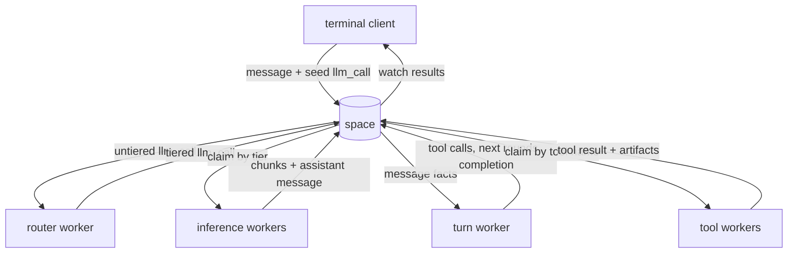

# Multi-process chat example

This example implements an LLM chat application as a set of independently authorized workers.
Messages, model requests, streamed chunks, tool calls, progress, artifacts and turn state are
records in the space. The terminal client writes one request per turn and renders the records that
workers produce.

Live model and image calls use OpenRouter. The automated suites use deterministic providers and
require no API key.

## Run locally

```bash
export OPENROUTER_API_KEY=sk-or-...
deno task dev                              # optional external space and console
deno task chat
deno task chat -- --conversation last      # resume the most recent conversation
```

When no external space is running, the launcher creates a durable SQLite space at
`.radia/chat.db`. Set `RADIA_CHAT_DB` to change that location.

## Separate deployment from user sessions

The fleet needs an operator credential during setup. User sessions do not.

```bash
# Run once as the operator. This process owns the provider key and worker fleet.
OPENROUTER_API_KEY=sk-or-... deno task chat -- --serve --auto-grant

# Run for each user with their own session.
radia login --sso
deno task chat
```

`--auto-grant` enrolls identities accepted by the configured OIDC issuer into the chat's standard
grant set. Without it, grant a known principal explicitly:

```bash
deno run -A examples/chat/grant-user.ts human:oidc-...
```

An OIDC identity starts with no grants. Retiring its `oidc_identity` record is the ban mechanism;
revoking application grants alone is not a durable ban when automatic enrollment is enabled.

Join mode is selected by the absence of an operator credential. A joined session cannot register
kinds, mint workers, grant itself access, enumerate other users' conversations or reach the
operations plane.

## Join from a browser

`--web` serves a page beside the fleet, so joining needs no checkout and no Deno:

```bash
OPENROUTER_API_KEY=sk-or-... deno task chat -- --serve --auto-grant --web   # prints the URL
deno task bundle-chat-web && deno task chat-web -- --url http://127.0.0.1:7788 --port 8082
```

The page is markup; its logic is a bundle built from `web/*.ts` (gitignored). `--serve --web` builds
it for you, so only the standalone command above needs `bundle-chat-web` first.

The page signs in with SSO only and holds one run token: there is no paste box, because a
definition token in browser storage is a durable credential. The page server holds no credential of
its own. It serves one file and relays `/v0` with the caller's own Authorization header, which is
also why it exists at all: the space sends no CORS headers, so a page on another origin cannot call
`/v0` directly.

The IdP must know the page's origin twice over, in Valid Redirect URIs (`http://127.0.0.1:8082/*`)
and in Web Origins (`http://127.0.0.1:8082`); `docker/keycloak` already lists both spellings of
port 8082. See [../../agent_docs/plan-chat-web-ui.md](../../agent_docs/plan-chat-web-ui.md) for what
the page does next, and for the parts of a browser client that a terminal one never had to answer.

The page runs the same turn logic as the terminal client, through the output port in
`client/ui.ts`: it signs in, attaches to the conversation named in its URL fragment
(`#c/<id>`), renders that conversation's history, and takes turns. Artifacts open as links,
with images, audio and video previewed inline and everything else opened on the isolated
artifact origin under a capability minted when you click. An encrypted conversation is refused
rather than shown as ciphertext; open those in the terminal until browser keys exist.

Attach a file with the button, a paste or a drop. Staging works as it does in the terminal: the
`[attach …]` placeholder in the box is what gets uploaded when you send, so deleting it first means
the bytes were never stored. Attachments carry no retention and are therefore permanent.

The page serves its own inspection tools, so asking the assistant about the space works there as
it does in the terminal. They cannot be delegated to a worker: a delegated run carries neither the
ops plane nor a self-scoped grant, so the session that asks is the one that answers. In a tab that
claim loop runs on its tick with no watch stream, which is what keeps the page inside a browser's
six connections per origin.

Every client on a conversation now sees what the others say: the page renders their messages
inline, the terminal reports them as notices. Reload mid-answer, or open the page on a turn the
terminal started, and the same turn is picked up rather than lost. The terminal and the page can both type into one
conversation: an append claims its slot, so two clients take different ones rather than writing over
each other. Two tabs of one browser still elect a single writer between them, with a Take over
button on the other, because two boxes on one conversation is confusing rather than unsafe.

## Test with several clients

Four processes, in this order. Only the first two are setup; everything after them is a client.

```bash
# 1. the IdP, for the page's SSO sign-in (run `docker compose down` first if the realm predates
#    port 8082). Skip this and the terminal client still works; the page has no way in without it.
cd docker/keycloak && docker compose up

# 2. the space, trusting it. Writes the operator credential under ./.radia for step 3.
deno task dev --db --oidc-issuer http://localhost:8080/realms/radia --oidc-audience radia-console

# 3. the fleet and the page, once, by whoever holds that credential
OPENROUTER_API_KEY=sk-or-... deno task chat -- --serve --auto-grant --web

# 4. a terminal client, signed in as the same person the browser will be
deno run -A src/main.ts login --sso        # opens a browser tab; log in as demo / radia
deno task chat
```

Then open <http://127.0.0.1:8082> and click **Sign in with SSO**. To join a conversation the other
client already has open, follow the link each one prints: the terminal's banner shows a `web` line
(`http://127.0.0.1:8082/#c/<id>`) whenever a page answers on that host, and the page's footer shows
the matching `deno task chat -- --conversation <id>`. Set `RADIA_CHAT_WEB` (or `--web-url`) if the
page is served somewhere the terminal will not find by probing.

What to try with both open:

- ask a question in one; the other renders the answer as it streams (the page inline, the terminal
  as notices)
- reload the page mid-answer: it rejoins the turn already running rather than losing it
- type in both: appends claim their slot, so neither overwrites the other
- open a second tab on the same conversation: it attaches read-only, with **Take over** to move the
  writer between them

Without an `OPENROUTER_API_KEY`, skip step 3 and run `deno task bundle-chat-web && deno task
chat-web` instead: sign-in, history and the live view all work, but nothing answers a question.

## Architecture



The client contains no model or tool routing logic. Workers publish model tiers and tool
capabilities as records. Starting or stopping a worker changes the live capability set without a
client deployment.

The main worker roles are:

| Worker | Responsibility | Important boundary |
|---|---|---|
| turn | advances record chains for a conversation turn | no provider key |
| router | assigns untiered model requests to a live tier | reads model registry |
| inference | calls the model provider and streams chunks | provider key, no file access |
| tools | file, compute and space tools | sandboxed file roots, no provider key |
| images | image generation and vision | provider key, artifact access |
| exec | JavaScript/Python and saved procedures | jailed child holds no Radia credential |

Definitions and grants for these roles live in `space/roles.ts` and process startup lives in
`client/fleet.ts`.

A tool advertisement is keyed by (provider, tool), so two fleets on one space publish one record
rather than one each, and withdrawal on exit belongs to the LAST fleet out. Each launcher records
that it is running (`chat_presence`, refreshed while it lives, on the shared presence convention in
`extensions/ts/presence.ts`) and withdraws the advertisements only when no other launcher's record
is live; a fleet killed outright stops counting after 15 minutes.
An exiting fleet used to retire them for everybody, which took every file tool off a running
session's list until a worker's description happened to change.

A withdrawal only ever happens on a clean exit, so a session also judges advertisements by the
beats: a worker spawned by this launcher marks its advertisements as presence-tracked, and a
session hides the tools of any tracked provider that has stopped beating, saying which one went
away. A crashed fleet therefore stops offering tools without anything having withdrawn them; a
provider that does not beat at all is untracked and always offered.

## Conversations and turns

A conversation is an append-only thread of `message` records anchored to a `conversation` record.
An `llm_call` identifies the conversation and highest message index to include. The inference
worker reconstructs a bounded provider context from those records.

The turn loop is also durable. The client seeds one `llm_call`; the turn worker watches resulting
messages and emits tool calls, subsequent model rounds and `turn_complete`. Closing the terminal
does not terminate an active turn. `--conversation <id>` and `--conversation last` attach a new
client to existing records.

Escape or Ctrl-C during a turn writes a turn-scoped `cancel` record. The turn worker stops emitting
new links after observing it. Already claimed model or tool work may still finish because delivery
is at least once.

Context assembly keeps one leading system message, removes older system messages and drops orphaned
tool exchanges. These rules are implemented in `extensions/ts/context.ts` and covered by the
`context` and `longthread` suites.

## Model routing

Inference workers advertise ordered model tiers. The terminal emits untiered calls; the router
classifies each round and emits a tiered successor. Explicit tier requests and short continuation
messages are handled by the router, not by client commands.

Provider-reported usage is stored on assistant messages. Token count and cost are declared sortable
so they can be queried and aggregated through the inspection APIs.

Configure tier models with:

```text
RADIA_CHAT_MODEL_FAST
RADIA_CHAT_MODEL_BALANCED
RADIA_CHAT_MODEL_DEEP
RADIA_CHAT_MODEL_ULTRA
```

`--classify-model` changes the classifier model. The inference extension also supports escalation
to the next live tier when a model requests it.

## Tools and artifacts

Tool workers publish `capability` records containing their names, schemas and descriptions. The
session watches the capability registry and supplies the current set to each model call. Tool calls
route by the `tool` field.

Large outputs and attachments use artifact records plus blob storage. Press Ctrl-V to stage clipboard
content in an interactive terminal; pressing Enter uploads the staged attachment. Removing the
marker before submission writes nothing. Clipboard integration supports `wl-paste` on Wayland,
`xclip` on X11 and `pbpaste` plus optional `pngpaste` on macOS.

The main tool groups are:

- file and documentation inspection;
- space queries, lineage, flows and diagnostics;
- image generation and vision;
- content and workspace saving;
- jailed JavaScript, Python and saved workspace procedures.

## Encrypted conversations

Start a conversation with `--encrypt` to encrypt message prose, tool arguments and tool output.
Routing fields remain clear because the runtime must match them. Conversation keys are wrapped for
the worker fleet and for each authorized user machine, then stored in shreddable artifacts.

Erasing all key artifacts makes the encrypted prose unreadable while preserving records, lineage
and the event chain. The application fails closed when a reader encounters an encryption marker it
cannot open.

## Sandboxed execution

Generated code runs through workspace bindings and the broker extension. The jailed process receives
the claimed record and a private proposal channel, but no credential. The host performs accepted
operations under the agent's run and supplies authoritative parent, label and compartment fields.

JavaScript uses the Deno jail. Python is advertised only where a configured sandbox backend probes
successfully. Files created by a run are captured as a new output-workspace version; runs never
modify the code tree they execute.

Filesystem read access is the one grantable capability, and it is off by default:
`RADIA_CHAT_EXEC_DIRS` lists directories the jailed program may read, and unset means no
filesystem at all. Net, env, run and write stay denied whatever it says. It is separate from
`RADIA_CHAT_DIRS`, which bounds the file *tools* rather than executed code.

See [the workspace documentation](../../docs/workspaces.html),
[the execution design](../../agent_docs/design-execution.md) and
[the confinement plan](../../agent_docs/architecture-jail-confinement.md) for the trust boundaries.

## Terminal controls

The interactive client owns a raw-mode line editor:

- arrows, Home/End and word movement edit the current line;
- Up/Down navigate per-user history;
- bracketed paste remains one input;
- Ctrl-V stages clipboard content;
- Escape or Ctrl-C cancels an active turn;
- Ctrl-C clears a non-empty prompt and exits from an empty prompt;
- Ctrl-D deletes forward or exits from an empty prompt.

Non-TTY input bypasses the editor and reads one line at a time.

## Test without a model

```bash
deno task test:chat
deno task test:chat context
deno task test:chat encrypt
```

The suite covers context assembly, long threads, resume, capabilities, tool workers, session
isolation, scopes, OIDC join behavior, encryption and key recovery, workspaces, runners, terminal
input, markdown streaming, rendering, vision and documentation search. Individual suite names are
the `smoke-*.ts` suffixes in this directory.

## Source map

| Path | Role |
|---|---|
| `chat.ts` | launcher, bootstrap and REPL entry point |
| `client/config.ts` | environment and command-line configuration |
| `client/fleet.ts` | worker processes and their credentials |
| `client/thread.ts` | conversation records and system instructions |
| `client/turn.ts` | seed a turn and render worker output |
| `client/ui.ts` | the output port the protocol half draws through |
| `client/live.ts` | what other clients say, on both front ends |
| `client/attach.ts` | bytes to an artifact, and the marker the assistant reads |
| `client/waiting.ts` | watches, progress and stall reporting |
| `client/terminal.ts` | terminal output and stdin ownership |
| `client/edit.ts` | pure line-editor state machine |
| `client/attachments.ts` | staged clipboard attachments |
| `web/serve.ts` | the page server and its `/v0` relay |
| `web/ui.html` | the page, markup only |
| `web/app.ts` | the browser client: sign in, attach, take turns |
| `web/dom-ui.ts` | the output port, rendered into a document |
| `web/auth.ts` | SSO sign-in and silent renewal |
| `workers/turn.ts` | durable turn advancement |
| `workers/router.ts` | untiered-to-tiered model routing |
| `workers/inference.ts` | provider binding for the inference extension |
| `workers/tools.ts` | file, compute and space tools |
| `workers/images.ts` | image generation and vision |
| `workers/exec.ts` | jailed execution and saved procedures |
| `space/kinds.ts` | application record kinds |
| `space/roles.ts` | principals and grant sets |
| `space/keys.ts` | conversation-key lifecycle |
| `provider/openrouter.ts` | streaming model API adapter |
| `provider/imagegen.ts` | image-generation adapter |
| `provider/vision.ts` | image and PDF analysis adapter |

Reusable conventions such as workspaces, model registries, inference loops, tool workers, media,
turn context, encryption and the jailed broker live in [`../../extensions`](../../extensions/README.md).
Application-specific kinds and grant policy remain in this example.
