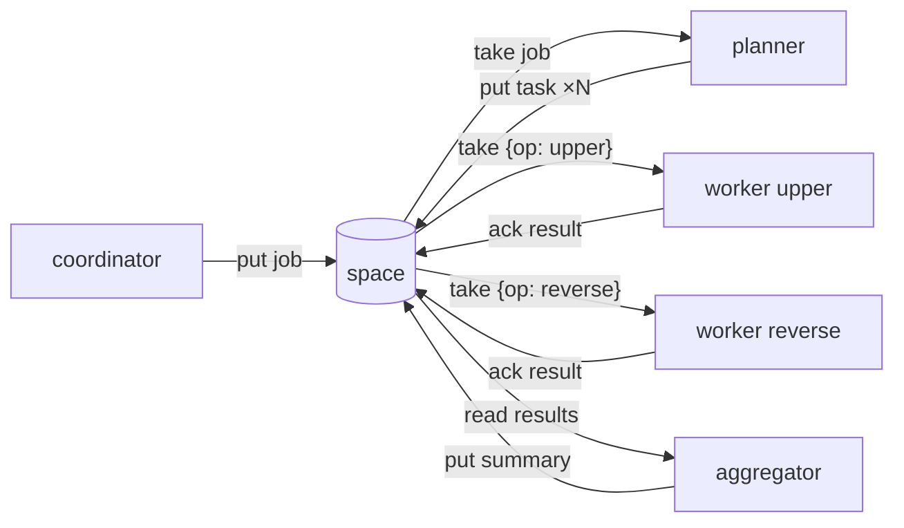

# Pipeline example — content-routed coordination, no routing table

Deterministic demo agents that exercise the runtime the way a real agent would: over the public
HTTP API, via the TS SDK in [`../../sdk/ts`](../../sdk/ts). No LLM keys, no flakiness. The seam
where a tool runs (`tools.ts`) is where a real agent would call a model.

A planner fans a `job` out into per-word `task`s, two workers claim only the ops they can handle,
and an aggregator reads the `result` facts and emits one `summary`.



## Watch it in the web console

```bash
deno task dev            # terminal 1: the space + web console at http://localhost:7788
deno task demo           # terminal 2: runs the agents against that space
```

Open http://localhost:7788, go to the **Feed** tab, then run `deno task demo`. It detects
the running space, runs a planner + two workers + an aggregator against it, and you watch
the events stream in live; open the `summary` record to see its lineage. (If no space is
running, `demo` starts one and leaves it up so you can open it — Ctrl-C to stop.)

## One command, self-contained (CI)

```bash
deno task demo:ci
```

Spawns an ephemeral `radia dev`, runs the whole pipeline, prints the summary + event log +
lineage, and exits. An integration smoke test of the wire contract — nothing to watch, it
tears down.

## What it demonstrates

- **Content-routed coordination, no routing table.** `worker upper` and `worker reverse`
  each claim only `{kind:task, match:{op:...}}` that matches their tool.
- **Fan-out / fan-in.** The planner splits a `job` into per-word `task`s (fan-out); workers
  emit `result` facts; the aggregator reads them and emits one `summary` (fan-in).
- **Leases + at-least-once**, idempotent aggregation (`summary:<jobId>` key), the
  transactional **event log**, and a 4-level **lineage** tree (summary → results → tasks → job).
- **Claim vs. read.** Workers *take* tasks (claimed once, fenced); the aggregator *reads*
  results (facts, never consumed).

## Running the pieces separately (the two-terminal experience)

Point agents at a running space with `RADIA_URL` (default `http://localhost:7788`):

```bash
deno task dev                                             # terminal 1: the space + web console
deno run --allow-net --allow-env examples/pipeline/planner.ts     # terminal 2
deno run --allow-net --allow-env examples/pipeline/worker.ts upper # terminal 3
deno run --allow-net --allow-env examples/pipeline/aggregator.ts  # terminal 4
deno run --allow-net --allow-env examples/pipeline/coordinator.ts "hello there world"  # seed + read
```

Watch it unfold live in the web console's **Feed** tab, and open a `summary` record to see
its lineage.

## Files

| File | Role |
|------|------|
| `tools.ts` | deterministic tools keyed by `op` |
| `kinds.ts` | registers the demo kinds |
| `worker.ts` | claims `{kind:task, match:{op}}`, runs the tool, emits a `result` |
| `planner.ts` | claims a `job`, fans out into `task`s |
| `aggregator.ts` | reads `result`s, emits a `summary` when a job is complete |
| `coordinator.ts` | seeds a job + a standalone task, reads outcomes |
| `demo.ts` | orchestrates all of the above in one process (`deno task demo`) |
