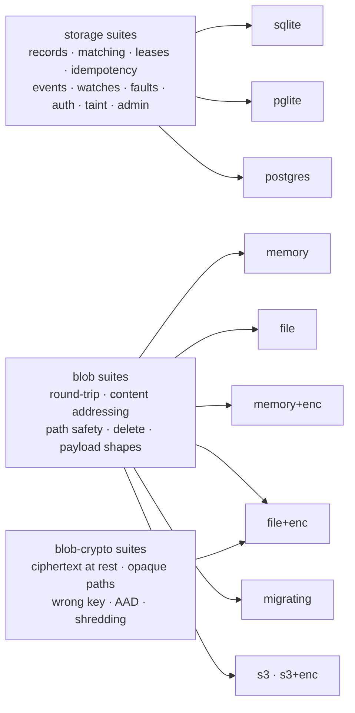

# Tests

Two kinds of test live here, and the directory says which is which.

`test/conformance/` is the **port contract**: one suite set, run against every implementation of
the storage and blob ports, so embedded and PostgreSQL backends keep the same semantics. Encrypted
blob stores implement the complete blob contract and an additional crypto contract. A test belongs
here only if it is parameterized over implementations.

`test/*.test.ts` is everything else: the HTTP boundary, the console, the defaults, the published
site, the SDK's own behaviour. Each has exactly one implementation, or knows a specific dialect, so
running it against a matrix would say nothing. They used to sit in a directory called
`conformance/` and the README needed a paragraph to explain why they were not conformance; the
directory now carries that distinction instead.



`postgres` joins on `RADIA_PG_URL` and the two `s3` columns on `RADIA_S3_URL`; both need a server,
and a backend nobody runs the suite against drifts.

```bash
deno task test                # check + everything under test/ + the extension contracts
deno task test:quick          # the structural guards only                        (~1s)
deno task test:runtime        # all of test/: the standalone files AND the matrix  (~1min)
deno task test:conformance    # the port matrix alone: sqlite + pglite + blobs     (~20s)
deno task test:extensions     # extensions/conformance/                            (~1m20)
deno task test:chat           # the chat example's own suites, no API key
deno task test:analysis       # the staged pipeline example
deno task test:teams          # the go-fish dealer host, played model-free           (~10s)
scripts/pg-conformance.sh     # test:runtime + a live Postgres
RADIA_PG_URL=postgres://… scripts/pg-conformance.sh          # against your own server
scripts/s3-conformance.sh     # + the S3 blob store, on the docker/s3/ endpoint
RADIA_S3_URL=s3://bucket/prefix scripts/s3-conformance.sh    # against your own bucket
```

Use `test:quick` for documentation, static pages, flags, routes and literal defaults: it is the
subset that does not boot PGlite, bind sockets or wait on timers. Run `test:runtime` after changes
under `src/`, and `test` before saying the tree is green. The published `docs/` site is checked;
internal `agent_docs/` files are not.

Without `RADIA_PG_URL`, `pg-conformance.sh` starts a throwaway Docker Postgres and removes it
afterwards, on a host port docker picks (it used to hardcode 55432, which is inside Linux's
ephemeral range; an unrelated outbound connection holding it, even in TIME_WAIT, made the script
fail with a docker "address already in use" that reads like a stale container and is not one).

Each Postgres test runs in its own ephemeral schema, dropped on close, so it is safe to point at a
database you care about. The live-server run adds its own storage tests to the embedded 753 (counts move as suites
are added; the claim to check is 0 failed), and it is the only run that actually *contends* for claims, which is why a claim-path
change needs it (see "Writing a suite" below). The two cases in `concurrency.test.ts` are ignored
entirely without it.

**All three run in CI** (`.github/workflows/ci.yml`), in three jobs: `embedded` (check +
conformance + extensions), `postgres` (the same suite against a service container) and `s3` (the
blob columns against the `docker/s3/` endpoint, the same recipe a local space uses). Until 2026-08-04 the
Postgres run was manual, while CLAUDE.md's invariant said the suite runs on every implementation
"in CI from day one" — an invariant naming a guard that was not running.

A PROSE-ONLY commit runs none of it. `ci.yml` ignores `docs/**`, `agent_docs/**` and `**/*.md`
(`paths-ignore` skips only when EVERY changed file matches, so prose beside code still runs the
lot), and `docs.yml` runs `deno task test:quick` for `docs/**` instead. The filter is one-directional
on purpose: `docs.test.ts` checks the site against `src/surfaces/cli.ts` and the npm exports map,
so it keeps running on every code change. `pages.yml` runs `quick` before it publishes, since the
docs workflow is now the only thing between a docs commit and the live site.

## Contract requirements

- **Write the suite before or alongside the behavior**, never after. A contract test written
  afterwards documents what the implementation happens to do.
- **A behavior is not done until it is green on every adapter**, not just the one it was written
  against. Running two embedded adapters from the first commit is what keeps that real rather than
  aspirational, and it is why the port stayed honest before Postgres arrived.
- **Never let a test's output be interactive**, and never make the suite depend on a live model.
  Per repo conventions the agent writes tests and states how to run them.

## Layout

Paths are relative to `test/`; the first three files live in `conformance/`.

| File | Role |
|------|------|
| `conformance/run.test.ts` | entry point: enumerates implementations, registers every suite against each. `RADIA_CONF_ADAPTERS=postgres` (comma list) narrows to the named adapters; CI's pg job uses it so the embedded matrix is not paid for twice |
| `conformance/adapters.ts` | the implementations under test, and how each is isolated per test: SQLite gets a fresh `:memory:` database, PGlite and Postgres get an ephemeral schema on ONE shared server (see below) |
| `conformance/harness.ts`  | the `Suite` / `BlobSuite` / `BlobCryptoSuite` types and setup/teardown |
| `conformance/suites/` | one file per behavior area (records, matching, **pushdown soundness**, **graph: children + lineage**, leases + claim fairness, idempotency, events, **the integrity chain incl. direct-SQL tamper cases**, **resource limits**, **the orphaned/starving split**, watches, faults, auth, **compartments: a dedicated kind plus pattern-scoped grants, refused on every write path**, taint, admin + selector-driven remediation, blobs + encryption incl. KEK ROTATION: reads and sweeps under retired keys, the sweep keeping what it cannot open, and the rewrap that lets the retired key be destroyed) |
| `layering.test.ts` | the dependency directions, the `platform.ts` seam and the AUTHORIZATION seam, as greps rather than prose: the runtime imports no surface or extension, a surface takes no runtime value, an extension never imports `src/`, `Deno.*` stays in `platform.ts`, a `Space` is constructed only where the wire wraps it, RAW coordination verbs sit in a near-empty ledger, and each handler's `space.as(principal)` count is pinned, since authority is the TYPE a caller holds (`ActingSpace`), never a per-call parameter (design-auth.md, "Where each verb is enforced"). Each guard was proved to FAIL on a planted violation, because a structural test nobody has seen fail is one nobody has tested |
| `teamfile.test.ts` | `team.json` (`src/surfaces/teamfile.ts`): fields refused by name, the harness templates and their resume variants, the frame wrapped around a prompt, and the two shipped teams parsing with prompts that carry no mechanics |
| `teamup.test.ts` | `radia team up` end to end against a fresh space with a model-free harness: a member `team add` stored is found, the session shared, the config written owner-only with absolute paths, a team DIRECTORY bootstrapped with `--init --seed`, leftovers warned about and `--fresh` retiring them, a member re-minted when the file names a grant its stored token lacks, a foreign unscoped claimant on a kind a member claims named at start (and one whose match cannot overlap left alone), and a run ending itself on `done` |
| `activity.test.ts` | `radia activity` (`src/surfaces/activity.ts`): the model on the console test's cases, the plain rendering, the colour rule (a pipe, `NO_COLOR`, `--no-color`), kind colours never dark |
| `http.test.ts` | the HTTP boundary, driving `makeHandler` directly: authentication and run renewal, the artifact inline/download allowlist and capability URLs, erasure (410 vs 404, shared payloads, forged shred markers), the ops-tier gate matrix (each `ops_grant` power opens exactly its verbs, `gc` and `rewrap` splitting live/dry across `sweep` and `observe`; no identity root or coordination bypass below full), the event-GC 410/clamp boundary, and a table of wrong-typed fields per endpoint |
| `backfill.test.ts` | the schema's one migration: rebuilding `record_edges` for a database written before that table existed |
| `blobmigration.test.ts` | what a migration layer adds over the blob port and the shared suite cannot see (it runs `MigratingBlobStore` with an EMPTY origin): a read falling through without copying, `delete` reaching every layer since an erasure that missed a copy is not one, one keep set sweeping all of them, and `sealed` being false unless every layer seals |
| `planner.test.ts`  | Postgres planner statistics for declared body paths (`prepareKind`) |
| `registry.test.ts` | latest-wins projections over hand-made ids and timestamps |
| `tasks.test.ts`    | every `deno task` a workflow or script invokes exists in `deno.json`. Written after `check` was pasted over by a new task and `embedded` failed at its first step on every run: the task nobody can run is the one nobody sees fail locally |
| `openapi.test.ts`  | the frozen contract against the router, both directions: every documented operation is routed, and every `/v0` path the router names is documented |
| `notifier.test.ts` | the watch wakeup state machine: who wakes, when the cross-instance poll runs |
| `concurrency.test.ts` | the fault matrix's CONTENDED half: the two claim-path races that need real parallel connections, so they skip without `RADIA_PG_URL` |
| `http.test.ts` (storm) | the fault matrix's last row: 24 streams reconnecting at once below a horizon made by the REAL sweep, each refused with the SAME horizon, each recovery served |
| `flows.test.ts`    | flow mining, including the acceptance test written before the feature: the pipeline example's shape, recovered without the miner being told to look for it |
| `tree.test.ts`     | serving a multi-file tree over one path capability: relative resolution, traversal missing the index, the mint-time read check, the isolated origin. Its three security cases were each validated against a planted regression |
| `loop.test.ts`     | the SDK worker loop losing a lease: the handler's cancellation channel (the one test here that binds a real port, since the SDK client and its SSE watchers are what is under test) |
| `console.test.ts`  | the dev console, lifted out of the page source: HTML escaping, no credential in the page, in an event handler or in the URL, the sign-in gate, and the hash router (run against a stub DOM, since source text cannot show whether a route wires the tab, the selection and the knobs in the right order) |
| `defaults.test.ts` | the posture an unconfigured space lands in: `--auth`, the runtime directory, optional-value flags |
| `exchange.test.ts` | a client that re-authenticates itself: the DURABLE half of a credential exchanged for the short half on expiry, once per failure, never on a 403, shared across concurrent calls, and on the SSE stream that does not go through `req`. Over a real socket, like `loop.test.ts`. It also pins that a person's login does not overwrite the operator credential in the shared file |
| `oidc.test.ts`     | SSO end to end (plan-oidc.md), against the in-repo issuer in `oidc-issuer.ts` (also runnable standalone for a live dance): the verifier's forgery classes (iss/aud/azp/exp/nbf/signature/alg/kid/kty), first-login enrollment + display-claim refresh + RETIRE IS A BAN, one-id_token-one-run replay + the per-subject ceiling, the JWKS cache's TTL/single-flight/global cooldown under a garbage-kid flood, the NEVER_COMPACT guard, and `radia login --sso`'s loopback dance with a scripted browser |
| `team.test.ts`     | the team convention (architecture-teams.md) and the MCP surface under it: attribution surviving a run's 12h ceiling, the SECOND-DEFINITION hazard asserted rather than commented (the shadowed token must still mint, or the refusal in `radia team add` could be dropped), cross-team isolation with NO unlabelled lane, a teammate's record readable on the ops plane through the PATTERN tier, the aggregates naming what they do not cover instead of answering zero, the write fill LEARNED FROM A REFUSAL (a successful write is never modified) and the READ-side ask beside it (`ScopeFiller.choose`: one scope narrows nothing, two is a refusal naming both, and a member of two teams saving one name into each is two trees rather than a fork), `newOnly` on a fact kind, a `kind_def` usage line that can be added and re-worded on an existing kind, and both protocol eras with an unknown version refused by name. Every guard proved red by a plant |
| `delegation.test.ts` | delegated runs (plan-delegation.md): the two `authorize` shortcuts a delegated run must not reach (privileged, the supervisor carve-out), the intersection being a SUBSET on every axis, the caller resolved THROUGH the run rather than from a body field or the leased record's author, the fail-open a cold memo would be, an unchanged delegation reusing its run instead of appending a permanent record, and what a delegated run must never hold (ops powers, authorization-kind writes). Every guard proved red by a plant |
| `resume.test.ts`   | an SDK watch surviving event-log GC under its resume cursor, over a real socket: one 410, recovery through the `"0"` sentinel (which clamps, never 410s), wakeups resume. The failure mode pinned is the hot loop, so the test hanging IS the failure |
| `py-parity.test.ts` | the two SDKs computing the SAME content key for the same body, checked by feeding one corpus of raw JSON texts through a real `python3` and `sdk/ts/registry.ts` and comparing. Raw text, so each side's own parser supplies its number semantics, which is the axis that broke: Python wrote `1e-05` where JavaScript writes `0.00001`. Skips without python3 (or `--allow-run=python3`); `docker/py-parity/` is the run that cannot skip |
| `docs.test.ts`     | the published site (`docs/`), structurally and never by wording: the CLI verbs it shows exist in `cli.ts`, its `radia` imports resolve through the npm exports map AND name something that file exports, links and anchors resolve, no undeclared external host, the pinned SDK install URLs against `deno.json`'s version and `release.yml`'s packing steps, the packages' dependency-freedom, and the playground page's client and jail-space calls against the surfaces they drive. It sits outside the directory where "update the doc in the same change" is written down, so a machine checks what a reviewer would not. Written after the landing page's first copyable command named a binary no checkout has, with the SDK snippet under it importing a path the package does not contain |

**One PGlite for the process, one schema per test.** Booting a WASM Postgres per test cost ~350ms
around single-digit ms of work, so `conformance/adapters.ts` boots one instance at module load and gives each
test an ephemeral schema, exactly as the standalone Postgres rows already worked (measured per
create-init-work-close cycle: 362ms → 17ms). A test still gets fresh tables; what it no longer gets
is a virgin *database*, so a test that reads a server-wide catalog must construct its own
`PgliteAdapter()` rather than take the harness's (`planner.test.ts` does, and pins the one place
that catalog scoping actually mattered). PGlite is a single connection and `search_path` is state
on it, so a shared instance is sequential-use only; the harness runs a test at a time.

**Where a test belongs.** `test/conformance/` is for PORT contracts, so a test goes there only if
it is parameterized over implementations. Anything with one implementation (the HTTP surface, the
console, the defaults) or that knows a specific dialect (the backfill, the planner) is a standalone
`test/*.test.ts`. Both run under `deno task test:runtime`, which globs `test/`; `test:conformance`
narrows to the matrix.

**What does NOT belong here: extension contracts.** `extensions/` holds conventions built on the
runtime rather than parts of it, and `extensions/conformance/` (`deno task test:extensions`) is their
tier. The split follows the dependency rule: everything in this directory may import `src/`, and
nothing in an extension may. A test that spawns `radia dev` and drives it over `/v0` is an extension
test even when it feels like a port test.

**Nor the lab's.** `scripts/agent-lab/*.test.ts` (`deno task test:lab`) split on COST rather than
dependency: each case spawns a space and an adapter, a dozen seconds nobody editing `src/` should
pay, so `test:runtime` leaves them out and only the aggregate `deno task test` runs them.

Two of these test SOURCE TEXT rather than behavior, which is unusual enough to justify. The console
is one file with no build step, so there is no module to import; `console.test.ts` lifts functions
out of the page and evaluates them, and the extraction fails loudly if one is renamed, so the test
cannot quietly stop testing anything. `defaults.test.ts` asserts on literals because a default is a
literal: the failure mode is someone changing `"required"` back to `"open"`, and only reading that
token catches it.

## Writing a suite

A suite is a name plus a `run(...)` function; the harness runs it once per implementation. Assert on
observable behavior, never on a specific backend's SQL or on-disk layout. A test that only passes
on one implementation is testing the implementation, not the contract.

Seven conventions worth copying rather than reinventing:

- **A race guard is not a guard until the pre-fix code fails it.** Both cases in
  `concurrency.test.ts` passed against the very defect they were written for on the first draft:
  one because a pushable pattern is filtered in SQL, so the take saw a window of pure matches and
  never paged at all, and one because matches parked at the tail of a queue shift *toward* a paging
  claimer instead of past it. Plant the old code back in, watch it fail, and record which detector
  fired and how often.

- **Simulate faults by composition, not test hooks.** A crashed worker is one that took a lease
  and never acked, with the lease forced expired via a negative `leaseSeconds`. A partition is a
  request not delivered, which is EXACT rather than approximate: a request the space never receives
  and a request never sent are the same event at the space. A failover is a Proxy around one adapter
  method, throwing before delegating (nothing committed) or after (committed, answer lost).
  Deterministic, no sleeps, and no test-only code paths in production. See
  `conformance/suites/faults.ts` and `conformance/suites/failover.ts`.
- **A fault test must FAIL fast, never hang.** The reconnect-storm case (`http.test.ts`) asserts
  response STATUS before reading any body, because a stream served in error has no body that ends:
  reading first parked the suite past five minutes on the exact regression it exists to catch.
- **Never assert on wall-clock timing.** All time comparisons use the database clock; a test that
  sleeps is a test that flakes in CI. The one exception is where LATENCY IS THE CONTRACT: the
  cross-instance wakeup (`conformance/suites/watches.ts`, `notifier.test.ts`) and the fenced handler
  (`loop.test.ts`) have nothing else to assert, since the pre-fix build produced the same records,
  just later or not at all. Those bounds are set an order of
  magnitude above the mechanism (a 250ms poll asserted under 10s) so the margin, not the scheduler,
  decides the outcome.
- **Keep crypto deterministic.** The blob-crypto suites use a fixed KEK, so a failure means a
  behavior change rather than a coin flip. Randomness stays inside the implementation (DEKs,
  nonces), never in the assertions.
- **Assume the embedded adapters cannot see your bug.** Claim starvation was invisible to
  `deno task test:runtime` and appeared only against a live Postgres, because SQLite and PGlite are
  single-connection and never actually contend. Anything touching concurrent claims needs
  `scripts/pg-conformance.sh`, and its test belongs in `concurrency.test.ts` rather than a suite,
  since a suite that cannot run on two of three adapters is not a port contract.
- **A persistent database is not `:memory:`, and a "restart" needs one.** `init()` opens a fresh
  connection, so re-initializing an in-memory adapter gives you an EMPTY database rather than the
  one you just wrote, so a restart test that skips this passes by finding nothing. `backfill.test.ts`
  uses a temp file/dir per dialect for exactly this reason.
- **Never assume ULID insertion order is id order.** Ids minted inside the same millisecond differ
  only in their random half, so a test asserting "the records I put, in that order" passes on a
  slow adapter and fails on a fast one. Sort the expectation.

Adding a behavior to `StorageAdapter` or `BlobStore` means adding it here in the same change. A
behavior is not done until it is green on every implementation of that port.
